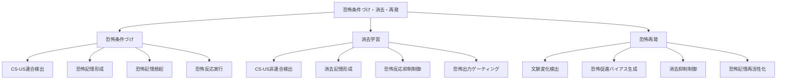

# ステップ1: TLFの段階的分解とGN作成

## 目的
TLF「恐怖条件づけ・消去・再発」を、十分に小さい部分機能（GN）まで分解し、階層的な機能分解構造を作成する。

---

## TLF分解の方針

### TLFの全体像
**恐怖条件づけ・消去・再発**は、以下の3つの連続的なプロセスを含む：

1. **恐怖条件づけ（Fear Conditioning）**: 中性刺激（CS）と嫌悪刺激（US）の連合学習により、CSが恐怖反応を引き起こすようになる
2. **消去学習（Extinction Learning）**: CSを繰り返し提示してもUSが続かない場合、CSに対する恐怖反応が減弱する。新たな消去記憶が形成される
3. **恐怖再発（Fear Renewal）**: 消去後、文脈が変化すると恐怖反応が再び出現する

### 分解の階層構造

#### 第1階層：TLF
- 恐怖条件づけ・消去・再発

#### 第2階層：主要プロセス（3つのGN）
TLFを時系列的な3つの主要プロセスに分解：

1. **GN: 恐怖条件づけ**
   - CS-US連合学習により恐怖記憶を形成し、恐怖反応を獲得する
   
2. **GN: 消去学習**
   - CS提示時のUS欠如により消去記憶を形成し、恐怖反応を抑制する
   
3. **GN: 恐怖再発**
   - 文脈変化により消去を解除し、恐怖記憶を再活性化して恐怖反応を再発させる

#### 第3階層：各プロセスの部分機能

##### GN: 恐怖条件づけ → 4つの子GN

1. **GN: CS-US連合検出**
   - 条件刺激（CS）と無条件刺激（US）の時間的近接を検出する

2. **GN: 恐怖記憶形成**
   - CS-US連合に基づいて恐怖記憶を形成し、保持する

3. **GN: 恐怖記憶想起**
   - CS入力により恐怖記憶を想起し、恐怖信号を生成する

4. **GN: 恐怖反応実行**
   - 恐怖信号に基づいて行動的・生理的な恐怖反応を実行する

##### GN: 消去学習 → 4つの子GN

1. **GN: CS-US非連合検出**
   - CS提示時のUS欠如（CS-US非連合）を検出する

2. **GN: 消去記憶形成**
   - CS-US非連合に基づいて消去記憶を形成し、保持する

3. **GN: 恐怖反応抑制制御**
   - 消去記憶に基づいて恐怖反応の出力を抑制する制御信号を生成する

4. **GN: 恐怖出力ゲーティング**
   - 抑制制御信号に基づいて恐怖反応の出力経路を遮断する

##### GN: 恐怖再発 → 4つの子GN

1. **GN: 文脈変化検出**
   - 消去文脈から新文脈への変化を検出する

2. **GN: 恐怖促進バイアス生成**
   - 文脈変化に基づいて、恐怖記憶の再活性化を促進するバイアス信号を生成する

3. **GN: 消去抑制制御**
   - 新文脈において消去記憶の影響を減弱させる

4. **GN: 恐怖記憶再活性化**
   - 恐怖促進バイアスにより恐怖記憶を再活性化し、恐怖反応を駆動する

---

## 階層構造の表形式

| 階層レベル | ノード名 | 機能説明 |
| ---------- | -------- | -------- |
| 1 | 恐怖条件づけ・消去・再発 | 中性刺激と嫌悪刺激の連合学習により恐怖反応を獲得し、消去学習により抑制し、文脈変化により再発させる一連のプロセス |
| 2 | 恐怖条件づけ | CS-US連合学習により恐怖記憶を形成し、恐怖反応を獲得する |
| 2 | 消去学習 | CS提示時のUS欠如により消去記憶を形成し、恐怖反応を抑制する |
| 2 | 恐怖再発 | 文脈変化により消去を解除し、恐怖記憶を再活性化して恐怖反応を再発させる |
| 3 | CS-US連合検出 | 条件刺激（CS）と無条件刺激（US）の時間的近接を検出する |
| 3 | 恐怖記憶形成 | CS-US連合に基づいて恐怖記憶を形成し、保持する |
| 3 | 恐怖記憶想起 | CS入力により恐怖記憶を想起し、恐怖信号を生成する |
| 3 | 恐怖反応実行 | 恐怖信号に基づいて行動的・生理的な恐怖反応を実行する |
| 3 | CS-US非連合検出 | CS提示時のUS欠如（CS-US非連合）を検出する |
| 3 | 消去記憶形成 | CS-US非連合に基づいて消去記憶を形成し、保持する |
| 3 | 恐怖反応抑制制御 | 消去記憶に基づいて恐怖反応の出力を抑制する制御信号を生成する |
| 3 | 恐怖出力ゲーティング | 抑制制御信号に基づいて恐怖反応の出力経路を遮断する |
| 3 | 文脈変化検出 | 消去文脈から新文脈への変化を検出する |
| 3 | 恐怖促進バイアス生成 | 文脈変化に基づいて、恐怖記憶の再活性化を促進するバイアス信号を生成する |
| 3 | 消去抑制制御 | 新文脈において消去記憶の影響を減弱させる |
| 3 | 恐怖記憶再活性化 | 恐怖促進バイアスにより恐怖記憶を再活性化し、恐怖反応を駆動する |

---

## Mermaid階層グラフ

---

## 分解の妥当性確認

### 第2階層の妥当性

**親ノード**: 恐怖条件づけ・消去・再発

**子ノード群**: 恐怖条件づけ、消去学習、恐怖再発

**確認**: 
- 恐怖条件づけにより恐怖反応を獲得し、消去学習により抑制し、恐怖再発により再活性化するという時系列的プロセスがTLFを構成している
- 3つの子ノードの組み合わせにより、TLF全体が実現される ✓

### 第3階層の妥当性（恐怖条件づけ）

**親ノード**: 恐怖条件づけ

**子ノード群**: CS-US連合検出、恐怖記憶形成、恐怖記憶想起、恐怖反応実行

**確認**:
- CS-US連合を検出し、それに基づいて恐怖記憶を形成
- 形成された記憶を想起し、恐怖反応を実行
- これらの組み合わせにより恐怖条件づけが実現される ✓

### 第3階層の妥当性（消去学習）

**親ノード**: 消去学習

**子ノード群**: CS-US非連合検出、消去記憶形成、恐怖反応抑制制御、恐怖出力ゲーティング

**確認**:
- CS-US非連合（US欠如）を検出し、消去記憶を形成
- 消去記憶に基づいて抑制制御信号を生成し、恐怖出力をゲーティングして遮断
- これらの組み合わせにより消去学習が実現される ✓

### 第3階層の妥当性（恐怖再発）

**親ノード**: 恐怖再発

**子ノード群**: 文脈変化検出、恐怖促進バイアス生成、消去抑制制御、恐怖記憶再活性化

**確認**:
- 文脈変化を検出し、恐怖促進バイアスを生成
- 消去の影響を抑制し、恐怖記憶を再活性化
- これらの組み合わせにより恐怖再発が実現される ✓

---

## まとめ

第1階層（TLF）から第3階層（リーフGN）までの機能分解が完了した。各親ノードの機能が子ノード群の組み合わせによって十分に実現されることが確認された。

次のステップ2では、冗長性を削減し、類似した機能を持つノードをマージして最適化を行う。
