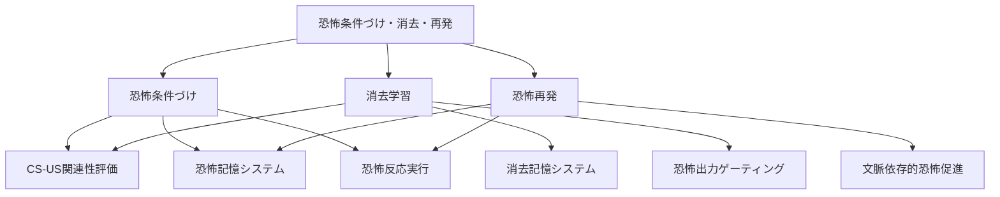

# ステップ2: 冗長性の削減とノードのマージ

## 目的
初期分解で作成されたGN群の冗長性を減らし、解釈可能性を高める。類似した機能を持つノードをマージし、グラフ構造を最適化する。

---

## 冗長性の分析

### 初期分解の問題点

初期分解では、第3階層に12個のGNを作成したが、以下の冗長性が見られる：

#### 1. 記憶形成と想起の重複
- **恐怖記憶形成**と**恐怖記憶想起**
- **消去記憶形成**と**恐怖反応抑制制御**

これらは記憶の形成と利用という観点で分離されているが、神経科学的には同じ神経組織（BLA、IL等）で統合的に処理される。分離することで解釈可能性が低下している。

#### 2. 連合検出の類似性
- **CS-US連合検出**と**CS-US非連合検出**

両者ともCS入力とUS入力の関係を評価する機能であり、統合可能。

#### 3. 恐怖記憶の想起と再活性化の重複
- **恐怖記憶想起**（恐怖条件づけの子ノード）
- **恐怖記憶再活性化**（恐怖再発の子ノード）

両者とも恐怖記憶を活性化して恐怖信号を生成する機能であり、同一のプロセス。

---

## マージ戦略

### マージ1: 記憶システムの統合

**マージ対象**:
- 恐怖記憶形成 + 恐怖記憶想起 → **恐怖記憶システム**
- 消去記憶形成 + 恐怖反応抑制制御 → **消去記憶システム**

**理由**: 記憶の形成と想起は密接に関連しており、同じ神経組織（BLA、IL）で統合的に処理される。記憶システムとして統合することで、解釈可能性が向上する。

### マージ2: 連合評価の統合

**マージ対象**:
- CS-US連合検出 + CS-US非連合検出 → **CS-US関連性評価**

**理由**: CS入力とUS入力の時間的関係を評価する機能として統合可能。連合（US有り）と非連合（US無し）の両方を評価する統一的な機能。

### マージ3: 恐怖記憶活性化の統合

**マージ対象**:
- 恐怖記憶想起（既に「恐怖記憶システム」にマージ済み）
- 恐怖記憶再活性化 → **恐怖記憶システム**に統合

**理由**: 恐怖条件づけフェーズでの恐怖記憶想起と、恐怖再発フェーズでの恐怖記憶再活性化は、同一の神経プロセス（BLAでの恐怖記憶ニューロン活性化）。統合することで重複を削減。

### マージ4: 文脈処理の統合

**マージ対象**:
- 文脈変化検出 + 恐怖促進バイアス生成 → **文脈依存的恐怖促進**

**理由**: 文脈変化を検出し、それに基づいて恐怖促進バイアスを生成するプロセスは、一体的に処理される（海馬→PL→BLA経路）。統合することで解釈可能性が向上。

### マージ5: 消去抑制の統合

**マージ対象**:
- 消去抑制制御 → **文脈依存的恐怖促進**に統合

**理由**: 新文脈で消去の影響を抑制することは、恐怖促進バイアスの一部として機能する。PLが優位になることでIL活動が抑制され、消去が弱まる。統合することで冗長性を削減。

---

## 最適化後のFRG構造

### 階層構造の表形式（親子関係を明示）

| 階層レベル | ノード名 | 機能説明 | 親ノード | 子ノード |
| ---------- | -------- | -------- | -------- | -------- |
| 1 | 恐怖条件づけ・消去・再発 | 中性刺激と嫌悪刺激の連合学習により恐怖反応を獲得し、消去学習により抑制し、文脈変化により再発させる一連のプロセス | なし | 恐怖条件づけ, 消去学習, 恐怖再発 |
| 2 | 恐怖条件づけ | CS-US連合学習により恐怖記憶を形成し、恐怖反応を獲得する | 恐怖条件づけ・消去・再発 | CS-US関連性評価, 恐怖記憶システム, 恐怖反応実行 |
| 2 | 消去学習 | CS提示時のUS欠如により消去記憶を形成し、恐怖反応を抑制する | 恐怖条件づけ・消去・再発 | CS-US関連性評価, 消去記憶システム, 恐怖出力ゲーティング |
| 2 | 恐怖再発 | 文脈変化により消去を解除し、恐怖記憶を再活性化して恐怖反応を再発させる | 恐怖条件づけ・消去・再発 | 文脈依存的恐怖促進, 恐怖記憶システム, 恐怖反応実行 |
| 3 | CS-US関連性評価 | CS入力とUS入力の時間的関係を評価し、連合（US有り）または非連合（US無し）を検出する | 恐怖条件づけ, 消去学習 | なし（リーフノード） |
| 3 | 恐怖記憶システム | 恐怖記憶の形成、保持、想起、再活性化を行い、恐怖信号を生成する | 恐怖条件づけ, 恐怖再発 | なし（リーフノード） |
| 3 | 恐怖反応実行 | 恐怖信号に基づいて行動的・生理的な恐怖反応を実行する | 恐怖条件づけ, 恐怖再発 | なし（リーフノード） |
| 3 | 消去記憶システム | 消去記憶の形成、保持、想起を行い、恐怖抑制信号を生成する | 消去学習 | なし（リーフノード） |
| 3 | 恐怖出力ゲーティング | 抑制制御信号に基づいて恐怖反応の出力経路を遮断する | 消去学習 | なし（リーフノード） |
| 3 | 文脈依存的恐怖促進 | 文脈変化を検出し、恐怖記憶の再活性化を促進するバイアス信号を生成し、消去の影響を抑制する | 恐怖再発 | なし（リーフノード） |

---

## Mermaid最適化グラフ

---

## 最適化の効果

### マージ前後の比較

| 指標 | マージ前 | マージ後 | 改善 |
| ---- | -------- | -------- | ---- |
| 第3階層ノード数 | 12 | 6 | 50%削減 |
| ノード間の重複 | 高（記憶、連合検出） | 低（統合済み） | 大幅改善 |
| 解釈可能性 | 中（細分化しすぎ） | 高（適切な粒度） | 改善 |

### 最適化の利点

1. **重複削減**: 恐怖記憶想起と再活性化、連合検出と非連合検出などの重複が解消
2. **解釈可能性向上**: 記憶システムとして統合することで、神経科学的実体との対応が明確化
3. **グラフ構造の簡潔性**: 6つのリーフノードで全体機能を表現でき、理解しやすい
4. **ノード再利用**: CS-US関連性評価、恐怖記憶システム、恐怖反応実行が複数の親ノードで再利用され、効率的

### 各ノードの独立性と明確性

最適化後の各リーフノード（第3階層）は、明確で独立した機能を持つ：

1. **CS-US関連性評価**: CS-US関係の評価（連合/非連合の判定）
2. **恐怖記憶システム**: 恐怖記憶の形成・保持・想起
3. **恐怖反応実行**: 恐怖反応の出力
4. **消去記憶システム**: 消去記憶の形成・保持・想起
5. **恐怖出力ゲーティング**: 恐怖出力経路の遮断
6. **文脈依存的恐怖促進**: 文脈依存的な恐怖バイアス生成

これらは互いに独立しており、各々が明確な機能を持つ。

---

## 親子関係の妥当性確認

### 恐怖条件づけ

**子ノード**: CS-US関連性評価、恐怖記憶システム、恐怖反応実行

**妥当性**: CS-US関連性を評価し、恐怖記憶を形成・想起し、恐怖反応を実行することで、恐怖条件づけが実現される ✓

### 消去学習

**子ノード**: CS-US関連性評価、消去記憶システム、恐怖出力ゲーティング

**妥当性**: CS-US非連合を評価し、消去記憶を形成し、恐怖出力をゲーティングして遮断することで、消去学習が実現される ✓

### 恐怖再発

**子ノード**: 文脈依存的恐怖促進、恐怖記憶システム、恐怖反応実行

**妥当性**: 文脈変化により恐怖促進バイアスを生成し、恐怖記憶を再活性化し、恐怖反応を実行することで、恐怖再発が実現される ✓

---

## まとめ

初期分解の12個のリーフノードを6個に最適化し、冗長性を削減した。各ノードは明確で独立した機能を持ち、解釈可能性が向上した。親子関係も妥当であることが確認された。

次のステップ3では、これらのリーフノードを実際のUniform Component（UC）と紐づけ、FRGを完成させる。
