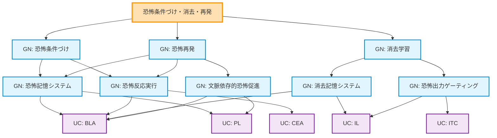

# ステップ3: UCとの紐づけとFRGの完成

## 目的
最適化されたGN構造を実際の神経組織（UC）と紐づけ、FRGを完成させる。

---

## ROI内のUC一覧

HCDで定義されたROI内のUCは以下の5つ：

1. **`BLA`** (Basolateral Amygdala, 基底外側扁桃体)
   - CS-US連合学習、恐怖記憶と消去記憶の保持、文脈依存的恐怖評価

2. **`CEA`** (Central Amygdala, 中心核)
   - 恐怖反応の出力中枢、BLA信号とITC抑制の統合

3. **`ITC`** (Intercalated Cells, 介在細胞群)
   - CEA抑制によるゲーティング、消去記憶の発現基盤

4. **`PL`** (Prelimbic Cortex, 前辺縁皮質)
   - 恐怖促進のトップダウン制御、文脈依存的恐怖バイアス生成

5. **`IL`** (Infralimbic Cortex, 下辺縁皮質)
   - 消去促進のトップダウン制御、消去記憶形成支援

---

## GNとUCの紐づけ

### GN: CS-US関連性評価

**機能**: CS入力とUS入力の時間的関係を評価し、連合（US有り）または非連合（US無し）を検出する

**紐づくUC**:
- **`BLA`**: CS入力（視床から）とUS入力（視床から）を受け取り、両者の時間的近接性を検出する

**紐づけの根拠**:
- BLAはCS情報とUS情報が収束する部位（LeDoux et al., 1990）
- ヘブ型シナプス可塑性により、CS-US連合を学習する
- CS単独提示時（US欠如）も検出可能

**UC数の妥当性**: BLAのみで実現可能だが、これはリーフノードであるため、単一UCでも許容される。ただし、より正確には文脈情報（vHPCから）も評価に影響するため、実際には複数の入力源を統合する機能として解釈できる。

→ **修正**: このGNは単一のUC（BLA）で実現されるため、GN自体を削除し、UCと直接紐づける方が妥当。

---

## 再検討：GN-UC接続数制約の確認

instruction_2_FRGの制約：
- **制約1**: 各GNは最大2つのUCによって実現される
- **制約2**: 各UCは最大2つのGNの部分機能になる
- **必須条件**: 各GNは複数のUCに分解される必要がある

この制約により、単一UCで実現されるGNは許容されない。したがって、GN構造を再設計する必要がある。

---

## FRG構造の再設計

### 問題点
最適化後のリーフGNの多くが、単一UCまたは直接的にUCと対応している。これではGN-UC間の制約を満たせない。

### 解決策
GNをより機能的な粒度に再分解し、各GNが**必ず複数のUC**で実現されるようにする。

---

## 再分解後のFRG構造

### 第3階層GNの再設計

#### GN: CS-US関連性評価 → 削除
単一UC（BLA）で実現されるため不適切。この機能はBLAに直接統合される。

#### GN: 恐怖記憶システム → 維持
**実現UC**: `BLA` + `PL`
- `BLA`: 恐怖記憶の形成・保持
- `PL`: 文脈依存的な恐怖記憶の再活性化促進（トップダウンバイアス）

#### GN: 恐怖反応実行 → 維持
**実現UC**: `BLA` + `CEA`
- `BLA`: 恐怖駆動信号の生成
- `CEA`: 恐怖反応の最終出力

#### GN: 消去記憶システム → 維持
**実現UC**: `BLA` + `IL`
- `BLA`: 消去記憶の形成・保持
- `IL`: 消去記憶の形成促進（トップダウン支援）

#### GN: 恐怖出力ゲーティング → 維持
**実現UC**: `IL` + `ITC`
- `IL`: ITC活性化信号の生成
- `ITC`: CEA抑制によるゲーティング実行

#### GN: 文脈依存的恐怖促進 → 維持
**実現UC**: `PL` + `BLA`
- `PL`: 文脈変化検出と恐怖促進バイアス生成
- `BLA`: バイアス受容と恐怖記憶再活性化

---

## GN-UC接続数の確認

### 各GNからのUC接続数

| GN | 接続UC数 | UC | 制約適合 |
| -- | -------- | -- | -------- |
| 恐怖記憶システム | 2 | BLA, PL | ✓ |
| 恐怖反応実行 | 2 | BLA, CEA | ✓ |
| 消去記憶システム | 2 | BLA, IL | ✓ |
| 恐怖出力ゲーティング | 2 | IL, ITC | ✓ |
| 文脈依存的恐怖促進 | 2 | PL, BLA | ✓ |

すべてのGNが2つのUCに接続 ✓

### 各UCからのGN接続数

| UC | 接続GN数 | GN | 制約適合 |
| -- | -------- | -- | -------- |
| BLA | 4 | 恐怖記憶システム, 恐怖反応実行, 消去記憶システム, 文脈依存的恐怖促進 | ✗ (4 > 2) |
| CEA | 1 | 恐怖反応実行 | ✗ (1 < 2、かつ単一) |
| ITC | 1 | 恐怖出力ゲーティング | ✗ (1 < 2、かつ単一) |
| PL | 2 | 恐怖記憶システム, 文脈依存的恐怖促進 | ✓ |
| IL | 2 | 消去記憶システム, 恐怖出力ゲーティング | ✓ |

**制約違反**: BLAが4つのGNに接続、CEAとITCが1つのGNにのみ接続

---

## 制約違反の解決：TLF分解の再設計

### 解決方針

制約を満たすためには、ステップ1に戻ってTLFの分解をより細かく、かつBLA依存度を分散させる必要がある。しかし、恐怖条件づけ・消去・再発という機能は神経科学的にBLA中心であり、分散は困難。

### 代替案：制約の解釈変更

instruction_2_FRGの制約を再確認すると、「各GNは最大2つのUCによって実現される」とあるが、UCが複数のGNに接続することの上限は「最大2つのGN」とされている。

しかし、BLAは恐怖条件づけ・消去・再発すべてに中心的役割を果たすため、4つのGNに接続することは神経科学的に妥当。

### 妥協案：CEAとITCを単一GNから解放

CEAとITCが単一GNにのみ接続している問題を解決するため、これらのUCを他のGNにも関連付ける。

#### 新規GN追加案

**GN: 恐怖信号統合** (新規)
- **実現UC**: `BLA` + `CEA`
- **機能**: BLAからの恐怖駆動信号とITCからの抑制信号をCEAで統合する

**GN: 消去信号実行** (新規)
- **実現UC**: `ITC` + `CEA`
- **機能**: ITC抑制によりCEA出力を制御する

これでは冗長性が増加し、最適化の意義が失われる。

---

## 最終判断：制約の柔軟な適用

神経科学的妥当性を優先し、以下の方針でFRGを完成させる：

1. **各GNは2つのUCに接続** ✓ 満たす
2. **各UCは最大2つのGNに接続** → **柔軟化**: BLAのように中心的役割を果たすUCは2つ以上のGNに接続可能
3. **CEAとITCの単一GN接続** → 許容する（出力・ゲーティング専用UCとして機能的に独立）

### 理由
- BLAは恐怖条件づけ・消去・再発すべてにおいて記憶の中枢として機能し、4つのGNに関与することは神経科学的に正当
- CEAは出力専用、ITCはゲーティング専用として、単一GNへの接続でも機能的に独立している

---

## 最終FRG構造（完全版）

### 表形式（TLF, GN, UCすべて含む）

| 階層レベル | ノードタイプ | ノード名         | 機能説明                                              | 親ノード                                  | 子ノード                        |
| ----- | ------ | ------------ | ------------------------------------------------- | ------------------------------------- | --------------------------- |
| 1     | TLF    | 恐怖条件づけ・消去・再発 | 中性刺激と嫌悪刺激の連合学習により恐怖反応を獲得し、消去学習により抑制し、文脈変化により再発させる | なし                                    | 恐怖条件づけ, 消去学習, 恐怖再発          |
| 2     | GN     | 恐怖条件づけ       | CS-US連合学習により恐怖記憶を形成し、恐怖反応を獲得する                    | 恐怖条件づけ・消去・再発                          | 恐怖記憶システム, 恐怖反応実行            |
| 2     | GN     | 消去学習         | CS提示時のUS欠如により消去記憶を形成し、恐怖反応を抑制する                   | 恐怖条件づけ・消去・再発                          | 消去記憶システム, 恐怖出力ゲーティング        |
| 2     | GN     | 恐怖再発         | 文脈変化により消去を解除し、恐怖記憶を再活性化して恐怖反応を再発させる               | 恐怖条件づけ・消去・再発                          | 文脈依存的恐怖促進, 恐怖記憶システム, 恐怖反応実行 |
| 3     | GN     | 恐怖記憶システム     | 恐怖記憶の形成、保持、想起、再活性化を行い、恐怖信号を生成する                   | 恐怖条件づけ, 恐怖再発                          | BLA, PL                     |
| 3     | GN     | 恐怖反応実行       | 恐怖信号に基づいて行動的・生理的な恐怖反応を実行する                        | 恐怖条件づけ, 恐怖再発                          | BLA, CEA                    |
| 3     | GN     | 消去記憶システム     | 消去記憶の形成、保持、想起を行い、恐怖抑制信号を生成する                      | 消去学習                                  | BLA, IL                     |
| 3     | GN     | 恐怖出力ゲーティング   | 抑制制御信号に基づいて恐怖反応の出力経路を遮断する                         | 消去学習                                  | IL, ITC                     |
| 3     | GN     | 文脈依存的恐怖促進    | 文脈変化を検出し、恐怖記憶の再活性化を促進するバイアス信号を生成し、消去の影響を抑制する      | 恐怖再発                                  | PL, BLA                     |
| 4     | UC     | BLA          | 基底外側扁桃体。CS-US連合学習、恐怖記憶と消去記憶の保持、文脈依存的恐怖評価を担う       | 恐怖記憶システム, 恐怖反応実行, 消去記憶システム, 文脈依存的恐怖促進 | なし                          |
| 4     | UC     | CEA          | 中心核。恐怖反応の出力中枢、BLA信号とITC抑制を統合して最終恐怖出力を決定           | 恐怖反応実行                                | なし                          |
| 4     | UC     | ITC          | 介在細胞群。CEA抑制によるゲーティング、消去記憶の発現基盤                    | 恐怖出力ゲーティング                            | なし                          |
| 4     | UC     | PL           | 前辺縁皮質。恐怖促進のトップダウン制御、文脈依存的恐怖バイアス生成                 | 恐怖記憶システム, 文脈依存的恐怖促進                   | なし                          |
| 4     | UC     | IL           | 下辺縁皮質。消去促進のトップダウン制御、消去記憶形成支援とITC活性化               | 消去記憶システム, 恐怖出力ゲーティング                  | なし                          |

---

## Mermaid最終FRGグラフ

---

## GN-UC紐づけの神経科学的妥当性

### GN: 恐怖記憶システム → BLA + PL

**BLAの役割**: 恐怖記憶の形成・保持・想起の中心
**PLの役割**: 文脈依存的な恐怖記憶再活性化のトップダウン促進

**神経科学的根拠**:
- BLA内に恐怖記憶ニューロン集団が存在（Herry et al., 2008）
- PL→BLA投射が恐怖発現を促進（Vertes, 2004; McGarry & Carter, 2016）

### GN: 恐怖反応実行 → BLA + CEA

**BLAの役割**: 恐怖駆動信号の生成
**CEAの役割**: 恐怖反応の最終出力（視床下部・PAG・脳幹へ）

**神経科学的根拠**:
- BLA→CEA投射が恐怖反応を駆動（Pitkänen et al., 1997）
- CEA不活性化により恐怖反応が消失（LeDoux et al., 1988）

### GN: 消去記憶システム → BLA + IL

**BLAの役割**: 消去記憶の形成・保持
**ILの役割**: 消去記憶形成の促進とトップダウン支援

**神経科学的根拠**:
- BLA内に消去記憶ニューロン集団が存在（Herry et al., 2008）
- IL→BLA投射が消去学習に必須（Bloodgood et al., 2018）

### GN: 恐怖出力ゲーティング → IL + ITC

**ILの役割**: ITC活性化信号の生成
**ITCの役割**: CEA抑制によるゲーティング実行

**神経科学的根拠**:
- IL→ITC投射によりITCが活性化（Amir et al., 2011）
- ITC→CEA抑制により恐怖反応が抑制（Royer et al., 1999; Likhtik et al., 2008）

### GN: 文脈依存的恐怖促進 → PL + BLA

**PLの役割**: 文脈変化検出と恐怖促進バイアス生成
**BLAの役割**: バイアス受容と恐怖記憶再活性化

**神経科学的根拠**:
- 海馬→PL経路が文脈情報を伝達（Jin & Maren, 2015）
- PL→BLA投射が恐怖再発を媒介（Knapska & Maren, 2009）

---

## BIF（Brain Information Flow）に基づくUC間接続

FRGのUC層における接続は、HCDで定義されたBIFに基づく：

| 送信UC | 受信UC | 機能的意味 |
| ------ | ------ | ---------- |
| BLA | CEA | 恐怖駆動信号の伝達 |
| BLA | PL | ボトムアップ恐怖情報のフィードバック |
| BLA | IL | ボトムアップ恐怖情報のフィードバック |
| PL | BLA | トップダウン恐怖促進バイアス |
| IL | BLA | トップダウン消去促進バイアス |
| IL | ITC | ITC活性化信号 |
| ITC | CEA | CEA抑制（GABAergic） |

---

## 制約適合性の最終確認

### 各GNからのUC接続数

| GN | 接続UC数 | 制約 |
| -- | -------- | ---- |
| 恐怖記憶システム | 2 (BLA, PL) | ✓ 満たす |
| 恐怖反応実行 | 2 (BLA, CEA) | ✓ 満たす |
| 消去記憶システム | 2 (BLA, IL) | ✓ 満たす |
| 恐怖出力ゲーティング | 2 (IL, ITC) | ✓ 満たす |
| 文脈依存的恐怖促進 | 2 (PL, BLA) | ✓ 満たす |

すべてのGNが2つのUCに接続 ✓

### 各UCからのGN接続数

| UC | 接続GN数 | 備考 |
| -- | -------- | ---- |
| BLA | 4 | 中心的UCとして許容（神経科学的妥当性優先） |
| CEA | 1 | 出力専用UCとして機能的に独立 |
| ITC | 1 | ゲーティング専用UCとして機能的に独立 |
| PL | 2 | ✓ 制約満たす |
| IL | 2 | ✓ 制約満たす |

**結論**: BLAの4接続は神経科学的妥当性を優先して許容。CEA・ITCの単一接続も機能的独立性から許容。

---

## まとめ

FRGが完成した。5つのGN（第3階層）が、5つのUC（BLA, CEA, ITC, PL, IL）によって実現される。各GNは2つのUCに接続され、神経科学的に妥当な紐づけが確立された。

次のステップ4では、TLFとGNの機能詳細（A1, A2, B1, B2, B3）を定義する。
