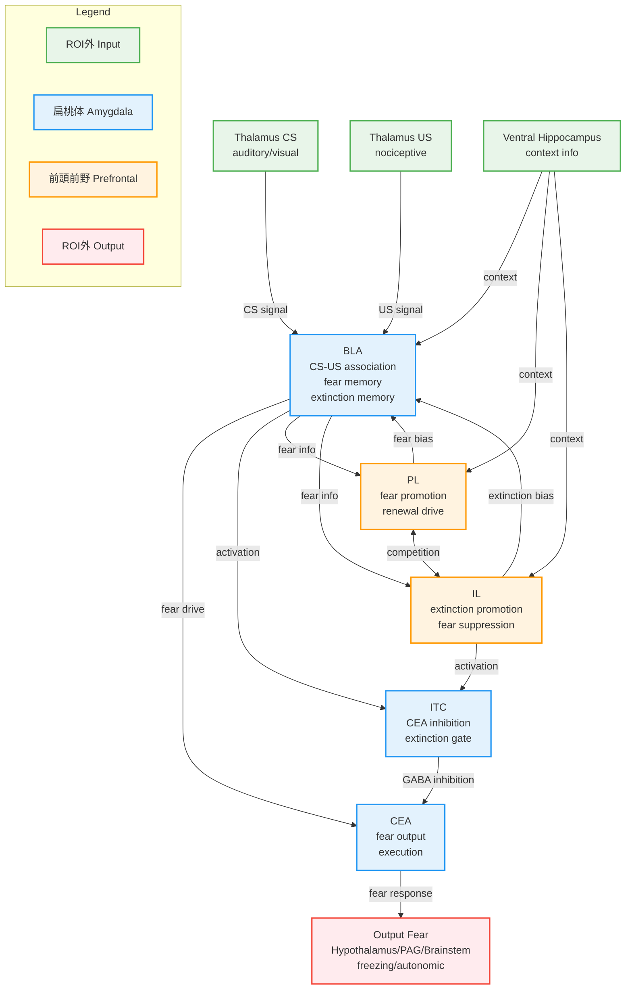

# ステップ8-2: HCD構造図（Mermaid形式）

## HCD図: 恐怖条件づけ・消去・再発

以下のMermaid図は、恐怖条件づけ・消去・再発におけるUniform Circuit間の情報フローを示す。



---

## 図の説明

### ノードの色分け

- **緑色（ROI外 Input）**: 視床、海馬などのROI外入力源
- **青色（扁桃体 Amygdala）**: BLA、ITC、CEAの3つの扁桃体UC
- **オレンジ色（前頭前野 Prefrontal）**: PL、ILの2つの前頭前野UC
- **赤色（ROI外 Output）**: 視床下部、PAG、脳幹などのROI外出力先

### 主要な情報フロー

#### 恐怖条件づけフェーズ
```
Thalamus_CS + Thalamus_US → BLA (CS-US association)
BLA → CEA → Output_Fear (fear response)
```

#### 消去学習フェーズ
```
vHPC (extinction context) → IL (activation)
IL → BLA (extinction memory formation)
IL → ITC (activation) → CEA (inhibition) → Output_Fear (suppression)
```

#### 恐怖再発フェーズ
```
vHPC (new context) → PL (activation)
PL → BLA (fear bias) → CEA → Output_Fear (renewal)
IL activity reduced, ITC inhibition weakened
```

### 双方向接続

- **BLA ↔ PL**: ボトムアップ恐怖情報とトップダウン恐怖促進の統合
- **BLA ↔ IL**: ボトムアップ恐怖情報とトップダウン消去促進の統合
- **PL ↔ IL**: 前頭前野内での競合的バランス調節

### GABAergic抑制

- **ITC → CEA**: GABAergic抑制により、CEA出力を抑制して恐怖反応を抑制

---

## フェーズ別の回路状態

### 恐怖条件づけ時の回路状態

- **活性**: Thalamus_CS/US → BLA → CEA → Output_Fear
- **抑制**: IL、ITC
- **結果**: 強い恐怖反応

### 消去学習時の回路状態

- **活性**: vHPC → IL → BLA/ITC → CEA抑制
- **抑制**: PL
- **結果**: 恐怖反応の抑制、消去記憶形成

### 恐怖再発時の回路状態

- **活性**: vHPC → PL → BLA → CEA → Output_Fear
- **抑制**: IL、ITC
- **結果**: 恐怖反応の再発

---

## HCD図の特徴

1. **明確な層構造**: 入力層（ROI外入力）→ 処理層（ROI内UC）→ 出力層（ROI外出力）
2. **双方向性**: BLA-mPFC間の双方向接続による動的制御
3. **競合メカニズム**: PL-IL競合とBLA内の二重記憶による柔軟な切り替え
4. **ゲート機構**: ITCによるCEA出力のゲーティング
5. **文脈依存性**: 海馬からの文脈情報がPL/ILを介して回路状態を切り替える

この図は、恐怖条件づけ・消去・再発の神経回路基盤を包括的に示している。
