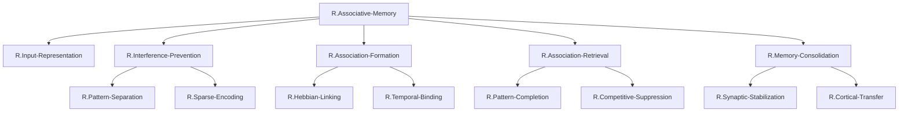

# ステップ1: TLFの段階的分解とGN作成

## TLF
**R.Associative-Memory**: 以前には無関係であった2つの刺激の間にリンクを形成し、一方の刺激が提示されると他方の刺激を想起する能力

## 機能分解の方針

連合記憶（Associative Memory）を実現するには、以下の主要な部分機能が必要である：

1. **入力刺激の識別と表現**: 連合されるべき刺激を適切に表現する
2. **干渉の防止**: 類似した刺激が互いに干渉しないようにする
3. **連合の形成**: 異なる刺激間のリンクを形成する
4. **連合の想起**: 部分手がかりから完全な連合を想起する
5. **記憶の安定化**: 一時的な連合を長期的な記憶に変換する

これらを階層的に分解する。

---

## 階層的機能分解表

| 階層レベル | ノード名 | 機能説明 | 親ノード |
| ---------- | -------- | -------- | -------- |
| 1（TLF） | `R.Associative-Memory` | 以前には無関係であった2つの刺激の間にリンクを形成し、一方の刺激が提示されると他方の刺激を想起する | - |
| 2 | `R.Input-Representation` | 連合されるべき刺激（物体・空間・文脈）を神経表現として適切にコーディングする | `R.Associative-Memory` |
| 2 | `R.Interference-Prevention` | 類似した刺激が互いに干渉しないように、入力パターンを区別可能な表現に変換する | `R.Associative-Memory` |
| 2 | `R.Association-Formation` | 時間的に近接して提示された異なる刺激間の連合をエンコーディングする | `R.Associative-Memory` |
| 2 | `R.Association-Retrieval` | 部分手がかりから完全な連合記憶を想起する | `R.Associative-Memory` |
| 2 | `R.Memory-Consolidation` | 一時的な連合記憶を長期的に安定した記憶に変換する | `R.Associative-Memory` |
| 3 | `R.Pattern-Separation` | 類似した入力パターンを直交化し、重複を最小化する | `R.Interference-Prevention` |
| 3 | `R.Sparse-Encoding` | 低活動率（スパース）の神経コーディングにより、干渉を防ぐ | `R.Interference-Prevention` |
| 3 | `R.Hebbian-Linking` | 同時活性化された神経集団間のシナプス結合を強化する | `R.Association-Formation` |
| 3 | `R.Temporal-Binding` | 時間的に近接した刺激を単一のエピソードとして結合する | `R.Association-Formation` |
| 3 | `R.Pattern-Completion` | リカレント回路を通じて、部分手がかりから完全なパターンを再構成する | `R.Association-Retrieval` |
| 3 | `R.Competitive-Suppression` | 競合する記憶エングラムを選択的に抑制する | `R.Association-Retrieval` |
| 3 | `R.Synaptic-Stabilization` | シナプス可塑性を通じて記憶表現を安定化する | `R.Memory-Consolidation` |
| 3 | `R.Cortical-Transfer` | 海馬依存の記憶を皮質依存の記憶へ転送する | `R.Memory-Consolidation` |

---

## Mermaid階層構造図

---

## 分解の妥当性検証

### 第2階層の妥当性

**親**: `R.Associative-Memory`
**子**: `R.Input-Representation`, `R.Interference-Prevention`, `R.Association-Formation`, `R.Association-Retrieval`, `R.Memory-Consolidation`

**検証**: 
- `R.Input-Representation`: 連合されるべき刺激を表現する（前提条件）
- `R.Interference-Prevention`: 類似刺激の干渉を防ぐ（必要条件）
- `R.Association-Formation`: 刺激間のリンクを形成する（エンコーディング段階）
- `R.Association-Retrieval`: 形成された連合を想起する（想起段階）
- `R.Memory-Consolidation`: 一時的記憶を長期記憶に変換する（固定化段階）

これら5つの部分機能が組み合わされることで、連合記憶の全プロセス（エンコーディング→想起→固定化）が実現される。✓

### 第3階層の妥当性

#### `R.Interference-Prevention`の分解

**子**: `R.Pattern-Separation`, `R.Sparse-Encoding`

**検証**: 
- Pattern Separationとスパースエンコーディングは、干渉防止の2つの主要メカニズムであり、これらの組み合わせで干渉防止が実現される。✓

#### `R.Association-Formation`の分解

**子**: `R.Hebbian-Linking`, `R.Temporal-Binding`

**検証**: 
- Hebbian Linkingは空間的な連合（同時活性化）を形成し、Temporal Bindingは時間的な連合を形成する。両者の組み合わせで、時空間的な連合形成が実現される。✓

#### `R.Association-Retrieval`の分解

**子**: `R.Pattern-Completion`, `R.Competitive-Suppression`

**検証**: 
- Pattern Completionは正しい記憶の再構成を行い、Competitive Suppressionは競合する記憶を抑制する。両者の組み合わせで、正確な連合想起が実現される。✓

#### `R.Memory-Consolidation`の分解

**子**: `R.Synaptic-Stabilization`, `R.Cortical-Transfer`

**検証**: 
- Synaptic Stabilizationは海馬内での記憶の安定化を行い、Cortical Transferは記憶を皮質へ転送する。両者の組み合わせで、記憶の長期固定化が実現される。✓

---

## 各ノードの独立性と明確性

すべてのGNは以下の特性を満たしている：

1. **独立性**: 各GNは他のGNと機能的に独立している
2. **明確性**: 各GNの機能は神経科学的に明確に定義されている
3. **必要性**: すべてのGNが連合記憶の実現に必要である
4. **十分性**: 親ノードの機能が子ノードの組み合わせで実現される

---

## 分解の粒度について

本分解では、第3階層までとしている。これは以下の理由による：

1. **神経組織との対応**: 第3階層のGNは、HCDで定義したUC（DG, CA3, CA1の各サブ領域）に直接対応させることができる粒度である

2. **解釈可能性**: これ以上細かく分解すると、機能の独立性が失われ、解釈が困難になる

3. **神経科学的妥当性**: 第3階層のGN（Pattern Separation, Hebbian Linking, Pattern Completion など）は、神経科学において確立された計算概念である

---

## 次ステップへの準備

この初期分解では、純粋に機能の論理的分解に集中した。次のステップ2では、冗長性の削減とノードのマージを検討する。現時点では、各GNが独立しており、明確な冗長性は見られないが、ステップ2で再検討する。
