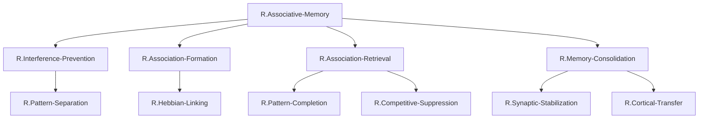

# ステップ2: 冗長性の削減とノードのマージ

## 初期分解の分析

ステップ1で作成した機能分解を分析し、冗長性の有無を検討する。

### 第2階層の分析

| ノード名 | 機能 | 検討結果 |
| -------- | ---- | -------- |
| `R.Input-Representation` | 刺激の表現 | 他のノードの前提条件として機能するが、独立した処理ステップではない |
| `R.Interference-Prevention` | 干渉防止 | 独立した計算機能 |
| `R.Association-Formation` | 連合形成 | 独立した計算機能 |
| `R.Association-Retrieval` | 連合想起 | 独立した計算機能 |
| `R.Memory-Consolidation` | 記憶固定化 | 独立した計算機能 |

**問題点**: `R.Input-Representation`は、連合記憶の独立した部分機能というより、他の機能の前提条件である。このノードは、実際には嗅内皮質（ROI外）が担う機能であり、FRGの階層構造に含める必要性が低い。

**決定**: `R.Input-Representation`を削除し、入力表現は暗黙の前提条件とする。

### 第3階層の分析

#### `R.Interference-Prevention`の子ノード

| ノード名 | 機能 | 検討結果 |
| -------- | ---- | -------- |
| `R.Pattern-Separation` | パターン直交化 | 独立した計算機能 |
| `R.Sparse-Encoding` | スパースコーディング | Pattern Separationの実装メカニズムの一部 |

**問題点**: `R.Sparse-Encoding`は、`R.Pattern-Separation`を実現するための具体的なメカニズム（低活動率の神経コーディング）であり、独立した機能というより実装手段である。

**決定**: `R.Sparse-Encoding`を`R.Pattern-Separation`にマージする。Pattern Separationの実現にはスパースエンコーディングが本質的に含まれる。

#### `R.Association-Formation`の子ノード

| ノード名 | 機能 | 検討結果 |
| -------- | ---- | -------- |
| `R.Hebbian-Linking` | Hebbianシナプス結合 | 独立した計算機能 |
| `R.Temporal-Binding` | 時間的結合 | Hebbian Linkingに包含される |

**問題点**: `R.Temporal-Binding`は、時間的に近接した刺激を結合する機能だが、これはHebbian Linkingの時間窓内での適用である。両者を分離する神経科学的根拠は弱い。

**決定**: `R.Temporal-Binding`を`R.Hebbian-Linking`にマージする。Hebbian Linkingには時間的結合が本質的に含まれる。

#### `R.Association-Retrieval`の子ノード

| ノード名 | 機能 | 検討結果 |
| -------- | ---- | -------- |
| `R.Pattern-Completion` | パターン補完 | 独立した計算機能 |
| `R.Competitive-Suppression` | 競合抑制 | Pattern Completionの精度向上メカニズム |

**検討**: 両者は密接に関連するが、`R.Competitive-Suppression`は`R.Pattern-Completion`とは独立したメカニズム（介在ニューロンによる選択的抑制）として実装される。

**決定**: マージしない。両者は独立したGNとして保持する。

#### `R.Memory-Consolidation`の子ノード

| ノード名 | 機能 | 検討結果 |
| -------- | ---- | -------- |
| `R.Synaptic-Stabilization` | シナプス安定化 | 独立した計算機能 |
| `R.Cortical-Transfer` | 皮質転送 | 独立した計算機能 |

**検討**: 両者は記憶固定化の異なる側面（海馬内の安定化 vs. 皮質への転送）を担う。

**決定**: マージしない。両者は独立したGNとして保持する。

---

## 最適化後の階層構造

### 最適化FRG表

| 階層レベル | ノード名 | 機能説明 | 親ノード | 子ノード |
| ---------- | -------- | -------- | -------- | -------- |
| 1（TLF） | `R.Associative-Memory` | 以前には無関係であった2つの刺激の間にリンクを形成し、一方の刺激が提示されると他方の刺激を想起する | - | `R.Interference-Prevention`; `R.Association-Formation`; `R.Association-Retrieval`; `R.Memory-Consolidation` |
| 2 | `R.Interference-Prevention` | 類似した刺激が互いに干渉しないように、入力パターンを区別可能な表現に変換する | `R.Associative-Memory` | `R.Pattern-Separation` |
| 2 | `R.Association-Formation` | 時間的に近接して提示された異なる刺激間の連合をエンコーディングする | `R.Associative-Memory` | `R.Hebbian-Linking` |
| 2 | `R.Association-Retrieval` | 部分手がかりから完全な連合記憶を想起する | `R.Associative-Memory` | `R.Pattern-Completion`; `R.Competitive-Suppression` |
| 2 | `R.Memory-Consolidation` | 一時的な連合記憶を長期的に安定した記憶に変換する | `R.Associative-Memory` | `R.Synaptic-Stabilization`; `R.Cortical-Transfer` |
| 3 | `R.Pattern-Separation` | 類似した入力パターンを直交化し、スパースエンコーディングにより重複を最小化する（旧`R.Sparse-Encoding`をマージ） | `R.Interference-Prevention` | （リーフノード） |
| 3 | `R.Hebbian-Linking` | 時間的に近接して同時活性化された神経集団間のシナプス結合を強化する（旧`R.Temporal-Binding`をマージ） | `R.Association-Formation` | （リーフノード） |
| 3 | `R.Pattern-Completion` | リカレント回路を通じて、部分手がかりから完全なパターンを再構成する | `R.Association-Retrieval` | （リーフノード） |
| 3 | `R.Competitive-Suppression` | 競合する記憶エングラムを選択的に抑制する | `R.Association-Retrieval` | （リーフノード） |
| 3 | `R.Synaptic-Stabilization` | シナプス可塑性を通じて記憶表現を安定化する | `R.Memory-Consolidation` | （リーフノード） |
| 3 | `R.Cortical-Transfer` | 海馬依存の記憶を皮質依存の記憶へ転送する | `R.Memory-Consolidation` | （リーフノード） |

---

## Mermaid最適化階層構造図

---

## マージの根拠

### マージ1: `R.Input-Representation`の削除

**理由**: 
- 入力表現は連合記憶の前提条件であり、独立した部分機能ではない
- 実際の神経基盤は嗅内皮質（ROI外）にあり、海馬のFRGに含める必要性が低い
- 削除することで、FRGの焦点が海馬内の情報処理に絞られ、解釈可能性が向上する

### マージ2: `R.Sparse-Encoding` → `R.Pattern-Separation`

**理由**: 
- スパースエンコーディングは、Pattern Separationを実現するための本質的なメカニズムである
- 両者を分離する神経科学的根拠は弱い（DGの顆粒細胞がPattern Separationとスパース発火の両方を同時に実現する）
- マージにより、`R.Pattern-Separation`が単一のGNとして明確に定義される

### マージ3: `R.Temporal-Binding` → `R.Hebbian-Linking`

**理由**: 
- Temporal Bindingは、Hebbian Linkingの時間窓内での適用である
- Hebbian学習の原理には、時間的近接性が本質的に含まれる（"cells that fire together, wire together"の"together"には時間的近接が含まれる）
- 両者を分離すると、CA3のリカレント回路を2つの異なるメカニズムに無理に分割することになり、神経科学的に不自然

---

## 最適化後のグラフ構造の妥当性

### 親子関係の確認

#### `R.Associative-Memory`の実現

**子**: `R.Interference-Prevention`, `R.Association-Formation`, `R.Association-Retrieval`, `R.Memory-Consolidation`

**検証**: 
1. 干渉防止により、類似記憶が区別される
2. 連合形成により、刺激間のリンクが作られる
3. 連合想起により、部分手がかりから記憶が想起される
4. 記憶固定化により、連合が長期記憶として保存される

これら4つの部分機能の組み合わせで、連合記憶の全プロセスが実現される。✓

#### `R.Interference-Prevention`の実現

**子**: `R.Pattern-Separation`

**検証**: Pattern Separationにより、干渉防止が実現される。✓

#### `R.Association-Formation`の実現

**子**: `R.Hebbian-Linking`

**検証**: Hebbian Linkingにより、連合形成が実現される。✓

#### `R.Association-Retrieval`の実現

**子**: `R.Pattern-Completion`, `R.Competitive-Suppression`

**検証**: Pattern Completionにより記憶が再構成され、Competitive Suppressionにより競合が抑制される。両者の組み合わせで、正確な連合想起が実現される。✓

#### `R.Memory-Consolidation`の実現

**子**: `R.Synaptic-Stabilization`, `R.Cortical-Transfer`

**検証**: Synaptic Stabilizationにより海馬内で記憶が安定化され、Cortical Transferにより皮質へ転送される。両者の組み合わせで、記憶固定化が実現される。✓

---

## 解釈可能性の向上

### 最適化前の構造

- TLF: 1ノード
- 第2階層: 5ノード
- 第3階層: 8ノード
- **合計: 14ノード**

### 最適化後の構造

- TLF: 1ノード
- 第2階層: 4ノード
- 第3階層: 6ノード
- **合計: 11ノード**

**改善点**:
- ノード数が14→11に削減され、グラフの複雑性が低下した
- 各ノードがより明確で独立した機能を表現している
- 神経科学的実体（UC）との対応がより明確になった

---

## 次ステップへの準備

最適化後のFRG構造は、以下の特徴を持つ：

1. **階層の明確性**: 3階層構造（TLF、第2階層、第3階層）
2. **機能の独立性**: 各GNが明確で独立した計算機能を持つ
3. **神経科学的妥当性**: 各GNが確立された神経科学的概念に対応する
4. **UC対応の準備**: 第3階層のGNは、HCDで定義したUCに直接対応可能な粒度である

次のステップ3では、各GNをROI内のUC（DG, CA3-Pyr, CA3-IN, CA1-Pyr, CA1-PV, CA1-SST）と紐づける。
