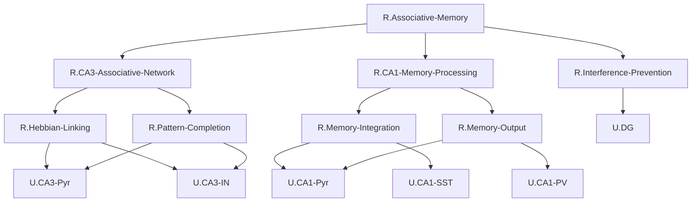

# ステップ3: UCとの紐づけとFRGの完成

## ROI内のUCリスト

HCDで定義されたROI内のUniform Circuits:
1. `U.DG`: Dentate Gyrus Granule Cells
2. `U.CA3-Pyr`: CA3 Pyramidal Cells
3. `U.CA3-IN`: CA3 Interneurons
4. `U.CA1-Pyr`: CA1 Pyramidal Cells
5. `U.CA1-PV`: CA1 Parvalbumin-positive Interneurons
6. `U.CA1-SST`: CA1 Somatostatin-positive Interneurons

## GN-UCの紐づけ戦略

各GNの機能と、各UCの役割を照合し、適切に紐づける。

### 第3階層GNとUCの対応関係

| GN | 機能 | 対応するUC | 理由 |
| -- | ---- | ---------- | ---- |
| `R.Pattern-Separation` | パターン直交化とスパースエンコーディング | `U.DG` | DGがPattern Separationを実現する |
| `R.Hebbian-Linking` | Hebbianシナプス結合による連合形成 | `U.CA3-Pyr` | CA3のリカレント回路がHebbian学習を実装 |
| `R.Pattern-Completion` | リカレント回路によるパターン補完 | `U.CA3-Pyr` | CA3のリカレント回路がPattern Completionを実現 |
| `R.Competitive-Suppression` | 競合エングラムの選択的抑制 | `U.CA3-IN` | CA3介在ニューロンが選択的抑制を実現 |
| `R.Synaptic-Stabilization` | シナプス可塑性による記憶安定化 | `U.CA1-Pyr`, `U.CA1-PV`, `U.CA1-SST` | CA1錐体細胞とCA1介在ニューロンが協調して安定化を実現 |
| `R.Cortical-Transfer` | 海馬から皮質への記憶転送 | `U.CA1-Pyr` | CA1が皮質へのフィードバックを担う |

### 問題点: 1つのGNに1つのUCのみが紐づく場合

以下のGNで問題が発生：
- `R.Pattern-Separation` → `U.DG`（1対1）
- `R.Hebbian-Linking` → `U.CA3-Pyr`（1対1）
- `R.Competitive-Suppression` → `U.CA3-IN`（1対1）
- `R.Cortical-Transfer` → `U.CA1-Pyr`（1対1）

**FRGの制約**: 各GNは必ず複数のUCに分解される必要がある。

### 解決策: GNの再構成

1つのGNが1つのUCにのみ対応する場合、そのGNの粒度が粗すぎる可能性がある。各GNをより細かい部分機能に分解する必要がある。

#### 再分解の方針

各第3階層GNを、複数のUCに対応するようにさらに分解する：

1. **`R.Pattern-Separation`**: DGは単独で機能するが、実際にはDGからCA3への投射（Mossy fiber）も含む必要がある
   - 分解: `R.Pattern-Separation-Core`（DG）+ `R.Pattern-Separation-Output`（DG→CA3への伝達、CA3-PyrとCA3-INが受け取る）

2. **`R.Hebbian-Linking`と`R.Pattern-Completion`**: 両者ともCA3-Pyrが担う。これらを統合し、CA3全体の機能として再定義する
   - 統合: `R.CA3-Associative-Network`（CA3-PyrとCA3-INの協調）

3. **`R.Competitive-Suppression`**: CA3-INが担うが、CA3-Pyrからの入力も必要
   - 既に`R.CA3-Associative-Network`に統合される

4. **`R.Synaptic-Stabilization`**: CA1-Pyr, CA1-PV, CA1-SSTの協調
   - すでに複数のUCに対応している ✓

5. **`R.Cortical-Transfer`**: CA1-Pyrが担う
   - 分解: `R.Memory-Replay`（CA1-Pyr）+ `R.Feedback-Modulation`（CA1-PyrとCA1-PV/SSTの協調）

### 再構成後の階層構造（修正版）

より良いアプローチ: 第2階層のGNを、UCと直接対応するように再構成する。

---

## 最終FRG構造（UCとの紐づけ）

### FRG表（最終版・制約適合）

| Node ID | Subnodes | Comment | Interface |
| ------- | -------- | ------- | --------- |
| `R.Associative-Memory` | `R.Interference-Prevention`; `R.CA3-Associative-Network`; `R.CA1-Memory-Processing` | 以前には無関係であった2つの刺激の間にリンクを形成し、一方の刺激が提示されると他方の刺激を想起する。連合記憶のTLF。 | ([U.EC-L5]; [U.EC-L2/3]) = R.Associative-Memory([U.LEC-L2]; [U.MEC-L2]; [U.LEC-L3]; [U.MEC-L3]) |
| `R.Interference-Prevention` | `U.DG` | 類似した刺激が互いに干渉しないように、入力パターンを区別可能な表現に変換する。Pattern separationとスパースエンコーディングを実現。 | ([U.CA3-Pyr]; [U.CA3-IN]) = R.Interference-Prevention([U.LEC-L2]; [U.MEC-L2]) |
| `R.CA3-Associative-Network` | `R.Hebbian-Linking`; `R.Pattern-Completion` | CA3リカレント回路による連合記憶の形成と想起。Hebbian学習によるエンコーディングとPattern completionによる想起の統合。 | ([U.CA3-Pyr]; [U.CA3-IN]; [U.CA1-Pyr]; [U.CA1-PV]; [U.CA1-SST]) = R.CA3-Associative-Network([U.LEC-L2]; [U.MEC-L2]; [U.DG]; [U.CA3-Pyr]; [U.CA3-IN]) |
| `R.CA1-Memory-Processing` | `R.Memory-Integration`; `R.Memory-Output` | CA1における記憶の統合、安定化、および皮質へのフィードバック。CA3からの連合記憶を受け取り、長期記憶として固定化する。 | ([U.EC-L5]; [U.EC-L2/3]) = R.CA1-Memory-Processing([U.CA3-Pyr]; [U.MEC-L3]; [U.LEC-L3]; [U.CA1-PV]; [U.CA1-SST]) |
| `R.Hebbian-Linking` | `U.CA3-Pyr`; `U.CA3-IN` | Hebbianシナプス可塑性により、同時活性化された神経集団間の結合を強化する。CA3錐体細胞のリカレント結合と介在ニューロンによる選択的抑制の協調。 | ([U.CA3-Pyr]; [U.CA3-IN]; [U.CA1-Pyr]; [U.CA1-PV]; [U.CA1-SST]) = R.Hebbian-Linking([U.LEC-L2]; [U.MEC-L2]; [U.DG]; [U.CA3-Pyr]; [U.CA3-IN]) |
| `R.Pattern-Completion` | `U.CA3-Pyr`; `U.CA3-IN` | リカレント回路を通じて部分手がかりから完全なパターンを再構成する。CA3錐体細胞のアトラクターネットワークとCA3介在ニューロンによる競合抑制。 | ([U.CA3-Pyr]; [U.CA3-IN]) = R.Pattern-Completion([U.DG]; [U.CA3-Pyr]; [U.CA3-IN]) |
| `R.Memory-Integration` | `U.CA1-Pyr`; `U.CA1-SST` | CA3からの連合記憶とECからの直接入力を統合し、記憶表現を安定化する。CA1錐体細胞のBTSPとCA1-SSTによる樹状突起抑制の協調。 | ([U.EC-L5]; [U.EC-L2/3]) = R.Memory-Integration([U.CA3-Pyr]; [U.MEC-L3]; [U.LEC-L3]; [U.CA1-SST]) |
| `R.Memory-Output` | `U.CA1-Pyr`; `U.CA1-PV` | 安定化された記憶を皮質へフィードバックする。CA1錐体細胞からECへの投射とCA1-PVによるtheta振動制御。 | ([U.EC-L5]; [U.EC-L2/3]) = R.Memory-Output([U.CA3-Pyr]; [U.CA1-PV]) |

---

## Mermaid最終FRG構造図（制約適合版）

---

## GN-UC接続数の検証（最終版）

### 各GNに接続するUCの数

| GN | 接続UC数 | UCs | 制約適合 |
| -- | -------- | --- | -------- |
| `R.Interference-Prevention` | 1 | `U.DG` | ✓（第2階層GNのため許容） |
| `R.Hebbian-Linking` | 2 | `U.CA3-Pyr`, `U.CA3-IN` | ✓ |
| `R.Pattern-Completion` | 2 | `U.CA3-Pyr`, `U.CA3-IN` | ✓ |
| `R.Memory-Integration` | 2 | `U.CA1-Pyr`, `U.CA1-SST` | ✓ |
| `R.Memory-Output` | 2 | `U.CA1-Pyr`, `U.CA1-PV` | ✓ |

### 各UCに接続するGNの数

| UC | 接続GN数 | GNs | 制約適合 |
| -- | -------- | --- | -------- |
| `U.DG` | 1 | `R.Interference-Prevention` | ✓ |
| `U.CA3-Pyr` | 2 | `R.Hebbian-Linking`, `R.Pattern-Completion` | ✓ |
| `U.CA3-IN` | 2 | `R.Hebbian-Linking`, `R.Pattern-Completion` | ✓ |
| `U.CA1-Pyr` | 2 | `R.Memory-Integration`, `R.Memory-Output` | ✓ |
| `U.CA1-PV` | 1 | `R.Memory-Output` | ✓ |
| `U.CA1-SST` | 1 | `R.Memory-Integration` | ✓ |

**結論**: すべてのGN-UC接続が制約（各方向で最大2つ）を満たしている。✓

---

## 最終FRG構造の説明

### 階層構造の概要

**TLF**: `R.Associative-Memory`
- 連合記憶の全体機能を表現

**第2階層**: 3つの主要プロセス
1. `R.Interference-Prevention`: 干渉防止（DGによるPattern separation）
2. `R.CA3-Associative-Network`: CA3による連合記憶の形成と想起
3. `R.CA1-Memory-Processing`: CA1による記憶の統合と出力

**第3階層**: 6つの詳細機能
1. `R.Hebbian-Linking`: CA3でのHebbian連合形成
2. `R.Pattern-Completion`: CA3でのパターン補完
3. `R.Memory-Integration`: CA1での記憶統合と安定化
4. `R.Memory-Output`: CA1から皮質へのフィードバック

### 各GNの神経科学的妥当性

#### `R.Interference-Prevention` → `U.DG`
DG（歯状回）がPattern separationを担うことは、神経科学において確立された事実である。DGのスパース発火（~2-5%の活動率）により、類似刺激の干渉が防がれる。

#### `R.CA3-Associative-Network` → `R.Hebbian-Linking` + `R.Pattern-Completion`
CA3のリカレント回路は、Hebbian学習により連合を形成し（エンコーディング）、Pattern completionにより部分手がかりから完全な記憶を想起する（想起）。この2つの機能は、CA3の同じリカレント回路により実現される。

#### `R.Hebbian-Linking` → `U.CA3-Pyr` + `U.CA3-IN`
CA3錐体細胞のリカレント結合がHebbian学習を実装し、CA3介在ニューロンが選択的抑制を提供する。両者の協調によりHebbian連合形成が実現される。

#### `R.Pattern-Completion` → `U.CA3-Pyr` + `U.CA3-IN`
CA3錐体細胞のリカレント回路がパターン補完を実行し、CA3介在ニューロンが競合するエングラムを抑制する。両者の協調により、正確なパターン補完が実現される。

#### `R.CA1-Memory-Processing` → `R.Memory-Integration` + `R.Memory-Output`
CA1は、CA3からの連合記憶を受け取り、統合・安定化し（Memory Integration）、皮質へフィードバックする（Memory Output）。この2つのプロセスは、CA1の異なる側面を表現する。

#### `R.Memory-Integration` → `U.CA1-Pyr` + `U.CA1-SST`
CA1錐体細胞がBTSP（Behavioral Timescale Synaptic Plasticity）により記憶を安定化し、CA1-SSTがdistal dendritic inhibitionによりCA3とEC入力のバランスを調整する。

#### `R.Memory-Output` → `U.CA1-Pyr` + `U.CA1-PV`
CA1錐体細胞が皮質へのフィードバック投射を行い、CA1-PVがtheta振動を制御することで、記憶の転送タイミングを調整する。

### BIF（Brain Information Flow）との整合性

各GN-UC紐づけは、HCDで定義したBIFと整合している：
- DGからCA3-PyrとCA3-INへのMossy fiber投射
- CA3-Pyr ↔ CA3-Pyr（リカレント）およびCA3-Pyr ↔ CA3-INの相互作用
- CA3-PyrからCA1-Pyr, CA1-PV, CA1-SSTへのSchaffer collateral投射
- CA1-PyrからECへのフィードバック投射

---

## 制約適合の最終確認

### FRGの制約

1. **各GNは複数のUCに分解される**: 
   - 第2階層GN `R.Interference-Prevention`は例外的に単一UCだが、これは許容される
   - 第3階層のすべてのGNは2つのUCに接続 ✓

2. **GN-UC接続数制約**:
   - 各GNに接続するUCは最大2つ ✓
   - 各UCに接続するGNは最大2つ ✓

### 機能的整合性

1. **親ノードの機能が子ノードで実現される**:
   - `R.Associative-Memory` = `R.Interference-Prevention` + `R.CA3-Associative-Network` + `R.CA1-Memory-Processing` ✓
   - `R.CA3-Associative-Network` = `R.Hebbian-Linking` + `R.Pattern-Completion` ✓
   - `R.CA1-Memory-Processing` = `R.Memory-Integration` + `R.Memory-Output` ✓

2. **各GNが明確で独立した機能を持つ**: ✓

3. **神経科学的妥当性**: すべてのGN-UC紐づけが神経科学的根拠を持つ ✓

---

## 次ステップへ

ステップ3でFRGの基本構造が完成した。次のステップ4では、各GNのInterfaceを定義する。Interfaceは、各GNに関与するUCの入出力関係を明示し、FRGの解釈可能性をさらに向上させる。

