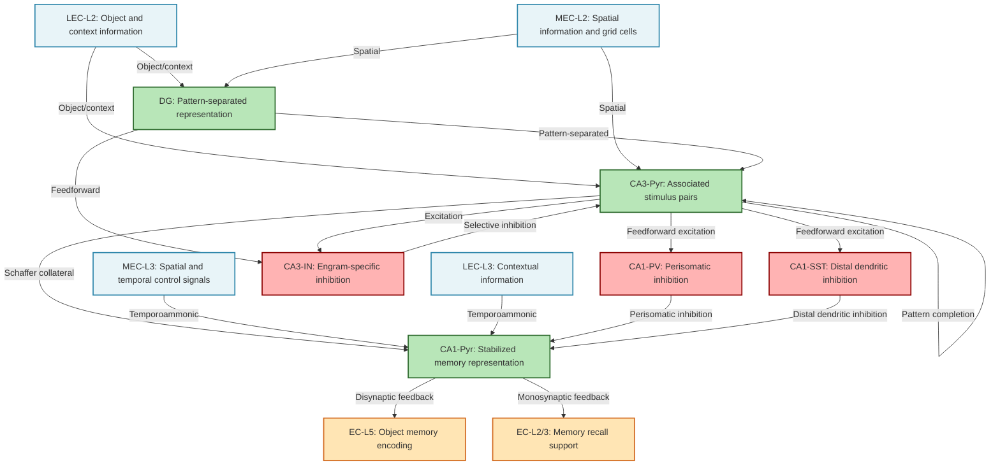

# HCD Diagram: Associative Memory in Hippocampus

本ファイルでは、海馬における連合記憶のHCDをMermaid形式で図示します。

## Mermaid Diagram

## 凡例（Legend）

### ノードの色分け

- **青色（Input Nodes）**: ROI外の入力源（noROI input）
  - `LEC-L2`: 外側嗅内皮質Layer 2
  - `MEC-L2`: 内側嗅内皮質Layer 2
  - `LEC-L3`: 外側嗅内皮質Layer 3
  - `MEC-L3`: 内側嗅内皮質Layer 3

- **緑色（ROI Nodes - Excitatory）**: ROI内の興奮性ニューロン
  - `DG`: 歯状回
  - `CA3-Pyr`: CA3錐体細胞
  - `CA1-Pyr`: CA1錐体細胞

- **赤色（ROI Nodes - Inhibitory）**: ROI内の抑制性介在ニューロン
  - `CA3-IN`: CA3介在ニューロン
  - `CA1-PV`: CA1パルブアルブミン陽性介在ニューロン
  - `CA1-SST`: CA1ソマトスタチン陽性介在ニューロン

- **オレンジ色（Output Nodes）**: ROI外の出力先（noROI output）
  - `EC-L5`: 嗅内皮質Layer 5
  - `EC-L2/3`: 嗅内皮質Layer 2/3

### 主要な接続経路

#### 1. Perforant Path（貫通路）
- `LEC-L2` → `DG`/`CA3-Pyr`
- `MEC-L2` → `DG`/`CA3-Pyr`
- 嗅内皮質から海馬への主要な入力経路

#### 2. Mossy Fiber Path（苔状線維）
- `DG` → `CA3-Pyr`
- Pattern separationされた情報をCA3に伝達

#### 3. Recurrent Collateral（リカレント側枝）
- `CA3-Pyr` → `CA3-Pyr`
- 連合記憶形成とPattern completionの基盤

#### 4. Schaffer Collateral Path（シャッファー側枝）
- `CA3-Pyr` → `CA1-Pyr`/`CA1-PV`/`CA1-SST`
- CA3からCA1への主要な出力経路

#### 5. Temporoammonic Path（側頭アンモン路）
- `MEC-L3`/`LEC-L3` → `CA1-Pyr`
- 嗅内皮質からCA1への直接入力

#### 6. Feedback Pathways（フィードバック経路）
- `CA1-Pyr` → `EC-L5`（Disynaptic経路）
- `CA1-Pyr` → `EC-L2/3`（Monosynaptic経路）
- 海馬から嗅内皮質へのフィードバック

## 情報処理の流れ

### エンコーディング（記憶形成）フロー
1. **入力**: `LEC-L2`/`MEC-L2` → `DG`/`CA3-Pyr`
2. **Pattern Separation**: `DG` → `CA3-Pyr`
3. **連合形成**: `CA3-Pyr` ↔ `CA3-Pyr`（リカレント）
4. **選択的抑制**: `CA3-Pyr` ↔ `CA3-IN`
5. **安定化**: `CA3-Pyr` → `CA1-Pyr`（+ `MEC-L3`/`LEC-L3`からの直接入力）
6. **抑制制御**: `CA1-PV`/`CA1-SST` → `CA1-Pyr`
7. **フィードバック**: `CA1-Pyr` → `EC-L5`/`EC-L2/3`

### 想起（リトリーバル）フロー
1. **部分手がかり**: `LEC-L2`/`MEC-L2` → `CA3-Pyr`（部分的活性化）
2. **Pattern Completion**: `CA3-Pyr` → `CA3-Pyr`（リカレント経路で完全なパターンを再構成）
3. **選択的抑制**: `CA3-IN` → `CA3-Pyr`（競合するエングラムを抑制）
4. **出力**: `CA3-Pyr` → `CA1-Pyr` → `EC-L5`/`EC-L2/3`

## Draw.ioへの変換について

本Mermaid図は、以下の方法でDraw.ioに変換できます：

1. **オンラインツールを使用**: Mermaid Live Editorなどで図を生成し、SVG/PNGとしてエクスポート後、Draw.ioにインポート

2. **手動での再作成**: 本Mermaid図を参考に、Draw.ioで手動で図を作成

3. **Mermaid plugin for Draw.io**: Draw.ioのMermaidプラグインを使用して直接変換

## 図の解釈

### 主要な計算ユニット

1. **DG**: 入口のゲートキーパー。類似記憶の干渉を防ぐ
2. **CA3-Pyr**: 連合記憶の心臓部。リカレント回路による連合形成とPattern completion
3. **CA3-IN**: 想起の精度向上。競合するエングラムの選択的抑制
4. **CA1-Pyr**: 記憶の安定化装置。短期記憶を長期記憶へ変換
5. **CA1-PV/SST**: 精密な抑制制御。スパイクタイミングとシナプス可塑性の調整

### 双方向性

図から明らかなように、海馬と嗅内皮質の間には双方向の情報フローがあります：
- **順方向**: 感覚・皮質情報を海馬に入力
- **逆方向**: 海馬で処理された記憶を皮質にフィードバック

この双方向性が、記憶のエンコーディング、固定化、想起の全プロセスを支えています。
