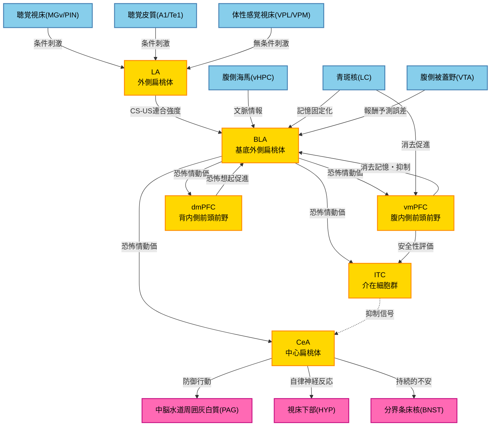

# HCD構造図

## 恐怖条件付けと消去のHCD（Hypothetical Component Graph）

以下は、扁桃体と前頭前野における恐怖条件付けと消去のHCDをMermaid形式で図示したものです。



## 図の説明

### ノードの色分け
- **水色系（ROI_Input）**: ROI外からの入力を供給する神経組織
- **黄色系（ROI内UC）**: ROI内のUniform Component
- **マゼンタ系（ROI_Output）**: ROI外への出力を受け取る神経組織

### 主要な情報フロー

#### 1. 恐怖条件付け経路（獲得）
```
感覚入力 → LA → BLA → CeA → 運動出力系
```

#### 2. 恐怖消去経路（抑制）
```
BLA → vmPFC → ITC → CeA（抑制）
BLA → vmPFC → BLA（直接抑制）
```

#### 3. 恐怖想起経路（促進）
```
BLA → dmPFC → BLA（フィードバック増強）
```

### エッジの表現
- **実線矢印**: 興奮性投射または情報伝達
- **点線矢印**: 抑制性投射（ITCからCeA）

### UCの機能的配置

#### 扁桃体グループ（左側）
- LA: 感覚入力の受け皿、連合学習
- BLA: 情報統合のハブ
- ITC: 抑制ゲート
- CeA: 出力核

#### 前頭前野グループ（右側）
- vmPFC: 消去記憶、抑制制御
- dmPFC: 恐怖想起、促進制御

この配置により、扁桃体による自動的な恐怖処理と、前頭前野による認知的制御の相互作用が視覚的に理解できます。

## 神経回路の特徴

### ボトムアップとトップダウンの統合
- **ボトムアップ**: 感覚系 → LA → BLA → 前頭前野
- **トップダウン**: 前頭前野 → BLA/ITC → CeA

### 拮抗的制御
- vmPFC（抑制）とdmPFC（促進）がBLAに対して拮抗的に作用
- この拮抗作用により、状況依存的な適応的恐怖反応が実現

### ゲート機能
- ITCがvmPFCの制御下でCeAへの信号を抑制
- 消去学習時の柔軟な恐怖反応制御を可能にする

## 臨床的意義

このHCD図は、以下の臨床的観点から重要です：

1. **PTSD**: vmPFC-ITC-CeA経路の機能不全が恐怖反応の過剰持続を引き起こす
2. **曝露療法**: vmPFC活性化によるITCの賦活が治療メカニズム
3. **薬物療法**: 各UCや接続を標的とした治療法開発の基盤

このように、HCD図は恐怖条件付けと消去の神経メカニズムを包括的に可視化し、研究と臨床応用の両面で有用な枠組みを提供します。


