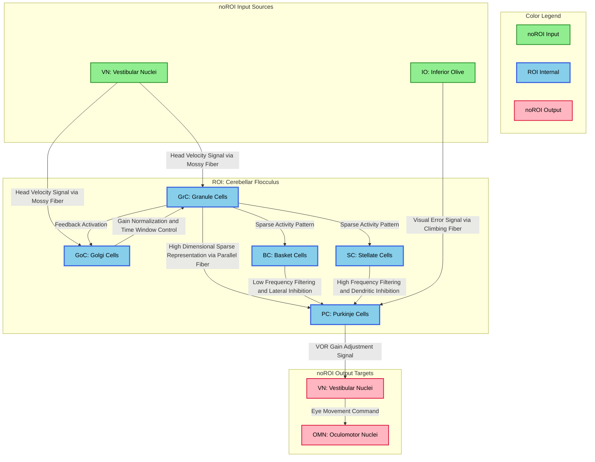

# 7_diagram.md - HCD構造図

## 基本情報
- **ROI**: 小脳片葉（Cerebellar Flocculus）
- **TLF**: VOR（前庭動眼反射）の適応的制御

---

## HCD図（Mermaid形式）

---

## 図の説明

### 色分け凡例

| 色 | 意味 | 対応要素 |
| -- | ---- | -------- |
| 緑（#90EE90） | noROI Input（入力源） | VN, IO |
| 青（#87CEEB） | ROI Internal（小脳片葉内UC） | GrC, GoC, BC, SC, PC |
| ピンク（#FFB6C1） | noROI Output（出力先） | VN, OMN |

### 主要情報フロー

1. **主経路（フィードフォワード）**: VN → GrC → PC → VN → OMN
2. **教師信号経路**: IO → PC（登上線維経由）
3. **側方抑制経路**: GrC → BC/SC → PC
4. **フィードバック抑制経路**: GrC → GoC → GrC

### エッジラベル（Output Semantics）

| 接続 | ラベル（Output Semantics） |
| ---- | -------------------------- |
| VN → GrC | Head Velocity Signal via Mossy Fiber |
| VN → GoC | Head Velocity Signal via Mossy Fiber |
| GrC → PC | High Dimensional Sparse Representation via Parallel Fiber |
| GrC → BC | Sparse Activity Pattern |
| GrC → SC | Sparse Activity Pattern |
| GrC → GoC | Feedback Activation |
| GoC → GrC | Gain Normalization and Time Window Control |
| BC → PC | Low Frequency Filtering and Lateral Inhibition |
| SC → PC | High Frequency Filtering and Dendritic Inhibition |
| IO → PC | Visual Error Signal via Climbing Fiber |
| PC → VN | VOR Gain Adjustment Signal |
| VN → OMN | Eye Movement Command |

---

## 情報処理の要約

### 学習過程
1. 頭部が回転すると、前庭核（VN）が頭部速度を検出
2. 苔状線維経由で顆粒細胞（GrC）に入力
3. 平行線維経由でプルキンエ細胞（PC）が活性化
4. VORが不完全な場合、網膜滑り（retinal slip）が発生
5. 下オリーブ核（IO）が視覚誤差を検出し、登上線維でPCに伝達
6. 平行線維-PC間シナプスにLTDが誘導され、応答が修正
7. PCからVNへの抑制出力が変化し、VORゲインが調整

### 回路の計算特性
- **スパース符号化**: GrCが低次元入力を高次元スパース表現に変換
- **ゲイン正規化**: GoCがGrC活動を一定レベルに維持
- **周波数選択**: BC/SCが相補的にPC出力の周波数帯域を規定
- **教師あり学習**: IO登上線維が誤差信号としてシナプス可塑性を誘導

---

## draw.io変換用ノート

Mermaid形式のダイアグラムをdraw.ioで開くには：

1. draw.ioを開く
2. 「Arrange」→「Insert」→「Advanced」→「Mermaid」を選択
3. 上記のMermaidコードを貼り付け
4. 必要に応じてレイアウトを調整

または、Mermaid Live Editor（https://mermaid.live/）でSVG/PNGにエクスポートし、draw.ioにインポートすることも可能。
