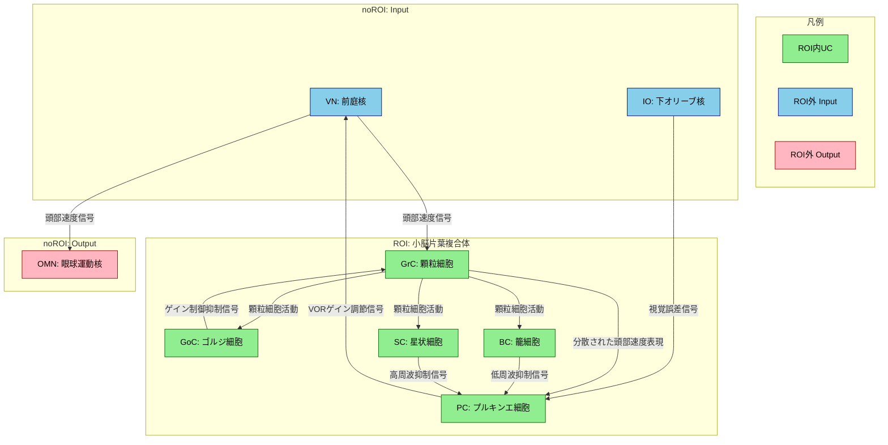
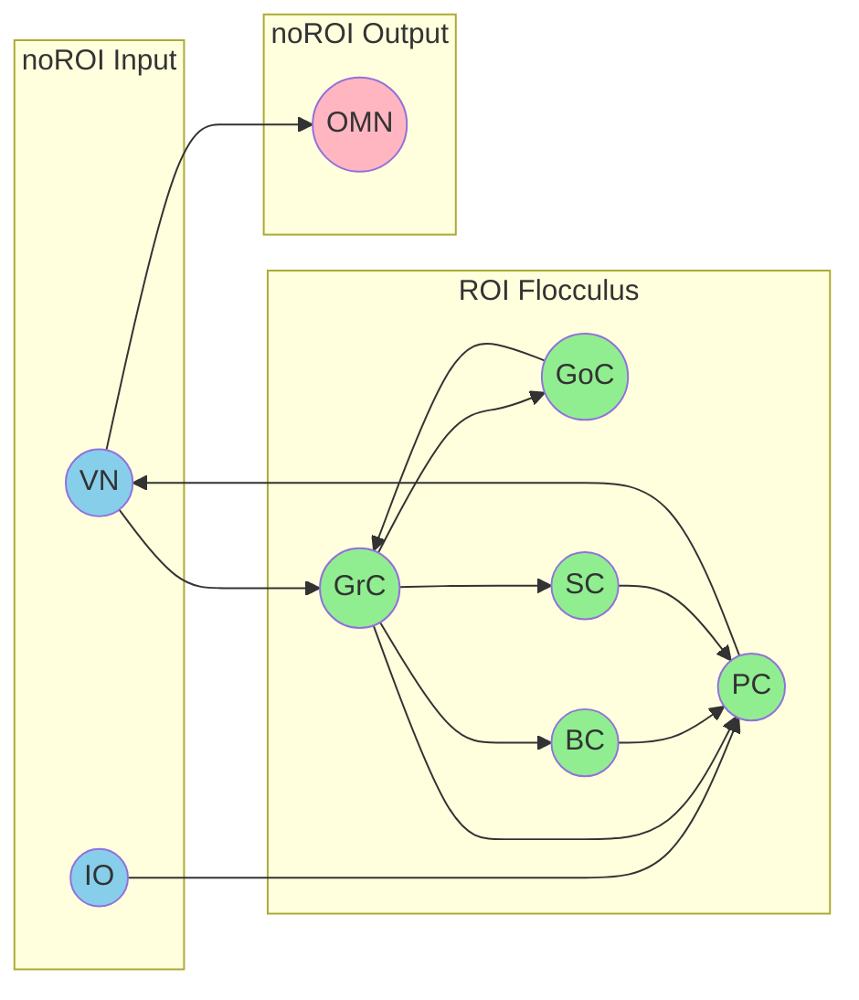
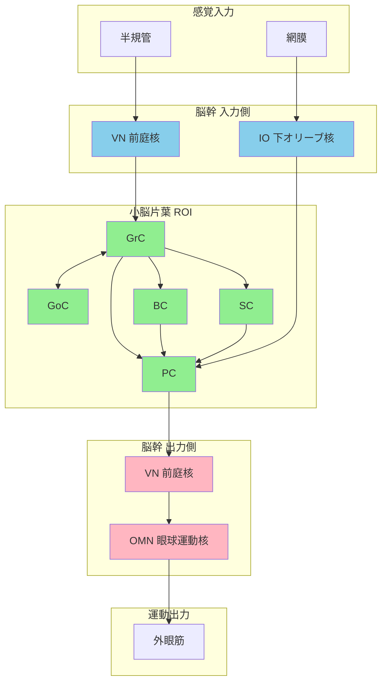

# 7_diagram.md - HCD構造図（Mermaid形式）

## TLF: VOR (Vestibulo-Ocular Reflex)
## ROI: 小脳片葉複合体 (Floccular Complex)

---

## HCD Diagram

---

## 色の凡例

| 色 | 意味 |
|----|------|
| 緑 (#90EE90) | ROI内 Uniform Component |
| 青 (#87CEEB) | ROI外 Input（入力ノード） |
| ピンク (#FFB6C1) | ROI外 Output（出力ノード） |

---

## 接続一覧（Output Semantics付き）

| Sender | Receiver | Output Semantics |
|--------|----------|------------------|
| `VN` | `GrC` | 頭部速度信号および眼球運動関連信号 |
| `VN` | `OMN` | 頭部速度信号および小脳によって調節された眼球運動指令 |
| `IO` | `PC` | 視覚誤差信号を表す教師信号 |
| `GrC` | `PC` | 頭部速度信号を空間的に分散させた並列表現 |
| `GrC` | `GoC` | 顆粒細胞の活動状態 |
| `GrC` | `BC` | 顆粒細胞の活動状態 |
| `GrC` | `SC` | 顆粒細胞の活動状態 |
| `GoC` | `GrC` | 顆粒細胞活動の時間的および空間的ゲイン制御信号 |
| `BC` | `PC` | プルキンエ細胞への低周波選択的抑制信号 |
| `SC` | `PC` | プルキンエ細胞への高周波選択的抑制信号 |
| `PC` | `VN` | VORゲイン調節信号 |

---

## 簡略版ダイアグラム（draw.io変換用）

---

## 情報フロー概要図

