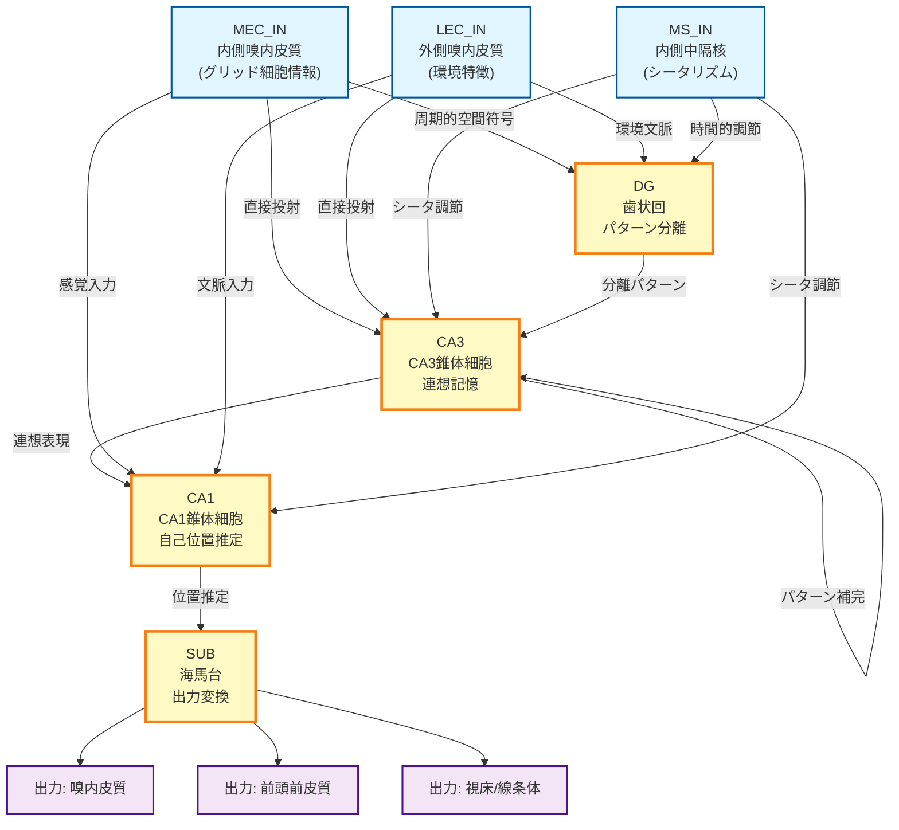
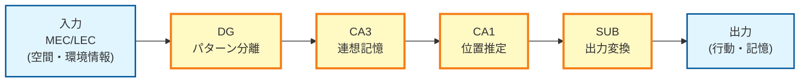
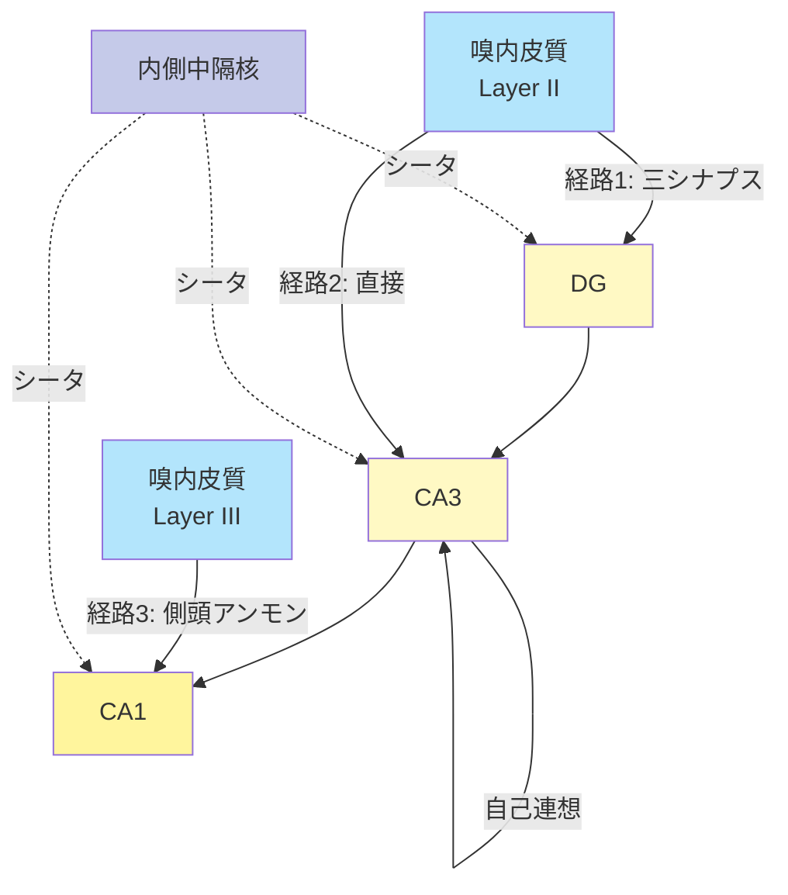
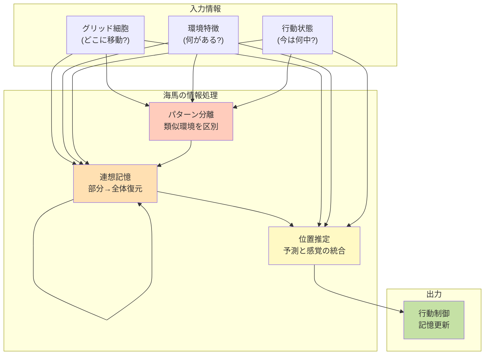
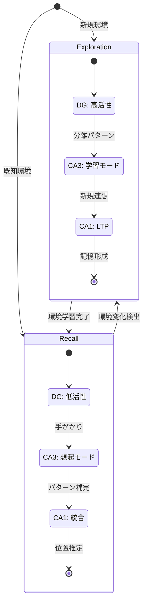

# HCD図: 海馬における自己位置推定

## Mermaid形式のHCD図

以下の図は、海馬における自己位置推定のHypothetical Component Graphを表現しています。

### 完全版HCD図

---

## 簡略版HCD図（主要経路のみ）

三シナプス経路を中心とした簡略版：

---

## 並行経路を強調したHCD図

三つの並行経路を明示：

---

## 機能的視点のHCD図

各UCの計算機能を強調：

---

## 時間的ダイナミクスを含むHCD図

記憶の符号化と想起のモード：

---

## 使用方法

### Draw.ioへの変換

上記のMermaid形式の図は、以下の方法でDraw.ioで使用できます：

1. **オンラインツール使用**:
   - https://mermaid.live/ でMermaidコードを入力
   - SVGまたはPNG形式でエクスポート
   - Draw.ioにインポート

2. **Draw.io直接使用**:
   - Draw.ioは一部Mermaidをサポート
   - または手動で上記の構造を再現

3. **推奨される図の使用**:
   - **発表用**: 簡略版または機能的視点図
   - **詳細説明用**: 完全版HCD図
   - **メカニズム説明用**: 並行経路強調図
   - **動的プロセス説明用**: 時間的ダイナミクス図

---

## 図の解釈ガイド

### ノードの色分け
- **青系（水色）**: 入力（ROI外からの情報源）
- **黄色系**: 海馬内部のUC（ROI内の情報処理）
- **紫系**: 出力（ROI外への情報配信）

### エッジ（矢印）の意味
- **実線矢印**: 興奮性の神経投射
- **点線矢印**: 調節性の入力（抑制を含む）
- **自己ループ**: 反回性接続（CA3 → CA3）

### 情報の流れ
1. **順方向**: 入力 → DG → CA3 → CA1 → SUB → 出力
2. **並行経路**: 複数の経路が同時に情報を伝達
3. **フィードバック**: CA3の自己連想、SUBから嗅内皮質へ（図には省略）

---

## 注記

1. 本図は、自己位置推定に関連する主要な接続を示しています
2. 介在ニューロンによる抑制性制御は簡略化されています
3. 各UCの内部構造（層構造など）は省略されています
4. 実際の神経投射は、図示されたものよりも複雑です

---

作成日: 2024年
形式: Mermaid Diagram Markdown

