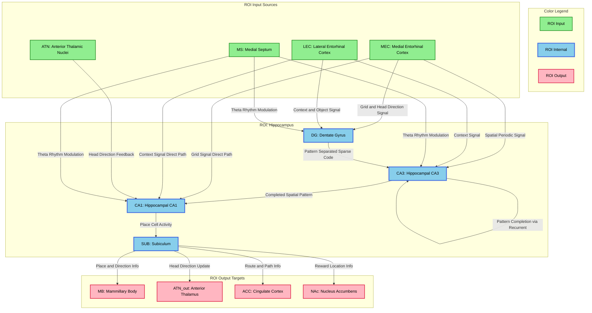

# 7_diagram.md - HCD構造図

## 基本情報
- **ROI**: 海馬（Hippocampus）
- **TLF**: 自己位置推定

---

## HCD図（Mermaid形式）

---

## 図の説明

### 色分け凡例

| 色 | 意味 | 対応要素 |
| -- | ---- | -------- |
| 緑（#90EE90） | ROI Input（入力源） | MEC, LEC, ATN, MS |
| 青（#87CEEB） | ROI Internal（海馬内UC） | DG, CA3, CA1, SUB |
| ピンク（#FFB6C1） | ROI Output（出力先） | MB, ATN_out, ACC, NAc |

### 主要情報フロー

1. **三シナプス回路**: MEC/LEC → DG → CA3 → CA1 → SUB
2. **直接経路**: MEC/LEC → CA1（temporoammonic pathway）
3. **再帰的処理**: CA3 → CA3（recurrent collaterals）
4. **出力分配**: SUB → MB, ATN_out, ACC, NAc

### エッジラベル（Output Semantics）

| 接続 | ラベル（Output Semantics） |
| ---- | -------------------------- |
| MEC → DG | Grid and Head Direction Signal |
| LEC → DG | Context and Object Signal |
| MS → DG/CA3/CA1 | Theta Rhythm Modulation |
| DG → CA3 | Pattern Separated Sparse Code |
| CA3 → CA3 | Pattern Completion via Recurrent |
| CA3 → CA1 | Completed Spatial Pattern |
| MEC → CA1 | Grid Signal Direct Path |
| ATN → CA1 | Head Direction Feedback |
| CA1 → SUB | Place Cell Activity |
| SUB → MB | Place and Direction Info |
| SUB → ATN_out | Head Direction Update |
| SUB → ACC | Route and Path Info |
| SUB → NAc | Reward Location Info |

---

## draw.io変換用ノート

Mermaid形式のダイアグラムをdraw.ioで開くには：

1. draw.ioを開く
2. 「Arrange」→「Insert」→「Advanced」→「Mermaid」を選択
3. 上記のMermaidコードを貼り付け
4. 必要に応じてレイアウトを調整

または、Mermaid Live Editor（https://mermaid.live/）でSVG/PNGにエクスポートし、draw.ioにインポートすることも可能。
