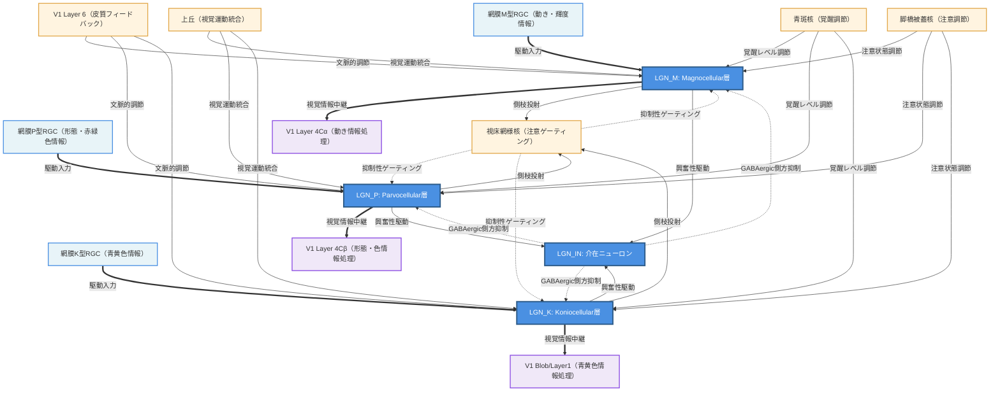
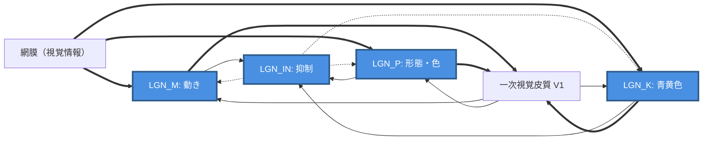
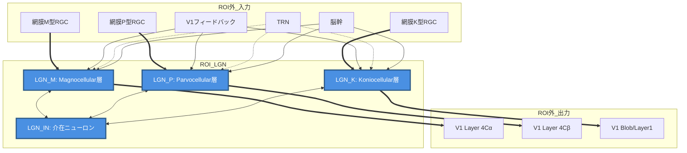

# HCD構造図（Mermaid形式）

## 概要
外側膝状体（LGN）のHCDをmermaid形式で視覚化したものです。
UCをノード、Connectionを有向エッジとして表現しています。

## 凡例
- **長方形ノード**: ROI内のUC（Uniform Component）
- **角丸長方形ノード**: ROI外の入力・出力要素
- **実線矢印**: 興奮性接続
- **点線矢印**: 抑制性接続
- **太線矢印**: 主要な駆動入力・出力

---

## HCD構造図（draw.io対応版）



---

## 情報フローの説明

### 1. 主情報経路（ボトムアップ）
```
網膜RGC → LGN各層 → V1各層
```
視覚情報の主要な流れ。3つの並列経路（M、P、K）で処理される。

### 2. フィードバック経路（トップダウン）
```
V1 Layer 6 → LGN各層
```
皮質からのフィードバックによる文脈的調節。

### 3. ゲーティング経路
```
LGN各層 → TRN → LGN各層
```
注意による選択的情報ゲーティング。TRNは抑制性。

### 4. 局所処理経路（ROI内）
```
LGN各層 → LGN_IN → LGN各層
```
介在ニューロンによる側方抑制とコントラスト増強。

### 5. 神経修飾経路
```
脳幹諸核（上丘、青斑核、脚橋被蓋核）→ LGN各層
```
覚醒、注意、視覚運動統合による調節。

---

## 簡略版（コアネットワークのみ - draw.io対応）



---

## 層構造の可視化（draw.io対応版）



---

## 図の解釈ガイド

### ノードの意味
- **青色の四角（ROI内UC）**: LGN内の情報処理単位。これらがHCDの主要コンポーネント
- **水色の四角（入力）**: ROI外からの入力源
- **紫色の四角（出力）**: ROI外への出力先
- **黄色の四角（調節）**: ROI外からの調節入力

### エッジの意味
- **太い実線矢印（==>）**: 主要な駆動入力・出力
- **細い実線矢印（-->）**: 興奮性の調節入力
- **点線矢印（-.->）**: 抑制性接続

### 情報処理の流れ
1. 網膜から3つの並列経路で情報が入力
2. LGN内で局所処理（介在ニューロンによる抑制）
3. 各種調節入力により情報伝達ゲインが調節
4. V1へ3つの並列経路で情報が出力
5. V1からフィードバックが返ってくる（双方向処理）

---

## 注意事項

本図は、HCDの構造を視覚的に理解するためのものです。実際の神経接続の空間的配置や、シナプス数の多寡は反映されていません。また、各接続の神経伝達物質の種類や、詳細な受容野構造なども省略されています。

より詳細な情報については、2_BIF.md、3_UC.md、4_Connection.md を参照してください。

