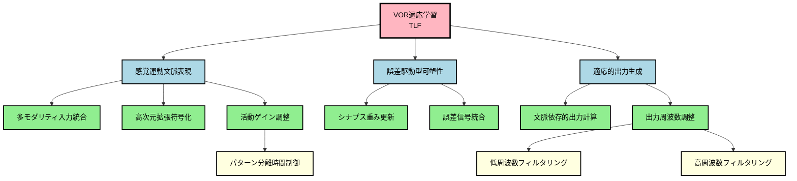

# ステップ1: TLFの段階的分解とGN作成

## 目的
TLFを十分に小さい部分機能（GN）にまで分解し、階層的な機能分解構造を作成する。

## TLF（Top Level Function）
**VOR適応学習（VOR Adaptive Gain Control）**

VOR（前庭動眼反射）適応学習は、視覚フィードバック（網膜滑り：retinal slip）に基づいて、VORゲイン（眼球速度/頭部速度比）を調整し、視線安定性を最適化する学習プロセスである。

---

## 機能分解の方針

VOR適応学習を実現するためには、以下の主要な部分機能が必要：

1. **感覚運動情報の統合**: 前庭、視覚、運動コマンドの情報を統合
2. **文脈の表現**: 異なる感覚運動状況を区別可能な表現を生成
3. **誤差信号の検出**: 視覚誤差（retinal slip）を検出
4. **適応的なゲイン調整**: 誤差に基づいてVORゲインを調整
5. **出力の時間的調整**: 適切な時間スケールで応答

これらを階層的に分解していく。

---

## 階層的機能分解結果

### 表形式

| 階層レベル | ノード名 | 機能説明 |
| ---------- | -------- | -------- |
| 1（TLF） | VOR適応学習 | 視覚誤差信号に基づいてVORゲイン（眼球速度/頭部速度比）を適応的に調整し、頭部運動中の視線安定性を最適化する学習機能 |
| 2 | 感覚運動文脈表現 | 前庭情報、視運動情報、運動コマンドコピーを統合し、現在の感覚運動状況を高次元特徴空間に表現する |
| 2 | 誤差駆動型可塑性 | 視覚誤差信号（retinal slip）に基づいて、感覚運動文脈とVORゲイン調整の対応関係を可塑的に変化させる |
| 2 | 適応的出力生成 | 学習された対応関係に基づいて、前庭神経核へのVORゲイン調整信号を生成する |
| 3 | 多モダリティ入力統合 | 複数の起源からの感覚運動情報（前庭、視覚、運動コマンド）を受容し統合する |
| 3 | 高次元拡張符号化 | 統合された入力を高次元空間に拡張表現し、パターン分離を実現する |
| 3 | 活動ゲイン調整 | 拡張符号化された表現の活動レベルを適切なダイナミックレンジに調整する |
| 3 | シナプス重み更新 | 誤差信号と入力活動の同時発生に基づいて、シナプス重みを更新する（LTD/LTP） |
| 3 | 誤差信号統合 | 視覚誤差信号を受容し、可塑性誘導のトリガーとして機能する |
| 3 | 文脈依存的出力計算 | 高次元拡張表現の線形結合により、文脈依存的なVORゲイン調整量を計算する |
| 3 | 出力周波数調整 | 出力信号の周波数特性を最適化し、適切な時間スケールでの応答を実現する |
| 4 | パターン分離時間制御 | 拡張符号化された表現の時空間パターンを制御し、パターン分離性能を最適化する |
| 4 | 低周波数フィルタリング | 出力の低周波数成分を抑制し、応答周波数帯域を高周波側にシフトする |
| 4 | 高周波数フィルタリング | 出力の高周波数成分を抑制し、応答周波数帯域を中低周波側にシフトする |

---

## Mermaidグラフによる階層構造の視覚化

---

## 分解の妥当性確認

### 第1階層（TLF）→ 第2階層の分解

**TLF: VOR適応学習**が以下の3つのGNで十分に実現されるか？

1. **感覚運動文脈表現**: 現在の状況を表現
2. **誤差駆動型可塑性**: 誤差に基づいて学習
3. **適応的出力生成**: 学習に基づいて出力を生成

✓ **妥当**: VOR適応学習は、文脈の表現、学習、出力の3つで構成される。

### 第2階層 → 第3階層の分解

#### 感覚運動文脈表現 → 3つのGN

1. **多モダリティ入力統合**: 複数の感覚運動情報を受容
2. **高次元拡張符号化**: 入力を高次元空間に拡張
3. **活動ゲイン調整**: 活動レベルを調整

✓ **妥当**: 文脈表現は、入力の統合、拡張表現、活動調整で実現される。

#### 誤差駆動型可塑性 → 2つのGN

1. **シナプス重み更新**: 重みを可塑的に変化
2. **誤差信号統合**: 誤差信号を受容

✓ **妥当**: 可塑性は、誤差信号の受容と重み更新で実現される。

#### 適応的出力生成 → 2つのGN

1. **文脈依存的出力計算**: 文脈に基づいて出力を計算
2. **出力周波数調整**: 周波数特性を最適化

✓ **妥当**: 出力生成は、計算と周波数調整で実現される。

### 第3階層 → 第4階層の分解

#### 活動ゲイン調整 → 1つのGN

1. **パターン分離時間制御**: 時空間パターンを制御

✓ **妥当**: ゲイン調整は時間制御で実現される。

#### 出力周波数調整 → 2つのGN

1. **低周波数フィルタリング**: 低周波成分を抑制
2. **高周波数フィルタリング**: 高周波成分を抑制

✓ **妥当**: 周波数調整は、低周波と高周波の両方の抑制で実現される。

---

## 各GNの独立性確認

各GNが明確で独立した機能を表現しているか？

| ノード名 | 独立性 | 理由 |
| -------- | ------ | ---- |
| 感覚運動文脈表現 | ✓ | 入力の表現に特化 |
| 誤差駆動型可塑性 | ✓ | 学習メカニズムに特化 |
| 適応的出力生成 | ✓ | 出力の生成に特化 |
| 多モダリティ入力統合 | ✓ | 入力の受容と統合 |
| 高次元拡張符号化 | ✓ | パターン分離のための拡張 |
| 活動ゲイン調整 | ✓ | 活動レベルの制御 |
| シナプス重み更新 | ✓ | LTD/LTPによる重み変化 |
| 誤差信号統合 | ✓ | 誤差信号の受容 |
| 文脈依存的出力計算 | ✓ | 線形結合による計算 |
| 出力周波数調整 | ✓ | 周波数特性の最適化 |
| パターン分離時間制御 | ✓ | 時空間パターンの制御 |
| 低周波数フィルタリング | ✓ | 低周波抑制 |
| 高周波数フィルタリング | ✓ | 高周波抑制 |

すべてのGNが明確で独立した機能を持つ。

---

## まとめ

### 階層構造
- **階層数**: 4階層（TLFを含む）
- **GNの総数**: 13個

### 分解の特徴
1. **機能的分解**: 各階層で機能が明確に分解されている
2. **階層的構造**: 上位ノードが下位ノードで十分に実現される
3. **独立性**: 各GNが独立した機能を持つ
4. **神経科学的妥当性**: 既知のVOR適応メカニズムに基づく

### 次のステップ
ステップ2に進み、冗長性の削減とノードのマージを検討する。
