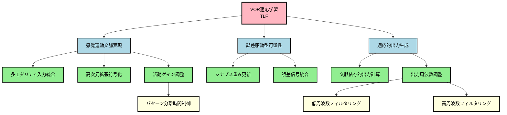

# ステップ2: 冗長性の削減とノードのマージ

## 目的
初期分解で作成されたGN群の冗長性を減らし、解釈可能性を高める。

---

## 冗長性の分析

### 分析1: 機能の重複

初期分解結果を確認したところ、以下の観点で冗長性が低いことを確認：

| GN名 | 主要機能 | 重複の有無 |
| ---- | -------- | ---------- |
| 感覚運動文脈表現 | 文脈の表現 | なし（入力処理に特化） |
| 誤差駆動型可塑性 | 学習メカニズム | なし（可塑性に特化） |
| 適応的出力生成 | 出力の生成 | なし（出力に特化） |
| 多モダリティ入力統合 | 入力受容 | なし |
| 高次元拡張符号化 | 拡張表現 | なし |
| 活動ゲイン調整 | ゲイン制御 | なし |
| シナプス重み更新 | 重み変化 | なし |
| 誤差信号統合 | 誤差受容 | なし |
| 文脈依存的出力計算 | 出力計算 | なし |
| 出力周波数調整 | 周波数制御 | なし |
| パターン分離時間制御 | 時間制御 | なし |
| 低周波数フィルタリング | 低周波抑制 | なし |
| 高周波数フィルタリング | 高周波抑制 | なし |

**結論**: 各GNが独立した機能を持ち、重複は見られない。

### 分析2: 類似した処理

「シナプス重み更新」と「誤差信号統合」は、どちらも可塑性に関連しているが：
- **シナプス重み更新**: 重みの実際の変化（LTD/LTP）
- **誤差信号統合**: 誤差信号の受容と可塑性のトリガー

→ **異なる機能**であり、マージ不適切。

「低周波数フィルタリング」と「高周波数フィルタリング」は、どちらも周波数調整だが：
- 異なる周波数帯域を担当
- 相補的な機能

→ **異なる機能**であり、マージ不適切。

### 分析3: 過剰な分解

第4階層が最も下層であるが、以下を確認：
- **パターン分離時間制御**: 時間制御という独立した機能
- **低周波数フィルタリング**: 低周波抑制という独立した機能
- **高周波数フィルタリング**: 高周波抑制という独立した機能

→ **過剰な分解ではない**。各々が独立した機能を持つ。

---

## マージの必要性評価

### 結論: マージ不要

初期分解結果は以下の理由からマージの必要性が低い：

1. **各GNが独立した明確な機能を持つ**
2. **階層構造が適切**（4階層は複雑すぎない）
3. **神経科学的実体との対応が明確**
4. **解釈可能性が高い**

ただし、後のステップ3でUCとの紐づけを行う際に、接続数制約（各GNは最大2つのUC、各UCは最大2つのGN）を満たすために調整が必要になる可能性がある。

---

## 最適化されたFRG構造

### 表形式（親子関係を明示）

| 階層レベル | ノード名 | 機能説明 | 親ノード | 子ノード |
| ---------- | -------- | -------- | -------- | -------- |
| 1（TLF） | VOR適応学習 | 視覚誤差信号に基づいてVORゲイン（眼球速度/頭部速度比）を適応的に調整し、頭部運動中の視線安定性を最適化する学習機能 | なし | 感覚運動文脈表現、誤差駆動型可塑性、適応的出力生成 |
| 2 | 感覚運動文脈表現 | 前庭情報、視運動情報、運動コマンドコピーを統合し、現在の感覚運動状況を高次元特徴空間に表現する | VOR適応学習 | 多モダリティ入力統合、高次元拡張符号化、活動ゲイン調整 |
| 2 | 誤差駆動型可塑性 | 視覚誤差信号（retinal slip）に基づいて、感覚運動文脈とVORゲイン調整の対応関係を可塑的に変化させる | VOR適応学習 | シナプス重み更新、誤差信号統合 |
| 2 | 適応的出力生成 | 学習された対応関係に基づいて、前庭神経核へのVORゲイン調整信号を生成する | VOR適応学習 | 文脈依存的出力計算、出力周波数調整 |
| 3 | 多モダリティ入力統合 | 複数の起源からの感覚運動情報（前庭、視覚、運動コマンド）を受容し統合する | 感覚運動文脈表現 | （リーフノード） |
| 3 | 高次元拡張符号化 | 統合された入力を高次元空間に拡張表現し、パターン分離を実現する | 感覚運動文脈表現 | （リーフノード） |
| 3 | 活動ゲイン調整 | 拡張符号化された表現の活動レベルを適切なダイナミックレンジに調整する | 感覚運動文脈表現 | パターン分離時間制御 |
| 3 | シナプス重み更新 | 誤差信号と入力活動の同時発生に基づいて、シナプス重みを更新する（LTD/LTP） | 誤差駆動型可塑性 | （リーフノード） |
| 3 | 誤差信号統合 | 視覚誤差信号を受容し、可塑性誘導のトリガーとして機能する | 誤差駆動型可塑性 | （リーフノード） |
| 3 | 文脈依存的出力計算 | 高次元拡張表現の線形結合により、文脈依存的なVORゲイン調整量を計算する | 適応的出力生成 | （リーフノード） |
| 3 | 出力周波数調整 | 出力信号の周波数特性を最適化し、適切な時間スケールでの応答を実現する | 適応的出力生成 | 低周波数フィルタリング、高周波数フィルタリング |
| 4 | パターン分離時間制御 | 拡張符号化された表現の時空間パターンを制御し、パターン分離性能を最適化する | 活動ゲイン調整 | （リーフノード） |
| 4 | 低周波数フィルタリング | 出力の低周波数成分を抑制し、応答周波数帯域を高周波側にシフトする | 出力周波数調整 | （リーフノード） |
| 4 | 高周波数フィルタリング | 出力の高周波数成分を抑制し、応答周波数帯域を中低周波側にシフトする | 出力周波数調整 | （リーフノード） |

---

## Mermaidグラフ（最適化版）

---

## グラフ構造の妥当性確認

### 親子関係の整合性

各親ノードの機能が、その子ノード群の組み合わせによって十分に実現されるか確認：

| 親ノード | 子ノード | 十分性 |
| -------- | -------- | ------ |
| VOR適応学習 | 感覚運動文脈表現、誤差駆動型可塑性、適応的出力生成 | ✓ 文脈表現、学習、出力で適応学習が実現される |
| 感覚運動文脈表現 | 多モダリティ入力統合、高次元拡張符号化、活動ゲイン調整 | ✓ 入力統合、拡張、ゲイン調整で文脈表現が実現される |
| 誤差駆動型可塑性 | シナプス重み更新、誤差信号統合 | ✓ 誤差受容と重み更新で可塑性が実現される |
| 適応的出力生成 | 文脈依存的出力計算、出力周波数調整 | ✓ 計算と周波数調整で出力生成が実現される |
| 活動ゲイン調整 | パターン分離時間制御 | ✓ 時間制御でゲイン調整が実現される |
| 出力周波数調整 | 低周波数フィルタリング、高周波数フィルタリング | ✓ 低周波と高周波の抑制で周波数調整が実現される |

**結論**: すべての親ノードが子ノード群で十分に実現される。

### 解釈可能性の評価

- **階層数**: 4階層（適切）
- **各階層のGN数**: 第2階層3個、第3階層7個、第4階層3個（バランス良い）
- **各GNの機能**: 明確で独立（解釈しやすい）
- **グラフの複雑度**: 適度（理解可能）

**結論**: 解釈可能性が高い構造である。

---

## 最適化の判断

### マージの実施: なし

初期分解結果がすでに適切であり、以下の理由からマージを実施しない：

1. **機能の独立性**: 各GNが明確に異なる機能を持つ
2. **階層構造の妥当性**: 親子関係が論理的に整合
3. **解釈可能性**: グラフが理解しやすい
4. **神経科学的裏付け**: 各GNが既知の神経メカニズムに対応

### リーフノードの特定

以下の7つのGNがリーフノード（子を持たない最下層ノード）：
1. 多モダリティ入力統合
2. 高次元拡張符号化
3. シナプス重み更新
4. 誤差信号統合
5. 文脈依存的出力計算
6. パターン分離時間制御
7. 低周波数フィルタリング
8. 高周波数フィルタリング

これらのリーフノードがステップ3でUCに接続される候補となる。

---

## まとめ

### 最適化の結果
- **マージ実施**: なし
- **削除されたGN**: なし
- **追加されたGN**: なし
- **最終GN数**: 13個（初期分解と同じ）

### グラフの特徴
- **階層性**: TLFから第4階層まで明確な階層構造
- **独立性**: 各GNが独立した機能を持つ
- **完全性**: 各親ノードが子ノード群で十分に実現される
- **解釈可能性**: グラフ構造が理解しやすい

### 次のステップ
ステップ3に進み、リーフノード（および必要に応じて中間層のGN）をROI内のUCに紐づける。その際、以下の制約を満たす必要がある：
- 各GNは最大2つのUCに接続
- 各UCは最大2つのGNに接続
- 各GNは複数のUCに分解される
