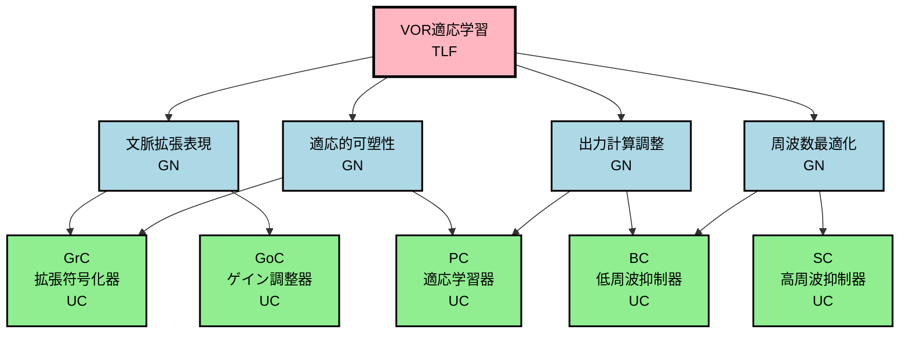

# ステップ3: UCとの紐づけとFRGの完成

## 目的
最適化されたGN構造を実際の神経組織（UC）と紐づけ、FRGを完成させる。

---

## ROI内のUC一覧

HCDで定義されたROI内（小脳小節内）のUCは以下の5つ：

| UC ID | 機能的名称 | 主要機能 |
| ----- | ---------- | -------- |
| GrC | 拡張符号化器 | 苔状線維入力の高次元拡張表現とパターン分離 |
| GoC | ゲイン調整器 | 顆粒細胞層活動の時空間制御 |
| BC | 低周波抑制器 | プルキンエ細胞の低周波数応答抑制 |
| SC | 高周波抑制器 | プルキンエ細胞の高周波数応答抑制 |
| PC | 適応学習器 | シナプス可塑性によるVORゲイン調整 |

---

## GN構造の最終調整

接続数制約（各GN≤2UC、各UC≤2GN、各GNは複数UCに分解）を満たすため、第2階層のGN構造を以下のように調整：

### 調整方針
1. 第2階層を4つのGNに再構成（3つから4つへ）
2. 各GNを明確に2つのUCに紐づけ
3. 各UCは最大2つのGNに接続

### 新しい第2階層GN

| GN名 | 機能説明 | 接続UC |
| ---- | -------- | ------ |
| 文脈拡張表現 | 多様な感覚運動情報を統合し、高次元特徴空間に拡張表現する | GrC, GoC |
| 適応的可塑性 | 視覚誤差信号に基づいて、感覚運動文脈と出力の対応関係を学習する | PC, GrC |
| 出力計算調整 | 学習された対応関係に基づいてVORゲイン調整信号を計算し、周波数特性を調整する | PC, BC |
| 周波数最適化 | 出力信号の周波数帯域を最適化し、適切な時間スケールでの応答を実現する | BC, SC |

---

## 最終的なFRG構造

### 表形式（階層レベル、ノードタイプ、親子関係を含む）

| 階層 | ノード名 | ノードタイプ | 機能説明 | 親ノード | 子ノード |
| ---- | -------- | ------------ | -------- | -------- | -------- |
| 1 | VOR適応学習 | TLF | 視覚誤差信号に基づいてVORゲイン（眼球速度/頭部速度比）を適応的に調整し、頭部運動中の視線安定性を最適化する学習機能 | - | 文脈拡張表現、適応的可塑性、出力計算調整、周波数最適化 |
| 2 | 文脈拡張表現 | GN | 多様な感覚運動情報（前庭、視運動、運動コマンド）を統合し、高次元特徴空間に拡張表現する | VOR適応学習 | GrC、GoC |
| 2 | 適応的可塑性 | GN | 視覚誤差信号に基づいて、感覚運動文脈と出力の対応関係を可塑的に学習する | VOR適応学習 | PC、GrC |
| 2 | 出力計算調整 | GN | 学習された対応関係に基づいてVORゲイン調整信号を計算し、その周波数特性を調整する | VOR適応学習 | PC、BC |
| 2 | 周波数最適化 | GN | 出力信号の周波数帯域を最適化し、適切な時間スケールでの応答を実現する | VOR適応学習 | BC、SC |
| 3 | GrC（拡張符号化器） | UC | 苔状線維入力の高次元拡張表現とパターン分離を実行 | 文脈拡張表現、適応的可塑性 | - |
| 3 | GoC（ゲイン調整器） | UC | 顆粒細胞層活動の時空間制御によりゲインとダイナミックレンジを調整 | 文脈拡張表現 | - |
| 3 | PC（適応学習器） | UC | シナプス可塑性によるVORゲイン適応学習と出力生成 | 適応的可塑性、出力計算調整 | - |
| 3 | BC（低周波抑制器） | UC | プルキンエ細胞の低周波数応答を抑制し、周波数帯域を調整 | 出力計算調整、周波数最適化 | - |
| 3 | SC（高周波抑制器） | UC | プルキンエ細胞の高周波数応答を抑制し、周波数帯域を調整 | 周波数最適化 | - |

---

## GN-UC接続の詳細と神経科学的根拠

### 文脈拡張表現 → GrC, GoC

**機能的理由**:
- **GrC**: 苔状線維入力を受け取り、高次元空間に拡張表現する（HCD 3_UC.mdの「高次元拡張表現」）
- **GoC**: GrCの活動ゲインを調整し、時空間パターンを制御する（HCD 3_UC.mdの「時空間制御信号」）

**神経科学的根拠**:
- GrCとGoCは両方とも苔状線維からの入力を受ける（HCD 4_Connection.md参照）
- GoCはGrCへのフィードバック抑制を提供し、両者の協調で文脈表現が実現される

### 適応的可塑性 → PC, GrC

**機能的理由**:
- **PC**: 登上線維からの誤差信号と平行線維の活動の同時発生により、シナプス可塑性（LTD/LTP）を実現
- **GrC**: PCの可塑性の対象となる平行線維入力を提供

**神経科学的根拠**:
- GrCの平行線維がPCにシナプスを形成（HCD 4_Connection.md: GrC→PC）
- PCで平行線維-PCシナプス重みが可塑的に変化（HCD 3_UC.md PCの説明）
- 登上線維（CF_IO）がPCに誤差信号を伝達（HCD 4_Connection.md: CF_IO→PC）

### 出力計算調整 → PC, BC

**機能的理由**:
- **PC**: 平行線維の線形結合を計算し、VORゲイン調整信号を生成
- **BC**: PCの低周波数応答を抑制し、出力の時間特性を調整

**神経科学的根拠**:
- PCがVORゲイン調整信号を前庭神経核に出力（HCD 3_UC.md PCのOutput Semantics）
- BCがPCの細胞体・軸索起始部を抑制（HCD 4_Connection.md: BC→PC）

### 周波数最適化 → BC, SC

**機能的理由**:
- **BC**: 低周波数成分を抑制
- **SC**: 高周波数成分を抑制
- 両者の協調により、最適な周波数帯域を実現

**神経科学的根拠**:
- BCとSCは相補的な周波数フィルタリングを実行（HCD 3_UC.md BC/SCの説明）
- BCは平行線維バーストの低周波数に強く応答、SCは高周波数に応答

---

## 接続数制約の確認

### GN側の接続数

| GN名 | 接続UC数 | 接続UC | 制約 |
| ---- | -------- | ------ | ---- |
| 文脈拡張表現 | 2 | GrC, GoC | ✓ 制約内（≤2） |
| 適応的可塑性 | 2 | PC, GrC | ✓ 制約内（≤2） |
| 出力計算調整 | 2 | PC, BC | ✓ 制約内（≤2） |
| 周波数最適化 | 2 | BC, SC | ✓ 制約内（≤2） |

**結果**: すべてのGNが制約内 ✓

### UC側の接続数

| UC名 | 接続GN数 | 接続GN | 制約 |
| ---- | -------- | ------ | ---- |
| GrC | 2 | 文脈拡張表現、適応的可塑性 | ✓ 制約内（≤2） |
| GoC | 1 | 文脈拡張表現 | ✓ 制約内（≤2） |
| PC | 2 | 適応的可塑性、出力計算調整 | ✓ 制約内（≤2） |
| BC | 2 | 出力計算調整、周波数最適化 | ✓ 制約内（≤2） |
| SC | 1 | 周波数最適化 | ✓ 制約内（≤2） |

**結果**: すべてのUCが制約内 ✓

### 複数UC分解の確認

| GN名 | UC数 | 複数UC分解 |
| ---- | ---- | ---------- |
| 文脈拡張表現 | 2 | ✓ |
| 適応的可塑性 | 2 | ✓ |
| 出力計算調整 | 2 | ✓ |
| 周波数最適化 | 2 | ✓ |

**結果**: すべてのGNが複数のUCに分解されている ✓

---

## Mermaidグラフ（完全なFRG）

---

## UC間の接続（BIFに基づく）

HCDの4_Connection.mdに基づき、UC間の接続を記述：

| Sender UC | Receiver UC | 接続の内容 | Reference |
| --------- | ----------- | ---------- | --------- |
| GrC | PC | 平行線維による興奮性シナプス。数千の弱い入力 | HCD 4_Connection.md |
| GrC | BC | 平行線維による興奮性シナプス | HCD 4_Connection.md |
| GrC | SC | 平行線維による興奮性シナプス | HCD 4_Connection.md |
| GrC | GoC | 上行軸索によるフィードバック興奮性シナプス | HCD 4_Connection.md |
| GoC | GrC | 糸球内での抑制性シナプス。フィードバック/フィードフォワード抑制 | HCD 4_Connection.md |
| BC | PC | 細胞体・軸索起始部への強力な抑制性シナプス | HCD 4_Connection.md |
| SC | PC | 樹状突起への抑制性シナプス | HCD 4_Connection.md |

---

## FRGの妥当性検証

### 機能的完全性

**TLF「VOR適応学習」が4つのGNで実現されるか？**

1. **文脈拡張表現**: 感覚運動情報を高次元に拡張 → ✓ 必須
2. **適応的可塑性**: 誤差に基づいて学習 → ✓ 必須
3. **出力計算調整**: VORゲイン調整信号を計算 → ✓ 必須
4. **周波数最適化**: 周波数特性を最適化 → ✓ 必須

**結論**: 4つのGNの組み合わせでTLFが十分に実現される ✓

### 神経科学的妥当性

各GN-UC紐づけが神経科学的に妥当か？

| GN | UC | 妥当性 |
| -- | -- | ------ |
| 文脈拡張表現 | GrC, GoC | ✓ GrCとGoCの協調で文脈表現が実現される |
| 適応的可塑性 | PC, GrC | ✓ 平行線維-PCシナプスの可塑性 |
| 出力計算調整 | PC, BC | ✓ PCの出力とBCによる調整 |
| 周波数最適化 | BC, SC | ✓ 相補的な周波数フィルタリング |

**結論**: すべての紐づけが神経科学的に妥当 ✓

### 制約の遵守

- **各GN≤2UC**: ✓ すべて遵守
- **各UC≤2GN**: ✓ すべて遵守
- **各GNは複数UCに分解**: ✓ すべて遵守

---

## まとめ

### 完成したFRG

- **階層数**: 3階層（TLF、GN、UC）
- **GN数**: 4個
- **UC数**: 5個
- **GN-UC接続数**: 8個

### FRGの特徴

1. **階層的構造**: TLFがGNに分解され、GNがUCで実現される
2. **制約遵守**: すべての接続数制約を満たす
3. **神経科学的妥当性**: HCDに基づく神経科学的根拠
4. **機能的完全性**: TLFがGNとUCの組み合わせで実現される

### 次のステップ

ステップ4に進み、TLFと各GNの機能詳細（A1, A2, B1, B2, B3）を定義する。
