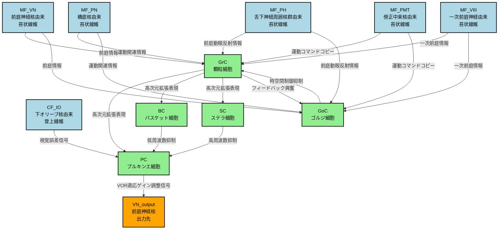
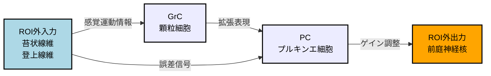

# ステップ8-2: HCD構造図

## 概要
本図は、小脳小節におけるVOR適応学習のHCD（Hypothetical Component Graph）を視覚化したものです。

---

## Mermaid形式のHCD図



---

## 図の説明

### ノードの色分け
- **水色（ROI外入力）**: 小脳小節への入力を担う神経組織
  - 苔状線維入力（MF_VN, MF_PN, MF_PH, MF_PMT, MF_VIII）
  - 登上線維入力（CF_IO）
  
- **緑色（ROI内UC）**: 小脳小節内のUniform Circuit
  - GrC: 顆粒細胞
  - GoC: ゴルジ細胞
  - BC: バスケット細胞
  - SC: ステラ細胞
  - PC: プルキンエ細胞
  
- **オレンジ色（ROI外出力）**: 小脳小節からの出力先
  - VN_output: 前庭神経核

### 主要な情報処理経路

#### 経路1: 直接興奮性経路
```
苔状線維入力 → GrC → PC → VN_output
```
- 感覚運動情報が顆粒細胞で拡張符号化され、プルキンエ細胞を経由して前庭神経核へ

#### 経路2: フィードバック抑制経路
```
苔状線維入力 → GrC ⇄ GoC
```
- 顆粒細胞とゴルジ細胞のフィードバックループにより、顆粒細胞層の活動を動的に制御

#### 経路3: フィードフォワード抑制経路
```
GrC → BC/SC → PC
```
- バスケット細胞とステラ細胞により、プルキンエ細胞の周波数特性を調整

#### 経路4: 可塑性誘導経路
```
CF_IO → PC (シナプス可塑性)
```
- 登上線維からの視覚誤差信号が、平行線維-プルキンエ細胞シナプスの可塑性を誘導

### エッジラベルの意味
各矢印には、その接続で伝達される情報の意味を示すラベルが付与されている：
- **前庭情報**: 頭部運動情報
- **運動コマンドコピー**: 眼球運動指令のコピー
- **視覚誤差信号**: 網膜滑り（retinal slip）情報
- **高次元拡張表現**: パターン分離された特徴表現
- **時空間制御抑制**: ゲイン調整と時間的整形のための抑制
- **低周波数抑制/高周波数抑制**: 周波数選択的な抑制
- **VOR適応ゲイン調整信号**: VORゲインを調整する補正信号

---

## Draw.ioへの変換方法

### 変換手順
1. オンラインのMermaid to Draw.ioコンバータを使用（例: https://mermaid.live/）
2. 上記のMermaidコードをコピー＆ペースト
3. 生成された図をSVGまたはPNG形式でエクスポート
4. Draw.ioで開いて編集

### 手動での作成推奨事項
より詳細な図を作成する場合、以下の要素を追加することを推奨：
- **フィードバックループの強調**: GrC-GoC間のループを円形矢印で表現
- **シナプス可塑性の表記**: CF_IO→PC接続に「LTD/LTP」の注釈
- **興奮性/抑制性の区別**: 矢印の形状を変更（興奮性: 通常の矢印、抑制性: ●付き矢印）
- **層構造の表現**: 顆粒細胞層、プルキンエ細胞層、分子層を背景色で区別

---

## 簡略版図（主要経路のみ）

より単純な図が必要な場合、以下の簡略版を使用：



---

## 凡例

### ノードタイプ
- **四角形**: Uniform Circuit（UC）または入出力
- **ラベル**: UC名 + 日本語名称

### エッジタイプ
- **実線矢印**: 神経投射（シナプス結合）
- **ラベル**: 伝達される情報の意味

### 色の意味
- **水色**: ROI外入力（小脳小節への入力源）
- **緑色**: ROI内UC（小脳小節内の処理単位）
- **オレンジ色**: ROI外出力（小脳小節からの出力先）

---

作成日: 2026年2月15日
