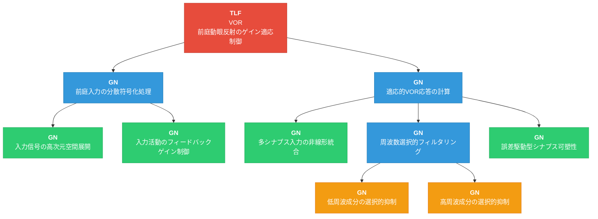

# 1_初期分解結果

## 対象情報

- **TLF**: VOR（Vestibulo-Ocular Reflex / 前庭動眼反射のゲイン適応制御）
- **ROI**: 小脳片葉複合体（Floccular Complex）

---

## TLFの機能概要

VOR（前庭動眼反射）は、頭部回転時に眼球を反対方向に動かし、網膜像を安定化させる反射である。小脳片葉複合体は、VORのゲイン（頭部速度に対する眼球速度の比率）を適応的に調節する役割を担う。本FRGでは、小脳片葉複合体内におけるVORゲイン適応制御の情報処理を階層的に分解する。

---

## 階層的機能分解（表形式）

| 階層 | ノード名 | 機能説明 |
|------|----------|----------|
| L1 (TLF) | VOR（前庭動眼反射のゲイン適応制御） | 頭部回転に対する補償性眼球運動のゲインを適応的に制御する。前庭入力を処理し、誤差信号に基づいてVOR応答を学習・調節する |
| L2 | 前庭入力の分散符号化処理 | 前庭核からの頭部速度信号を小脳皮質内で処理可能な高次元の分散表現に変換する |
| L2 | 適応的VOR応答の計算 | 分散符号化された入力信号を統合し、誤差信号に基づいて適応的にVOR応答出力を計算する |
| L3 | 入力信号の高次元空間展開 | 苔状線維からの頭部速度信号をスパース符号化により高次元空間に展開し、多数の並列チャネルに分配する |
| L3 | 入力活動のフィードバックゲイン制御 | 負帰還ループにより入力層ニューロンの活動レベルを適切な動作範囲に維持し、スパース符号化の質を保証する |
| L3 | 多シナプス入力の非線形統合 | 平行線維からの興奮性入力と介在ニューロンからの抑制性入力を非線形に統合し、VOR出力を決定する |
| L3 | 周波数選択的フィルタリング | VOR応答の周波数特性を調節するため、異なる周波数帯域の信号を選択的に処理する |
| L3 | 誤差駆動型シナプス可塑性 | 視覚誤差信号（網膜スリップ）に基づいてシナプス重みを更新し、VORゲインを適応的に調節する |
| L4 | 低周波成分の選択的抑制 | 低周波信号を選択的に減衰させ、高域通過特性を実現する。VORの高周波応答を保存する |
| L4 | 高周波成分の選択的抑制 | 高周波信号を選択的に減衰させ、低域通過特性を実現する。VORの低周波応答を保存する |

---

## 階層的機能分解（Mermaidグラフ）

**凡例**:
- 🔴 赤: TLF（トップレベル機能）
- 🔵 青: GN（中間グループノード）
- 🟢 緑: GN（リーフノード候補）
- 🟠 橙: GN（最下層リーフノード）

---

## 分解の妥当性確認

### 親子関係の十分性

| 親ノード | 子ノード群 | 十分性の根拠 |
|----------|------------|-------------|
| VOR | 前庭入力の分散符号化処理 + 適応的VOR応答の計算 | VOR制御は「入力処理」と「応答計算」の2段階で完全に記述される。入力を適切に処理し、その入力に基づいて適応的に応答を計算することでVOR機能が実現される |
| 前庭入力の分散符号化処理 | 入力信号の高次元空間展開 + 入力活動のフィードバックゲイン制御 | 分散符号化は「高次元展開」と「ゲイン制御」の組み合わせにより実現される。展開によりパターン分離が可能になり、ゲイン制御により動作範囲が維持される |
| 適応的VOR応答の計算 | 多シナプス入力の非線形統合 + 周波数選択的フィルタリング + 誤差駆動型シナプス可塑性 | VOR応答は「信号統合」「周波数調節」「適応学習」の3要素で構成される。統合により即時応答が生成され、フィルタリングにより周波数特性が整形され、可塑性によりゲインが適応される |
| 周波数選択的フィルタリング | 低周波成分の選択的抑制 + 高周波成分の選択的抑制 | 周波数フィルタリングは低周波抑制（高域通過）と高周波抑制（低域通過）の組み合わせにより、帯域通過特性を含む任意の周波数特性を実現する |

### 各GNの独立性

各GNは以下の点で独立した機能を表現している：
- **入力信号の高次元空間展開**: 入力のパターン分離・分散表現生成に特化
- **入力活動のフィードバックゲイン制御**: 活動レベルの調節に特化
- **多シナプス入力の非線形統合**: リアルタイムの信号統合に特化
- **周波数選択的フィルタリング**: 周波数特性の調節に特化
- **誤差駆動型シナプス可塑性**: 学習・適応に特化
- **低周波成分の選択的抑制**: 低周波帯域の処理に特化
- **高周波成分の選択的抑制**: 高周波帯域の処理に特化
