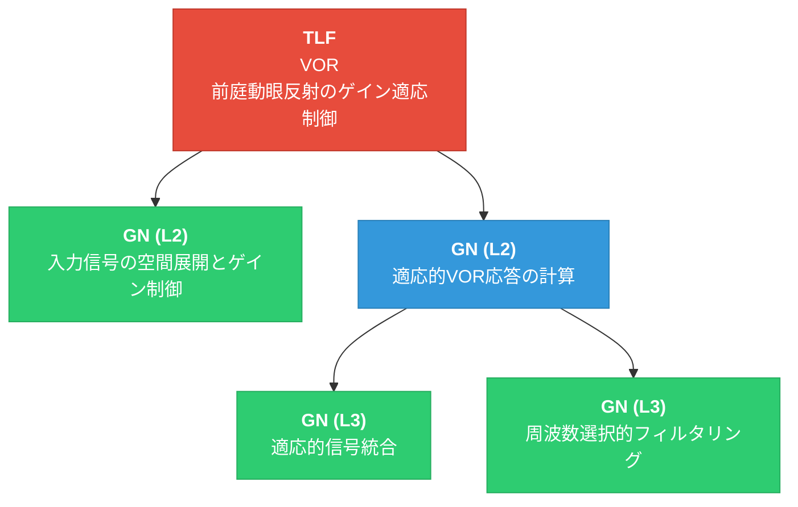

# 2_最適化FRG

## 対象情報

- **TLF**: VOR（Vestibulo-Ocular Reflex / 前庭動眼反射のゲイン適応制御）
- **ROI**: 小脳片葉複合体（Floccular Complex）

---

## 冗長性分析

初期分解結果（ステップ1）を分析し、以下の冗長性を特定した。

### 冗長性1: 入力処理の過剰分解

| マージ対象             | 理由                                                                                            |
| ----------------- | --------------------------------------------------------------------------------------------- |
| 入力信号の高次元空間展開      | 小脳顆粒層では、スパース符号化による高次元展開とゴルジ細胞によるフィードバックゲイン制御は同一の神経回路内で不可分に動作する。展開の程度とゲイン制御は相互依存関係にあり、機能的に分離困難 |
| 入力活動のフィードバックゲイン制御 | 同上                                                                                            |

**マージ結果**: → **「入力信号の空間展開とゲイン制御」**（高次元展開とゲイン調節を統合した入力処理機能）

### 冗長性2: 統合と可塑性の機能的重複

| マージ対象 | 理由 |
|-----------|------|
| 多シナプス入力の非線形統合 | プルキンエ細胞において、信号統合とシナプス可塑性は同一のシナプス（平行線維-プルキンエ細胞シナプス）上で同時に進行する。リアルタイムの統合計算は可塑性により調節されたシナプス重みに直接依存しており、両者は分離不可能 |
| 誤差駆動型シナプス可塑性 | 同上 |

**マージ結果**: → **「適応的信号統合」**（シナプス可塑性に基づく重み更新を含む多入力の非線形統合）

### 冗長性3: 周波数フィルタリングの階層削減

| マージ対象 | 理由 |
|-----------|------|
| 低周波成分の選択的抑制 | 籠細胞と星状細胞はいずれも平行線維から入力を受けプルキンエ細胞を抑制する分子層介在ニューロンであり、相補的な周波数フィルタとして協調的に動作する。低周波抑制と高周波抑制は「周波数選択的フィルタリング」の相補的な2側面であり、個別に分解するよりも統合的に扱う方が、帯域特性の調節という機能をより適切に表現できる |
| 高周波成分の選択的抑制 | 同上 |

**マージ結果**: → **「周波数選択的フィルタリング」**（低周波・高周波の相補的抑制による帯域特性の調節）をリーフノードとして扱う

### 冗長性4: 親ノードの簡素化

| 対象 | 理由 |
|------|------|
| 前庭入力の分散符号化処理 | マージ後、子ノードが「入力信号の空間展開とゲイン制御」の1つのみとなるため、親ノード自体が冗長。親子を統合してフラット化する |

**対処**: 「前庭入力の分散符号化処理」を削除し、「入力信号の空間展開とゲイン制御」をTLFの直接の子に昇格

---

## 最適化後のFRG構造（表形式）

| 階層 | ノード名 | 機能説明 | 親ノード | 子ノード |
|------|----------|----------|----------|----------|
| L1 (TLF) | VOR（前庭動眼反射のゲイン適応制御） | 頭部回転に対する補償性眼球運動のゲインを適応的に制御する | — | 入力信号の空間展開とゲイン制御, 適応的VOR応答の計算 |
| L2 | 入力信号の空間展開とゲイン制御 | 苔状線維からの頭部速度信号をスパース符号化で高次元空間に展開し、フィードバック抑制で活動レベルを適切な動作範囲に維持する | VOR | — (リーフ) |
| L2 | 適応的VOR応答の計算 | 分散符号化された入力を統合・フィルタリングし、誤差に基づいて適応的にVOR応答を計算する | VOR | 適応的信号統合, 周波数選択的フィルタリング |
| L3 | 適応的信号統合 | 平行線維からの興奮性入力と介在ニューロンからの抑制性入力を非線形に統合し、誤差信号に基づくシナプス可塑性（LTD/LTP）により重みを適応的に更新する | 適応的VOR応答の計算 | — (リーフ) |
| L3 | 周波数選択的フィルタリング | 低周波抑制（高域通過）と高周波抑制（低域通過）を相補的に適用し、VOR応答の帯域特性を調節する | 適応的VOR応答の計算 | — (リーフ) |

---

## 最適化後のFRG構造（Mermaidグラフ）

**凡例**:
- 🔴 赤: TLF（トップレベル機能）
- 🔵 青: GN（中間ノード — 子GNを持つ）
- 🟢 緑: GN（リーフノード — UC紐づけ対象）

---

## マージ前後の比較

| 観点 | マージ前（ステップ1） | マージ後（ステップ2） |
|------|---------------------|---------------------|
| ノード総数 | 10（TLF:1, GN:9） | 5（TLF:1, GN:4） |
| 階層数 | 4（L1–L4） | 3（L1–L3） |
| リーフノード数 | 6 | 3 |
| 解釈可能性 | 各ノードの機能は明確だが、細かすぎて全体像が把握しにくい | ノード数が削減され、各ノードが明確で解釈しやすい |

---

## 最適化の妥当性確認

### 親子関係の十分性（最適化後）

| 親ノード | 子ノード群 | 十分性の根拠 |
|----------|------------|-------------|
| VOR | 入力信号の空間展開とゲイン制御 + 適応的VOR応答の計算 | VOR機能は「入力の処理」と「適応的応答計算」の2つの主要段階で十分に実現される |
| 適応的VOR応答の計算 | 適応的信号統合 + 周波数選択的フィルタリング | VOR応答計算は「多入力の適応的統合」と「周波数特性の調節」により十分に実現される。統合が出力の大きさを、フィルタリングが時間特性を決定する |

### 各ノードの独立性（最適化後）

- **入力信号の空間展開とゲイン制御**: 入力層における信号変換に特化（展開＋ゲイン制御の統合機能）
- **適応的信号統合**: 出力層における信号統合と学習に特化（統合＋可塑性の統合機能）
- **周波数選択的フィルタリング**: 出力の周波数特性調節に特化（低周波＋高周波抑制の統合機能）
