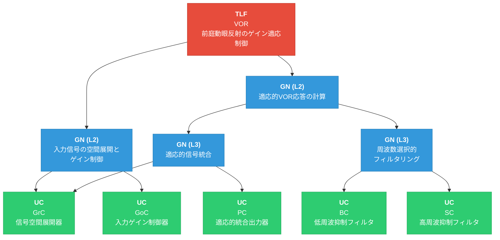
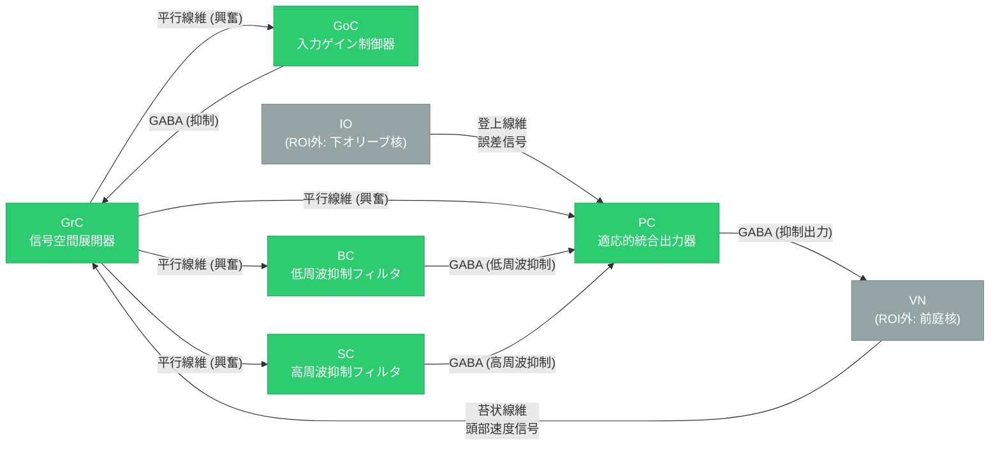

# 3_最終FRG

## 対象情報

- **TLF**: VOR（Vestibulo-Ocular Reflex / 前庭動眼反射のゲイン適応制御）
- **ROI**: 小脳片葉複合体（Floccular Complex）

---

## ROI内UC一覧

以下のROI内UCのみを使用する（ROI外UC: VN, IO, OMNは使用しない）。

| UC | 解剖学的名称 | 機能的名称 |
|----|-------------|-----------|
| GrC | 顆粒細胞 | 信号空間展開器 |
| PC | プルキンエ細胞 | 適応的統合出力器 |
| GoC | ゴルジ細胞 | 入力ゲイン制御器 |
| BC | 籠細胞 | 低周波抑制フィルタ |
| SC | 星状細胞 | 高周波抑制フィルタ |

---

## GN-UC紐づけ

### 紐づけ結果

| リーフGN | 紐づけUC | 紐づけの根拠 |
|----------|---------|-------------|
| 入力信号の空間展開とゲイン制御 | GrC（信号空間展開器）, GoC（入力ゲイン制御器） | GrCは苔状線維入力を平行線維に変換し高次元空間展開を実行する。GoCはGrCに対するフィードバック抑制により入力ゲインを自動制御する。両者は顆粒層内で密結合した負帰還ループを形成し、この機能を協調的に実現する |
| 適応的信号統合 | PC（適応的統合出力器）, GrC（信号空間展開器） | PCは平行線維（GrC出力）からの興奮性入力と登上線維（IO）からの誤差信号を統合し、LTD/LTPによるシナプス可塑性で適応的に出力を調節する。GrCは平行線維を介してPCに分散符号化された信号を供給する入力源であり、両者のシナプス結合がVORゲインの適応学習の実体となる |
| 周波数選択的フィルタリング | BC（低周波抑制フィルタ）, SC（高周波抑制フィルタ） | BCはプルキンエ細胞体・軸索起始部を抑制し低周波成分を選択的に減衰させる（高域通過特性）。SCはプルキンエ細胞樹状突起を抑制し高周波成分を選択的に減衰させる（低域通過特性）。両者は相補的な周波数選択的抑制を行い、協調してVOR応答の帯域特性を調節する |

### GN-UC接続数の制約確認

**制約1: 各GNは最大2つのUCによって実現される**

| GN | 接続UC数 | 接続UC | 判定 |
|----|---------|--------|------|
| 入力信号の空間展開とゲイン制御 | 2 | GrC, GoC | ✓ |
| 適応的信号統合 | 2 | PC, GrC | ✓ |
| 周波数選択的フィルタリング | 2 | BC, SC | ✓ |

**制約2: 各UCは最大2つのGNの部分機能になる**

| UC | 接続GN数 | 接続GN | 判定 |
|----|---------|--------|------|
| GrC（信号空間展開器） | 2 | 入力信号の空間展開とゲイン制御, 適応的信号統合 | ✓ |
| GoC（入力ゲイン制御器） | 1 | 入力信号の空間展開とゲイン制御 | ✓ |
| PC（適応的統合出力器） | 1 | 適応的信号統合 | ✓ |
| BC（低周波抑制フィルタ） | 1 | 周波数選択的フィルタリング | ✓ |
| SC（高周波抑制フィルタ） | 1 | 周波数選択的フィルタリング | ✓ |

**全制約を満たしている。**

---

## 完成FRGグラフ（表形式）

| 階層 | ノード名 | ノードタイプ | 機能説明 | 親ノード | 子ノード |
|------|----------|-------------|----------|----------|----------|
| L1 | VOR（前庭動眼反射のゲイン適応制御） | TLF | 頭部回転に対する補償性眼球運動のゲインを適応的に制御する | — | 入力信号の空間展開とゲイン制御, 適応的VOR応答の計算 |
| L2 | 入力信号の空間展開とゲイン制御 | GN | 苔状線維からの頭部速度信号をスパース符号化で高次元空間に展開し、フィードバック抑制で入力活動を適切な動作範囲に維持する | VOR | GrC, GoC |
| L2 | 適応的VOR応答の計算 | GN | 分散符号化された入力を統合・フィルタリングし、誤差に基づいて適応的にVOR応答を計算する | VOR | 適応的信号統合, 周波数選択的フィルタリング |
| L3 | 適応的信号統合 | GN | 平行線維からの興奮性入力と抑制性入力を非線形に統合し、誤差駆動型シナプス可塑性（LTD/LTP）により重みを適応的に更新してVOR出力を生成する | 適応的VOR応答の計算 | PC, GrC |
| L3 | 周波数選択的フィルタリング | GN | 低周波抑制（高域通過）と高周波抑制（低域通過）を相補的に適用し、VOR応答の帯域特性を調節する | 適応的VOR応答の計算 | BC, SC |
| UC | GrC（信号空間展開器） | UC | 頭部速度信号を平行線維を介して高次元空間に展開し、空間的に分散した並列表現を生成する | 入力信号の空間展開とゲイン制御, 適応的信号統合 | — |
| UC | GoC（入力ゲイン制御器） | UC | 顆粒細胞へのフィードバック抑制により、入力活動の時間的・空間的ゲインを自動制御する | 入力信号の空間展開とゲイン制御 | — |
| UC | PC（適応的統合出力器） | UC | 平行線維と登上線維からの入力を非線形に統合し、LTD/LTPに基づく適応学習によりVORゲイン調節信号を前庭核へ出力する | 適応的信号統合 | — |
| UC | BC（低周波抑制フィルタ） | UC | プルキンエ細胞体・軸索起始部への抑制により低周波成分を選択的に減衰させ、高域通過特性を実現する | 周波数選択的フィルタリング | — |
| UC | SC（高周波抑制フィルタ） | UC | プルキンエ細胞樹状突起への抑制により高周波成分を選択的に減衰させ、低域通過特性を実現する | 周波数選択的フィルタリング | — |

---

## 完成FRGグラフ（Mermaidグラフ）

**凡例**:
- 🔴 赤: TLF（トップレベル機能）
- 🔵 青: GN（グループノード）
- 🟢 緑: UC（Uniform Component / ROI内神経組織）

---

## UC間情報フロー（BIF準拠）

以下にROI内UC間の情報フローを神経科学的根拠とともに記述する。

### UC間接続一覧

| 送信元UC | 受信先UC | 接続タイプ | 神経科学的根拠 |
|----------|----------|-----------|---------------|
| GrC → | GoC | 興奮性（平行線維） | 顆粒細胞のT字型平行線維はゴルジ細胞の樹状突起にも興奮性シナプスを形成し、フィードバック抑制回路の駆動入力となる |
| GoC → | GrC | 抑制性（GABA作動性） | ゴルジ細胞は顆粒層の糸球体（glomerulus）においてGABA作動性シナプスを介して顆粒細胞を抑制し、負帰還ゲイン制御を実現する |
| GrC → | PC | 興奮性（平行線維） | 平行線維はプルキンエ細胞の樹状突起と多数の興奮性シナプスを形成する。このシナプスはLTD/LTPの対象であり、VOR適応学習の主要な基盤となる |
| GrC → | BC | 興奮性（平行線維） | 平行線維は分子層を横走する過程で籠細胞にも興奮性シナプスを形成し、フィードフォワード抑制経路を駆動する |
| GrC → | SC | 興奮性（平行線維） | 平行線維は星状細胞にも興奮性シナプスを形成し、別の周波数特性を持つフィードフォワード抑制経路を駆動する |
| BC → | PC | 抑制性（GABA作動性） | 籠細胞はプルキンエ細胞の細胞体および軸索起始部（pinceau構造）に強力なGABA作動性抑制を行い、特に低周波入力に対するシャンティング抑制を提供する。HCN1チャネルを介したソーマコンダクタンスの増加が低周波選択性に寄与する |
| SC → | PC | 抑制性（GABA作動性） | 星状細胞はプルキンエ細胞の樹状突起にGABA作動性シナプスを形成し、樹状突起でのシャンティング抑制により特に高周波入力に対する急速な電位変化を減衰させる |

### UC間情報フロー図

**凡例**:
- 🟢 緑: ROI内UC
- ⚪ 灰: ROI外UC（参考表示のみ）

---

## UC紐づけの妥当性確認

### 各GNの複数UC分解

| GN | UC数 | 妥当性 |
|----|------|--------|
| 入力信号の空間展開とゲイン制御 | 2 (GrC, GoC) | ✓ GrCが展開、GoCがゲイン制御を担い、両UCの組み合わせで機能が十分に実現される |
| 適応的信号統合 | 2 (PC, GrC) | ✓ GrCが平行線維で入力を供給し、PCが統合・学習・出力を行う。PF-PCシナプスが適応学習の実体 |
| 周波数選択的フィルタリング | 2 (BC, SC) | ✓ BCが低周波抑制、SCが高周波抑制を担い、相補的な周波数フィルタとして帯域特性を調節する |

### BIFとの整合性

- **GrC-GoC間**: 平行線維による興奮とGABA作動性フィードバック抑制の負帰還ループがBIFにおいて確認されており、「入力信号の空間展開とゲイン制御」の機能と整合する
- **GrC-PC間**: 平行線維-プルキンエ細胞シナプスはVOR適応学習の主要基盤としてBIFで確認されており、「適応的信号統合」の機能と整合する
- **BC/SC-PC間**: 分子層介在ニューロンからプルキンエ細胞への抑制はBIFで確認されており、それぞれ異なる周波数選択性を持つことが「周波数選択的フィルタリング」の機能と整合する

### 全UC使用確認

| UC | 使用GN数 | 状態 |
|----|---------|------|
| GrC | 2 | ✓ 使用済み |
| PC | 1 | ✓ 使用済み |
| GoC | 1 | ✓ 使用済み |
| BC | 1 | ✓ 使用済み |
| SC | 1 | ✓ 使用済み |

**全5つのROI内UCがFRGに含まれている。**
