# 初期分解結果 - VOR Function Realization Graph

## TLF: VOR (Vestibulo-Ocular Reflex)
## ROI: 小脳片葉複合体 (Floccular Complex)

---

## 機能分解の概要

VOR（前庭動眼反射）は、頭部運動時に視線を安定させるために、頭部速度に応じた代償性眼球運動を生成する反射です。小脳片葉複合体は、このVORのゲイン（頭部速度に対する眼球速度の比）を適応的に調節する役割を担います。

この初期分解では、VORゲイン調節機能を以下の階層で分解します：
1. **第2階層**: TLFの直接の部分機能（主要な機能モジュール）
2. **第3階層**: 第2階層の各機能を実現する具体的な処理
3. **第4階層**: 第3階層の処理を実現する最小の機能単位（リーフノード）

---

## 階層的機能分解（表形式）

| 階層レベル | ノード名 | 機能説明 |
|-----------|---------|---------|
| **第1階層（TLF）** |
| 1 | VOR_Gain_Adaptation | 視覚誤差に基づいてVORゲインを適応的に調節し、頭部運動時の視線安定性を最適化する |
| **第2階層（主要機能）** |
| 2 | Vestibular_Input_Processing | 前庭入力（頭部速度信号）を受容し、小脳内部で処理可能な形式に変換する |
| 2 | Error_Signal_Integration | 視覚誤差信号（網膜スリップ）を統合し、学習のための教師信号として利用する |
| 2 | Adaptive_Motor_Output | 学習された重みに基づいて、VORゲイン調節のための運動出力を生成する |
| **第3階層（処理ステージ）** |
| 3 | Input_Expansion | 前庭入力を高次元空間に展開し、並列表現を生成する |
| 3 | Input_Gain_Control | 入力信号の強度と時間特性を動的に調節する |
| 3 | Error_Detection | 視覚誤差を検出し、学習に必要な誤差信号を抽出する |
| 3 | Synaptic_Weight_Modification | 誤差信号に基づいてシナプス重みを修正する |
| 3 | Motor_Command_Integration | 複数の入力を統合し、前庭核への抑制性運動指令を生成する |
| 3 | Output_Frequency_Tuning | 運動出力の周波数特性を調整する |
| **第4階層（最小機能単位）** |
| 4 | Sparse_Code_Generation | 入力信号をスパース符号化し、空間的に分散した表現を生成する |
| 4 | Spatial_Distribution | 符号化された信号を小脳皮質の広範囲に空間的に分配する |
| 4 | Feedback_Inhibition | 入力活動に対するフィードバック抑制を行い、ゲインを自動調節する |
| 4 | Temporal_Precision | 入力信号の時間的精度を高め、タイミング情報を保持する |
| 4 | Climbing_Fiber_Reception | 登上線維からの教師信号を受容する |
| 4 | Error_Encoding | 誤差の方向と大きさを符号化する |
| 4 | LTD_Induction | 長期抑圧（LTD）を誘導し、シナプス重みを減少させる |
| 4 | LTP_Induction | 長期増強（LTP）を誘導し、シナプス重みを増加させる |
| 4 | Parallel_Fiber_Integration | 平行線維からの多数の入力を統合する |
| 4 | Climbing_Fiber_Integration | 登上線維からの教師信号を統合する |
| 4 | Inhibitory_Output_Generation | GABA作動性の抑制性出力を生成する |
| 4 | Low_Frequency_Filtering | 低周波成分を選択的に抑制する |
| 4 | High_Frequency_Filtering | 高周波成分を選択的に抑制する |

---

## Mermaid グラフ（階層構造の視覚化）

```mermaid
graph TD
    %% 第1階層: TLF
    TLF[VOR_Gain_Adaptation]
    
    %% 第2階層: 主要機能
    TLF --> Vestibular_Input_Processing
    TLF --> Error_Signal_Integration
    TLF --> Adaptive_Motor_Output
    
    %% 第3階層: 処理ステージ
    Vestibular_Input_Processing --> Input_Expansion
    Vestibular_Input_Processing --> Input_Gain_Control
    
    Error_Signal_Integration --> Error_Detection
    Error_Signal_Integration --> Synaptic_Weight_Modification
    
    Adaptive_Motor_Output --> Motor_Command_Integration
    Adaptive_Motor_Output --> Output_Frequency_Tuning
    
    %% 第4階層: 最小機能単位
    Input_Expansion --> Sparse_Code_Generation
    Input_Expansion --> Spatial_Distribution
    
    Input_Gain_Control --> Feedback_Inhibition
    Input_Gain_Control --> Temporal_Precision
    
    Error_Detection --> Climbing_Fiber_Reception
    Error_Detection --> Error_Encoding
    
    Synaptic_Weight_Modification --> LTD_Induction
    Synaptic_Weight_Modification --> LTP_Induction
    
    Motor_Command_Integration --> Parallel_Fiber_Integration
    Motor_Command_Integration --> Climbing_Fiber_Integration
    Motor_Command_Integration --> Inhibitory_Output_Generation
    
    Output_Frequency_Tuning --> Low_Frequency_Filtering
    Output_Frequency_Tuning --> High_Frequency_Filtering
    
    %% スタイル設定
    classDef tlf fill:#ff9999,stroke:#333,stroke-width:3px
    classDef gn2 fill:#99ccff,stroke:#333,stroke-width:2px
    classDef gn3 fill:#99ff99,stroke:#333,stroke-width:2px
    classDef gn4 fill:#ffff99,stroke:#333,stroke-width:1px
    
    class TLF tlf
    class Vestibular_Input_Processing,Error_Signal_Integration,Adaptive_Motor_Output gn2
    class Input_Expansion,Input_Gain_Control,Error_Detection,Synaptic_Weight_Modification,Motor_Command_Integration,Output_Frequency_Tuning gn3
    class Sparse_Code_Generation,Spatial_Distribution,Feedback_Inhibition,Temporal_Precision,Climbing_Fiber_Reception,Error_Encoding,LTD_Induction,LTP_Induction,Parallel_Fiber_Integration,Climbing_Fiber_Integration,Inhibitory_Output_Generation,Low_Frequency_Filtering,High_Frequency_Filtering gn4
```

---

## 分解の妥当性検証

### 第2階層の妥当性
1. **Vestibular_Input_Processing**: 前庭入力の受容と変換は、VORゲイン調節の必須前提
2. **Error_Signal_Integration**: 視覚誤差に基づく学習がなければ適応的調節は不可能
3. **Adaptive_Motor_Output**: 学習された情報に基づく運動出力がVORゲイン調節の最終段階

→ これら3つの機能によってVORゲイン適応が十分に実現される

### 第3階層の妥当性
- **Vestibular_Input_Processing**は、**Input_Expansion**（情報の高次元展開）と**Input_Gain_Control**（ゲイン調節）によって実現される
- **Error_Signal_Integration**は、**Error_Detection**（誤差検出）と**Synaptic_Weight_Modification**（重み修正）によって実現される
- **Adaptive_Motor_Output**は、**Motor_Command_Integration**（指令統合）と**Output_Frequency_Tuning**（周波数調整）によって実現される

### 第4階層の妥当性
- 各第3階層ノードが、第4階層の子ノードによって十分に実現される
- 第4階層ノードは、これ以上分解すると神経科学的に意味のある独立した機能単位にならないレベルまで到達している

---

## 分解基準の説明

本分解では、以下の基準に基づいて階層化を行いました：

1. **機能的独立性**: 各ノードが明確で独立した機能を持つ
2. **神経科学的妥当性**: 小脳の既知の情報処理メカニズムに対応
3. **十分性**: 子ノードの組み合わせが親ノードの機能を完全に実現
4. **必要性**: 各子ノードが親ノードの実現に不可欠

この段階では、UCとの紐づけは考慮せず、純粋に機能の論理的分解に集中しました。
