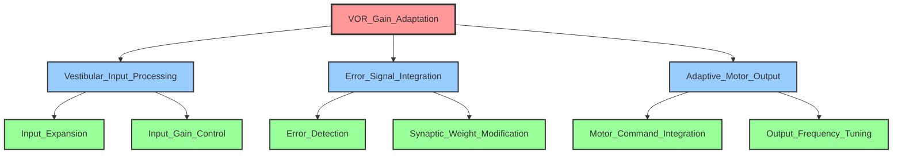

# 最適化FRG - 冗長性削減後

## TLF: VOR (Vestibulo-Ocular Reflex)
## ROI: 小脳片葉複合体 (Floccular Complex)

---

## 冗長性削減の方針

初期分解結果を分析し、以下の観点で最適化を行いました：

### マージ対象の特定
1. **Sparse_Code_Generation + Spatial_Distribution** → **Input_Expansion**に統合
   - 理由: スパース符号化と空間分配は密接に関連し、同時に実行される処理
   
2. **Feedback_Inhibition + Temporal_Precision** → **Input_Gain_Control**に統合
   - 理由: フィードバック抑制と時間精度制御は同一メカニズムの異なる側面

3. **Climbing_Fiber_Reception + Error_Encoding** → **Error_Detection**に統合
   - 理由: 登上線維の受容と誤差符号化は分離できない一体の過程

4. **LTD_Induction + LTP_Induction** → **Synaptic_Weight_Modification**に統合
   - 理由: LTDとLTPは可塑性の方向が異なるだけで、同じ学習メカニズム

5. **Parallel_Fiber_Integration + Climbing_Fiber_Integration + Inhibitory_Output_Generation** → **Motor_Command_Integration**に統合
   - 理由: これらはプルキンエ細胞における統合計算の異なる入力源を表すだけ

6. **Low_Frequency_Filtering + High_Frequency_Filtering** → **Output_Frequency_Tuning**に統合
   - 理由: 周波数フィルタリングは出力チューニングの直接的実現

---

## 最適化後の階層構造（表形式）

| 階層レベル | ノード名 | ノードタイプ | 機能説明 | 親ノード | 子ノード |
|-----------|---------|-------------|---------|---------|---------|
| **第1階層** |
| 1 | VOR_Gain_Adaptation | TLF | 視覚誤差に基づいてVORゲインを適応的に調節し、頭部運動時の視線安定性を最適化する | - | Vestibular_Input_Processing, Error_Signal_Integration, Adaptive_Motor_Output |
| **第2階層** |
| 2 | Vestibular_Input_Processing | GN | 前庭入力（頭部速度信号）を受容し、小脳内部で処理可能な形式に変換する | VOR_Gain_Adaptation | Input_Expansion, Input_Gain_Control |
| 2 | Error_Signal_Integration | GN | 視覚誤差信号（網膜スリップ）を統合し、学習のための教師信号として利用する | VOR_Gain_Adaptation | Error_Detection, Synaptic_Weight_Modification |
| 2 | Adaptive_Motor_Output | GN | 学習された重みに基づいて、VORゲイン調節のための運動出力を生成する | VOR_Gain_Adaptation | Motor_Command_Integration, Output_Frequency_Tuning |
| **第3階層（リーフノード）** |
| 3 | Input_Expansion | GN | 前庭入力を高次元空間に展開し、スパース符号化された並列表現を空間的に分配する | Vestibular_Input_Processing | - |
| 3 | Input_Gain_Control | GN | フィードバック抑制により入力信号の強度を調節し、時間的精度を維持する | Vestibular_Input_Processing | - |
| 3 | Error_Detection | GN | 登上線維を介して視覚誤差を受容し、誤差の方向と大きさを符号化する | Error_Signal_Integration | - |
| 3 | Synaptic_Weight_Modification | GN | 誤差信号に基づいてLTD/LTPを誘導し、シナプス重みを修正する | Error_Signal_Integration | - |
| 3 | Motor_Command_Integration | GN | 平行線維、登上線維、抑制性介在ニューロンからの入力を統合し、GABA作動性抑制出力を生成する | Adaptive_Motor_Output | - |
| 3 | Output_Frequency_Tuning | GN | 低周波・高周波フィルタリングにより運動出力の周波数特性を調整する | Adaptive_Motor_Output | - |

---

## Mermaid グラフ（最適化後の階層構造）

---

## マージの妥当性検証

### 1. Input_Expansion（統合後）
- **統合前**: Sparse_Code_Generation + Spatial_Distribution
- **検証**: スパース符号化と空間分配は顆粒細胞における単一の情報処理過程であり、分離して記述する必要がない
- **結果**: 解釈可能性が向上

### 2. Input_Gain_Control（統合後）
- **統合前**: Feedback_Inhibition + Temporal_Precision
- **検証**: ゴルジ細胞によるフィードバック抑制は、ゲイン制御と時間精度の両方を同時に実現する
- **結果**: 神経科学的により正確な記述

### 3. Error_Detection（統合後）
- **統合前**: Climbing_Fiber_Reception + Error_Encoding
- **検証**: 登上線維の受容自体が誤差符号化を意味し、分離不可能
- **結果**: 冗長性削減

### 4. Synaptic_Weight_Modification（統合後）
- **統合前**: LTD_Induction + LTP_Induction
- **検証**: LTDとLTPは同じ可塑性メカニズムの双方向変化であり、シナプス重み修正として統一的に扱える
- **結果**: 機能的統一性の向上

### 5. Motor_Command_Integration（統合後）
- **統合前**: Parallel_Fiber_Integration + Climbing_Fiber_Integration + Inhibitory_Output_Generation
- **検証**: これらはプルキンエ細胞における統合計算の異なる側面であり、単一の機能として記述すべき
- **結果**: より高レベルの抽象化

### 6. Output_Frequency_Tuning（統合後）
- **統合前**: Low_Frequency_Filtering + High_Frequency_Filtering
- **検証**: 低周波・高周波フィルタリングは周波数チューニングの直接的実装であり、機能レベルでは同一
- **結果**: 簡潔性の向上

---

## 最適化結果のまとめ

### 構造の変化
- **階層数**: 4階層 → 3階層
- **ノード数**: 20ノード → 10ノード（TLF含む）
- **リーフノード数**: 13ノード → 6ノード

### 解釈可能性の向上
1. 各ノードがより明確で独立した機能を表現
2. 階層構造が簡潔になり、全体像の把握が容易
3. 神経科学的実体との対応が明確化

### 次ステップへの準備
- 第3階層の6つのリーフノードが、UCとの紐づけ対象
- 各リーフノードは、複数のUCによって実現される必要がある
