# ステップ1: TLFの段階的分解とGN作成

## TLF（Top Level Function）

**Deductive Reasoning**: The ability to apply general rules to specific problems to produce answers that make sense.

演繹的推論は、一般的なルールを特定の問題に適用し、論理的に妥当な答えを生成する能力である。

---

## 機能分解の方針

演繹的推論を実現するために、以下の主要な部分機能に分解する：

1. **前提の理解と表現**: 問題となる前提情報を理解し、内部表現として保持する
2. **ルールの選択と適用**: 適用可能なルールを選択し、前提に適用する
3. **結論の生成と検証**: ルール適用の結果から結論を導出し、妥当性を確認する
4. **応答の実行**: 導出された結論を外部に出力する

これらの部分機能は、演繹的推論の時間的・論理的なプロセスフローを反映している。

---

## 初期分解結果（表形式）

| 階層レベル | ノード名 | 機能説明 |
|----------|----------|----------|
| 1 | **TLF: DeductiveReasoning** | 一般的なルールを特定の問題に適用し、論理的に妥当な答えを生成する |
| 2 | **PremiseRepresentation** | 前提情報を理解し、内部表現として構築する |
| 2 | **RuleSelection** | 前提に適用可能な論理的ルールを選択する |
| 2 | **RuleApplication** | 選択されたルールを前提に適用し、推論を実行する |
| 2 | **ConclusionGeneration** | ルール適用の結果から結論を生成する |
| 2 | **ResponseExecution** | 生成された結論を運動出力として実行する |
| 3 | **SemanticParsing** | 前提の意味内容を解析する（PremiseRepresentationの子） |
| 3 | **SpatialModelConstruction** | 前提を空間的な心的モデルとして構築する（PremiseRepresentationの子） |
| 3 | **WorkingMemoryMaintenance** | 前提情報を作業記憶として保持する（PremiseRepresentationの子） |
| 3 | **RuleRetrieval** | 長期記憶からルールを検索する（RuleSelectionの子） |
| 3 | **RuleMatching** | 前提パターンとルールの適合性を評価する（RuleSelectionの子） |
| 3 | **ExecutiveControl** | ルール適用プロセス全体を制御・調整する（RuleApplicationの子） |
| 3 | **PremiseIntegration** | 複数の前提を統合して処理する（RuleApplicationの子） |
| 3 | **LogicalInference** | 論理的推論規則に基づいて結論を導出する（RuleApplicationの子） |
| 3 | **ValidityVerification** | 導出された結論の論理的妥当性を検証する（ConclusionGenerationの子） |
| 3 | **ConclusionFormulation** | 検証された推論結果を明示的な結論として定式化する（ConclusionGenerationの子） |
| 3 | **MotorProgramming** | 結論を具体的な応答の運動プログラムに変換する（ResponseExecutionの子） |
| 3 | **ExecutionTiming** | 応答の適切なタイミングを制御する（ResponseExecutionの子） |

---

## 初期分解結果（Mermaidグラフ）

```mermaid
graph TB
    TLF[DeductiveReasoning<br/>演繹的推論]
    
    %% 第2階層
    PR[PremiseRepresentation<br/>前提の表現]
    RS[RuleSelection<br/>ルール選択]
    RA[RuleApplication<br/>ルール適用]
    CG[ConclusionGeneration<br/>結論生成]
    RE[ResponseExecution<br/>応答実行]
    
    %% 第3階層: PremiseRepresentationの子
    SP[SemanticParsing<br/>意味解析]
    SMC[SpatialModelConstruction<br/>空間的モデル構築]
    WMM[WorkingMemoryMaintenance<br/>作業記憶保持]
    
    %% 第3階層: RuleSelectionの子
    RR[RuleRetrieval<br/>ルール検索]
    RM[RuleMatching<br/>ルールマッチング]
    
    %% 第3階層: RuleApplicationの子
    EC[ExecutiveControl<br/>実行制御]
    PI[PremiseIntegration<br/>前提統合]
    LI[LogicalInference<br/>論理的推論]
    
    %% 第3階層: ConclusionGenerationの子
    VV[ValidityVerification<br/>妥当性検証]
    CF[ConclusionFormulation<br/>結論定式化]
    
    %% 第3階層: ResponseExecutionの子
    MP[MotorProgramming<br/>運動プログラミング]
    ET[ExecutionTiming<br/>実行タイミング制御]
    
    %% TLF → 第2階層
    TLF --> PR
    TLF --> RS
    TLF --> RA
    TLF --> CG
    TLF --> RE
    
    %% 第2階層 → 第3階層
    PR --> SP
    PR --> SMC
    PR --> WMM
    
    RS --> RR
    RS --> RM
    
    RA --> EC
    RA --> PI
    RA --> LI
    
    CG --> VV
    CG --> CF
    
    RE --> MP
    RE --> ET
    
    %% スタイリング
    classDef tlf fill:#ffcccc,stroke:#ff0000,stroke-width:3px
    classDef level2 fill:#ccccff,stroke:#0000ff,stroke-width:2px
    classDef level3 fill:#ccffcc,stroke:#00cc00,stroke-width:1px
    
    class TLF tlf
    class PR,RS,RA,CG,RE level2
    class SP,SMC,WMM,RR,RM,EC,PI,LI,VV,CF,MP,ET level3
```

---

## 分解の妥当性確認

### 第2階層の確認

**TLF: DeductiveReasoning**は以下の5つのGNによって実現される：

1. **PremiseRepresentation**: 前提を理解し表現することは演繹推論の前提条件
2. **RuleSelection**: ルールを選択することは演繹推論の中核プロセス
3. **RuleApplication**: ルールを実際に適用することで推論が実行される
4. **ConclusionGeneration**: 結論を生成することは演繹推論の目的
5. **ResponseExecution**: 結論を外部に出力することで推論が完結する

**確認結果**: ✓ これら5つのGNの組み合わせにより、TLFが十分に実現される。

### 第3階層の確認

#### PremiseRepresentationの子ノード
- **SemanticParsing**: 意味内容の解析
- **SpatialModelConstruction**: 空間的モデルの構築
- **WorkingMemoryMaintenance**: 作業記憶での保持

**確認結果**: ✓ これら3つのプロセスにより、前提の表現が十分に実現される。

#### RuleSelectionの子ノード
- **RuleRetrieval**: ルールの検索
- **RuleMatching**: ルールと前提の適合性評価

**確認結果**: ✓ これら2つのプロセスにより、ルール選択が十分に実現される。

#### RuleApplicationの子ノード
- **ExecutiveControl**: 適用プロセスの制御
- **PremiseIntegration**: 複数前提の統合
- **LogicalInference**: 論理的推論の実行

**確認結果**: ✓ これら3つのプロセスにより、ルール適用が十分に実現される。

#### ConclusionGenerationの子ノード
- **ValidityVerification**: 妥当性の検証
- **ConclusionFormulation**: 結論の定式化

**確認結果**: ✓ これら2つのプロセスにより、結論生成が十分に実現される。

#### ResponseExecutionの子ノード
- **MotorProgramming**: 運動プログラムへの変換
- **ExecutionTiming**: タイミング制御

**確認結果**: ✓ これら2つのプロセスにより、応答実行が十分に実現される。

---

## 機能の独立性確認

各GNが明確で独立した機能を表現しているかを確認：

### 第2階層の独立性
- **PremiseRepresentation** vs **RuleSelection**: 前提の表現とルールの選択は明確に異なるプロセス
- **RuleSelection** vs **RuleApplication**: ルールの選択とその適用は明確に分離可能
- **RuleApplication** vs **ConclusionGeneration**: 推論実行と結論生成は論理的に分離される
- **ConclusionGeneration** vs **ResponseExecution**: 内部的な結論生成と外部への出力は分離される

**確認結果**: ✓ 第2階層の全GNが独立した機能を持つ。

### 第3階層の独立性
各親ノードの子ノード群について：
- **PremiseRepresentation**: 意味解析、空間モデル、作業記憶は異なる表現形式・処理
- **RuleSelection**: ルール検索とマッチングは異なる処理段階
- **RuleApplication**: 実行制御、前提統合、論理推論は異なる処理側面
- **ConclusionGeneration**: 妥当性検証と定式化は異なる処理段階
- **ResponseExecution**: 運動プログラミングとタイミング制御は異なる処理側面

**確認結果**: ✓ 第3階層の全GNが独立した機能を持つ。

---

## 分解の深さの妥当性

### 第3階層が適切な理由

- **SemanticParsing**: これ以上分解すると、単語認識などの低レベル処理になり、演繹推論に特化した機能ではなくなる
- **SpatialModelConstruction**: 空間モデル構築は単一の処理として適切。これ以上の分解は不要
- **WorkingMemoryMaintenance**: 作業記憶保持は単一の機能として適切
- **RuleRetrieval**: ルール検索は単一のプロセスとして適切
- **RuleMatching**: マッチング評価は単一のプロセスとして適切
- **ExecutiveControl**: 実行制御は統合的な機能として適切
- **PremiseIntegration**: 前提統合は単一のプロセスとして適切
- **LogicalInference**: 論理推論の実行は単一のプロセスとして適切
- **ValidityVerification**: 妥当性検証は単一のプロセスとして適切
- **ConclusionFormulation**: 結論定式化は単一のプロセスとして適切
- **MotorProgramming**: 運動プログラミングは単一のプロセスとして適切
- **ExecutionTiming**: タイミング制御は単一のプロセスとして適切

**結論**: 第3階層で分解を停止することが適切である。これより深く分解すると、演繹推論に特化しない一般的な認知機能や、UCレベルの詳細になる。

---

## まとめ

TLFを5つの第2階層GN、12個の第3階層GNに分解した。各階層で親ノードの機能が子ノード群によって十分に実現されること、各GNが独立した明確な機能を持つことを確認した。

第3階層のGNは、次のステップでUCとの紐づけに適した粒度であり、これ以上の分解は不要である。

**総ノード数**: 
- TLF: 1
- 第2階層GN: 5
- 第3階層GN: 12
- **合計**: 18ノード（TLF含む）
