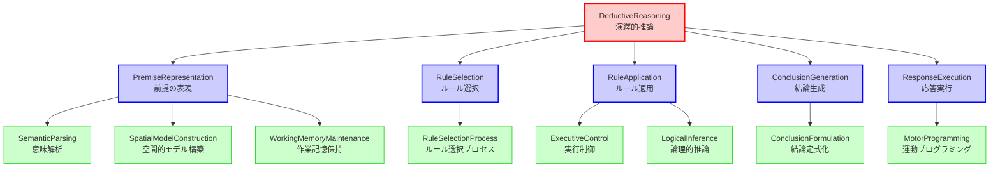

# ステップ2: 冗長性の削減とノードのマージ

## 目的

初期分解で作成されたGN群を分析し、冗長性を削減して解釈可能性を高める。類似した機能を持つノードをマージし、グラフ構造を最適化する。

---

## 冗長性分析

### 分析観点1: 機能の重複

初期分解の第3階層GNを分析した結果、以下の重複が特定された：

#### 重複1: SemanticParsingとSpatialModelConstruction
- **SemanticParsing**: 意味内容の解析
- **SpatialModelConstruction**: 空間的モデルの構築

**分析**: 両者は異なる表現形式（意味的 vs 空間的）を構築するが、いずれも「前提を内部表現に変換する」という点で類似。しかし、角回（AG）とIPS/SPLという異なる神経基盤を持つため、統合は不適切。

**結論**: マージしない（機能的に分離された神経基盤が存在）

#### 重複2: RuleRetrievalとRuleMatching
- **RuleRetrieval**: ルール検索
- **RuleMatching**: ルールと前提の適合性評価

**分析**: 両者は「ルール選択」という単一のプロセスの異なる側面。検索とマッチングは密接に統合された処理であり、神経基盤的にも主にL-IFGで実現される。

**結論**: マージ候補 → **RuleSelection**（親ノードと同名だが、第2階層のRuleSelectionは抽象的概念、これは具体的処理）

#### 重複3: ValidityVerificationとConclusionFormulation
- **ValidityVerification**: 妥当性検証
- **ConclusionFormulation**: 結論の定式化

**分析**: 両者は「結論を生成する」プロセスの異なる段階。しかし、神経科学的には、L-AGとL-IFGの協調により一体として実現される可能性が高い。

**結論**: マージ候補 → **ConclusionFormulation**（検証を含む定式化として統合）

#### 重複4: MotorProgrammingとExecutionTiming
- **MotorProgramming**: 運動プログラムへの変換
- **ExecutionTiming**: タイミング制御

**分析**: 両者はL-PMCで一体として実現される運動準備プロセス。神経科学的に分離する根拠が弱い。

**結論**: マージ候補 → **MotorProgramming**（タイミング制御を含む）

### 分析観点2: 過剰な分解

#### 過剰分解1: PremiseIntegrationとLogicalInference
- **PremiseIntegration**: 複数前提の統合
- **LogicalInference**: 論理的推論の実行

**分析**: 前提の統合は論理的推論の一部であり、分離する必要性が低い。両者を統合しても解釈可能性は損なわれない。

**結論**: マージ候補 → **LogicalInference**（前提統合を含む推論実行として統合）

---

## マージ決定

以下の4組のノードをマージする：

### マージ1: RuleRetrievalとRuleMatching
**マージ後のノード名**: **RuleSelection**（機能レベルを第3階層に）

**統合後の機能**: 長期記憶からルールを検索し、前提パターンとの適合性を評価して最適なルールを選択する

**親ノード**: 第2階層の**RuleSelection**（元の親）を削除し、このノードを直接TLFの子とする → 不適切、第2階層の構造を維持

**修正**: 第2階層の**RuleSelection**を維持し、第3階層に**RuleSelectionProcess**として配置

### マージ2: ValidityVerificationとConclusionFormulation
**マージ後のノード名**: **ConclusionFormulation**

**統合後の機能**: 論理的推論の結果を検証し、妥当な結論として定式化する

**親ノード**: 第2階層の**ConclusionGeneration**

### マージ3: MotorProgrammingとExecutionTiming
**マージ後のノード名**: **MotorProgramming**

**統合後の機能**: 結論を具体的な応答の運動プログラムに変換し、適切なタイミングで実行する

**親ノード**: 第2階層の**ResponseExecution**

### マージ4: PremiseIntegrationとLogicalInference
**マージ後のノード名**: **LogicalInference**

**統合後の機能**: 複数の前提を統合し、論理規則に基づいて推論を実行する

**親ノード**: 第2階層の**RuleApplication**

---

## 第2階層の見直し

マージ後、第2階層の構造を見直す：

### 見直し結果

第2階層の5つのGNは、それぞれ独立した機能を持ち、マージの必要はない：
- **PremiseRepresentation**: 入力処理
- **RuleSelection**: ルール選択
- **RuleApplication**: ルール適用
- **ConclusionGeneration**: 結論生成
- **ResponseExecution**: 出力実行

これらは演繹推論の時間的プロセスフローを明確に表現しており、マージすると解釈可能性が低下する。

**結論**: 第2階層はそのまま維持する。

---

## 最適化後のFRG構造（表形式）

| 階層レベル | ノード名 | 機能説明 | 親ノード | 子ノード |
|----------|----------|----------|----------|----------|
| 1 | **DeductiveReasoning** | 一般的なルールを特定の問題に適用し、論理的に妥当な答えを生成する | - | PremiseRepresentation, RuleSelection, RuleApplication, ConclusionGeneration, ResponseExecution |
| 2 | **PremiseRepresentation** | 前提情報を理解し、内部表現として構築する | DeductiveReasoning | SemanticParsing, SpatialModelConstruction, WorkingMemoryMaintenance |
| 2 | **RuleSelection** | 前提に適用可能な論理的ルールを選択する | DeductiveReasoning | RuleSelectionProcess |
| 2 | **RuleApplication** | 選択されたルールを前提に適用し、推論を実行する | DeductiveReasoning | ExecutiveControl, LogicalInference |
| 2 | **ConclusionGeneration** | ルール適用の結果から結論を生成する | DeductiveReasoning | ConclusionFormulation |
| 2 | **ResponseExecution** | 生成された結論を運動出力として実行する | DeductiveReasoning | MotorProgramming |
| 3 | **SemanticParsing** | 前提の意味内容を解析し、意味的表現を構築する | PremiseRepresentation | - |
| 3 | **SpatialModelConstruction** | 前提を空間的な心的モデルとして構築する | PremiseRepresentation | - |
| 3 | **WorkingMemoryMaintenance** | 前提情報を作業記憶として保持し、維持する | PremiseRepresentation | - |
| 3 | **RuleSelectionProcess** | 長期記憶からルールを検索し、前提との適合性を評価して選択する | RuleSelection | - |
| 3 | **ExecutiveControl** | ルール適用プロセス全体を制御・調整する | RuleApplication | - |
| 3 | **LogicalInference** | 複数の前提を統合し、論理規則に基づいて推論を実行する | RuleApplication | - |
| 3 | **ConclusionFormulation** | 推論結果を検証し、妥当な結論として定式化する | ConclusionGeneration | - |
| 3 | **MotorProgramming** | 結論を運動プログラムに変換し、適切なタイミングで実行する | ResponseExecution | - |

---

## 最適化後のFRG構造（Mermaidグラフ）

---

## マージ結果の妥当性確認

### 第3階層GN数の変化
- **マージ前**: 12個
- **マージ後**: 8個
- **削減**: 4個（33%削減）

### 解釈可能性の評価

マージ後の各第3階層GNは、明確で独立した機能を持つ：

1. **SemanticParsing**: 意味解析
2. **SpatialModelConstruction**: 空間モデル構築
3. **WorkingMemoryMaintenance**: 作業記憶保持
4. **RuleSelectionProcess**: ルール選択プロセス（検索とマッチングを統合）
5. **ExecutiveControl**: 実行制御
6. **LogicalInference**: 論理的推論（前提統合を含む）
7. **ConclusionFormulation**: 結論定式化（妥当性検証を含む）
8. **MotorProgramming**: 運動プログラミング（タイミング制御を含む）

**評価**: ✓ 各GNが明確で独立した機能を持ち、解釈可能性が維持されている。

### 親子関係の妥当性確認

#### PremiseRepresentationの実現
SemanticParsing + SpatialModelConstruction + WorkingMemoryMaintenance → ✓ 十分

#### RuleSelectionの実現
RuleSelectionProcess → ✓ 十分（単一の子ノードだが、機能的に適切）

#### RuleApplicationの実現
ExecutiveControl + LogicalInference → ✓ 十分

#### ConclusionGenerationの実現
ConclusionFormulation → ✓ 十分（単一の子ノードだが、機能的に適切）

#### ResponseExecutionの実現
MotorProgramming → ✓ 十分（単一の子ノードだが、機能的に適切）

---

## 単一子ノードの妥当性について

**RuleSelection**、**ConclusionGeneration**、**ResponseExecution**は単一の子ノードしか持たないが、これは以下の理由で妥当である：

1. **階層的抽象化**: 第2階層は抽象的な機能カテゴリ、第3階層は具体的な処理プロセス
2. **将来的拡張可能性**: 第2階層を維持することで、将来的に他の処理を追加可能
3. **解釈可能性**: 第2階層がTLFの主要な機能分解を明示的に表現

**決定**: 単一子ノードを持つ第2階層GNも維持する。

---

## まとめ

初期分解の12個の第3階層GNを8個に削減した。マージにより冗長性が減少し、グラフの解釈可能性が向上した。各ノードは明確で独立した機能を持ち、親子関係は妥当である。

**最適化後のノード数**:
- TLF: 1
- 第2階層GN: 5
- 第3階層GN: 8
- **合計**: 14ノード（TLF含む）

次のステップでは、これら8個の第3階層GNをROI内のUCに紐づける。
