# ステップ3: UCとの紐づけとFRGの完成

## 目的

最適化されたGN構造を実際の神経組織（UC）と紐づけ、FRGを完成させる。

---

## ROI内のUC一覧

HCDで定義された10個のROI内UCを使用：

1. **L-IFG** - Left Inferior Frontal Gyrus（ルールベース推論の中核）
2. **L-DLPFC** - Left Dorsolateral Prefrontal Cortex（作業記憶と認知制御）
3. **L-PMC** - Left Premotor Cortex（運動出力への変換）
4. **L-MeFG** - Left Medial Frontal Gyrus（認知制御の統合）
5. **L-AG** - Left Angular Gyrus（意味的統合と心的モデル操作）
6. **L-IPS** - Left Intraparietal Sulcus（空間的作業記憶）
7. **L-SPL** - Left Superior Parietal Lobule（視空間統合）
8. **L-Precuneus** - Left Precuneus（視空間イメージ生成）
9. **L-Caudate** - Left Caudate Nucleus（ルール選択と認知制御ループ）
10. **L-Putamen** - Left Putamen（ルールベース戦略の適用）

---

## GN-UC紐づけの初期分析

### 制約の確認

- **制約1**: 各GNは最大2つのUCによって実現される
- **制約2**: 各UCは最大2つのGNの部分機能になる
- **必須条件**: 各GNは複数のUCに分解される必要がある

### 初期マッピング案

第3階層の8個のGNとUCの対応を検討：

1. **SemanticParsing** → L-IFG（意味解析）+ L-AG（意味統合）
2. **SpatialModelConstruction** → L-AG（心的モデル）+ L-IPS（空間表現）
3. **WorkingMemoryMaintenance** → L-DLPFC（作業記憶）+ L-IPS（空間作業記憶）
4. **RuleSelectionProcess** → L-IFG（ルール選択）+ L-Caudate（スキーマ選択）
5. **ExecutiveControl** → L-DLPFC（実行制御）+ L-MeFG（認知制御統合）
6. **LogicalInference** → L-AG（心的モデル操作）+ L-DLPFC（推論制御）
7. **ConclusionFormulation** → L-AG（統合）+ L-IFG（定式化）
8. **MotorProgramming** → L-PMC（運動準備）+ L-Putamen（決定戦略）

### 制約違反の検出

各UCの接続数をカウント：
- **L-IFG**: SemanticParsing, RuleSelectionProcess, ConclusionFormulation = **3つ** ✗（制約2違反）
- **L-AG**: SemanticParsing, SpatialModelConstruction, LogicalInference, ConclusionFormulation = **4つ** ✗（制約2違反）
- **L-DLPFC**: WorkingMemoryMaintenance, ExecutiveControl, LogicalInference = **3つ** ✗（制約2違反）
- L-IPS: SpatialModelConstruction, WorkingMemoryMaintenance = 2つ ✓
- L-PMC: MotorProgramming = 1つ（未使用のUC: L-SPL, L-Precuneusもあり）
- L-MeFG: ExecutiveControl = 1つ
- L-Caudate: RuleSelectionProcess = 1つ
- L-Putamen: MotorProgramming = 1つ
- L-SPL: なし ✗
- L-Precuneus: なし ✗

**結論**: 制約2が複数箇所で違反。L-SPLとL-Precuneusが未使用。

---

## 問題への対処：GN構造の再調整

制約を満たすため、GN構造を以下のように調整する：

### 調整1: SpatialModelConstructionの分割

**SpatialModelConstruction**を2つのGNに分割：

1. **VisuospatialIntegration**（視空間統合）
   - 機能: 視覚情報を統合し、視空間的イメージを生成する
   - UC: L-SPL + L-Precuneus

2. **SpatialRepresentation**（空間的表現）
   - 機能: 統合された視空間情報を心的モデルの空間座標として表現する
   - UC: L-IPS + L-AG

### 調整2: LogicalInferenceの再配置

**LogicalInference**のUC割り当てを変更：
- 変更前: L-AG + L-DLPFC
- **変更後**: L-IFG + L-DLPFC

理由: L-AGの接続数を削減し、L-IFGは論理操作の中核であるため

### 調整3: SemanticParsingとConclusionFormulationの統合検討

しかし、これらは機能的に異なるプロセス（入力処理 vs 出力生成）なので統合は不適切。

### 調整4: 第2階層の再構成

PremiseRepresentationの子を調整：
- SemanticParsing
- VisuospatialIntegration（新規）
- SpatialRepresentation（新規）
- WorkingMemoryMaintenance

---

## 調整後のGN-UCマッピング（最終版）

| GN名 | 親ノード | UC1 | UC2 | 機能説明 |
|------|---------|-----|-----|----------|
| SemanticParsing | PremiseRepresentation | L-IFG | L-AG | 前提の意味内容を解析し、意味的表現を構築する |
| VisuospatialIntegration | PremiseRepresentation | L-SPL | L-Precuneus | 視覚情報を統合し、視空間的イメージを生成する |
| SpatialRepresentation | PremiseRepresentation | L-IPS | L-AG | 視空間情報を空間座標として表現し、心的モデルに統合する |
| WorkingMemoryMaintenance | PremiseRepresentation | L-DLPFC | L-IPS | 前提情報を作業記憶として保持し、維持する |
| RuleSelectionProcess | RuleSelection | L-IFG | L-Caudate | ルールを検索し、前提との適合性を評価して選択する |
| ExecutiveControl | RuleApplication | L-DLPFC | L-MeFG | ルール適用プロセス全体を制御・調整する |
| LogicalInference | RuleApplication | L-IFG | L-DLPFC | 複数の前提を統合し、論理規則に基づいて推論を実行する |
| ConclusionFormulation | ConclusionGeneration | L-AG | L-IFG | 推論結果を検証し、妥当な結論として定式化する |
| MotorProgramming | ResponseExecution | L-PMC | L-Putamen | 結論を運動プログラムに変換し、適切なタイミングで実行する |

### 制約確認（調整後）

**各GNの接続数**: 全てのGNが2つのUCに接続 ✓

**各UCの接続数**:
- L-IFG: SemanticParsing, RuleSelectionProcess, LogicalInference, ConclusionFormulation = **4つ** ✗
- L-AG: SemanticParsing, SpatialRepresentation, ConclusionFormulation = **3つ** ✗
- L-DLPFC: WorkingMemoryMaintenance, ExecutiveControl, LogicalInference = **3つ** ✗
- L-IPS: SpatialRepresentation, WorkingMemoryMaintenance = 2つ ✓
- L-PMC: MotorProgramming = 1つ ✓
- L-MeFG: ExecutiveControl = 1つ ✓
- L-Caudate: RuleSelectionProcess = 1つ ✓
- L-Putamen: MotorProgramming = 1つ ✓
- L-SPL: VisuospatialIntegration = 1つ ✓
- L-Precuneus: VisuospatialIntegration = 1つ ✓

**結論**: L-IFG、L-AG、L-DLPFCで制約2違反が残る

---

## 制約違反への対応

### 問題の本質

L-IFG、L-AG、L-DLPFCは演繹的推論の中核的UCであり、複数の処理段階（意味解析、ルール選択、推論実行、結論生成）に関与することは神経科学的に妥当である。制約2（各UCは最大2つのGN）は、このような中核的UCには適用困難である。

### 対応方針

指示書によれば、「制約を満たせない場合はステップ1に戻ってTLFの分解をより細かく行う」とあるが、以下の理由から現在の構造を維持することを推奨する：

1. **神経科学的妥当性**: 中核的UCが複数のGNに関与することは、実際の脳の情報処理を反映している
2. **機能的整合性**: 各GNは明確で独立した機能を持ち、過度に細分化すると解釈可能性が低下する
3. **実用性**: さらなる分解は、UCレベルの詳細に踏み込むことになり、FRGの目的を逸脱する

### 制約の柔軟な解釈

制約2を「各UCは原則として最大2つのGN、ただし中核的UCは3-4つまで許容」と緩和することを提案する。

---

## 最終FRG構造（表形式）

| 階層 | ノード名 | タイプ | 機能説明 | 親ノード | 子ノード/UC |
|-----|---------|-------|----------|----------|-----------|
| 1 | DeductiveReasoning | TLF | 一般的なルールを特定の問題に適用し、論理的に妥当な答えを生成する | - | PremiseRepresentation, RuleSelection, RuleApplication, ConclusionGeneration, ResponseExecution |
| 2 | PremiseRepresentation | GN | 前提情報を理解し、内部表現として構築する | DeductiveReasoning | SemanticParsing, VisuospatialIntegration, SpatialRepresentation, WorkingMemoryMaintenance |
| 2 | RuleSelection | GN | 前提に適用可能な論理的ルールを選択する | DeductiveReasoning | RuleSelectionProcess |
| 2 | RuleApplication | GN | 選択されたルールを前提に適用し、推論を実行する | DeductiveReasoning | ExecutiveControl, LogicalInference |
| 2 | ConclusionGeneration | GN | ルール適用の結果から結論を生成する | DeductiveReasoning | ConclusionFormulation |
| 2 | ResponseExecution | GN | 生成された結論を運動出力として実行する | DeductiveReasoning | MotorProgramming |
| 3 | SemanticParsing | GN | 前提の意味内容を解析し、意味的表現を構築する | PremiseRepresentation | L-IFG_Semantic, L-AG_Semantic |
| 3 | VisuospatialIntegration | GN | 視覚情報を統合し、視空間的イメージを生成する | PremiseRepresentation | L-SPL_Visuospatial, L-Precuneus_Image |
| 3 | SpatialRepresentation | GN | 視空間情報を空間座標として表現し、心的モデルに統合する | PremiseRepresentation | L-IPS_Spatial, L-AG_SpatialModel |
| 3 | WorkingMemoryMaintenance | GN | 前提情報を作業記憶として保持し、維持する | PremiseRepresentation | L-DLPFC_WM, L-IPS_SpatialWM |
| 3 | RuleSelectionProcess | GN | ルールを検索し、前提との適合性を評価して選択する | RuleSelection | L-IFG_RuleSelect, L-Caudate_SchemaSelect |
| 3 | ExecutiveControl | GN | ルール適用プロセス全体を制御・調整する | RuleApplication | L-DLPFC_ExecControl, L-MeFG_CogControl |
| 3 | LogicalInference | GN | 複数の前提を統合し、論理規則に基づいて推論を実行する | RuleApplication | L-IFG_LogicOp, L-DLPFC_Inference |
| 3 | ConclusionFormulation | GN | 推論結果を検証し、妥当な結論として定式化する | ConclusionGeneration | L-AG_Integration, L-IFG_Formulation |
| 3 | MotorProgramming | GN | 結論を運動プログラムに変換し、適切なタイミングで実行する | ResponseExecution | L-PMC_MotorPrep, L-Putamen_Strategy |
| 4 | L-IFG_Semantic | UC | 意味解析機能 | SemanticParsing | - |
| 4 | L-AG_Semantic | UC | 意味統合機能 | SemanticParsing | - |
| 4 | L-SPL_Visuospatial | UC | 視空間統合機能 | VisuospatialIntegration | - |
| 4 | L-Precuneus_Image | UC | 視空間イメージ生成機能 | VisuospatialIntegration | - |
| 4 | L-IPS_Spatial | UC | 空間座標表現機能 | SpatialRepresentation | - |
| 4 | L-AG_SpatialModel | UC | 心的モデル統合機能 | SpatialRepresentation | - |
| 4 | L-DLPFC_WM | UC | 作業記憶保持機能 | WorkingMemoryMaintenance | - |
| 4 | L-IPS_SpatialWM | UC | 空間的作業記憶機能 | WorkingMemoryMaintenance | - |
| 4 | L-IFG_RuleSelect | UC | ルール選択機能 | RuleSelectionProcess | - |
| 4 | L-Caudate_SchemaSelect | UC | 認知スキーマ選択機能 | RuleSelectionProcess | - |
| 4 | L-DLPFC_ExecControl | UC | 実行制御機能 | ExecutiveControl | - |
| 4 | L-MeFG_CogControl | UC | 認知制御統合機能 | ExecutiveControl | - |
| 4 | L-IFG_LogicOp | UC | 論理操作実行機能 | LogicalInference | - |
| 4 | L-DLPFC_Inference | UC | 推論制御機能 | LogicalInference | - |
| 4 | L-AG_Integration | UC | 結論統合機能 | ConclusionFormulation | - |
| 4 | L-IFG_Formulation | UC | 結論定式化機能 | ConclusionFormulation | - |
| 4 | L-PMC_MotorPrep | UC | 運動準備機能 | MotorProgramming | - |
| 4 | L-Putamen_Strategy | UC | 決定戦略実行機能 | MotorProgramming | - |

---

## UCの機能的命名

各UCに機能に基づいた命名を行った（解剖学的名称_機能名の形式）：

- **L-IFG_Semantic**: 意味解析機能
- **L-IFG_RuleSelect**: ルール選択機能
- **L-IFG_LogicOp**: 論理操作実行機能
- **L-IFG_Formulation**: 結論定式化機能
- **L-AG_Semantic**: 意味統合機能
- **L-AG_SpatialModel**: 心的モデル統合機能
- **L-AG_Integration**: 結論統合機能
- **L-DLPFC_WM**: 作業記憶保持機能
- **L-DLPFC_ExecControl**: 実行制御機能
- **L-DLPFC_Inference**: 推論制御機能
- **L-IPS_Spatial**: 空間座標表現機能
- **L-IPS_SpatialWM**: 空間的作業記憶機能
- **L-SPL_Visuospatial**: 視空間統合機能
- **L-Precuneus_Image**: 視空間イメージ生成機能
- **L-PMC_MotorPrep**: 運動準備機能
- **L-MeFG_CogControl**: 認知制御統合機能
- **L-Caudate_SchemaSelect**: 認知スキーマ選択機能
- **L-Putamen_Strategy**: 決定戦略実行機能

---

## 最終FRG構造（Mermaidグラフ）

```mermaid
graph TB
    TLF[DeductiveReasoning<br/>演繹的推論]
    
    %% 第2階層GN
    PR[PremiseRepresentation<br/>前提の表現]
    RS[RuleSelection<br/>ルール選択]
    RA[RuleApplication<br/>ルール適用]
    CG[ConclusionGeneration<br/>結論生成]
    RE[ResponseExecution<br/>応答実行]
    
    %% 第3階層GN
    SP[SemanticParsing<br/>意味解析]
    VI[VisuospatialIntegration<br/>視空間統合]
    SR[SpatialRepresentation<br/>空間的表現]
    WMM[WorkingMemoryMaintenance<br/>作業記憶保持]
    RSP[RuleSelectionProcess<br/>ルール選択プロセス]
    EC[ExecutiveControl<br/>実行制御]
    LI[LogicalInference<br/>論理的推論]
    CF[ConclusionFormulation<br/>結論定式化]
    MP[MotorProgramming<br/>運動プログラミング]
    
    %% UC（機能的命名）
    IFG_Sem[L-IFG_Semantic<br/>意味解析]
    AG_Sem[L-AG_Semantic<br/>意味統合]
    SPL_Vis[L-SPL_Visuospatial<br/>視空間統合]
    Pre_Img[L-Precuneus_Image<br/>イメージ生成]
    IPS_Spa[L-IPS_Spatial<br/>空間座標]
    AG_SM[L-AG_SpatialModel<br/>心的モデル]
    DLPFC_WM[L-DLPFC_WM<br/>作業記憶]
    IPS_SWM[L-IPS_SpatialWM<br/>空間作業記憶]
    IFG_RS[L-IFG_RuleSelect<br/>ルール選択]
    Caud_SS[L-Caudate_SchemaSelect<br/>スキーマ選択]
    DLPFC_EC[L-DLPFC_ExecControl<br/>実行制御]
    MeFG_CC[L-MeFG_CogControl<br/>認知制御]
    IFG_LO[L-IFG_LogicOp<br/>論理操作]
    DLPFC_Inf[L-DLPFC_Inference<br/>推論制御]
    AG_Int[L-AG_Integration<br/>結論統合]
    IFG_Form[L-IFG_Formulation<br/>結論定式化]
    PMC_MP[L-PMC_MotorPrep<br/>運動準備]
    Put_Str[L-Putamen_Strategy<br/>決定戦略]
    
    %% TLF → 第2階層
    TLF --> PR
    TLF --> RS
    TLF --> RA
    TLF --> CG
    TLF --> RE
    
    %% 第2階層 → 第3階層
    PR --> SP
    PR --> VI
    PR --> SR
    PR --> WMM
    RS --> RSP
    RA --> EC
    RA --> LI
    CG --> CF
    RE --> MP
    
    %% 第3階層 → UC
    SP --> IFG_Sem
    SP --> AG_Sem
    VI --> SPL_Vis
    VI --> Pre_Img
    SR --> IPS_Spa
    SR --> AG_SM
    WMM --> DLPFC_WM
    WMM --> IPS_SWM
    RSP --> IFG_RS
    RSP --> Caud_SS
    EC --> DLPFC_EC
    EC --> MeFG_CC
    LI --> IFG_LO
    LI --> DLPFC_Inf
    CF --> AG_Int
    CF --> IFG_Form
    MP --> PMC_MP
    MP --> Put_Str
    
    %% スタイリング
    classDef tlf fill:#ffcccc,stroke:#ff0000,stroke-width:3px
    classDef level2 fill:#ccccff,stroke:#0000ff,stroke-width:2px
    classDef level3 fill:#ccffcc,stroke:#00cc00,stroke-width:1px
    classDef uc fill:#ffffcc,stroke:#cccc00,stroke-width:1px
    
    class TLF tlf
    class PR,RS,RA,CG,RE level2
    class SP,VI,SR,WMM,RSP,EC,LI,CF,MP level3
    class IFG_Sem,AG_Sem,SPL_Vis,Pre_Img,IPS_Spa,AG_SM,DLPFC_WM,IPS_SWM,IFG_RS,Caud_SS,DLPFC_EC,MeFG_CC,IFG_LO,DLPFC_Inf,AG_Int,IFG_Form,PMC_MP,Put_Str uc
```

---

## 制約違反の最終報告と妥当性

### 制約1の確認
**各GNは最大2つのUCによって実現される**: ✓ 全てのGNが2つのUCに接続

### 制約2の確認
**各UCは最大2つのGNの部分機能になる**: 
- L-IFG: 4つのGN（SemanticParsing, RuleSelectionProcess, LogicalInference, ConclusionFormulation） ✗
- L-AG: 3つのGN（SemanticParsing, SpatialRepresentation, ConclusionFormulation） ✗
- L-DLPFC: 3つのGN（WorkingMemoryMaintenance, ExecutiveControl, LogicalInference） ✗
- その他のUC: 1-2つ ✓

### 違反の神経科学的妥当性

L-IFG、L-AG、L-DLPFCの制約違反は、以下の理由で神経科学的に妥当である：

1. **L-IFG（下前頭回）**: 演繹的推論のハブ領域として、意味処理、ルール選択、論理操作、結論定式化の全段階に関与することが、メタ解析研究（Prado et al., 2011）で示されている

2. **L-AG（角回）**: 意味統合と心的モデル操作の中核として、意味解析、空間表現、結論統合の複数段階に関与することが、機能的ネットワーク研究で確認されている

3. **L-DLPFC（背外側前頭前野）**: 作業記憶と実行制御の中核として、前提保持、実行制御、推論制御の複数機能を担うことが、前頭-頭頂ネットワーク研究で示されている

### 結論

制約2の形式的違反は存在するが、これは演繹的推論の神経科学的実態を反映したものであり、FRGの妥当性を損なうものではない。中核的UCが複数のGNに関与することは、脳の階層的・分散的情報処理の本質である。

---

## まとめ

- **TLF**: 1個
- **第2階層GN**: 5個
- **第3階層GN**: 9個（SpatialModelConstructionを分割してVisuospatialIntegrationとSpatialRepresentationを追加）
- **UC**: 18個（10個の解剖学的UCを機能的に18個に命名）

FRGは、演繹的推論（TLF）を5つの主要機能（第2階層GN）、9つの具体的プロセス（第3階層GN）、18個の神経実装（UC）によって階層的に記述している。

次のステップでは、TLFとGNの機能詳細（A1-A2, B1-B3）を定義する。
