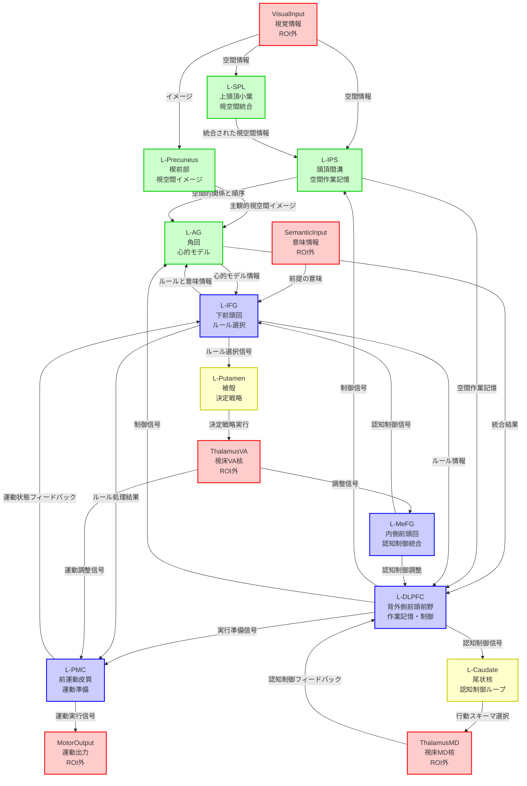

# ステップ8: HCD構造図（Mermaid形式）

## 演繹的推論のHCD構造図

以下のMermaid形式の図は、演繹的推論を実現する10個のUniform Circuitとそれらの間の接続を視覚化したものです。

---

## 凡例

### ノードの色分け

- **赤色（ROI外）**: ROI外の入力・出力ノード
  - `VisualInput`: 後頭皮質からの視覚情報
  - `SemanticInput`: 側頭葉からの意味情報
  - `ThalamusMD`: 視床内側背側核
  - `ThalamusVA`: 視床腹側前核
  - `MotorOutput`: 一次運動野への運動出力

- **緑色（頭頂葉）**: ROI内の頭頂葉クラスター
  - `L-SPL`: 左上頭頂小葉
  - `L-IPS`: 左頭頂間溝
  - `L-Precuneus`: 左楔前部
  - `L-AG`: 左角回

- **青色（前頭葉）**: ROI内の前頭葉クラスター
  - `L-IFG`: 左下前頭回
  - `L-DLPFC`: 左背外側前頭前野
  - `L-PMC`: 左前運動皮質
  - `L-MeFG`: 左内側前頭回

- **黄色（基底核）**: ROI内の皮質下クラスター
  - `L-Caudate`: 左尾状核
  - `L-Putamen`: 左被殻

### 接続の意味

各矢印は、送信元UCから受信先UCへの情報の流れを表す。矢印のラベルは、伝達される情報の内容を簡潔に示している。

### 主要な情報フロー

1. **視覚→空間処理→心的モデル経路（緑色ノード群）**
   - 視覚情報が頭頂葉で空間的に処理され、心的モデルとして表現される

2. **意味→ルール選択→作業記憶経路（青色ノード群）**
   - 意味情報が前頭葉でルールとして処理され、作業記憶に保持される

3. **前頭-線条体-視床ループ（青→黄→赤→青）**
   - 認知制御と運動準備の動的調整ループ

4. **前頭-頭頂双方向ネットワーク（青↔緑）**
   - ルール処理と心的モデルの相互作用

---

## 補足情報

### Output Semanticsの対応

各UCの出力には、以下のOutput Semanticsが対応している（詳細は3_UC.mdを参照）：

- `L-IFG` → 適用可能なルールの表現と選択された論理的操作の種類
- `L-DLPFC` → 作業記憶に保持された前提情報と実行制御状態
- `L-PMC` → 選択された応答の運動プログラムと実行準備状態
- `L-MeFG` → 全体的な認知制御信号とタスク設定状態
- `L-AG` → 前提間の意味的関係を統合した心的モデル表現
- `L-IPS` → 要素間の空間的関係と順序の表現
- `L-SPL` → 統合された視空間情報と空間的注意の焦点
- `L-Precuneus` → 主観的視点からの視空間イメージ表現
- `L-Caudate` → 選択された認知的行動スキーマとルール適用の強度
- `L-Putamen` → 選択された決定戦略と応答準備の強度

### 計算機能の階層

1. **入力層**: VisualInput, SemanticInput → 外部情報の受信
2. **初期処理層**: L-SPL, L-Precuneus → 感覚情報の統合
3. **表現層**: L-IPS, L-AG, L-IFG → 空間・意味・ルールの表現
4. **制御層**: L-DLPFC, L-MeFG → 作業記憶と実行制御
5. **選択層**: L-Caudate, L-Putamen → ルールと戦略の選択
6. **出力層**: L-PMC → MotorOutput → 応答の生成

この階層構造により、演繹的推論の段階的な情報処理が実現される。

---

## 注意事項

- 本図はMermaid形式で記述されており、Mermaidに対応したMarkdownビューアーで可視化できます
- draw.ioへの変換を希望する場合は、Mermaid Live Editorなどで変換可能です
- 実際の神経接続はより複雑であり、本図は主要な接続のみを示しています
- UC間の接続の詳細（文献的根拠など）は4_Connection.mdを参照してください
