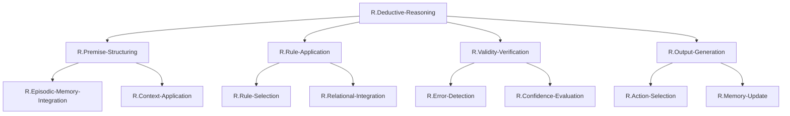

# ステップ1: TLFの段階的分解とGN作成

## TLF
**Deductive Reasoning: The ability to apply general rules to specific problems to produce answers that make sense.**

演繹的推論を、その実現に必要な部分機能に段階的に分解する。

## 機能分解の方針

演繹的推論は、以下の主要な部分機能に分解できる：
1. **前提の構造化**: 個別の情報を推論に使える形式に整理
2. **規則の表現と選択**: 適用すべき論理規則を特定
3. **規則の適用**: 前提に規則を適用して結論を導出
4. **妥当性の検証**: 推論過程と結論の論理的妥当性をチェック
5. **結論の出力**: 推論結果を行動や意思決定に変換

## 階層的分解結果

### 表形式

| 階層レベル | ノード名 | 機能説明 |
| -------- | -------- | -------- |
| 1 (TLF) | `R.Deductive-Reasoning` | 一般規則を特定問題に適用して論理的結論を導く能力全体 |
| 2 | `R.Premise-Structuring` | 個別情報を推論可能な形式に構造化する |
| 2 | `R.Rule-Application` | 適切な論理規則を選択・適用して結論を導出する |
| 2 | `R.Validity-Verification` | 推論過程と結論の妥当性を検証する |
| 2 | `R.Output-Generation` | 推論結果を行動可能な形式で出力する |
| 3 | `R.Episodic-Memory-Integration` | エピソード記憶から関係性情報を抽出・統合する（Premise-Structuringの子） |
| 3 | `R.Context-Application` | タスク文脈を適用して情報を選択・構造化する（Premise-Structuringの子） |
| 3 | `R.Rule-Selection` | 適用すべき論理規則を選択する（Rule-Applicationの子） |
| 3 | `R.Relational-Integration` | 前提と規則を統合して新たな関係を導出する（Rule-Applicationの子） |
| 3 | `R.Error-Detection` | 論理的不整合やエラーを検出する（Validity-Verificationの子） |
| 3 | `R.Confidence-Evaluation` | 推論結果の確信度を評価する（Validity-Verificationの子） |
| 3 | `R.Action-Selection` | 推論結果に基づく行動を選択する（Output-Generationの子） |
| 3 | `R.Memory-Update` | 推論結果を作業記憶に更新する（Output-Generationの子） |

## Mermaid図

## 各ノードの詳細説明

### Level 1: TLF

**R.Deductive-Reasoning**:
演繹的推論全体の機能。一般的な規則を特定の問題に適用し、論理的に妥当な結論を導き出す。

### Level 2: 主要機能

**R.Premise-Structuring** (前提の構造化):
個別の情報（エピソード記憶、観察事実など）を、推論に使える形式の前提として構造化する。散在した情報を、論理的関係として整理する。

**R.Rule-Application** (規則の適用):
適切な論理規則（推移律、三段論法など）を選択し、前提に適用して結論を導出する。演繹推論の中核的計算。

**R.Validity-Verification** (妥当性の検証):
推論過程に論理的エラーがないか、結論が妥当かを検証する。推論の信頼性を保証。

**R.Output-Generation** (出力の生成):
推論結果を、行動選択、意思決定、記憶更新など、実用的な形式で出力する。

### Level 3: 部分機能

**R.Episodic-Memory-Integration** (エピソード記憶統合):
海馬に保存された個別のエピソード記憶（「試行1でAがBに勝った」）から、関係性情報（「AはBより強い」）を抽出し、統合する。

**R.Context-Application** (文脈適用):
現在のタスク文脈（目標、評価基準）を適用して、どの情報が推論に関連するかを選択し、適切な観点で構造化する。

**R.Rule-Selection** (規則選択):
頭頂葉に表現された複数の論理規則の中から、現在の前提と目標に適した規則（推移律、三段論法など）を選択する。

**R.Relational-Integration** (関係統合):
構造化された前提（「AはBより強い」「BはCより強い」）と選択された規則（推移律）を統合し、新たな関係（「AはCより強い」）を導出する。演繹推論の計算的中核。

**R.Error-Detection** (エラー検出):
推論過程における論理的不整合、前提の矛盾、規則の誤適用などを検出する。

**R.Confidence-Evaluation** (確信度評価):
推論結果がどの程度確実か、前提の信頼性、推論ステップの妥当性に基づいて評価する。

**R.Action-Selection** (行動選択):
推論結果（「AはCより強い」）に基づいて、具体的な行動（「Aを選択する」）を決定する。

**R.Memory-Update** (記憶更新):
推論により得られた新規情報を作業記憶に格納し、次の推論ステップで利用可能にする。

## 分解の妥当性

### 親子関係の十分性

**R.Deductive-Reasoning**は、以下の4つの子ノードにより十分に実現される：
- **R.Premise-Structuring**: 推論の材料を準備
- **R.Rule-Application**: 推論を実行
- **R.Validity-Verification**: 推論の正しさを保証
- **R.Output-Generation**: 推論結果を利用

**R.Premise-Structuring**は、以下の2つの子ノードにより十分に実現される：
- **R.Episodic-Memory-Integration**: 記憶から情報を抽出
- **R.Context-Application**: 文脈に基づいて情報を選択・構造化

**R.Rule-Application**は、以下の2つの子ノードにより十分に実現される：
- **R.Rule-Selection**: 適切な規則を選択
- **R.Relational-Integration**: 規則を適用して結論を導出

**R.Validity-Verification**は、以下の2つの子ノードにより十分に実現される：
- **R.Error-Detection**: エラーを検出
- **R.Confidence-Evaluation**: 確信度を評価

**R.Output-Generation**は、以下の2つの子ノードにより十分に実現される：
- **R.Action-Selection**: 行動を選択
- **R.Memory-Update**: 記憶を更新

### 各GNの独立性

各グループノードは、明確で独立した機能を表現している：
- エピソード記憶統合と文脈適用は、情報の抽出と構造化という異なる側面
- 規則選択と関係統合は、規則の特定と適用という異なるステップ
- エラー検出と確信度評価は、質的検証と量的評価という異なる観点
- 行動選択と記憶更新は、外部出力と内部更新という異なる出力形式

## 次ステップ

ステップ2では、この初期分解の冗長性を確認し、必要に応じてノードをマージする。
