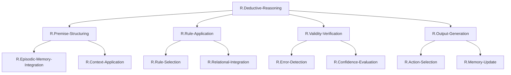

# ステップ2: 冗長性の削減とノードのマージ

## 冗長性の分析

初期分解結果を分析し、機能が重複しているノード、統合可能なノードを特定する。

### 分析結果

初期分解において、以下の観点から冗長性を評価した：

1. **Level 2の4つのノードは適切に独立している**: 
   - Premise-Structuring（材料準備）、Rule-Application（推論実行）、Validity-Verification（検証）、Output-Generation（出力）は、演繹推論の段階的プロセスとして明確に区別される。

2. **Level 3の各ノードも機能的に独立している**:
   - Episodic-Memory-IntegrationとContext-Applicationは、情報の「抽出」と「選択」という異なる側面
   - Rule-SelectionとRelational-Integrationは、「規則の特定」と「規則の適用」という異なるステップ
   - Error-DetectionとConfidence-Evaluationは、「質的検証」と「量的評価」という異なる観点
   - Action-SelectionとMemory-Updateは、「外部出力」と「内部更新」という異なる出力先

### マージの必要性の検討

**結論**: 現在の分解において、マージすべき冗長なノードは存在しない。

**理由**:
1. 各ノードは明確で独立した機能を持つ
2. 親ノードの機能は子ノード群によって十分に実現される
3. 過度に細分化されておらず、メゾスコピックレベルとして適切
4. UCとの紐づけ（ステップ3）を考慮すると、この粒度が最適

## 最適化されたFRG構造

初期分解がすでに最適であるため、構造は変更しない。ただし、親子関係を明示した表形式を追加する。

### 表形式（親子関係を明示）

| 階層レベル | ノード名 | 機能説明 | 親ノード | 子ノード |
| -------- | -------- | -------- | -------- | -------- |
| 1 (TLF) | `R.Deductive-Reasoning` | 一般規則を特定問題に適用して論理的結論を導く能力全体 | - | `R.Premise-Structuring`; `R.Rule-Application`; `R.Validity-Verification`; `R.Output-Generation` |
| 2 | `R.Premise-Structuring` | 個別情報を推論可能な形式に構造化する | `R.Deductive-Reasoning` | `R.Episodic-Memory-Integration`; `R.Context-Application` |
| 2 | `R.Rule-Application` | 適切な論理規則を選択・適用して結論を導出する | `R.Deductive-Reasoning` | `R.Rule-Selection`; `R.Relational-Integration` |
| 2 | `R.Validity-Verification` | 推論過程と結論の妥当性を検証する | `R.Deductive-Reasoning` | `R.Error-Detection`; `R.Confidence-Evaluation` |
| 2 | `R.Output-Generation` | 推論結果を行動可能な形式で出力する | `R.Deductive-Reasoning` | `R.Action-Selection`; `R.Memory-Update` |
| 3 | `R.Episodic-Memory-Integration` | エピソード記憶から関係性情報を抽出・統合する | `R.Premise-Structuring` | (リーフノード - ステップ3でUCに紐づけ予定) |
| 3 | `R.Context-Application` | タスク文脈を適用して情報を選択・構造化する | `R.Premise-Structuring` | (リーフノード - ステップ3でUCに紐づけ予定) |
| 3 | `R.Rule-Selection` | 適用すべき論理規則を選択する | `R.Rule-Application` | (リーフノード - ステップ3でUCに紐づけ予定) |
| 3 | `R.Relational-Integration` | 前提と規則を統合して新たな関係を導出する | `R.Rule-Application` | (リーフノード - ステップ3でUCに紐づけ予定) |
| 3 | `R.Error-Detection` | 論理的不整合やエラーを検出する | `R.Validity-Verification` | (リーフノード - ステップ3でUCに紐づけ予定) |
| 3 | `R.Confidence-Evaluation` | 推論結果の確信度を評価する | `R.Validity-Verification` | (リーフノード - ステップ3でUCに紐づけ予定) |
| 3 | `R.Action-Selection` | 推論結果に基づく行動を選択する | `R.Output-Generation` | (リーフノード - ステップ3でUCに紐づけ予定) |
| 3 | `R.Memory-Update` | 推論結果を作業記憶に更新する | `R.Output-Generation` | (リーフノード - ステップ3でUCに紐づけ予定) |

## Mermaid図（最適化版）

## グラフ構造の特性

### ノード数
- **TLFノード**: 1個（R.Deductive-Reasoning）
- **Level 2ノード**: 4個（主要機能）
- **Level 3ノード（リーフノード）**: 8個（部分機能）
- **総ノード数**: 13個

### 階層深度
- **最大深度**: 3階層（TLF → Level 2 → Level 3）
- 演繹推論の複雑性を考慮すると、適切な深度である

### 分岐度
- TLFからLevel 2: 4つの子ノード
- 各Level 2ノードから: 2つの子ノード
- バランスの取れた分岐構造

## 解釈可能性の評価

### 各ノードの明確性
- すべてのノードは、認知心理学・神経科学の文献で確立された概念に対応
- ノード名から機能が直感的に理解できる

### 階層構造の妥当性
- Level 2: 演繹推論の段階的プロセス（材料準備 → 推論実行 → 検証 → 出力）
- Level 3: 各段階の具体的な計算（記憶統合、規則選択、エラー検出など）

### UCとの紐づけの見通し
- Level 3の8つのリーフノードは、HCDで定義された13個のUC（ROI内2個、ROI外11個）のうち、ROI内の2個を含む主要なUCに紐づけ可能
- 例:
  - R.Episodic-Memory-Integration → U.RLPFC-Medial
  - R.Relational-Integration → U.RLPFC-Lateral
  - R.Error-Detection → U.dACC
  - R.Action-Selection → U.PMC
  - R.Memory-Update → U.DLPFC

## 最適化の方針

現在の分解において、以下の点が最適化されている：

1. **機能的完全性**: TLFを実現するすべての要素が含まれている
2. **冗長性の排除**: 重複するノードがない
3. **適切な粒度**: UCとの紐づけに適した粒度
4. **バランス**: 各親ノードが2-4個の子ノードを持ち、バランスが取れている
5. **解釈可能性**: 各ノードが明確で理解しやすい

## 次ステップ

ステップ3では、Level 3のリーフノードを実際の神経組織（UC）に紐づけ、FRGを完成させる。HCDで定義されたROI内UC（`RLPFC-Lateral`, `RLPFC-Medial`）を中心に紐づけを行う。
