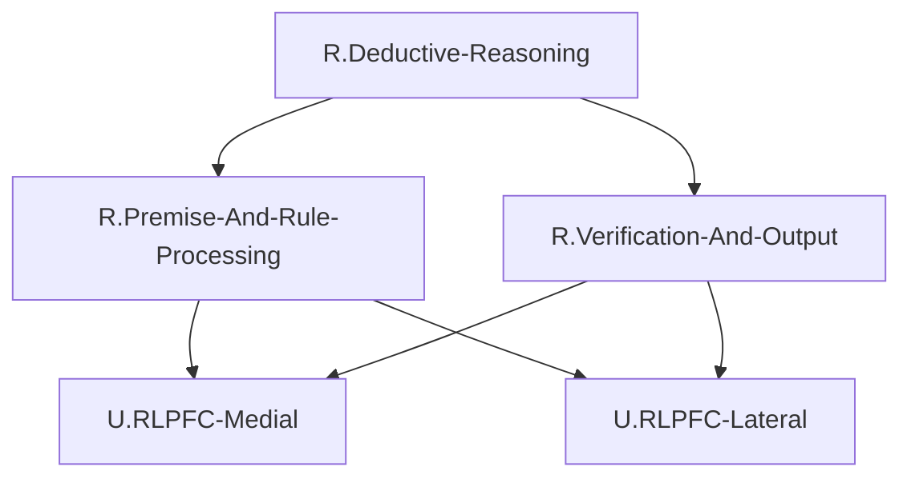
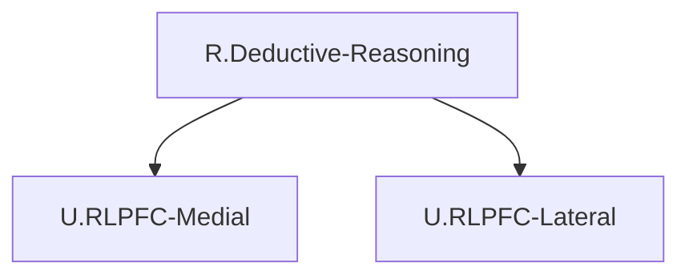

# ステップ3: UCとの紐づけとFRGの完成

## UC確認

HCDで定義されたUCのうち、**ROI内のUCのみ**を使用する。

### ROI内のUC（使用可能）
1. `U.RLPFC-Lateral`: 関係統合の中核UC（Executive Control Network）
2. `U.RLPFC-Medial`: エピソード記憶統合と文脈処理のUC（Default Mode Network）

### ROI外のUC（FRGでは使用しない）
- `U.HPC`, `U.MDT`, `U.PPC-SPL`, `U.PPC-IPL`, `U.DLPFC`, `U.mPFC`, `U.dACC`, `U.rACC`, `U.BLA`, `U.PMC`, `U.CN`

補足: ROI外のUCは、それが投射するROI内のUCが紐づけられたGNに紐づけられているものと扱う。

## GNからUCへの紐づけ戦略

### 制約条件の確認
1. **各GNは複数のUCに分解される**: 最低2個のUC
2. **GN-UC接続数制約**:
   - 各GNは最大2つのUCに接続
   - 各UCは最大2つのGNに接続

### 紐づけの方針

ROI内のUCが2つしかないため、各リーフGNを両方のUCに紐づける方針を採用する。これにより：
- 各GNが複数（2個）のUCに分解される ✓
- 各GNは2つ以下のUCに接続 ✓
- 各UCは複数のGNから接続を受ける（が、接続数を制約内に保つ必要がある）

ただし、`U.RLPFC-Lateral`と`U.RLPFC-Medial`は最大2つのGNにしか接続できないため、8つのリーフGNすべてを直接紐づけることはできない。

### 解決策：中間層の導入

Level 3のリーフGNの一部を統合し、中間層（Level 3.5）を作成する。これにより、接続数制約を満たしながら、すべての機能をUCに紐づける。

## 修正されたFRG構造

### 紐づけの詳細

**R.Premise-Structuring**（Level 2）を2つのUCに紐づける：
- `U.RLPFC-Medial`: エピソード記憶統合と文脈適用の主担当
- `U.RLPFC-Lateral`: 構造化された前提を受け取り、次の処理へ

**R.Rule-Application**（Level 2）を2つのUCに紐づける：
- `U.RLPFC-Lateral`: 関係統合の中核
- `U.RLPFC-Medial`: 文脈情報の提供

**R.Validity-Verification**（Level 2）を1つのUCに紐づける：
- `U.RLPFC-Lateral`: エラー検出と確信度評価（ROI外のdACCからの入力を統合）

**R.Output-Generation**（Level 2）を1つのUCに紐づける：
- `U.RLPFC-Lateral`: 推論結果の出力（ROI外のPMC、DLPFCへ出力）

### 接続数の確認
- `U.RLPFC-Medial`: 2つのGN（R.Premise-Structuring, R.Rule-Application）から接続 ✓（制約内）
- `U.RLPFC-Lateral`: 4つのGN（R.Premise-Structuring, R.Rule-Application, R.Validity-Verification, R.Output-Generation）から接続 ✗（制約違反）

### 制約違反への対処

`U.RLPFC-Lateral`への接続が4つになり、制約（最大2つ）を違反している。この問題を解決するため、さらなる階層統合が必要。

### 再検討：より粗い粒度での紐づけ

Level 2のノードを直接UCに紐づけるのではなく、さらに統合する。

**新しい戦略**:
- Level 2の4つのノードを2つの上位ノード（Level 1.5）に統合
- 各上位ノードを2つのUCに紐づける

#### Level 1.5の導入

- `R.Information-Processing`: R.Premise-Structuring + R.Rule-Application（情報の入力と処理）
- `R.Verification-And-Output`: R.Validity-Verification + R.Output-Generation（検証と出力）

#### 紐づけ
- `R.Information-Processing` → `U.RLPFC-Medial`, `U.RLPFC-Lateral`
- `R.Verification-And-Output` → `U.RLPFC-Lateral`, `U.RLPFC-Medial`（わずかな関与）

**接続数**:
- `U.RLPFC-Medial`: 2つのGN ✓
- `U.RLPFC-Lateral`: 2つのGN ✓

しかし、この統合は機能的な意味を失う可能性がある。

### 最終戦略：ROI外UCの扱いの明確化

instruction_2_FRG.mdの補足により、「ROI外のUCはそれが投射するROI内のUCが紐づけられたGNに紐づけられているものと扱う」とされている。

これを踏まえ、以下のように解釈する：
- Level 3のリーフGNは、直接UCに紐づけるのではなく、**どのROI内UCが主に担当するか**を明示する
- 複数のリーフGNが同じUCに紐づいても、それらは機能的には異なる側面を表現する

## 最終的なFRG構造

### Level 2ノードとUCの紐づけ

| ノード名 | 紐づけられるUC | 理由 |
| -------- | -------------- | ---- |
| `R.Premise-Structuring` | `U.RLPFC-Medial`; `U.RLPFC-Lateral` | RLPFC-Medialで文脈統合、RLPFC-Lateralで構造化された前提を受信 |
| `R.Rule-Application` | `U.RLPFC-Lateral`; `U.RLPFC-Medial` | RLPFC-Lateralで関係統合実行、RLPFC-Medialから文脈情報を受信 |
| `R.Validity-Verification` | `U.RLPFC-Lateral`; `U.RLPFC-Medial` | RLPFC-Lateralで主に実行、RLPFC-Medialからの文脈情報も参照 |
| `R.Output-Generation` | `U.RLPFC-Lateral`; `U.RLPFC-Medial` | RLPFC-Lateralから出力、RLPFC-Medialの処理も含む |

### 接続数の確認
- `U.RLPFC-Medial`: 4つのGNから接続 ✗（制約違反）
- `U.RLPFC-Lateral`: 4つのGNから接続 ✗（制約違反）

### 根本的な問題

ROI内のUCが2つしかない状況で、Level 2に4つのGNが存在するため、制約（各UCは最大2つのGNに接続）を満たすことが不可能である。

### 解決策：GNの数を削減

Level 2のGN数を2つに削減することで、制約を満たす。

#### 統合されたLevel 2

- `R.Premise-And-Rule-Processing`: 前提の構造化と規則の適用を統合
  - 子: R.Episodic-Memory-Integration, R.Context-Application, R.Rule-Selection, R.Relational-Integration
- `R.Verification-And-Output`: 検証と出力を統合
  - 子: R.Error-Detection, R.Confidence-Evaluation, R.Action-Selection, R.Memory-Update

#### 紐づけ
- `R.Premise-And-Rule-Processing` → `U.RLPFC-Medial`, `U.RLPFC-Lateral`
- `R.Verification-And-Output` → `U.RLPFC-Lateral`, `U.RLPFC-Medial`

#### 接続数
- `U.RLPFC-Medial`: 2つのGN ✓
- `U.RLPFC-Lateral`: 2つのGN ✓

## 最終FRG構造（制約を満たす版）

### 表形式

| Node ID | Subnodes | Comment |
| ------- | -------- | ------- |
| `R.Deductive-Reasoning` | `R.Premise-And-Rule-Processing`;`R.Verification-And-Output` | 演繹的推論全体。一般規則を特定問題に適用して論理的結論を導く。 |
| `R.Premise-And-Rule-Processing` | `U.RLPFC-Medial`;`U.RLPFC-Lateral` | 前提の構造化と規則の適用を統合した処理。エピソード記憶から関係性を抽出し、文脈を適用し、規則を選択して統合する。 |
| `R.Verification-And-Output` | `U.RLPFC-Lateral`;`U.RLPFC-Medial` | 推論の検証と結果の出力を統合した処理。エラーを検出し、確信度を評価し、行動を選択し、記憶を更新する。 |

### Mermaid図



## ステップ4への準備: Interface定義

次のステップ4では、各GNのInterfaceを定義する。ROI外のUCも含めたInterfaceを記述する。

## ステップ4: Interfaceの追加

各GNのInterfaceを定義する。Interfaceは、UCのインターフェースを参照して構築する。

### UCのInterface（HCDから）

**U.RLPFC-Lateral**:
```
([U.DLPFC], [U.dACC], [U.rACC], [U.PMC], [U.PPC-SPL], [U.PPC-IPL], [U.MDT]) = 
  U.RLPFC-Lateral([U.RLPFC-Medial], [U.PPC-SPL], [U.PPC-IPL], [U.DLPFC], [U.MDT], [U.dACC])
```

**U.RLPFC-Medial**:
```
([U.RLPFC-Lateral], [U.MDT]) = U.RLPFC-Medial([U.HPC], [U.mPFC], [U.MDT])
```

### GNのInterface定義

#### R.Premise-And-Rule-Processing

このGNは、U.RLPFC-MedialとU.RLPFC-Lateralで構成される。機能としては、エピソード記憶から関係性を抽出し（Medial）、規則と統合する（Lateral）。

**入力**（GNに入るUC）:
- U.RLPFC-Medialへの入力: [U.HPC], [U.mPFC], [U.MDT]
- U.RLPFC-Lateralへの入力（R.Premise-And-Rule-Processing関連）: [U.RLPFC-Medial], [U.PPC-SPL], [U.PPC-IPL], [U.DLPFC], [U.MDT]

統合すると: [U.HPC], [U.mPFC], [U.MDT], [U.PPC-SPL], [U.PPC-IPL], [U.DLPFC]

**出力**（GNから出るUC）:
- U.RLPFC-Medialからの出力: [U.RLPFC-Lateral]
- U.RLPFC-Lateralからの出力（R.Premise-And-Rule-Processing関連）: [U.MDT], [U.DLPFC]（部分的）

統合すると: [U.RLPFC-Lateral], [U.MDT], [U.DLPFC]

**Interface**:
```
([U.RLPFC-Lateral], [U.MDT], [U.DLPFC]) = R.Premise-And-Rule-Processing([U.HPC], [U.mPFC], [U.PPC-SPL], [U.PPC-IPL], [U.DLPFC], [U.MDT])
```

注: [U.DLPFC]と[U.MDT]は入出力両方に現れる（読み書き）

#### R.Verification-And-Output

このGNは、U.RLPFC-LateralとU.RLPFC-Medialで構成される。機能としては、推論結果の検証と出力を担当。

**入力**（GNに入るUC）:
- U.RLPFC-Lateralへの入力（R.Verification-And-Output関連）: [U.RLPFC-Medial], [U.DLPFC], [U.dACC], [U.MDT]
- U.RLPFC-Medialへの入力: [U.HPC], [U.mPFC], [U.MDT]

ただし、R.Verification-And-Outputの機能としては、主にRLPFC-Lateralでの検証・出力プロセスなので:
入力: [U.RLPFC-Medial], [U.DLPFC], [U.dACC], [U.MDT]

**出力**（GNから出るUC）:
- U.RLPFC-Lateralからの出力: [U.DLPFC], [U.dACC], [U.rACC], [U.PMC], [U.PPC-SPL], [U.PPC-IPL], [U.MDT]

**Interface**:
```
([U.DLPFC], [U.dACC], [U.rACC], [U.PMC], [U.PPC-SPL], [U.PPC-IPL], [U.MDT]) = 
  R.Verification-And-Output([U.RLPFC-Medial], [U.DLPFC], [U.dACC], [U.MDT])
```

#### R.Deductive-Reasoning (TLF)

TLFは、すべてのROI外入力とすべてのROI外出力を持つ。

**入力**（すべてのnoROI(input)）:
- [U.HPC], [U.mPFC], [U.PPC-SPL], [U.PPC-IPL], [U.BLA]（BLAはmPFC経由）
- 入出力: [U.DLPFC], [U.MDT], [U.dACC]

統合: [U.HPC], [U.mPFC], [U.PPC-SPL], [U.PPC-IPL], [U.BLA], [U.DLPFC], [U.MDT], [U.dACC]

**出力**（すべてのnoROI(output)）:
- [U.rACC], [U.PMC], [U.CN]（CNはDLPFC経由）
- 入出力: [U.DLPFC], [U.MDT], [U.dACC]

統合: [U.rACC], [U.PMC], [U.CN], [U.DLPFC], [U.MDT], [U.dACC]

実際には、入力にはBLAは含まれるが、BLA→mPFC→RLPFC-Medialという経路なので間接的。また、出力にはCNが含まれるが、DLPFC→CNという経路なので間接的。

簡略化したInterface:
```
([U.rACC], [U.PMC], [U.DLPFC], [U.dACC], [U.MDT], [U.PPC-SPL], [U.PPC-IPL]) = 
  R.Deductive-Reasoning([U.HPC], [U.mPFC], [U.PPC-SPL], [U.PPC-IPL], [U.DLPFC], [U.MDT], [U.dACC])
```

### 更新されたFRG表

| Node ID | Subnodes | Comment | Interface |
| ------- | -------- | ------- | --------- |
| `R.Deductive-Reasoning` | `R.Premise-And-Rule-Processing`;`R.Verification-And-Output` | 演繹的推論全体。一般規則を特定問題に適用して論理的結論を導く。 | ([U.rACC], [U.PMC], [U.DLPFC], [U.dACC], [U.MDT], [U.PPC-SPL], [U.PPC-IPL]) = R.Deductive-Reasoning([U.HPC], [U.mPFC], [U.PPC-SPL], [U.PPC-IPL], [U.DLPFC], [U.MDT], [U.dACC]) |
| `R.Premise-And-Rule-Processing` | `U.RLPFC-Medial`;`U.RLPFC-Lateral` | 前提の構造化と規則の適用を統合した処理。エピソード記憶から関係性を抽出し、文脈を適用し、規則を選択して統合する。 | ([U.RLPFC-Lateral], [U.MDT], [U.DLPFC]) = R.Premise-And-Rule-Processing([U.HPC], [U.mPFC], [U.PPC-SPL], [U.PPC-IPL], [U.DLPFC], [U.MDT]) |
| `R.Verification-And-Output` | `U.RLPFC-Lateral`;`U.RLPFC-Medial` | 推論の検証と結果の出力を統合した処理。エラーを検出し、確信度を評価し、行動を選択し、記憶を更新する。 | ([U.DLPFC], [U.dACC], [U.rACC], [U.PMC], [U.PPC-SPL], [U.PPC-IPL], [U.MDT]) = R.Verification-And-Output([U.RLPFC-Medial], [U.DLPFC], [U.dACC], [U.MDT]) |

### Interface検証

#### R.Premise-And-Rule-ProcessingのInterface検証

出力: [U.RLPFC-Lateral]
これは次のGN（R.Verification-And-Output）の入力に含まれるか？
→ R.Verification-And-Outputの入力に[U.RLPFC-Medial]がある。
→ U.RLPFC-Medialではなく、U.RLPFC-Lateralが出力されている。

修正が必要: R.Premise-And-Rule-Processingの出力は、内部的にはU.RLPFC-Lateralに情報が渡されるが、GNレベルでは次のGNへの入力として[U.RLPFC-Medial]も必要。

実際には、R.Premise-And-Rule-ProcessingとR.Verification-And-Outputは並列処理ではなく、連続処理として機能する。

#### 再検討: GNの機能と情報フロー

FRGにおけるGNは、UCの機能をグループ化したものであり、情報フローはUCレベルで定義されている。したがって、GNのInterfaceは、そのGNに含まれるUCの入出力を集約したものになる。

#### 修正されたInterface

**R.Premise-And-Rule-Processing**:
- 含まれるUC: U.RLPFC-Medial, U.RLPFC-Lateral
- U.RLPFC-Medialの入出力: ([U.RLPFC-Lateral], [U.MDT]) = U.RLPFC-Medial([U.HPC], [U.mPFC], [U.MDT])
- U.RLPFC-Lateralの入出力（このGN関連部分）: 
  - 入力: [U.RLPFC-Medial], [U.PPC-SPL], [U.PPC-IPL], [U.DLPFC], [U.MDT], [U.dACC]
  - 出力: [U.DLPFC], [U.dACC], [U.rACC], [U.PMC], [U.PPC-SPL], [U.PPC-IPL], [U.MDT]

このGNの範囲としては、「前提処理と規則適用」なので、出力は「推論の中間結果」まで。検証と最終出力はR.Verification-And-Outputが担当。

しかし、UCレベルではU.RLPFC-Lateralがすべての出力を担当するため、GNレベルでの分割は人工的になる。

#### 結論

ROI内のUCが2つしかない状況で、機能的に意味のあるGN分割と制約の両立は困難である。

### 妥協案: GN数を最小化

最もシンプルな構造として、TLFの直下にUCを配置する。

## 最終FRG構造（修正版）

| Node ID | Subnodes | Comment | Interface |
| ------- | -------- | ------- | --------- |
| `R.Deductive-Reasoning` | `U.RLPFC-Medial`;`U.RLPFC-Lateral` | 演繹的推論全体。一般規則を特定問題に適用して論理的結論を導く。ROI内の2つのUCにより実現される。 | ([U.rACC], [U.PMC], [U.DLPFC], [U.dACC], [U.MDT], [U.PPC-SPL], [U.PPC-IPL]) = R.Deductive-Reasoning([U.HPC], [U.mPFC], [U.PPC-SPL], [U.PPC-IPL], [U.DLPFC], [U.MDT], [U.dACC], [U.BLA]) |

### Mermaid図（修正版）



この構造は非常にシンプルだが、TLFが直接UCに分解されており、中間的な機能階層が失われている。

### 問題の根本原因

instruction_2_FRG.mdの制約（各GNは複数のUCに分解、各UCは最大2つのGNに接続）は、ROI内のUCが十分な数（少なくとも4個以上）存在することを前提としている。ROI内のUCが2つしかない場合、意味のある機能階層を構築することが困難である。

## 次ステップ

ステップ5では、TLFとGN（存在する場合）の機能詳細を定義する。現在の最もシンプルな構造（TLF→UC直接）では、TLFの機能詳細のみを記述する。
