# HCD Structure Diagram for Deductive Reasoning

## Mermaid Graph

```mermaid
graph TD
    %% Define node styles
    classDef roiInternal fill:#ff9999,stroke:#cc0000,stroke-width:3px,color:#000
    classDef roiInputOnly fill:#99ccff,stroke:#0066cc,stroke-width:2px,color:#000
    classDef roiOutputOnly fill:#99ff99,stroke:#00cc00,stroke-width:2px,color:#000
    classDef roiInputOutput fill:#ffcc99,stroke:#ff6600,stroke-width:2px,color:#000

    %% ROI Internal UCs
    RLPFC-Lateral[RLPFC-Lateral: Integrated inference result]:::roiInternal
    RLPFC-Medial[RLPFC-Medial: Contextualized relational representation]:::roiInternal

    %% noROI input UCs
    HPC[HPC: Individual relational encoding]:::roiInputOnly
    PPC-SPL[PPC-SPL: Spatial rule structure]:::roiInputOnly
    PPC-IPL[PPC-IPL: Logical argument structure]:::roiInputOnly
    mPFC[mPFC: Task context and goal]:::roiInputOnly
    BLA[BLA: Emotional salience]:::roiInputOnly

    %% noROI input/output UCs
    MDT[MDT: Integrated cognitive control signal]:::roiInputOutput
    DLPFC[DLPFC: Working memory contents]:::roiInputOutput
    dACC[dACC: Error and conflict detection]:::roiInputOutput

    %% noROI output UCs
    rACC[rACC: Emotional evaluation]:::roiOutputOnly
    PMC[PMC: Action selection]:::roiOutputOnly
    CN[CN: Goal-directed behavior]:::roiOutputOnly

    %% Input connections to ROI
    HPC -->|Individual relations| RLPFC-Medial
    mPFC -->|Task context| RLPFC-Medial
    MDT -->|Cognitive control signal| RLPFC-Medial
    MDT -->|Cognitive control signal| RLPFC-Lateral
    PPC-SPL -->|Spatial rule structure| RLPFC-Lateral
    PPC-IPL -->|Logical argument structure| RLPFC-Lateral
    DLPFC -->|Working memory contents| RLPFC-Lateral
    dACC -->|Error monitoring signal| RLPFC-Lateral
    BLA -->|Emotional salience| mPFC

    %% ROI internal connection
    RLPFC-Medial -->|Contextualized relations| RLPFC-Lateral

    %% Output connections from ROI
    RLPFC-Lateral -->|Updated working memory| DLPFC
    RLPFC-Lateral -->|Validity information| dACC
    RLPFC-Lateral -->|Inference result for evaluation| rACC
    RLPFC-Lateral -->|Action selection information| PMC
    RLPFC-Lateral -->|Updated spatial rule structure| PPC-SPL
    RLPFC-Lateral -->|Updated logical structure| PPC-IPL
    RLPFC-Lateral -->|Feedback signal| MDT
    RLPFC-Medial -->|Feedback signal| MDT
    DLPFC -->|Goal-directed information| CN
    mPFC -->|Emotional regulation signal| BLA

    %% Legend
    subgraph Legend
        L1[ROI Internal]:::roiInternal
        L2[noROI input]:::roiInputOnly
        L3[noROI output]:::roiOutputOnly
        L4[noROI input/output]:::roiInputOutput
    end
```



## Node Descriptions

### ROI Internal (Red nodes with thick border)
- **RLPFC-Lateral**: Core UC for relational integration in deductive reasoning. Integrates multiple relations to derive logical conclusions. Belongs to Executive Control Network.
- **RLPFC-Medial**: Handles integration of episodic memory information and self-related processing. Belongs to Default Mode Network. Maintains contextual information in deductive reasoning.

### noROI(input) - Blue nodes (Input only to ROI)
- **HPC (Hippocampus)**: Encodes individual relational information. Provides episodic memory-based relational representations.
- **PPC-SPL (Posterior Parietal Cortex - Superior Parietal Lobule)**: Maintains spatial structural representation of logical rules.
- **PPC-IPL (Posterior Parietal Cortex - Inferior Parietal Lobule)**: Maintains formal structure of logical arguments.
- **mPFC (Medial Prefrontal Cortex)**: Provides task context and goal state information.
- **BLA (Basolateral Amygdala)**: Provides emotional salience information.

### noROI(output) - Green nodes (Output only from ROI)
- **rACC (Rostral Anterior Cingulate Cortex)**: Receives inference results for emotional evaluation.
- **PMC (Premotor Cortex)**: Receives action selection information from reasoning results.
- **CN (Caudate Nucleus)**: Integrates reasoning results into goal-directed behavior through frontostriatal pathway.

### noROI(input/output) - Orange nodes (Bidirectional connection with ROI)
- **MDT (Mediodorsal Thalamus)**: Provides and receives integrated cognitive control signals. Supports information integration through bidirectional connections with both RLPFC-Lateral and RLPFC-Medial.
- **DLPFC (Dorsolateral Prefrontal Cortex)**: Provides working memory contents and receives updated information from reasoning process.
- **dACC (Dorsal Anterior Cingulate Cortex)**: Provides error monitoring signals and receives validity information for performance monitoring.

## Information Flow Summary

### Stage 1: Information Collection and Contextualization
```
HPC (Individual relations) → RLPFC-Medial
mPFC (Task context) → RLPFC-Medial
→ RLPFC-Medial (Contextualized relational representation)
```

### Stage 2: Relational Integration
```
RLPFC-Medial (Contextualized relations) → RLPFC-Lateral
PPC-SPL/IPL (Rule structures) → RLPFC-Lateral
DLPFC (Working memory) ⇄ RLPFC-Lateral
→ RLPFC-Lateral (Integrated inference result)
```

### Stage 3: Output and Behavioral Implementation
```
RLPFC-Lateral → DLPFC (Working memory update)
RLPFC-Lateral → dACC (Validity verification)
RLPFC-Lateral → rACC (Emotional evaluation)
RLPFC-Lateral → PMC (Action selection)
```

## Color Legend Explanation
- **Red (thick border)**: ROI internal - Core circuits within left RLPFC (BA10) that execute the central computations for deductive reasoning
- **Blue**: noROI(input) - Circuits outside ROI that provide input information to ROI
- **Green**: noROI(output) - Circuits outside ROI that receive output information from ROI
- **Orange**: noROI(input/output) - Circuits outside ROI that have bidirectional connections with ROI
