# ステップ1: TLFの初期分解結果

## TLFとUCの確認

**TLF**: Mathematical knowledge: Range of general knowledge about mathematics, not the performance of mathematical operations or the solving of math problem

**利用可能なUC（ROI内のみ）**:
- `U.pIPS`: Posterior Intraparietal Sulcus - 視覚的数量表象
- `U.aIPS`: Anterior Intraparietal Sulcus - 抽象的数量表象
- `U.FG-math`: Fusiform Gyrus Mathematical Area - 数字形態認識と意味的表象
- `U.ITG-math`: Inferior Temporal Gyrus Mathematical Area - 数学的概念の高次意味表象

## 機能分解の方針

TLF「Mathematical knowledge」は、数学的操作や問題解決ではなく、数学に関する一般的知識の範囲を指す。これを実現するには、以下の主要な部分機能が必要:

1. **視覚的数学情報の認識**: 数字や数学記号を視覚的に認識する
2. **数量的側面の表象**: 数の大小や数量関係を表象する
3. **数学的概念の意味的表象**: 抽象的な数学的概念を意味として保持する
4. **知識の統合と検索**: 異なる側面の知識を統合し、必要時に検索する

## 階層的機能分解

### 第1階層: TLF

**`R.Mathematical-Knowledge`** (TLF)
- 数学に関する一般的知識の範囲。数学的事実、概念、性質の表象と検索。

### 第2階層: TLFの主要な分解

**`R.Visual-Mathematical-Recognition`**: 視覚的数学情報認識
- 視覚的に提示された数学情報（数字、記号、式）を認識し、その形態的・視覚的アイデンティティを確立する。

**`R.Quantitative-Representation`**: 数量的表象
- 数の大小関係、数量的側面、数的順序性を表象する。視覚的から抽象的な数量表象への変換を含む。

**`R.Conceptual-Mathematical-Representation`**: 概念的数学表象
- 抽象的な数学的概念（素数、周期性、対称性など）、数学的カテゴリー、数学的性質を意味として表象する。

**`R.Knowledge-Integration-And-Retrieval`**: 知識統合と検索
- 視覚的、数量的、概念的な数学的知識を統合し、必要に応じて明示的に検索・想起する。

### 第3階層: 各第2階層ノードの分解

#### `R.Visual-Mathematical-Recognition`の分解

**`R.Number-Form-Recognition`**: 数字形態認識
- アラビア数字、ローマ数字などの数字の視覚的形態を認識し、それを数字として同定する。

**`R.Symbol-Recognition`**: 記号認識
- 数学的記号（+、−、=、∫など）の視覚的形態を認識し、その意味的アイデンティティを確立する。

**`R.Visual-Semantic-Binding`**: 視覚-意味結合
- 認識された数字・記号の視覚的形態と、その意味的表象を結びつける。

#### `R.Quantitative-Representation`の分解

**`R.Visual-Quantity-Extraction`**: 視覚的数量抽出
- 視覚的に提示された数字や物の集合から、数量（numerosity）を抽出する。

**`R.Abstract-Quantity-Formation`**: 抽象的数量形成
- 感覚モダリティから独立した、抽象的な数量表象を形成する。Mental number lineの構築を含む。

**`R.Magnitude-Relationship-Encoding`**: 大小関係符号化
- 数の大小関係、順序性、相対的な大きさを符号化する。

#### `R.Conceptual-Mathematical-Representation`の分解

**`R.Mathematical-Category-Formation`**: 数学的カテゴリー形成
- 数学的対象を適切なカテゴリー（素数、偶数、無理数など）に分類する。

**`R.Mathematical-Property-Representation`**: 数学的性質表象
- 数学的対象が持つ性質（周期性、対称性、連続性など）を表象する。

**`R.Domain-Specific-Knowledge`**: ドメイン特異的知識
- 特定の数学ドメイン（算術、代数、幾何、解析など）に固有の知識を保持する。

#### `R.Knowledge-Integration-And-Retrieval`の分解

**`R.Visual-Quantity-Integration`**: 視覚-数量統合
- 視覚的形態情報と数量的情報を統合する（例：「7」という記号と「7」という数量の統合）。

**`R.Quantity-Concept-Integration`**: 数量-概念統合
- 数量的表象と概念的表象を統合する（例：「7」という数量と「素数」という概念の統合）。

**`R.Explicit-Fact-Retrieval`**: 明示的事実検索
- 長期記憶から数学的事実を明示的に検索・想起する（例：「7×8=56」の想起）。

## 階層構造の表形式まとめ

| 階層レベル | ノード名 | 機能説明 |
|-----------|---------|---------|
| 1 (TLF) | `R.Mathematical-Knowledge` | 数学に関する一般的知識の表象と検索 |
| 2 | `R.Visual-Mathematical-Recognition` | 視覚的数学情報認識 |
| 2 | `R.Quantitative-Representation` | 数量的表象 |
| 2 | `R.Conceptual-Mathematical-Representation` | 概念的数学表象 |
| 2 | `R.Knowledge-Integration-And-Retrieval` | 知識統合と検索 |
| 3 | `R.Number-Form-Recognition` | 数字形態認識 |
| 3 | `R.Symbol-Recognition` | 記号認識 |
| 3 | `R.Visual-Semantic-Binding` | 視覚-意味結合 |
| 3 | `R.Visual-Quantity-Extraction` | 視覚的数量抽出 |
| 3 | `R.Abstract-Quantity-Formation` | 抽象的数量形成 |
| 3 | `R.Magnitude-Relationship-Encoding` | 大小関係符号化 |
| 3 | `R.Mathematical-Category-Formation` | 数学的カテゴリー形成 |
| 3 | `R.Mathematical-Property-Representation` | 数学的性質表象 |
| 3 | `R.Domain-Specific-Knowledge` | ドメイン特異的知識 |
| 3 | `R.Visual-Quantity-Integration` | 視覚-数量統合 |
| 3 | `R.Quantity-Concept-Integration` | 数量-概念統合 |
| 3 | `R.Explicit-Fact-Retrieval` | 明示的事実検索 |

## Mermaid図: 階層構造

```mermaid
graph TB
    TLF[R.Mathematical-Knowledge]
    
    %% 第2階層
    VMR[R.Visual-Mathematical-Recognition]
    QR[R.Quantitative-Representation]
    CMR[R.Conceptual-Mathematical-Representation]
    KIR[R.Knowledge-Integration-And-Retrieval]
    
    %% 第3階層（VMRの子）
    NFR[R.Number-Form-Recognition]
    SR[R.Symbol-Recognition]
    VSB[R.Visual-Semantic-Binding]
    
    %% 第3階層（QRの子）
    VQE[R.Visual-Quantity-Extraction]
    AQF[R.Abstract-Quantity-Formation]
    MRE[R.Magnitude-Relationship-Encoding]
    
    %% 第3階層（CMRの子）
    MCF[R.Mathematical-Category-Formation]
    MPR[R.Mathematical-Property-Representation]
    DSK[R.Domain-Specific-Knowledge]
    
    %% 第3階層（KIRの子）
    VQI[R.Visual-Quantity-Integration]
    QCI[R.Quantity-Concept-Integration]
    EFR[R.Explicit-Fact-Retrieval]
    
    %% 接続
    TLF --> VMR
    TLF --> QR
    TLF --> CMR
    TLF --> KIR
    
    VMR --> NFR
    VMR --> SR
    VMR --> VSB
    
    QR --> VQE
    QR --> AQF
    QR --> MRE
    
    CMR --> MCF
    CMR --> MPR
    CMR --> DSK
    
    KIR --> VQI
    KIR --> QCI
    KIR --> EFR
```

## 分解の妥当性確認

### 各親ノードと子ノードの関係

1. **TLF → 第2階層**:
   - 視覚認識（VMR）、数量表象（QR）、概念表象（CMR）、統合・検索（KIR）が合わさることで、数学的知識（Mathematical Knowledge）が十分に実現される ✓

2. **VMR → 第3階層**:
   - 数字形態認識（NFR）、記号認識（SR）、視覚-意味結合（VSB）が合わさることで、視覚的数学情報認識が実現される ✓

3. **QR → 第3階層**:
   - 視覚的数量抽出（VQE）、抽象的数量形成（AQF）、大小関係符号化（MRE）が合わさることで、数量的表象が実現される ✓

4. **CMR → 第3階層**:
   - 数学的カテゴリー形成（MCF）、数学的性質表象（MPR）、ドメイン特異的知識（DSK）が合わさることで、概念的数学表象が実現される ✓

5. **KIR → 第3階層**:
   - 視覚-数量統合（VQI）、数量-概念統合（QCI）、明示的事実検索（EFR）が合わさることで、知識統合と検索が実現される ✓

### 独立性の確認

各グループノード（GN）は明確で独立した機能を持っている：
- VMRは視覚認識に特化
- QRは数量表象に特化
- CMRは概念表象に特化
- KIRは統合と検索に特化

第3階層のGNも、それぞれ明確に異なる機能を持っている ✓

## 次のステップへ

この初期分解は、ステップ2でさらに最適化される可能性がある。特に、以下の点を検討する：
1. 第3階層のノードの統合可能性
2. UCとの紐づけを考慮した調整
3. 冗長性の削減
