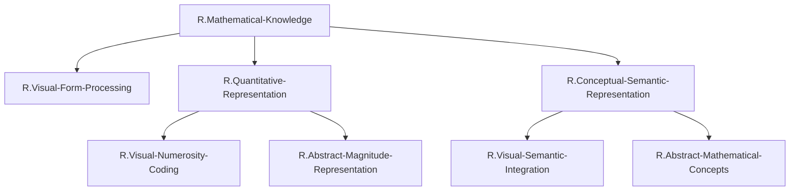

# ステップ2: 最適化FRG

## 最適化の方針

ステップ1で作成した初期分解を分析し、以下の観点で最適化を行う：
1. 機能が重複しているGNの統合
2. UCとの紐づけを考慮した構造調整
3. 過度に細分化されたGNの統合
4. 解釈可能性の向上

## 冗長性の分析

### 統合候補1: 視覚認識系の統合

初期分解では、`R.Visual-Mathematical-Recognition`が以下の3つに分解されていた：
- `R.Number-Form-Recognition`: 数字形態認識
- `R.Symbol-Recognition`: 記号認識
- `R.Visual-Semantic-Binding`: 視覚-意味結合

**分析**: これら3つは、実際にはFG-mathという単一のUCで実現される機能である。分離する必要性は低い。

**統合案**: `R.Visual-Mathematical-Recognition`を第3階層に下ろし、直接FG-mathに紐づける。

### 統合候補2: 知識統合系の再編

初期分解では、`R.Knowledge-Integration-And-Retrieval`が以下の3つに分解されていた：
- `R.Visual-Quantity-Integration`: 視覚-数量統合
- `R.Quantity-Concept-Integration`: 数量-概念統合
- `R.Explicit-Fact-Retrieval`: 明示的事実検索

**分析**: 
- `R.Visual-Quantity-Integration`は、実質的にFG-mathとpIPSの相互作用そのもの
- `R.Quantity-Concept-Integration`は、aIPSとITG-mathの相互作用そのもの
- `R.Explicit-Fact-Retrieval`は、ROI外のAGが担う機能で、FRGには含めるべきでない

**統合案**: `R.Knowledge-Integration-And-Retrieval`を削除し、統合機能は各UCの相互作用として暗黙的に表現する。

### 保持すべき構造

以下のGNは、それぞれ明確な機能を持ち、複数のUCに分解される可能性があるため保持：
- `R.Quantitative-Representation`: pIPSとaIPSの両方に関連
- `R.Conceptual-Mathematical-Representation`: FG-mathとITG-mathの両方に関連

## 最適化後の構造

### 第1階層: TLF

**`R.Mathematical-Knowledge`** (TLF)
- 数学に関する一般的知識の表象と検索

### 第2階層: TLFの分解

**`R.Visual-Form-Processing`**: 視覚的形態処理
- 数字や数学記号の視覚的形態を認識し、意味表象と結びつける

**`R.Quantitative-Representation`**: 数量的表象
- 数の大小関係、数量的側面、数的順序性を表象する

**`R.Conceptual-Semantic-Representation`**: 概念的意味表象
- 抽象的な数学的概念、カテゴリー、性質を意味として表象する

### 第3階層: 第2階層ノードの分解

#### `R.Visual-Form-Processing`の分解
→ このノードは直接UCに紐づけられる（第3階層なし）

#### `R.Quantitative-Representation`の分解

**`R.Visual-Numerosity-Coding`**: 視覚的数量符号化
- 視覚的に提示された数字や物の集合から数量を符号化する。Weber-Fechner法則に従う近似数量システム。

**`R.Abstract-Magnitude-Representation`**: 抽象的数量表象
- 感覚モダリティから独立した抽象的数量表象。Mental number lineと数的順序性。

#### `R.Conceptual-Semantic-Representation`の分解

**`R.Visual-Semantic-Integration`**: 視覚-意味統合
- 視覚的数字形態と数学的意味を統合する。数字-概念の対応づけ。

**`R.Abstract-Mathematical-Concepts`**: 抽象的数学概念
- 言語から独立した、高次の数学的概念（素数性、周期性、対称性など）と数学的カテゴリー。

## 最適化後の階層構造（表形式）

| 階層レベル | ノード名 | 親ノード名 | 子ノード名 | 機能説明 |
|-----------|---------|-----------|-----------|---------|
| 1 (TLF) | `R.Mathematical-Knowledge` | - | `R.Visual-Form-Processing`; `R.Quantitative-Representation`; `R.Conceptual-Semantic-Representation` | 数学に関する一般的知識の表象と検索 |
| 2 | `R.Visual-Form-Processing` | `R.Mathematical-Knowledge` | （第3階層なし、直接UCへ） | 数字や数学記号の視覚的形態認識と意味表象の結合 |
| 2 | `R.Quantitative-Representation` | `R.Mathematical-Knowledge` | `R.Visual-Numerosity-Coding`; `R.Abstract-Magnitude-Representation` | 数量的側面の表象、数の大小関係と順序性 |
| 2 | `R.Conceptual-Semantic-Representation` | `R.Mathematical-Knowledge` | `R.Visual-Semantic-Integration`; `R.Abstract-Mathematical-Concepts` | 抽象的数学概念とカテゴリーの意味表象 |
| 3 | `R.Visual-Numerosity-Coding` | `R.Quantitative-Representation` | （リーフノード、UCへ紐づけ予定） | 視覚的数量符号化、近似数量システム |
| 3 | `R.Abstract-Magnitude-Representation` | `R.Quantitative-Representation` | （リーフノード、UCへ紐づけ予定） | 抽象的数量表象、Mental number line |
| 3 | `R.Visual-Semantic-Integration` | `R.Conceptual-Semantic-Representation` | （リーフノード、UCへ紐づけ予定） | 視覚的形態と数学的意味の統合 |
| 3 | `R.Abstract-Mathematical-Concepts` | `R.Conceptual-Semantic-Representation` | （リーフノード、UCへ紐づけ予定） | 高次数学概念、言語から独立した意味記憶 |

## Mermaid図: 最適化後の階層構造

## 最適化の妥当性確認

### 親子関係の妥当性

1. **TLF → 第2階層**:
   - 視覚的形態処理（VFP）、数量的表象（QR）、概念的意味表象（CSR）が合わさることで、数学的知識が実現される ✓

2. **QR → 第3階層**:
   - 視覚的数量符号化（VNC）と抽象的数量表象（AMR）が合わさることで、視覚的から抽象的な数量表象の全範囲が実現される ✓

3. **CSR → 第3階層**:
   - 視覚-意味統合（VSI）と抽象的数学概念（AMC）が合わさることで、視覚的形態から抽象概念までの意味表象が実現される ✓

### UCとの紐づけ可能性

各リーフノード（第2階層のVFP、第3階層のVNC、AMR、VSI、AMC）について、UCへの紐づけ可能性を確認：

- **VFP**: FG-mathに紐づけ可能 ✓
- **VNC**: pIPSに紐づけ可能 ✓
- **AMR**: aIPSに紐づけ可能 ✓
- **VSI**: FG-mathに紐づけ可能 ✓
- **AMC**: ITG-mathに紐づけ可能 ✓

**重要な発見**: この構造では、以下のようなUCへの紐づけが想定される：
- FG-math: VFPとVSIの両方に関与（FG-mathは視覚形態認識と視覚-意味統合の両方を担う）
- pIPS: VNCに関与
- aIPS: AMRに関与
- ITG-math: AMCに関与

### 解釈可能性の向上

初期分解に比べて、以下の点で解釈可能性が向上した：
1. ノード数が12から7に削減され、全体構造が把握しやすくなった
2. 各ノードの機能がより明確になった
3. UCとの対応関係が見えやすくなった

## マージの根拠まとめ

### 統合されたノード

1. **`R.Number-Form-Recognition`, `R.Symbol-Recognition`, `R.Visual-Semantic-Binding` → `R.Visual-Form-Processing`**
   - これらはすべてFG-mathという単一のUCで実現される機能であり、過度に細分化されていた

2. **`R.Visual-Quantity-Extraction`, `R.Abstract-Quantity-Formation`, `R.Magnitude-Relationship-Encoding` → `R.Visual-Numerosity-Coding`, `R.Abstract-Magnitude-Representation`**
   - pIPS（視覚的）とaIPS（抽象的）という2つのUCに対応させるため、2つのノードに整理

3. **`R.Mathematical-Category-Formation`, `R.Mathematical-Property-Representation`, `R.Domain-Specific-Knowledge` → `R.Visual-Semantic-Integration`, `R.Abstract-Mathematical-Concepts`**
   - FG-math（視覚-意味統合）とITG-math（抽象概念）という2つのUCに対応させるため再編

4. **`R.Knowledge-Integration-And-Retrieval`系を削除**
   - これらの機能はUC間の相互作用として暗黙的に表現されるため、明示的なGNは不要

## 次のステップへ

ステップ3では、この最適化されたFRG構造にUCを紐づけ、完全なFRGを構築する。特に、以下の点に注意：
1. 各GNが複数のUCに分解されること（FRGの必須条件）
2. GN-UC間の接続数制約（各2つ以下）を満たすこと
3. ROI内のUCのみを使用すること
