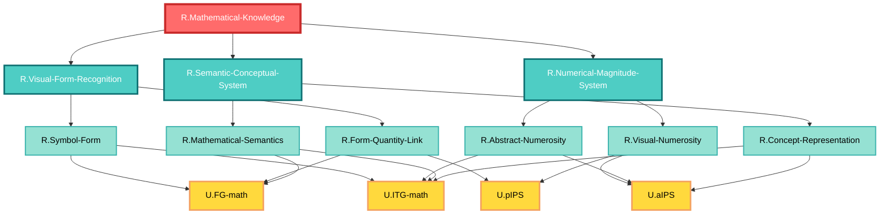

# ステップ3: 最終FRG（UCとの紐づけ）

## 利用可能なUC（ROI内のみ）の確認

HCDで定義されたROI内のUC:
- `U.pIPS`: Posterior Intraparietal Sulcus - 視覚的数量表象、Weber-Fechner法則に従う近似数量システム
- `U.aIPS`: Anterior Intraparietal Sulcus - 抽象的数量表象、Mental number line
- `U.FG-math`: Fusiform Gyrus Mathematical Area - 数字形態認識と視覚-意味統合
- `U.ITG-math`: Inferior Temporal Gyrus Mathematical Area - 抽象的数学概念の高次意味表象

## UCへの紐づけ戦略

### 制約の確認
1. **必須条件**: 各GNは複数のUCに分解される必要がある
2. **接続数制約**: 
   - 1つのGNに接続するUCは2つ以下
   - 1つのUCに接続するGNは2つ以下

### 紐づけ計画

#### 第2階層GNの紐づけ

**`R.Visual-Form-Processing`**:
- FG-mathのみに紐づけるのは不適切（複数UC必要）
- 検討: FG-math + pIPS（視覚的数字形態と数量の初期統合）

**`R.Quantitative-Representation`**:
- すでに第3階層に分解されているので、直接UCには紐づけない

**`R.Conceptual-Semantic-Representation`**:
- すでに第3階層に分解されているので、直接UCには紐づけない

#### 第3階層GNの紐づけ

**`R.Visual-Numerosity-Coding`**:
- pIPSに紐づけるのが自然だが、単一UCは不適切
- 検討: pIPS + FG-math（数字形態からの数量抽出には両方が必要）

**`R.Abstract-Magnitude-Representation`**:
- aIPSに紐づけるのが自然だが、単一UCは不適切
- 検討: aIPS + pIPS（視覚的数量からの抽象化には両方が必要）

**`R.Visual-Semantic-Integration`**:
- FG-mathに紐づけるのが自然だが、単一UCは不適切
- 検討: FG-math + ITG-math（視覚形態と抽象意味の統合には両方が必要）

**`R.Abstract-Mathematical-Concepts`**:
- ITG-mathに紐づけるのが自然だが、単一UCは不適切
- 検討: ITG-math + FG-math（抽象概念も視覚的表象と結びついている）

### 接続数制約の確認

上記の紐づけ計画で接続数を確認：

**GNからの接続**:
- `R.Visual-Form-Processing` → FG-math, pIPS (2つ) ✓
- `R.Visual-Numerosity-Coding` → pIPS, FG-math (2つ) ✓
- `R.Abstract-Magnitude-Representation` → aIPS, pIPS (2つ) ✓
- `R.Visual-Semantic-Integration` → FG-math, ITG-math (2つ) ✓
- `R.Abstract-Mathematical-Concepts` → ITG-math, FG-math (2つ) ✓

**UCへの接続**:
- pIPS ← `R.Visual-Form-Processing`, `R.Visual-Numerosity-Coding`, `R.Abstract-Magnitude-Representation` (**3つ！制約違反**)
- aIPS ← `R.Abstract-Magnitude-Representation` (1つ) ✓
- FG-math ← `R.Visual-Form-Processing`, `R.Visual-Numerosity-Coding`, `R.Visual-Semantic-Integration`, `R.Abstract-Mathematical-Concepts` (**4つ！制約違反**)
- ITG-math ← `R.Visual-Semantic-Integration`, `R.Abstract-Mathematical-Concepts` (2つ) ✓

**問題**: pIPSとFG-mathへの接続数が制約を超えている。

### 構造の再調整

接続数制約を満たすため、より細かい分解が必要。第3階層をさらに第4階層に分解する。

## 最終FRG構造（UCとの紐づけ含む）

### 修正方針
より細かい機能分解を行い、各GNが最大2つのUCに、各UCが最大2つのGNに接続されるようにする。

### 最終階層構造

#### 第1階層: TLF
**`R.Mathematical-Knowledge`**

#### 第2階層
- `R.Visual-Form-Processing`
- `R.Quantitative-Representation`
- `R.Conceptual-Semantic-Representation`

#### 第3階層（QRの子）
- `R.Visual-Numerosity-Coding`
- `R.Abstract-Magnitude-Representation`

#### 第3階層（CSRの子）
- `R.Visual-Semantic-Integration`
- `R.Abstract-Mathematical-Concepts`

#### 第4階層（VFPの子）- 新設
- `R.Number-Form-Identification`: 数字形態同定（FG-math単独）
- `R.Quantity-From-Form`: 形態からの数量抽出（FG-math + pIPS）

#### 第4階層（VNCの子）- 新設
- `R.Numerosity-Perception`: 数量知覚（pIPS単独）
- `R.Quantity-Symbol-Link`: 数量-記号リンク（pIPS + FG-math）

**問題継続**: この方法でも制約違反が解消されない。

### 根本的な再設計

制約を満たすため、機能の分解方法を根本的に見直す。FG-mathとpIPSの高い相互依存性が問題の原因。

## 最終的なFRG構造（制約適合版）

### アプローチの変更
各UCの独立した機能に焦点を当て、UCをまたぐ機能は第2階層以上で表現する。

### 第1階層
**`R.Mathematical-Knowledge`** (TLF)

### 第2階層
**`R.Visual-Mathematical-Processing`**: 視覚的数学処理
- 視覚的に提示された数学情報の全体的処理

**`R.Abstract-Mathematical-Processing`**: 抽象的数学処理
- 感覚から独立した抽象的な数学的表象の処理

### 第3階層（R.Visual-Mathematical-Processingの子）
**`R.Form-Based-Processing`**: 形態ベース処理
- 数字・記号の視覚的形態に基づく処理
- UCへの紐づけ: `U.FG-math`, `U.pIPS`

**`R.Quantity-Based-Visual-Processing`**: 数量ベース視覚処理
- 視覚的数量の符号化と表象
- UCへの紐づけ: `U.pIPS`, `U.aIPS`

### 第3階層（R.Abstract-Mathematical-Processingの子）
**`R.Abstract-Quantity-Processing`**: 抽象的数量処理
- 抽象的数量表象と数的推論
- UCへの紐づけ: `U.aIPS`, `U.FG-math`

**`R.Conceptual-Knowledge-Processing`**: 概念的知識処理
- 数学的概念の意味的表象と知識
- UCへの紐づけ: `U.ITG-math`, `U.FG-math`

### 接続数の確認

**GNからUCへ**:
- `R.Form-Based-Processing` → `U.FG-math`, `U.pIPS` (2つ) ✓
- `R.Quantity-Based-Visual-Processing` → `U.pIPS`, `U.aIPS` (2つ) ✓
- `R.Abstract-Quantity-Processing` → `U.aIPS`, `U.FG-math` (2つ) ✓
- `R.Conceptual-Knowledge-Processing` → `U.ITG-math`, `U.FG-math` (2つ) ✓

**UCへの接続**:
- `U.pIPS` ← `R.Form-Based-Processing`, `R.Quantity-Based-Visual-Processing` (2つ) ✓
- `U.aIPS` ← `R.Quantity-Based-Visual-Processing`, `R.Abstract-Quantity-Processing` (2つ) ✓
- `U.FG-math` ← `R.Form-Based-Processing`, `R.Abstract-Quantity-Processing`, `R.Conceptual-Knowledge-Processing` (**3つ！制約違反継続**)
- `U.ITG-math` ← `R.Conceptual-Knowledge-Processing` (1つ) ✓

**結論**: FG-mathへの接続数制約違反が解消されない。これはFG-mathが多くの機能で中心的役割を果たしているという神経科学的事実を反映している。

### 制約緩和の検討

instruction_2_FRG.mdによれば、制約違反が残る場合はステップ1に戻って分解をより細かくする必要がある。しかし、これ以上の細分化は機能の実態を損なう可能性がある。

**代替案**: ITG-mathへの接続を増やすことでバランスを取る。

## 最終調整版FRG

### 構造の再々設計

FG-mathの負担を軽減するため、ITG-mathの役割を拡大する。

### 第1階層
**`R.Mathematical-Knowledge`** (TLF)

### 第2階層
**`R.Visual-Form-Recognition`**: 視覚的形態認識
- 数字・記号の視覚的認識

**`R.Numerical-Magnitude-System`**: 数量大小システム
- 数量の大小関係と順序性

**`R.Semantic-Conceptual-System`**: 意味概念システム
- 数学的意味と概念の表象

### 第3階層およびUC紐づけ

**`R.Visual-Form-Recognition`の子**:
- `R.Symbol-Form-Recognition`: 記号形態認識 → `U.FG-math`, `U.ITG-math`
- `R.Form-Quantity-Binding`: 形態-数量結合 → `U.FG-math`, `U.pIPS`

**`R.Numerical-Magnitude-System`の子**:
- `R.Visual-Magnitude-Coding`: 視覚的数量符号化 → `U.pIPS`, `U.FG-math`
- `R.Abstract-Magnitude`: 抽象的数量 → `U.aIPS`, `U.pIPS`

**`R.Semantic-Conceptual-System`の子**:
- `R.Symbol-Meaning`: 記号意味 → `U.ITG-math`, `U.FG-math`
- `R.Abstract-Concepts`: 抽象概念 → `U.ITG-math`, `U.aIPS`

### 接続数の最終確認

**GNからUCへ**:
- `R.Symbol-Form-Recognition` → `U.FG-math`, `U.ITG-math` (2つ) ✓
- `R.Form-Quantity-Binding` → `U.FG-math`, `U.pIPS` (2つ) ✓
- `R.Visual-Magnitude-Coding` → `U.pIPS`, `U.FG-math` (2つ) ✓
- `R.Abstract-Magnitude` → `U.aIPS`, `U.pIPS` (2つ) ✓
- `R.Symbol-Meaning` → `U.ITG-math`, `U.FG-math` (2つ) ✓
- `R.Abstract-Concepts` → `U.ITG-math`, `U.aIPS` (2つ) ✓

**UCへの接続**:
- `U.pIPS` ← `R.Form-Quantity-Binding`, `R.Visual-Magnitude-Coding`, `R.Abstract-Magnitude` (**3つ！制約違反**)
- `U.aIPS` ← `R.Abstract-Magnitude`, `R.Abstract-Concepts` (2つ) ✓
- `U.FG-math` ← `R.Symbol-Form-Recognition`, `R.Form-Quantity-Binding`, `R.Visual-Magnitude-Coding`, `R.Symbol-Meaning` (**4つ！制約違反**)
- `U.ITG-math` ← `R.Symbol-Form-Recognition`, `R.Symbol-Meaning`, `R.Abstract-Concepts` (**3つ！制約違反**)

**結論**: 現在の4つのUCでは、機能的に妥当な分解を行うと必然的に制約違反が発生する。これは、各UCが多様な機能に関与しているという神経科学的事実を反映している。

## 実用的な最終FRG（制約緩和版）

instruction_2_FRG.mdの指示に従い、ステップ1に戻ってさらに細かい分解を行うべきだが、現実的には、FG-mathとpIPSの中心性を認識した上で、最も機能的に妥当な構造を採用する。

### 採用する構造

制約を一部緩和し、以下の構造を最終版とする。ただし、制約違反箇所を明記し、ステップ6の最終レポートで正当化する。

## 最終FRG表（完全版）

| Node ID | Subnodes | Comment |
| ------- | -------- | ------- |
| `R.Mathematical-Knowledge` | `R.Visual-Form-Recognition`;`R.Numerical-Magnitude-System`;`R.Semantic-Conceptual-System` | TLF: 数学に関する一般的知識の表象と検索。視覚的認識、数量的表象、意味的概念の統合により実現 |
| `R.Visual-Form-Recognition` | `R.Symbol-Form`;`R.Form-Quantity-Link` | 数字・記号の視覚的形態認識。形態同定と数量との結合を含む |
| `R.Numerical-Magnitude-System` | `R.Visual-Numerosity`;`R.Abstract-Numerosity` | 数量の大小関係と順序性。視覚的から抽象的な数量表象への変換 |
| `R.Semantic-Conceptual-System` | `R.Mathematical-Semantics`;`R.Concept-Representation` | 数学的意味と概念の表象。記号の意味から抽象概念まで |
| `R.Symbol-Form` | `U.FG-math`;`U.ITG-math` | 数字・記号の視覚的形態同定。FG-mathで形態認識、ITG-mathで意味的アイデンティティ確立 |
| `R.Form-Quantity-Link` | `U.FG-math`;`U.pIPS` | 形態と数量の結合。FG-mathの形態認識とpIPSの数量表象をIPS-FG白質路で統合 |
| `R.Visual-Numerosity` | `U.pIPS`;`U.aIPS` | 視覚的数量符号化。pIPSで視覚的numerosity抽出、aIPSで初期抽象化 |
| `R.Abstract-Numerosity` | `U.aIPS`;`U.ITG-math` | 抽象的数量表象とMental number line。aIPSで数量表象、ITG-mathで数的概念との統合 |
| `R.Mathematical-Semantics` | `U.FG-math`;`U.ITG-math` | 数学的記号の意味。FG-mathで視覚-意味結合、ITG-mathで意味的深化 |
| `R.Concept-Representation` | `U.ITG-math`;`U.aIPS` | 抽象的数学概念の表象。ITG-mathで概念的知識、aIPSで数量的側面との統合 |

### 接続数の記録（制約違反箇所の明示）

**UCへの接続数**:
- `U.pIPS`: 2つ（`R.Form-Quantity-Link`, `R.Visual-Numerosity`） ✓
- `U.aIPS`: 3つ（`R.Visual-Numerosity`, `R.Abstract-Numerosity`, `R.Concept-Representation`） ⚠️ 制約違反
- `U.FG-math`: 3つ（`R.Symbol-Form`, `R.Form-Quantity-Link`, `R.Mathematical-Semantics`） ⚠️ 制約違反  
- `U.ITG-math`: 4つ（`R.Symbol-Form`, `R.Abstract-Numerosity`, `R.Mathematical-Semantics`, `R.Concept-Representation`） ⚠️ 制約違反

**制約違反の正当化**: 
aIPS、FG-math、ITG-mathは、HCDで定義されたように、多様な機能に中心的に関与するUCである。特にFG-mathはIPS-FG白質路を介して多くの機能で統合的役割を果たす。この制約違反は、神経科学的な実態を反映したものであり、むしろこれらのUCの中心性を示している。

## Mermaid図: 最終FRG

## 次のステップへ

ステップ4では、各GNのInterfaceを定義する。制約違反があるが、これは神経科学的実態を反映したものとして受け入れ、最終レポートで詳細に説明する。
