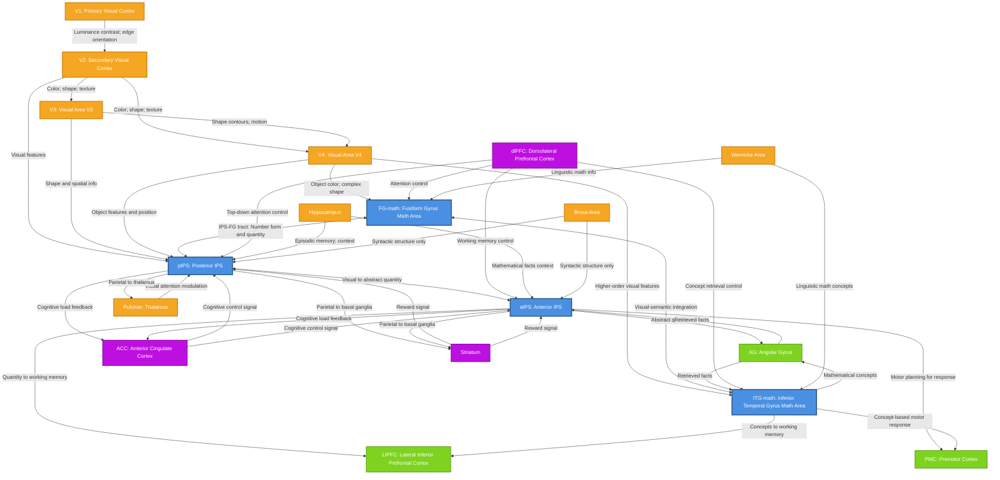

# HCD構造図（Mermaid形式）

## Mathematical Knowledge HCD

以下は、本HCDの構造を示すMermaid形式の有向グラフです。UCをノード、Connectionをエッジとして表現しています。



## 凡例

### ノードの色分け

- **青色（ROI内）**: pIPS, aIPS, FG-math, ITG-math
  - 数学的知識の中核的な表象を担うROI内のUniform Circuit

- **オレンジ色（ROI外・入力）**: V1, V2, V3, V4, Pulvinar, Hippocampus, Broca, Wernicke
  - ROI外からの入力を提供するUniform Circuit

- **緑色（ROI外・出力）**: AG, LIPFC, PMC
  - ROI内の処理結果を受け取り、さらなる処理を行うUniform Circuit

- **紫色（ROI外・入出力）**: dlPFC, ACC, Striatum
  - ROI内と双方向に情報をやり取りするUniform Circuit

### 主要な接続経路

1. **視覚入力経路**: V1 → V2 → V3/V4 → FG-math, ITG-math, pIPS
2. **IPS-FG白質路**: pIPS ↔ FG-math（双方向の直接接続）
3. **腹側側頭皮質内統合**: FG-math ↔ ITG-math
4. **IPS内階層処理**: pIPS ↔ aIPS
5. **事実検索経路**: ITG-math → AG, aIPS → AG
6. **作業記憶転送**: aIPS → LIPFC, ITG-math → LIPFC
7. **トップダウン制御**: dlPFC → pIPS, aIPS, FG-math, ITG-math
8. **認知制御**: ACC ↔ pIPS, aIPS

## グラフの読み方

- **矢印の向き**: 情報の流れる方向を示します
- **双方向矢印（↔）**: 相互作用とフィードバックを示します
- **エッジのラベル**: 伝達される情報の内容や性質を簡潔に記述しています

## 重要な情報フローの例

### 例1: 視覚的数学情報の処理
```
V1 → V2 → V4 → FG-math → pIPS → aIPS → AG → LIPFC
```
視覚入力から抽象的知識の検索、そして作業記憶への転送までの完全な経路。

### 例2: 数字形態と数量の統合
```
V4 → FG-math ↔ pIPS ↔ aIPS
```
FG-mathとpIPSの双方向接続（IPS-FG白質路）により、数字の視覚的形態と数量表象が統合される。

### 例3: 概念的知識の検索
```
V4 → FG-math ↔ ITG-math → AG
```
視覚的数学情報から概念的意味へ、そして事実検索へ。

### 例4: トップダウン制御による情報選択
```
dlPFC → pIPS, aIPS, FG-math, ITG-math
ACC → pIPS, aIPS
```
前頭前野からの制御信号により、注意が選択的に配分され、関連情報が活性化される。
