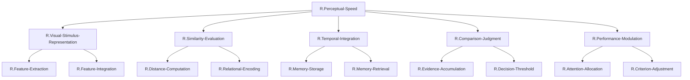

# FRG初期分解結果: Perceptual Speedの機能分解

## TLF（Top Level Function）

**R.Perceptual-Speed**: 文字、数字、物体、図柄、パターンの集合間の類似性と相違点を迅速かつ正確に比較する能力。比較される対象は同時に提示される場合もあれば、一つずつ順番に提示される場合もある。この能力には、提示された物体と記憶された物体を比較することも含まれる。

## 機能分解の方針

Perceptual Speed機能を実現するためには、以下の主要な部分機能が必要である：

1. **視覚情報の取得と表現**: 比較対象となる視覚刺激を認識し、内部表現を構築する
2. **類似性の評価**: 視覚刺激間の類似性/相違性を定量化する
3. **記憶との統合**: 順次提示される場合、記憶された刺激と現在の刺激を比較する
4. **決定の形成**: 類似/相違の判断を下す
5. **速度と正確性の制御**: タスク要求に応じて処理速度と正確性を調整する

これらの部分機能を階層的に分解し、最終的にUC（Visual-Input-Integration, Pattern-Comparison, Working-Memory-Maintenance, Comparison-Decision）と紐づける。

## 階層的機能分解表

| 階層レベル | ノード名 | 機能説明 |
| ---------- | -------- | -------- |
| 1（TLF） | `R.Perceptual-Speed` | 視覚刺激間の類似性と相違点を迅速かつ正確に比較する |
| 2 | `R.Visual-Stimulus-Representation` | 比較対象となる視覚刺激の内部表現を構築する |
| 2 | `R.Similarity-Evaluation` | 視覚刺激間の類似性/相違性を評価する |
| 2 | `R.Temporal-Integration` | 時間的に分離した刺激を統合して比較する |
| 2 | `R.Comparison-Judgment` | 類似/相違の最終判断を下す |
| 2 | `R.Performance-Modulation` | 速度と正確性のトレードオフを調整する |
| 3 | `R.Feature-Extraction` | 視覚刺激から比較に必要な特徴を抽出する |
| 3 | `R.Feature-Integration` | 抽出された特徴を統合して統一的表現を作る |
| 3 | `R.Distance-Computation` | 視覚表現間の距離（類似性）を計算する |
| 3 | `R.Relational-Encoding` | 刺激間の関係性を符号化する |
| 3 | `R.Memory-Storage` | 視覚刺激を短期記憶に保存する |
| 3 | `R.Memory-Retrieval` | 記憶された刺激を想起する |
| 3 | `R.Evidence-Accumulation` | 類似性に関する証拠を時間的に蓄積する |
| 3 | `R.Decision-Threshold` | 決定を下す閾値を設定・調整する |
| 3 | `R.Attention-Allocation` | タスク関連特徴への注意を配分する |
| 3 | `R.Criterion-Adjustment` | 決定基準を調整する |

## Mermaid図（初期分解）

## ノードの詳細説明

### 第2階層ノード

#### `R.Visual-Stimulus-Representation`（視覚刺激表現）
比較対象となる視覚刺激（文字、数字、物体など）を認識し、脳内で処理可能な内部表現を構築する。低次視覚特徴（エッジ、方位）から高次カテゴリー表現（「Aという文字」）まで、多層的な特徴を統合する。

#### `R.Similarity-Evaluation`（類似性評価）
構築された視覚表現間の類似性/相違性を定量的に評価する。距離計算や関係性符号化を通じて、「どれくらい似ているか」を定量化する。

#### `R.Temporal-Integration`（時間的統合）
順次提示される刺激を扱う場合、過去に提示された刺激を記憶に保存し、現在の刺激と統合する。短期記憶の維持と想起を含む。

#### `R.Comparison-Judgment`（比較判断）
類似性評価の結果を基に、「同じ」か「違う」かの最終判断を下す。証拠蓄積と閾値判定を通じて、二値的決定を形成する。

#### `R.Performance-Modulation`（パフォーマンス調整）
タスク要求に応じて、処理の速度と正確性をバランスさせる。注意配分と決定基準の調整を通じて、パフォーマンスを最適化する。

### 第3階層ノード

#### `R.Feature-Extraction`（特徴抽出）
視覚刺激から、比較に必要な特徴（形状、色、サイズ、配置など）を抽出する。初期視覚処理と対応。

#### `R.Feature-Integration`（特徴統合）
抽出された多様な特徴を統合し、単一の統一的表現を作る。階層的統合と注意による重み付けを含む。

#### `R.Distance-Computation`（距離計算）
視覚表現を高次元空間内の点として扱い、点間の距離を計算する。類似性の定量的指標を提供する。

#### `R.Relational-Encoding`（関係性符号化）
個々の刺激の絶対的特徴ではなく、刺激間の関係性（類似性距離行列）を符号化する。効率的な比較処理を実現する。

#### `R.Memory-Storage`（記憶保存）
視覚刺激の表現を短期記憶に保存する。リカレント神経回路による持続的活動として実装される。

#### `R.Memory-Retrieval`（記憶想起）
記憶された視覚刺激を想起し、現在の視覚入力と比較可能な状態にする。

#### `R.Evidence-Accumulation`（証拠蓄積）
類似性に関する情報を時間的に蓄積する。ドリフト拡散プロセスとして実装される。

#### `R.Decision-Threshold`（決定閾値）
決定を下すための閾値を設定・調整する。速度-正確性トレードオフの主要な制御パラメータ。

#### `R.Attention-Allocation`（注意配分）
タスク関連特徴（例: 3番目の文字）への注意を配分し、処理リソースを最適化する。

#### `R.Criterion-Adjustment`（基準調整）
決定基準を動的に調整し、タスク要求（「速く」vs「正確に」）に適応する。

## 次のステップ

ステップ2では、この初期分解結果を分析し、冗長性を削減してノードをマージする。特に、機能が重複しているGNや、統合可能なGNを特定し、最適化されたFRG構造を構築する。
