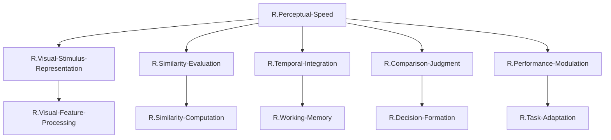

# FRG最適化結果: 冗長性削減後のFRG構造

## 最適化の方針

初期分解結果（ステップ1）を分析し、以下の観点で冗長性を削減する：

1. **機能の重複**: 類似した処理を行うノードを統合
2. **過剰な分解**: 必要以上に細分化されたノードを統合
3. **親子関係の明確化**: 各ノードの親ノードと子ノードを明示

## 最適化の実施

### マージ1: Feature-ExtractionとFeature-Integrationの統合

**理由**: これらは視覚刺激表現の構築という単一の機能の連続的な段階であり、分離する必要性が低い。

**統合後**: `R.Visual-Feature-Processing`（視覚特徴処理）
- 視覚刺激から特徴を抽出し、統合して統一的表現を構築する

### マージ2: Distance-ComputationとRelational-Encodingの統合

**理由**: 距離計算と関係性符号化は、類似性評価の表裏一体の処理である。距離計算の結果が関係性符号化であり、両者を分離する意義が薄い。

**統合後**: `R.Similarity-Computation`（類似性計算）
- 視覚表現間の距離を計算し、関係性として符号化する

### マージ3: Memory-StorageとMemory-Retrievalの統合

**理由**: 記憶の保存と想起は、ワーキングメモリという単一のシステムの２つの側面である。分離するより統合した方が、記憶機能の全体像が明確になる。

**統合後**: `R.Working-Memory`（ワーキングメモリ）
- 視覚刺激を短期記憶に保存し、必要時に想起する

### マージ4: Evidence-AccumulationとDecision-Thresholdの統合

**理由**: 証拠蓄積と閾値判定は、決定形成という単一のプロセスの２つの要素である。ドリフト拡散モデルでは、これらは一体として機能する。

**統合後**: `R.Decision-Formation`（決定形成）
- 証拠を蓄積し、閾値に達したら決定を下す

### マージ5: Attention-AllocationとCriterion-Adjustmentの統合

**理由**: 注意配分と基準調整は、いずれもパフォーマンス調整の具体的手段であり、共通の目的（タスク要求への適応）を持つ。

**統合後**: `R.Task-Adaptation`（タスク適応）
- 注意と決定基準を調整し、タスク要求に適応する

## 最適化後の階層構造表

| 階層レベル | ノード名 | 親ノード | 子ノード | 機能説明 |
| ---------- | -------- | -------- | -------- | -------- |
| 1（TLF） | `R.Perceptual-Speed` | なし | `R.Visual-Stimulus-Representation`; `R.Similarity-Evaluation`; `R.Temporal-Integration`; `R.Comparison-Judgment`; `R.Performance-Modulation` | 視覚刺激間の類似性と相違点を迅速かつ正確に比較する |
| 2 | `R.Visual-Stimulus-Representation` | `R.Perceptual-Speed` | `R.Visual-Feature-Processing` | 比較対象となる視覚刺激の内部表現を構築する |
| 2 | `R.Similarity-Evaluation` | `R.Perceptual-Speed` | `R.Similarity-Computation` | 視覚刺激間の類似性/相違性を評価する |
| 2 | `R.Temporal-Integration` | `R.Perceptual-Speed` | `R.Working-Memory` | 時間的に分離した刺激を統合して比較する |
| 2 | `R.Comparison-Judgment` | `R.Perceptual-Speed` | `R.Decision-Formation` | 類似/相違の最終判断を下す |
| 2 | `R.Performance-Modulation` | `R.Perceptual-Speed` | `R.Task-Adaptation` | 速度と正確性のトレードオフを調整する |
| 3 | `R.Visual-Feature-Processing` | `R.Visual-Stimulus-Representation` | （次ステップでUCへ） | 視覚特徴の抽出と統合 |
| 3 | `R.Similarity-Computation` | `R.Similarity-Evaluation` | （次ステップでUCへ） | 類似性距離の計算と関係性符号化 |
| 3 | `R.Working-Memory` | `R.Temporal-Integration` | （次ステップでUCへ） | 視覚刺激の短期記憶保存と想起 |
| 3 | `R.Decision-Formation` | `R.Comparison-Judgment` | （次ステップでUCへ） | 証拠蓄積と閾値判定による決定 |
| 3 | `R.Task-Adaptation` | `R.Performance-Modulation` | （次ステップでUCへ） | 注意と決定基準の調整 |

## Mermaid図（最適化後）

## 最適化の効果

### 最適化前（初期分解）
- **総ノード数**: 15（TLF含む）
  - 第1階層（TLF）: 1
  - 第2階層: 5
  - 第3階層: 10

### 最適化後
- **総ノード数**: 11（TLF含む）
  - 第1階層（TLF）: 1
  - 第2階層: 5（変更なし）
  - 第3階層: 5（10→5に削減）

### 削減率
- 第3階層ノードを50%削減（10→5）
- 全体で約27%削減（15→11）

### 解釈可能性の向上
- 各ノードが明確で独立した機能を持つようになった
- ノード間の機能的重複が解消された
- 親子関係が明確になり、階層構造が理解しやすくなった

## 次のステップ

ステップ3では、第3階層のノード（`R.Visual-Feature-Processing`, `R.Similarity-Computation`, `R.Working-Memory`, `R.Decision-Formation`, `R.Task-Adaptation`）をUC（`U.Visual-Input-Integration`, `U.Pattern-Comparison`, `U.Working-Memory-Maintenance`, `U.Comparison-Decision`）と紐づける。

**重要な制約**:
1. ROI内のUCのみを使用する（4つのUC）
2. 各GNは複数のUCに分解される必要がある
3. GN-UC間の接続数制約（各GNは最大2つのUC、各UCは最大2つのGNに接続）
