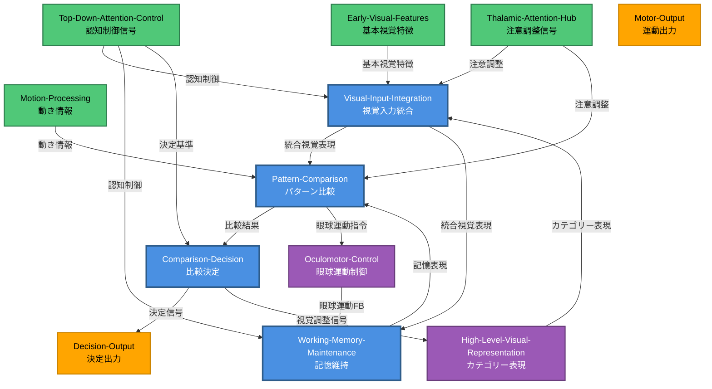

# HCD構造図（Mermaid形式）

以下は、Perceptual Speed機能を実現するHCDの構造を可視化したMermaid図です。draw.ioへの変換が可能です。

## 凡例
- **青色（#4A90E2）**: ROI内UC
- **緑色（#50C878）**: ROI外入力UC
- **オレンジ色（#FFA500）**: ROI外出力UC
- **紫色（#9B59B6）**: ROI外双方向UC

## Mermaid図

## 凡例の説明

| 色 | 分類 | 説明 |
| -- | ---- | ---- |
| 青色 | ROI内UC | 頭頂間溝（IPS）内の情報処理ユニット |
| 緑色 | ROI外入力UC | IPSへ情報を送る外部領域 |
| オレンジ色 | ROI外出力UC | IPSから情報を受け取る外部領域 |
| 紫色 | ROI外双方向UC | IPSと双方向接続を持つ外部領域 |

## ノードの詳細

### ROI内UC（青色）

1. **Visual-Input-Integration（視覚入力統合）**
   - 位置: 後部IPS（IPS1-2）
   - 機能: 多層的視覚情報の統合

2. **Pattern-Comparison（パターン比較）**
   - 位置: LIP（外側頭頂間領域）
   - 機能: 視覚パターン間の類似性計算

3. **Working-Memory-Maintenance（記憶維持）**
   - 位置: LIPd（背側LIP）
   - 機能: 視覚刺激の短期記憶維持

4. **Comparison-Decision（比較決定）**
   - 位置: 前部IPS（IPS3-4, hIP1-3）
   - 機能: 類似/相違の二値決定

### ROI外UC

**入力UC（緑色）**:
- **Early-Visual-Features**: 基本視覚特徴（V1/V2）
- **Motion-Processing**: 動き情報（MT/MST）
- **Thalamic-Attention-Hub**: 注意調整（Pulvinar）
- **Top-Down-Attention-Control**: 認知制御（dlPFC, Insula）

**出力UC（オレンジ色）**:
- **Decision-Output**: 決定出力（dlPFC）
- **Motor-Output**: 運動出力（Premotor Cortex）

**双方向UC（紫色）**:
- **High-Level-Visual-Representation**: カテゴリー表現（Fusiform Gyrus）
- **Oculomotor-Control**: 眼球運動制御（FEF）

## エッジの詳細（主要な情報フロー）

1. **視覚入力経路**:
   - 基本視覚特徴 → Visual-Input-Integration
   - カテゴリー表現 → Visual-Input-Integration

2. **ROI内処理経路**:
   - Visual-Input-Integration → Pattern-Comparison → Comparison-Decision
   - Visual-Input-Integration → Working-Memory-Maintenance → Pattern-Comparison

3. **出力経路**:
   - Comparison-Decision → Decision-Output
   - Pattern-Comparison → Oculomotor-Control

4. **フィードバック経路**:
   - Oculomotor-Control → Working-Memory-Maintenance（眼球運動フィードバック）
   - Comparison-Decision → High-Level-Visual-Representation（視覚調整）

## 図の使用方法

この Mermaid コードは、以下の方法で可視化できます：

1. **オンラインエディタ**: [Mermaid Live Editor](https://mermaid.live/) にコードを貼り付け
2. **draw.io**: draw.ioのMermaidプラグインを使用
3. **Markdown対応エディタ**: VSCode, Notion, GitHub などで直接レンダリング
4. **画像として出力**: Mermaid CLIを使用してPNG/SVG形式で出力

## 注記

- 改行タグ（` `）は使用していますが、中黒（・）は使用していません
- すべてのUC名とOutput Semanticsが含まれています
- ROI内/外の色分けにより、情報処理の境界が明確になっています
- エッジにはOutput Semanticsの簡略版を記載し、情報フローの内容が理解しやすくなっています
