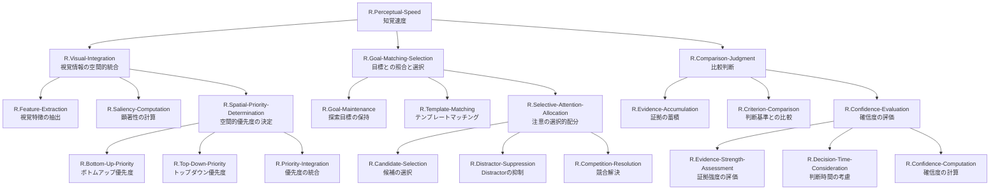

# ステップ1: TLFの段階的分解とGN作成

## TLFの定義
**TLF**: R.Perceptual-Speed
**定義**: An intermediate-stratum ability that can be defined as the speed and fluency with which similarities or differences in visual stimuli (e.g., letters, numbers, patterns, etc.) can be searched and compared in an extended visual field.

広範な視野内で視覚刺激（文字、数字、パターンなど）の類似点や相違点を素早く流暢に探索・比較する中間層の認知能力。

## 分解の方針

知覚速度を実現するために必要な部分機能を階層的に分解します。この段階では神経実体（UC）との対応は考慮せず、純粋に機能の論理的分解に集中します。

### 第1層分解：TLFから主要な部分機能へ

知覚速度は以下の主要な部分機能に分解できます：

1. **視覚情報の空間的統合**: 広範な視野全体から視覚情報を統合し、探索可能な表現を構築する
2. **目標との照合と選択**: 探索目標と視覚情報を照合し、候補を選択する
3. **比較判断**: 選択された候補が目標と一致するかを判断する

### 第2層分解：各主要機能のさらなる分解

#### 1. 視覚情報の空間的統合 → より詳細な部分機能

- **1a. 視覚特徴の抽出と表現**: 基本的な視覚特徴（方位、色、形態、運動）を抽出
- **1b. 顕著性の計算**: 視覚的に目立つ（顕著な）場所を自動的に検出
- **1c. 空間的優先度の決定**: 探索目標を考慮して、視野のどの位置を優先すべきかを決定

#### 2. 目標との照合と選択 → より詳細な部分機能

- **2a. 探索目標の保持**: 何を探すべきかの情報を維持
- **2b. テンプレートマッチング**: 視覚情報と探索目標の類似度を計算
- **2c. 注意の選択的配分**: 目標に一致しそうな候補に注意を集中し、不一致な刺激を抑制

#### 3. 比較判断 → より詳細な部分機能

- **3a. 証拠の蓄積**: 「目標が見つかった」という証拠を時間的に統合
- **3b. 判断基準との比較**: 蓄積された証拠が判断に十分かを評価
- **3c. 確信度の評価**: 判断の信頼性を評価

### 第3層分解：さらに細かい機能への展開

一部の機能はさらに分解可能です：

#### 1c. 空間的優先度の決定 → 詳細化

- **1c-i. ボトムアップ優先度**: 視覚的顕著性に基づく自動的な優先度
- **1c-ii. トップダウン優先度**: 探索目標に基づく意図的な優先度
- **1c-iii. 優先度の統合**: ボトムアップとトップダウンを統合

#### 2c. 注意の選択的配分 → 詳細化

- **2c-i. 候補の選択**: 一致度が高い候補を選択
- **2c-ii. Distractorの抑制**: 一致度が低い刺激を抑制
- **2c-iii. 選択の競合解決**: 複数候補間の競合を解決

#### 3c. 確信度の評価 → 詳細化

- **3c-i. 証拠強度の評価**: 証拠の明確さを評価
- **3c-ii. 判断時間の考慮**: 判断の速さを確信度に反映
- **3c-iii. 確信度の計算**: 最終的な確信度を算出

## 階層的分解の表形式まとめ

| 階層レベル | ノード名 | 機能説明 | 親ノード |
|-----------|---------|---------|---------|
| 0 | R.Perceptual-Speed | 広範な視野内で視覚刺激の類似点・相違点を素早く流暢に探索・比較する能力 | - |
| 1 | R.Visual-Integration | 広範な視野全体から視覚情報を統合し、探索可能な表現を構築 | R.Perceptual-Speed |
| 1 | R.Goal-Matching-Selection | 探索目標と視覚情報を照合し、候補を選択 | R.Perceptual-Speed |
| 1 | R.Comparison-Judgment | 選択された候補が目標と一致するかを判断 | R.Perceptual-Speed |
| 2 | R.Feature-Extraction | 基本的な視覚特徴（方位、色、形態、運動）を抽出 | R.Visual-Integration |
| 2 | R.Saliency-Computation | 視覚的に目立つ場所を自動的に検出 | R.Visual-Integration |
| 2 | R.Spatial-Priority-Determination | 探索目標を考慮して視野の優先位置を決定 | R.Visual-Integration |
| 2 | R.Goal-Maintenance | 何を探すべきかの情報を維持 | R.Goal-Matching-Selection |
| 2 | R.Template-Matching | 視覚情報と探索目標の類似度を計算 | R.Goal-Matching-Selection |
| 2 | R.Selective-Attention-Allocation | 目標に一致しそうな候補に注意を集中し、不一致な刺激を抑制 | R.Goal-Matching-Selection |
| 2 | R.Evidence-Accumulation | 「目標が見つかった」という証拠を時間的に統合 | R.Comparison-Judgment |
| 2 | R.Criterion-Comparison | 蓄積された証拠が判断に十分かを評価 | R.Comparison-Judgment |
| 2 | R.Confidence-Evaluation | 判断の信頼性を評価 | R.Comparison-Judgment |
| 3 | R.Bottom-Up-Priority | 視覚的顕著性に基づく自動的な優先度計算 | R.Spatial-Priority-Determination |
| 3 | R.Top-Down-Priority | 探索目標に基づく意図的な優先度計算 | R.Spatial-Priority-Determination |
| 3 | R.Priority-Integration | ボトムアップとトップダウン優先度を統合 | R.Spatial-Priority-Determination |
| 3 | R.Candidate-Selection | 一致度が高い候補を選択 | R.Selective-Attention-Allocation |
| 3 | R.Distractor-Suppression | 一致度が低い刺激を抑制 | R.Selective-Attention-Allocation |
| 3 | R.Competition-Resolution | 複数候補間の競合を解決 | R.Selective-Attention-Allocation |
| 3 | R.Evidence-Strength-Assessment | 証拠の明確さを評価 | R.Confidence-Evaluation |
| 3 | R.Decision-Time-Consideration | 判断の速さを確信度に反映 | R.Confidence-Evaluation |
| 3 | R.Confidence-Computation | 最終的な確信度を算出 | R.Confidence-Evaluation |

## 階層構造のMermaidグラフ

## 分解の妥当性確認

### 各親ノードが子ノードで十分に実現されるか

#### R.Perceptual-Speed
- 子: R.Visual-Integration + R.Goal-Matching-Selection + R.Comparison-Judgment
- 評価: ✓ 視覚統合→照合選択→判断という流れで知覚速度が実現される

#### R.Visual-Integration
- 子: R.Feature-Extraction + R.Saliency-Computation + R.Spatial-Priority-Determination
- 評価: ✓ 特徴抽出→顕著性→優先度という流れで視覚統合が実現される

#### R.Goal-Matching-Selection
- 子: R.Goal-Maintenance + R.Template-Matching + R.Selective-Attention-Allocation
- 評価: ✓ 目標保持→照合→選択という流れで目標との照合選択が実現される

#### R.Comparison-Judgment
- 子: R.Evidence-Accumulation + R.Criterion-Comparison + R.Confidence-Evaluation
- 評価: ✓ 証拠蓄積→基準比較→確信度評価という流れで判断が実現される

#### R.Spatial-Priority-Determination
- 子: R.Bottom-Up-Priority + R.Top-Down-Priority + R.Priority-Integration
- 評価: ✓ ボトムアップとトップダウンを統合して優先度が決定される

#### R.Selective-Attention-Allocation
- 子: R.Candidate-Selection + R.Distractor-Suppression + R.Competition-Resolution
- 評価: ✓ 選択と抑制と競合解決で注意配分が実現される

#### R.Confidence-Evaluation
- 子: R.Evidence-Strength-Assessment + R.Decision-Time-Consideration + R.Confidence-Computation
- 評価: ✓ 証拠強度と時間を考慮して確信度が計算される

### リーフノードの特定

以下のノードはさらなる分解が不要と判断されるリーフノードです：
- R.Feature-Extraction
- R.Saliency-Computation
- R.Goal-Maintenance
- R.Template-Matching
- R.Evidence-Accumulation
- R.Criterion-Comparison
- R.Bottom-Up-Priority
- R.Top-Down-Priority
- R.Priority-Integration
- R.Candidate-Selection
- R.Distractor-Suppression
- R.Competition-Resolution
- R.Evidence-Strength-Assessment
- R.Decision-Time-Consideration
- R.Confidence-Computation

これらのリーフノードは、次のステップでUCと紐づけられる候補となります。

## 分解の理論的根拠

この分解は、以下の計算論的・神経科学的枠組みに基づいています：

1. **Priority Map理論（Bisley & Goldberg, 2010）**: R.Visual-Integration → R.Spatial-Priority-Determination
2. **Guided Search 6.0（Wolfe, 2021）**: R.Goal-Matching-Selection の構造
3. **Drift Diffusion Model（Ratcliff & McKoon, 2008）**: R.Comparison-Judgment → R.Evidence-Accumulation
4. **注意の特徴統合理論（Treisman & Gelade, 1980）**: R.Feature-Extraction と R.Selective-Attention-Allocation
5. **ベイズ的確信度（Sanders et al., 2016）**: R.Confidence-Evaluation

この機能分解により、知覚速度という複雑な認知能力が、階層的に組織された部分機能の組み合わせとして理解できます。
