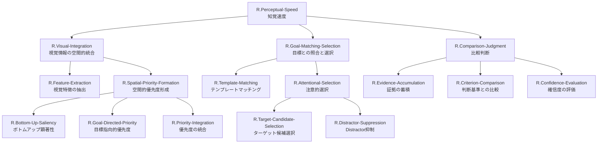

# ステップ2: 冗長性の削減とノードのマージ

## 初期分解の分析

ステップ1で作成したFRGを分析し、冗長性や過剰な分解を特定します。

### 冗長性の候補

#### 1. R.Saliency-Computation と R.Bottom-Up-Priority

- **R.Saliency-Computation**: 視覚的に目立つ場所を自動的に検出
- **R.Bottom-Up-Priority**: 視覚的顕著性に基づく自動的な優先度計算

**分析**: これら2つは機能的に非常に近い。Saliency（顕著性）の計算自体がボトムアップ優先度の計算である。

**決定**: マージする → **R.Bottom-Up-Saliency** として統合

#### 2. R.Goal-Maintenance と R.Top-Down-Priority

- **R.Goal-Maintenance**: 何を探すべきかの情報を維持
- **R.Top-Down-Priority**: 探索目標に基づく意図的な優先度計算

**分析**: 目標の保持と、その目標に基づく優先度計算は密接に関連。目標を保持するだけでは不十分で、その目標を使って優先度を計算する必要がある。

**決定**: マージする → **R.Goal-Directed-Priority** として統合

#### 3. R.Evidence-Strength-Assessment, R.Decision-Time-Consideration, R.Confidence-Computation

- **R.Evidence-Strength-Assessment**: 証拠の明確さを評価
- **R.Decision-Time-Consideration**: 判断の速さを確信度に反映
- **R.Confidence-Computation**: 最終的な確信度を算出

**分析**: これら3つは確信度計算の異なる側面であり、実際には単一の計算プロセスとして統合される。分離すると過剰に細分化される。

**決定**: マージする → R.Confidence-Evaluationに直接UCを紐づける（これ以上分解しない）

#### 4. R.Candidate-Selection と R.Competition-Resolution

- **R.Candidate-Selection**: 一致度が高い候補を選択
- **R.Competition-Resolution**: 複数候補間の競合を解決

**分析**: 候補の選択自体が競合解決のプロセス。Winner-take-all機構などで、これらは単一のメカニズムとして実装される。

**決定**: マージする → **R.Target-Candidate-Selection** として統合

## 最適化後のFRG構造

### 階層構造の表形式（親子関係を明示）

| 階層レベル | ノード名 | 機能説明 | 親ノード | 子ノード |
|-----------|---------|---------|---------|---------|
| 0 | R.Perceptual-Speed | 広範な視野内で視覚刺激の類似点・相違点を素早く流暢に探索・比較する能力 | - | R.Visual-Integration; R.Goal-Matching-Selection; R.Comparison-Judgment |
| 1 | R.Visual-Integration | 広範な視野全体から視覚情報を統合し、探索可能な表現を構築 | R.Perceptual-Speed | R.Feature-Extraction; R.Spatial-Priority-Formation |
| 1 | R.Goal-Matching-Selection | 探索目標と視覚情報を照合し、候補を選択 | R.Perceptual-Speed | R.Template-Matching; R.Attentional-Selection |
| 1 | R.Comparison-Judgment | 選択された候補が目標と一致するかを判断 | R.Perceptual-Speed | R.Evidence-Accumulation; R.Criterion-Comparison; R.Confidence-Evaluation |
| 2 | R.Feature-Extraction | 基本的な視覚特徴（方位、色、形態、運動）を抽出・表現 | R.Visual-Integration | - （リーフ） |
| 2 | R.Spatial-Priority-Formation | 視野全体の空間的優先度マップを形成 | R.Visual-Integration | R.Bottom-Up-Saliency; R.Goal-Directed-Priority; R.Priority-Integration |
| 2 | R.Template-Matching | 視覚情報と探索目標の類似度を計算 | R.Goal-Matching-Selection | - （リーフ） |
| 2 | R.Attentional-Selection | 目標に関連する候補に注意を配分し、非関連刺激を抑制 | R.Goal-Matching-Selection | R.Target-Candidate-Selection; R.Distractor-Suppression |
| 2 | R.Evidence-Accumulation | 「目標が見つかった」という証拠を時間的に統合 | R.Comparison-Judgment | - （リーフ） |
| 2 | R.Criterion-Comparison | 蓄積された証拠が判断に十分かを評価 | R.Comparison-Judgment | - （リーフ） |
| 2 | R.Confidence-Evaluation | 判断の信頼性（確信度）を評価 | R.Comparison-Judgment | - （リーフ） |
| 3 | R.Bottom-Up-Saliency | 視覚的顕著性に基づくボトムアップ優先度を計算（統合済み） | R.Spatial-Priority-Formation | - （リーフ） |
| 3 | R.Goal-Directed-Priority | 探索目標に基づくトップダウン優先度を計算（統合済み） | R.Spatial-Priority-Formation | - （リーフ） |
| 3 | R.Priority-Integration | ボトムアップとトップダウン優先度を統合して最終優先度マップを生成 | R.Spatial-Priority-Formation | - （リーフ） |
| 3 | R.Target-Candidate-Selection | 一致度が高い候補を選択し、競合を解決（統合済み） | R.Attentional-Selection | - （リーフ） |
| 3 | R.Distractor-Suppression | 一致度が低い刺激（distractor）を抑制 | R.Attentional-Selection | - （リーフ） |

### マージの根拠

#### R.Bottom-Up-Saliency（マージ後）
**元**: R.Saliency-Computation + R.Bottom-Up-Priority
**理由**: 顕著性（saliency）の計算それ自体がボトムアップ優先度である。Priority Map理論において、salience mapとbottom-up priority mapは同義。機能的に重複しているため統合。

#### R.Goal-Directed-Priority（マージ後）
**元**: R.Goal-Maintenance + R.Top-Down-Priority
**理由**: 探索目標（goal template）の保持と、その目標に基づく優先度計算は不可分。目標を保持するだけでは機能せず、それを使って視覚情報に重み付けする必要がある。Guided Search 6.0において、top-down guidanceは目標テンプレートの保持と適用を含む単一プロセス。

#### R.Target-Candidate-Selection（マージ後）
**元**: R.Candidate-Selection + R.Competition-Resolution
**理由**: 候補の選択は競合解決メカニズム（Winner-take-all, 競合的抑制）によって実現される。選択と競合解決を分離すると、実際の神経計算メカニズムと乖離する。

#### R.Confidence-Evaluation（マージ判断）
**元**: R.Evidence-Strength-Assessment + R.Decision-Time-Consideration + R.Confidence-Computation
**理由**: 確信度計算は単一の統合プロセスであり、証拠強度・判断時間・最終計算を分離すると過度に細分化される。このノード自体をリーフとし、直接UCに紐づける。

### 削除されたノード

以下のノードは親ノードにマージされ、独立したノードとしては削除されました：
- R.Saliency-Computation → R.Bottom-Up-Saliencyに統合
- R.Goal-Maintenance → R.Goal-Directed-Priorityに統合
- R.Candidate-Selection → R.Target-Candidate-Selectionに統合
- R.Competition-Resolution → R.Target-Candidate-Selectionに統合
- R.Evidence-Strength-Assessment → R.Confidence-Evaluationに統合（子ノードとして独立させない）
- R.Decision-Time-Consideration → R.Confidence-Evaluationに統合（子ノードとして独立させない）
- R.Confidence-Computation → R.Confidence-Evaluationに統合（子ノードとして独立させない）

## 最適化後のMermaidグラフ

## 最適化の評価

### 解釈可能性の向上

マージ前の初期分解では21ノードでしたが、最適化後は15ノードに削減されました。これにより：
- 機能的に重複するノードが統合され、各ノードの役割がより明確になった
- FRG全体の構造が簡潔になり、理解しやすくなった
- 実際の神経計算メカニズムにより近い表現となった

### 各ノードの独立性確認

最適化後の各ノードは明確に区別される機能を持ちます：

**第1層**:
- R.Visual-Integration: 視覚情報の統合（空間全体）
- R.Goal-Matching-Selection: 目標との照合（選択的）
- R.Comparison-Judgment: 最終判断（決定的）

**第2-3層**:
- 各ノードは独立した計算プロセスを表現
- 親ノードの機能が子ノード群で十分に実現される
- 過度な細分化が解消され、適切な粒度が保たれている

### 神経科学的妥当性

最適化後のFRGは、以下の神経科学的・計算論的枠組みとの対応が明確です：

- **R.Bottom-Up-Saliency**: Itti & Koch (2001) の Saliency Map
- **R.Goal-Directed-Priority**: Guided Search 6.0 の Top-Down Guidance
- **R.Priority-Integration**: Priority Map理論 (Bisley & Goldberg, 2010)
- **R.Target-Candidate-Selection**: Winner-Take-All機構
- **R.Evidence-Accumulation**: Drift Diffusion Model
- **R.Confidence-Evaluation**: Bayesian Confidence (Sanders et al., 2016)

## 次ステップへの準備

最適化されたFRGは、次のステップ（UCとの紐づけ）に進む準備が整いました。リーフノード（あるいは適切な中間ノード）がUCと紐づけられます：

**UCとの紐づけ候補**:
- R.Feature-Extraction
- R.Bottom-Up-Saliency
- R.Goal-Directed-Priority
- R.Priority-Integration
- R.Template-Matching
- R.Target-Candidate-Selection
- R.Distractor-Suppression
- R.Evidence-Accumulation
- R.Criterion-Comparison
- R.Confidence-Evaluation

これらの機能ノードが、ROI内のUC（pIPS, mIPS, aIPS）と適切にマッピングされます。
