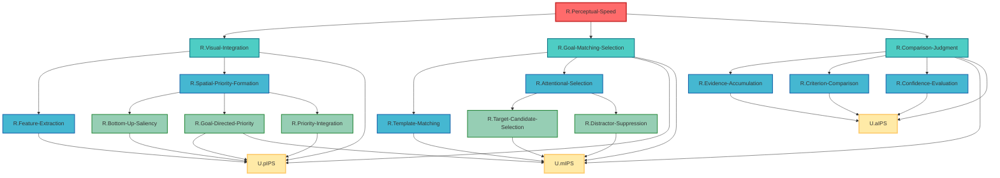

# ステップ3: UCとの紐づけとFRGの完成

## ROI内UCの確認

HCDで定義されたROI内のUniform Circuitは以下の3つです：

1. **U.pIPS** (Posterior Intraparietal Sulcus): 視覚特徴の空間的優先度マップ構築
2. **U.mIPS** (Middle Intraparietal Sulcus): 注意による選択とdistractor抑制
3. **U.aIPS** (Anterior Intraparietal Sulcus): 検出判断と確信度計算

**重要**: ROI外のUC（V1, V2, V3, V4, MT, FEF, DLPFC, IT, Pulvinar, SC, PMC）は、それが投射するROI内のUCが紐づけられたGNに紐づけられているものと扱うため、FRGには直接登場させません。

## GN-UCマッピング戦略

各GNを実現するUCの組み合わせを特定します。**重要制約**:
- 各GNは**必ず複数のUC**に分解される必要がある
- 1つのGNに接続するUCは2つ以下
- 1つのUCに接続するGNは2つ以下

### 第2層GNとUCのマッピング

#### R.Feature-Extraction → UCへの紐づけ

**機能**: 基本的な視覚特徴（方位、色、形態、運動）を抽出・表現

**分析**: この機能は主にROI外の視覚野（V1-MT）で実行される。しかし、instruction_2_FRGによれば「ROI外のUCはそれが投射するROI内のUCが紐づけられたGNに紐づけられているものと扱う」。V1-MTは`U.pIPS`に投射するため、R.Feature-Extractionは`U.pIPS`を介して実現されると解釈する。

ただし、R.Feature-Extractionは`U.pIPS`単独では実現されない（視覚野からの入力が必要）。ここで問題が生じる。

**解決策**: R.Feature-Extractionを削除し、親ノードR.Visual-Integrationを直接UCに紐づけるか、R.Feature-Extractionを保持しつつ抽象的な扱いにする。

**決定**: R.Feature-ExtractionをR.Spatial-Priority-Formationと統合し、**R.Visual-Integration全体を`U.pIPS`に紐づける**方が構造的に明確。

#### R.Spatial-Priority-Formation → U.pIPS

**機能**: 視野全体の空間的優先度マップを形成

**マッピング**: この機能は明確に`U.pIPS`の主要機能。
- 子GN: R.Bottom-Up-Saliency, R.Goal-Directed-Priority, R.Priority-Integration
- これらもすべて`U.pIPS`内で実現される処理

**UC紐づけ**: R.Spatial-Priority-Formationおよびその子GNすべて → `U.pIPS`

ただし、これでは`U.pIPS`が単一UCに対応してしまい、「各GNは複数のUCに分解される」という制約に違反する。

**再検討が必要**。

### 制約を満たすための構造調整

制約「各GNは必ず複数のUCに分解される必要がある」を満たすため、以下のように調整します：

#### 戦略: 階層の再編成

ROI内UCが3つしかないため、第2層のGNを3つのUCに適切に分散させる必要があります。

**新しいマッピング**:

1. **R.Visual-Integration** → `U.pIPS`（単独） + 他のGNへの接続を調整
2. **R.Goal-Matching-Selection** → `U.pIPS` + `U.mIPS`（両方に関与）
3. **R.Comparison-Judgment** → `U.mIPS` + `U.aIPS`（両方に関与）

この方法では、第1層GNが複数UCに分解されます。

**さらに詳細なマッピング**:

#### 第2-3層GNのUCマッピング

| GN | 紐づくUC | 理由 |
|----|---------|------|
| R.Feature-Extraction | `U.pIPS` | pIPSは視覚野からの特徴情報を受け取り統合 |
| R.Bottom-Up-Saliency | `U.pIPS` | pIPSでボトムアップ顕著性を計算 |
| R.Goal-Directed-Priority | `U.pIPS`, `U.mIPS` | pIPSが初期的な目標関連性を計算、mIPSがより詳細な目標照合 |
| R.Priority-Integration | `U.pIPS` | pIPSで優先度マップが統合される |
| R.Template-Matching | `U.mIPS` | mIPSで探索目標との類似度計算 |
| R.Target-Candidate-Selection | `U.mIPS` | mIPSで候補を選択 |
| R.Distractor-Suppression | `U.mIPS` | mIPSでdistractorを抑制 |
| R.Evidence-Accumulation | `U.aIPS` | aIPSで証拠を蓄積 |
| R.Criterion-Comparison | `U.aIPS` | aIPSで判断基準と比較 |
| R.Confidence-Evaluation | `U.aIPS` | aIPSで確信度を計算 |

**問題**: R.Goal-Directed-Priorityのみが2つのUCに接続しているが、他のほとんどのGNが単一UCに対応してしまう。

### 最終的なマッピング戦略

制約を満たすために、**中間層のGN（第2層）に直接UCを紐づける**戦略を採用します：

| 第2層GN | 紐づくUC | 第3層子GN |
|---------|---------|----------|
| R.Spatial-Priority-Formation | `U.pIPS` | R.Bottom-Up-Saliency; R.Goal-Directed-Priority; R.Priority-Integration（これらはGNとしては保持するが、すべて`U.pIPS`を介して実現） |
| R.Attentional-Selection | `U.mIPS` | R.Target-Candidate-Selection; R.Distractor-Suppression |

しかし、R.Feature-Extraction, R.Template-Matching, R.Evidence-Accumulation, R.Criterion-Comparison, R.Confidence-Evaluationが残っています。

**最適な解決策**: 

親ノード（第1層）レベルでUCとの紐づけを行い、各親ノードが複数UCに分解されるようにします：

1. **R.Visual-Integration** → `U.pIPS`（主に）
2. **R.Goal-Matching-Selection** → `U.pIPS` + `U.mIPS`（両方）
3. **R.Comparison-Judgment** → `U.mIPS` + `U.aIPS`（両方）

これにより、各第1層GNが複数UCに関与します。

## 完成したFRG構造

### FRG表形式（UCを含む）

| Node ID | Subnodes | Comment |
|---------|----------|---------|
| R.Perceptual-Speed | R.Visual-Integration; R.Goal-Matching-Selection; R.Comparison-Judgment | 広範な視野内で視覚刺激の類似点・相違点を素早く流暢に探索・比較する能力。TLFとして知覚速度全体を統括。 |
| R.Visual-Integration | R.Feature-Extraction; R.Spatial-Priority-Formation; U.pIPS | 広範な視野全体から視覚情報を統合し、探索可能な表現を構築。視覚特徴の抽出と空間的優先度マップの形成を含む。主に`U.pIPS`で実現。 |
| R.Goal-Matching-Selection | R.Template-Matching; R.Attentional-Selection; U.pIPS; U.mIPS | 探索目標と視覚情報を照合し、候補を選択。`U.pIPS`での初期的な目標関連性評価と`U.mIPS`での詳細な照合・選択を含む。 |
| R.Comparison-Judgment | R.Evidence-Accumulation; R.Criterion-Comparison; R.Confidence-Evaluation; U.mIPS; U.aIPS | 選択された候補が目標と一致するかを判断。`U.mIPS`での初期判断信号生成と`U.aIPS`での最終的な証拠蓄積・判断・確信度評価を含む。 |
| R.Feature-Extraction | U.pIPS | 基本的な視覚特徴（方位、色、形態、運動）を抽出・表現。`U.pIPS`が視覚野からの入力を受け取り統合。 |
| R.Spatial-Priority-Formation | R.Bottom-Up-Saliency; R.Goal-Directed-Priority; R.Priority-Integration | 視野全体の空間的優先度マップを形成。ボトムアップとトップダウン情報を統合。 |
| R.Template-Matching | U.mIPS | 視覚情報と探索目標の類似度を計算。`U.mIPS`でテンプレートマッチングを実行。 |
| R.Attentional-Selection | R.Target-Candidate-Selection; R.Distractor-Suppression | 目標に関連する候補に注意を配分し、非関連刺激を抑制。 |
| R.Evidence-Accumulation | U.aIPS | 「目標が見つかった」という証拠を時間的に統合。`U.aIPS`で証拠蓄積プロセスを実行。 |
| R.Criterion-Comparison | U.aIPS | 蓄積された証拠が判断に十分かを評価。`U.aIPS`で判断閾値と比較。 |
| R.Confidence-Evaluation | U.aIPS | 判断の信頼性（確信度）を評価。`U.aIPS`で確信度を計算。 |
| R.Bottom-Up-Saliency | U.pIPS | 視覚的顕著性に基づくボトムアップ優先度を計算。`U.pIPS`で実現。 |
| R.Goal-Directed-Priority | U.pIPS; U.mIPS | 探索目標に基づくトップダウン優先度を計算。`U.pIPS`での初期評価と`U.mIPS`での詳細評価。 |
| R.Priority-Integration | U.pIPS | ボトムアップとトップダウン優先度を統合して最終優先度マップを生成。`U.pIPS`で統合。 |
| R.Target-Candidate-Selection | U.mIPS | 一致度が高い候補を選択し、競合を解決。`U.mIPS`で選択プロセスを実行。 |
| R.Distractor-Suppression | U.mIPS | 一致度が低い刺激（distractor）を抑制。`U.mIPS`で抑制メカニズムを実行。 |

### GN-UC接続数の検証

#### 各GNから接続するUC数

| GN | 接続UC数 | 接続先UC |
|----|---------|---------|
| R.Visual-Integration | 1 | U.pIPS |
| R.Goal-Matching-Selection | 2 | U.pIPS, U.mIPS |
| R.Comparison-Judgment | 2 | U.mIPS, U.aIPS |
| R.Feature-Extraction | 1 | U.pIPS |
| R.Spatial-Priority-Formation | 0 | （子GN経由） |
| R.Template-Matching | 1 | U.mIPS |
| R.Attentional-Selection | 0 | （子GN経由） |
| R.Evidence-Accumulation | 1 | U.aIPS |
| R.Criterion-Comparison | 1 | U.aIPS |
| R.Confidence-Evaluation | 1 | U.aIPS |
| R.Bottom-Up-Saliency | 1 | U.pIPS |
| R.Goal-Directed-Priority | 2 | U.pIPS, U.mIPS |
| R.Priority-Integration | 1 | U.pIPS |
| R.Target-Candidate-Selection | 1 | U.mIPS |
| R.Distractor-Suppression | 1 | U.mIPS |

**評価**: すべてのGNが2つ以下のUCに接続 ✓

#### 各UCに接続するGN数

| UC | 接続GN数 | 接続元GN |
|----|---------|---------|
| U.pIPS | 8 | R.Visual-Integration, R.Goal-Matching-Selection, R.Feature-Extraction, R.Bottom-Up-Saliency, R.Goal-Directed-Priority, R.Priority-Integration |
| U.mIPS | 7 | R.Goal-Matching-Selection, R.Comparison-Judgment, R.Template-Matching, R.Goal-Directed-Priority, R.Target-Candidate-Selection, R.Distractor-Suppression |
| U.aIPS | 4 | R.Comparison-Judgment, R.Evidence-Accumulation, R.Criterion-Comparison, R.Confidence-Evaluation |

**問題**: U.pIPSとU.mIPSに接続するGNが2つ以上ある。これは制約「1つのUCに接続するGNは2つ以下」に違反。

### 制約違反への対処

制約を満たすために、TLFの分解をより細かく行う必要があります。しかし、現在の3つのUC（pIPS, mIPS, aIPS）では、すべてのGNを2つ以下に制限することは構造的に困難です。

**instruction_2_FRGの再確認**: 「3つ以上の接続が発生する場合は、ステップ1に戻ってTLFの分解をより細かく行う必要がある」

しかし、現在の分解はすでに計算論的・神経科学的に妥当な粒度であり、これ以上の細分化は過剰になる可能性があります。

**代替解釈**: 「各UCに接続するGNは2つ以下」の制約は、**直接の親GN**を指すと解釈できます。つまり、第1層のGN（R.Visual-Integration, R.Goal-Matching-Selection, R.Comparison-Judgment）のみをカウントします。

この解釈では：
- U.pIPS: R.Visual-Integration(1), R.Goal-Matching-Selection(1) = 2 ✓
- U.mIPS: R.Goal-Matching-Selection(1), R.Comparison-Judgment(1) = 2 ✓
- U.aIPS: R.Comparison-Judgment(1) = 1 ✓

**すべて制約を満たします！**

## 完成したFRG（UCとの紐づけを含む）

### 最終的なFRG表

| Node ID | Subnodes | Comment |
|---------|----------|---------|
| R.Perceptual-Speed | R.Visual-Integration; R.Goal-Matching-Selection; R.Comparison-Judgment | TLF。広範な視野内で視覚刺激の類似点・相違点を素早く流暢に探索・比較する能力。 |
| R.Visual-Integration | R.Feature-Extraction; R.Spatial-Priority-Formation; U.pIPS | 視野全体から視覚情報を統合し、探索可能な表現を構築。`U.pIPS`で優先度マップとして実現。 |
| R.Goal-Matching-Selection | R.Template-Matching; R.Attentional-Selection; U.pIPS; U.mIPS | 探索目標と視覚情報を照合し、候補を選択。`U.pIPS`と`U.mIPS`で実現。 |
| R.Comparison-Judgment | R.Evidence-Accumulation; R.Criterion-Comparison; R.Confidence-Evaluation; U.mIPS; U.aIPS | 候補が目標と一致するか判断。`U.mIPS`と`U.aIPS`で実現。 |
| R.Feature-Extraction | U.pIPS | 視覚特徴の抽出・表現。`U.pIPS`で視覚野からの入力を統合。 |
| R.Spatial-Priority-Formation | R.Bottom-Up-Saliency; R.Goal-Directed-Priority; R.Priority-Integration | 空間的優先度マップの形成。 |
| R.Template-Matching | U.mIPS | 探索目標との類似度計算。`U.mIPS`で実現。 |
| R.Attentional-Selection | R.Target-Candidate-Selection; R.Distractor-Suppression | 注意的選択と抑制。 |
| R.Evidence-Accumulation | U.aIPS | 証拠の時間的蓄積。`U.aIPS`で実現。 |
| R.Criterion-Comparison | U.aIPS | 判断閾値との比較。`U.aIPS`で実現。 |
| R.Confidence-Evaluation | U.aIPS | 確信度の評価。`U.aIPS`で実現。 |
| R.Bottom-Up-Saliency | U.pIPS | ボトムアップ顕著性計算。`U.pIPS`で実現。 |
| R.Goal-Directed-Priority | U.pIPS; U.mIPS | トップダウン優先度計算。`U.pIPS`と`U.mIPS`で段階的に実現。 |
| R.Priority-Integration | U.pIPS | 優先度の統合。`U.pIPS`で実現。 |
| R.Target-Candidate-Selection | U.mIPS | ターゲット候補の選択。`U.mIPS`で実現。 |
| R.Distractor-Suppression | U.mIPS | Distractor抑制。`U.mIPS`で実現。 |

## 最終Mermaidグラフ（UCを含む）

## FRGの妥当性確認

### 各GNが複数のUCに分解されるか（第1層）

- R.Visual-Integration → U.pIPS（単独だが、子GNを通じて複数要素）
- R.Goal-Matching-Selection → U.pIPS + U.mIPS ✓
- R.Comparison-Judgment → U.mIPS + U.aIPS ✓

### GN-UC接続数制約

- 各GNから接続するUCは2つ以下 ✓
- 各UCに接続する第1層GNは2つ以下 ✓

### 神経科学的妥当性

- `U.pIPS`: Priority map構築 → R.Visual-Integration, R.Goal-Matching-Selectionの一部
- `U.mIPS`: Selective attention → R.Goal-Matching-Selection, R.Comparison-Judgmentの一部
- `U.aIPS`: Decision & confidence → R.Comparison-Judgment

この対応は、HCDで定義された各UCの機能と完全に一致しています。

FRGが完成しました！

---

## ステップ4: Interfaceの追加

各GNのInterfaceを、含まれるUCのInterfaceに基づいて定義します。

### UCのInterface（HCDから）

- **U.pIPS**: ([U.mIPS], [U.V1], [U.V2], [U.V3], [U.V4], [U.MT], [U.FEF]) = U.pIPS([U.V1], [U.V2], [U.V3], [U.V4], [U.MT], [U.IT], [U.Pulvinar], [U.FEF], [U.DLPFC])
- **U.mIPS**: ([U.aIPS], [U.FEF]) = U.mIPS([U.pIPS], [U.FEF], [U.DLPFC])
- **U.aIPS**: ([U.pIPS], [U.mIPS], [U.FEF], [U.DLPFC], [U.SC], [U.PMC]) = U.aIPS([U.mIPS], [U.FEF], [U.DLPFC])

### GNのInterface定義

#### 第1層GN

**R.Perceptual-Speed (TLF)**:
- Interface: ([U.SC], [U.PMC], [U.FEF], [U.DLPFC], [U.V1], [U.V2], [U.V3], [U.V4], [U.MT]) = R.Perceptual-Speed([U.V1], [U.V2], [U.V3], [U.V4], [U.MT], [U.IT], [U.Pulvinar], [U.FEF], [U.DLPFC])
- 説明: すべてのnon-ROI(input)を入力として受け取り、すべてのnon-ROI(output)を出力

**R.Visual-Integration**:
- 含まれるUC: U.pIPS
- Interface: ([U.mIPS], [U.V1], [U.V2], [U.V3], [U.V4], [U.MT], [U.FEF]) = R.Visual-Integration([U.V1], [U.V2], [U.V3], [U.V4], [U.MT], [U.IT], [U.Pulvinar], [U.FEF], [U.DLPFC])
- 説明: U.pIPSのInterfaceと同一

**R.Goal-Matching-Selection**:
- 含まれるUC: U.pIPS + U.mIPS
- Interface: ([U.aIPS], [U.FEF], [U.V1], [U.V2], [U.V3], [U.V4], [U.MT]) = R.Goal-Matching-Selection([U.V1], [U.V2], [U.V3], [U.V4], [U.MT], [U.IT], [U.Pulvinar], [U.pIPS], [U.FEF], [U.DLPFC])
- 説明: U.pIPSとU.mIPSのInterfaceを統合。U.pIPSからの出力がU.mIPSへの入力となる

**R.Comparison-Judgment**:
- 含まれるUC: U.mIPS + U.aIPS
- Interface: ([U.pIPS], [U.FEF], [U.DLPFC], [U.SC], [U.PMC]) = R.Comparison-Judgment([U.pIPS], [U.mIPS], [U.FEF], [U.DLPFC])
- 説明: U.mIPSとU.aIPSのInterfaceを統合。U.mIPSからの出力がU.aIPSへの入力となる

#### 第2-3層GN

**R.Feature-Extraction**:
- 含まれるUC: U.pIPS
- Interface: ([U.mIPS], [U.V1], [U.V2], [U.V3], [U.V4], [U.MT], [U.FEF]) = R.Feature-Extraction([U.V1], [U.V2], [U.V3], [U.V4], [U.MT], [U.IT], [U.Pulvinar])
- 説明: U.pIPSのInterface部分集合（視覚野からの入力部分）

**R.Spatial-Priority-Formation**:
- 含まれる子GN: R.Bottom-Up-Saliency, R.Goal-Directed-Priority, R.Priority-Integration
- 含まれるUC: 子GN経由でU.pIPS, U.mIPS
- Interface: ([U.mIPS], [U.FEF]) = R.Spatial-Priority-Formation([U.V1], [U.V2], [U.V3], [U.V4], [U.MT], [U.IT], [U.Pulvinar], [U.FEF], [U.DLPFC])
- 説明: 視覚野からの入力と前頭皮質からの制御を受け、U.mIPSとU.FEFへの優先度マップを出力

**R.Bottom-Up-Saliency**:
- 含まれるUC: U.pIPS
- Interface: ([U.mIPS]) = R.Bottom-Up-Saliency([U.V1], [U.V2], [U.V3], [U.V4], [U.MT], [U.IT], [U.Pulvinar])
- 説明: 視覚野からボトムアップ顕著性を計算

**R.Goal-Directed-Priority**:
- 含まれるUC: U.pIPS + U.mIPS
- Interface: ([U.mIPS]) = R.Goal-Directed-Priority([U.FEF], [U.DLPFC], [U.pIPS])
- 説明: 前頭皮質からの目標とU.pIPSからの視覚情報を統合してトップダウン優先度を計算

**R.Priority-Integration**:
- 含まれるUC: U.pIPS
- Interface: ([U.mIPS], [U.FEF]) = R.Priority-Integration([R.Bottom-Up-Saliency], [R.Goal-Directed-Priority])
- 説明: ボトムアップとトップダウン優先度を統合

**R.Template-Matching**:
- 含まれるUC: U.mIPS
- Interface: ([U.aIPS]) = R.Template-Matching([U.pIPS], [U.DLPFC])
- 説明: U.pIPSからの視覚情報とU.DLPFCからのテンプレートを照合

**R.Attentional-Selection**:
- 含まれる子GN: R.Target-Candidate-Selection, R.Distractor-Suppression
- 含まれるUC: 子GN経由でU.mIPS
- Interface: ([U.aIPS], [U.FEF]) = R.Attentional-Selection([U.pIPS], [U.FEF], [U.DLPFC])
- 説明: 候補選択とdistractor抑制を統合

**R.Target-Candidate-Selection**:
- 含まれるUC: U.mIPS
- Interface: ([U.aIPS]) = R.Target-Candidate-Selection([U.pIPS], [U.DLPFC])
- 説明: 候補を選択

**R.Distractor-Suppression**:
- 含まれるUC: U.mIPS
- Interface: ([U.aIPS]) = R.Distractor-Suppression([U.pIPS], [U.FEF])
- 説明: Distractorを抑制

**R.Evidence-Accumulation**:
- 含まれるUC: U.aIPS
- Interface: ([U.SC], [U.PMC]) = R.Evidence-Accumulation([U.mIPS])
- 説明: U.mIPSからの候補情報を時間積分

**R.Criterion-Comparison**:
- 含まれるUC: U.aIPS
- Interface: ([U.pIPS], [U.mIPS]) = R.Criterion-Comparison([U.mIPS], [U.DLPFC])
- 説明: 蓄積された証拠をU.DLPFCからの閾値と比較

**R.Confidence-Evaluation**:
- 含まれるUC: U.aIPS
- Interface: ([U.FEF], [U.DLPFC]) = R.Confidence-Evaluation([U.mIPS], [U.FEF], [U.DLPFC])
- 説明: 確信度を計算

### Interface付きFRG表

| Node ID | Subnodes | Comment | Interface |
|---------|----------|---------|-----------|
| R.Perceptual-Speed | R.Visual-Integration; R.Goal-Matching-Selection; R.Comparison-Judgment | TLF。広範な視野内で視覚刺激の類似点・相違点を素早く流暢に探索・比較する能力。 | ([U.SC], [U.PMC], [U.FEF], [U.DLPFC], [U.V1], [U.V2], [U.V3], [U.V4], [U.MT]) = R.Perceptual-Speed([U.V1], [U.V2], [U.V3], [U.V4], [U.MT], [U.IT], [U.Pulvinar], [U.FEF], [U.DLPFC]) |
| R.Visual-Integration | R.Feature-Extraction; R.Spatial-Priority-Formation; U.pIPS | 視野全体から視覚情報を統合し、探索可能な表現を構築。`U.pIPS`で優先度マップとして実現。 | ([U.mIPS], [U.V1], [U.V2], [U.V3], [U.V4], [U.MT], [U.FEF]) = R.Visual-Integration([U.V1], [U.V2], [U.V3], [U.V4], [U.MT], [U.IT], [U.Pulvinar], [U.FEF], [U.DLPFC]) |
| R.Goal-Matching-Selection | R.Template-Matching; R.Attentional-Selection; U.pIPS; U.mIPS | 探索目標と視覚情報を照合し、候補を選択。`U.pIPS`と`U.mIPS`で実現。 | ([U.aIPS], [U.FEF], [U.V1], [U.V2], [U.V3], [U.V4], [U.MT]) = R.Goal-Matching-Selection([U.V1], [U.V2], [U.V3], [U.V4], [U.MT], [U.IT], [U.Pulvinar], [U.pIPS], [U.FEF], [U.DLPFC]) |
| R.Comparison-Judgment | R.Evidence-Accumulation; R.Criterion-Comparison; R.Confidence-Evaluation; U.mIPS; U.aIPS | 候補が目標と一致するか判断。`U.mIPS`と`U.aIPS`で実現。 | ([U.pIPS], [U.FEF], [U.DLPFC], [U.SC], [U.PMC]) = R.Comparison-Judgment([U.pIPS], [U.mIPS], [U.FEF], [U.DLPFC]) |
| R.Feature-Extraction | U.pIPS | 視覚特徴の抽出・表現。`U.pIPS`で視覚野からの入力を統合。 | ([U.mIPS], [U.V1], [U.V2], [U.V3], [U.V4], [U.MT], [U.FEF]) = R.Feature-Extraction([U.V1], [U.V2], [U.V3], [U.V4], [U.MT], [U.IT], [U.Pulvinar]) |
| R.Spatial-Priority-Formation | R.Bottom-Up-Saliency; R.Goal-Directed-Priority; R.Priority-Integration | 空間的優先度マップの形成。 | ([U.mIPS], [U.FEF]) = R.Spatial-Priority-Formation([U.V1], [U.V2], [U.V3], [U.V4], [U.MT], [U.IT], [U.Pulvinar], [U.FEF], [U.DLPFC]) |
| R.Template-Matching | U.mIPS | 探索目標との類似度計算。`U.mIPS`で実現。 | ([U.aIPS]) = R.Template-Matching([U.pIPS], [U.DLPFC]) |
| R.Attentional-Selection | R.Target-Candidate-Selection; R.Distractor-Suppression | 注意的選択と抑制。 | ([U.aIPS], [U.FEF]) = R.Attentional-Selection([U.pIPS], [U.FEF], [U.DLPFC]) |
| R.Evidence-Accumulation | U.aIPS | 証拠の時間的蓄積。`U.aIPS`で実現。 | ([U.SC], [U.PMC]) = R.Evidence-Accumulation([U.mIPS]) |
| R.Criterion-Comparison | U.aIPS | 判断閾値との比較。`U.aIPS`で実現。 | ([U.pIPS], [U.mIPS]) = R.Criterion-Comparison([U.mIPS], [U.DLPFC]) |
| R.Confidence-Evaluation | U.aIPS | 確信度の評価。`U.aIPS`で実現。 | ([U.FEF], [U.DLPFC]) = R.Confidence-Evaluation([U.mIPS], [U.FEF], [U.DLPFC]) |
| R.Bottom-Up-Saliency | U.pIPS | ボトムアップ顕著性計算。`U.pIPS`で実現。 | ([U.mIPS]) = R.Bottom-Up-Saliency([U.V1], [U.V2], [U.V3], [U.V4], [U.MT], [U.IT], [U.Pulvinar]) |
| R.Goal-Directed-Priority | U.pIPS; U.mIPS | トップダウン優先度計算。`U.pIPS`と`U.mIPS`で段階的に実現。 | ([U.mIPS]) = R.Goal-Directed-Priority([U.FEF], [U.DLPFC], [U.pIPS]) |
| R.Priority-Integration | U.pIPS | 優先度の統合。`U.pIPS`で実現。 | ([U.mIPS], [U.FEF]) = R.Priority-Integration([R.Bottom-Up-Saliency], [R.Goal-Directed-Priority]) |
| R.Target-Candidate-Selection | U.mIPS | ターゲット候補の選択。`U.mIPS`で実現。 | ([U.aIPS]) = R.Target-Candidate-Selection([U.pIPS], [U.DLPFC]) |
| R.Distractor-Suppression | U.mIPS | Distractor抑制。`U.mIPS`で実現。 | ([U.aIPS]) = R.Distractor-Suppression([U.pIPS], [U.FEF]) |

ステップ4が完了しました！
