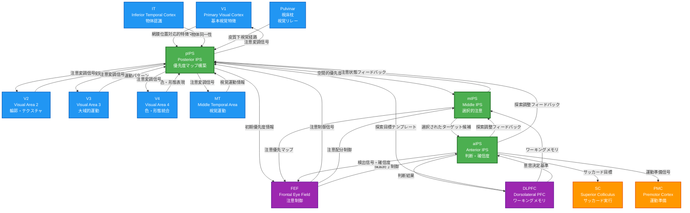

# HCD構造図（Mermaid形式）

以下のMermaidコードをdraw.ioなどのツールでレンダリングしてください。

## 凡例

### ノードの色分け

- **緑色（濃い線）**: ROI内のUniform Circuit（pIPS, mIPS, aIPS）
- **青色**: ROI外の入力UC（視覚野、前頭皮質、皮質下構造）
- **オレンジ色**: ROI外の出力UC（運動系）
- **紫色**: ROI外の入出力両方を担うUC（FEF, DLPFC）

### 接続の意味

- **矢印**: 情報の流れの方向
- **ラベル**: 各接続で伝達される情報の内容（Output Semantics）

### 情報フローの主要経路

#### 順投射経路（視覚入力→判断→運動出力）
1. 視覚野（V1, V2, V3, V4, MT）→ pIPS → mIPS → aIPS → 運動系（SC, PMC）

#### フィードバック経路（探索の調整）
2. aIPS → mIPS → pIPS（IPS内部フィードバック）
3. pIPS/mIPS/aIPS → FEF/DLPFC（認知制御フィードバック）
4. pIPS → V1-MT（視覚処理の変調）

### Output Semanticsの要約

| UC | Output Semantics（出力情報の意味） |
|----|----------------------------------|
| pIPS | 視野全体の空間的優先度マップ（どこが重要か） |
| mIPS | 注意選択されたターゲット候補の重み付け（どれが候補か） |
| aIPS | ターゲット検出の判断と確信度（見つかったか、どれくらい確信できるか） |
| V1 | 基本視覚特徴（方位、空間周波数、色、輝度） |
| V2 | 複雑視覚特徴（輪郭、テクスチャ） |
| V3 | 大域的運動パターン |
| V4 | 色と形態の統合表現 |
| MT | 視覚運動の方向と速度 |
| IT | 物体カテゴリと同一性 |
| FEF | 注意制御信号、サッカード指令 |
| DLPFC | 探索目標テンプレート、タスクルール、意思決定基準 |
| Pulvinar | 皮質下視覚情報リレー |

## HCD構造の特徴

### 1. 階層的情報処理
pIPS → mIPS → aIPSという3段階の順投射により、視覚特徴統合→選択→判断という階層的処理が実現されています。

### 2. 多重フィードバックループ
単純な一方向処理ではなく、複数のフィードバックループにより、探索が動的に調整されます。

### 3. トップダウンとボトムアップの統合
視覚野からのbottom-up情報と、FEF/DLPFCからのtop-down制御が、IPS各段階で統合されます。

### 4. 並列入力と収束
複数の視覚野（V1-MT）が並列にpIPSに投射し、それらの情報が収束・統合されます。

### 5. 発散出力
aIPSからの出力は、認知制御（FEF, DLPFC）、視覚処理（pIPS, mIPS経由でV1-MT）、運動系（SC, PMC）へと発散します。

この構造により、知覚速度という認知能力が、視覚、注意、意思決定、運動を統合したシステムとして実現されています。
