# ステップ1: TLFの段階的分解とGN作成

## TLF: VOR学習

VOR学習は、視覚フィードバックに基づいて前庭動眼反射のゲインや位相を適応的に変化させる運動学習です。この機能を段階的に分解し、階層的なグループノード（GN）構造を作成します。

## 機能分解の方針

VOR学習を実現するためには、以下の主要な処理が必要です：

1. **感覚情報の統合処理**: 前庭感覚と視覚運動情報を統合し、現在の感覚文脈を表現
2. **誤差検出と学習信号生成**: 運動の誤差（retinal slip）を検出し、学習のための教師信号を生成
3. **シナプス可塑性による学習**: 誤差信号に基づいてシナプス重みを調整
4. **運動指令の調整**: 学習されたシナプス重みに基づいて運動指令を調整

これらの処理をさらに詳細に分解します。

## 階層的な機能分解

### 第1階層（TLF直下）

| 階層レベル | ノード名 | 機能説明 |
| ---------- | -------- | -------- |
| Level 0 | R.VOR-learning | VOR学習：視覚フィードバックに基づいて前庭動眼反射のゲインを適応的に調整する運動学習 |
| Level 1 | R.multisensory-context-encoding | 多感覚文脈符号化：前庭感覚と視覚運動情報を統合し、VOR実行のための感覚文脈を高次元表現空間で符号化する |
| Level 1 | R.error-driven-synaptic-modulation | 誤差駆動シナプス調整：誤差信号に基づいてシナプス可塑性を誘導し、感覚-運動変換の重みを調整する |
| Level 1 | R.adaptive-motor-output-generation | 適応的運動出力生成：学習により調整されたシナプス重みに基づいて、前庭神経核への抑制信号を生成しVORゲインを調整する |

### 第2階層（多感覚文脈符号化の分解）

| 階層レベル | ノード名 | 機能説明 |
| ---------- | -------- | -------- |
| Level 2 | R.sensory-input-integration | 感覚入力統合：前庭感覚と視覚運動情報を顆粒細胞レベルで統合し、多感覚結合表現を生成する |
| Level 2 | R.activity-sparsification | 活動疎化：抑制性ゲイン制御により顆粒細胞活動を疎化し、パターン分離を実現する |
| Level 2 | R.spatial-information-distribution | 空間的情報拡散：平行線維を介して疎な多感覚情報を空間的に広範に拡散し、下流の計算資源に分配する |

### 第3階層（誤差駆動シナプス調整の分解）

| 階層レベル | ノード名 | 機能説明 |
| ---------- | -------- | -------- |
| Level 2 | R.error-signal-detection | 誤差信号検出：retinal slip errorを検出し、登上線維を介して教師信号として伝達する |
| Level 2 | R.plasticity-induction | 可塑性誘導：感覚文脈と誤差信号の同時活性化により、平行線維-プルキンエ細胞シナプスでLTD/LTPを誘導する |

### 第4階層（適応的運動出力生成の分解）

| 階層レベル | ノード名 | 機能説明 |
| ---------- | -------- | -------- |
| Level 2 | R.sensory-motor-transformation | 感覚-運動変換：多感覚文脈情報と学習されたシナプス重みに基づいて、プルキンエ細胞の活動パターンを生成する |
| Level 2 | R.output-pattern-refinement | 出力パターン精緻化：側方抑制により、プルキンエ細胞の出力パターンを鋭敏化し、VOR調整信号の精度を向上させる |
| Level 2 | R.inhibitory-gain-adjustment | 抑制性ゲイン調整：プルキンエ細胞から前庭神経核への抑制を調整し、VORゲインを変更する |

### 第5階層（さらなる分解）

**感覚入力統合の分解:**

| 階層レベル | ノード名 | 機能説明 |
| ---------- | -------- | -------- |
| Level 3 | R.expansion-recoding | 拡張再符号化：苔状線維入力を約100倍に拡張し、高次元空間に埋め込むことで線形分離可能性を向上させる |
| Level 3 | R.multisensory-conjunction | 多感覚結合：各顆粒細胞が異なる感覚モダリティからの入力をランダムに統合し、多様な感覚結合パターンを生成する |

**活動疎化の分解:**

| 階層レベル | ノード名 | 機能説明 |
| ---------- | -------- | -------- |
| Level 3 | R.feedforward-gain-control | フィードフォワードゲイン制御：苔状線維入力と同時にゴルジ細胞を介した抑制を提供し、顆粒細胞の初期ゲインを制御する |
| Level 3 | R.feedback-gain-control | フィードバックゲイン制御：平行線維活動に基づいてゴルジ細胞を介した抑制を提供し、顆粒細胞活動を動的に調整する |

**可塑性誘導の分解:**

| 階層レベル | ノード名 | 機能説明 |
| ---------- | -------- | -------- |
| Level 3 | R.coincidence-detection | 同時活性検出：平行線維活動（mGluR1経由のIP3）と登上線維活動（電位依存性カルシウム流入）をIP3受容体で統合し、同時活性を検出する |
| Level 3 | R.synaptic-weight-modification | シナプス重み修正：同時活性検出に基づいてAMPA受容体のエンドサイトーシス（LTD）または挿入（LTP）を実行し、シナプス重みを変更する |

**出力パターン精緻化の分解:**

| 階層レベル | ノード名 | 機能説明 |
| ---------- | -------- | -------- |
| Level 3 | R.axonal-lateral-inhibition | 軸索レベル側方抑制：バスケット細胞がプルキンエ細胞の軸索初節周囲を抑制し、出力の空間的コントラストを向上させる |
| Level 3 | R.dendritic-lateral-inhibition | 樹状突起レベル側方抑制：ステラート細胞がプルキンエ細胞の樹状突起を抑制し、入力統合パターンを調整する |

## 階層構造のMermaid図

```mermaid
graph TD
    %% Level 0
    TLF[R.VOR-learning]
    
    %% Level 1
    TLF --> MSC[R.multisensory-context-encoding]
    TLF --> ESM[R.error-driven-synaptic-modulation]
    TLF --> AMO[R.adaptive-motor-output-generation]
    
    %% Level 2 - multisensory-context-encoding
    MSC --> SII[R.sensory-input-integration]
    MSC --> AS[R.activity-sparsification]
    MSC --> SID[R.spatial-information-distribution]
    
    %% Level 2 - error-driven-synaptic-modulation
    ESM --> ESD[R.error-signal-detection]
    ESM --> PI[R.plasticity-induction]
    
    %% Level 2 - adaptive-motor-output-generation
    AMO --> SMT[R.sensory-motor-transformation]
    AMO --> OPR[R.output-pattern-refinement]
    AMO --> IGA[R.inhibitory-gain-adjustment]
    
    %% Level 3 - sensory-input-integration
    SII --> ER[R.expansion-recoding]
    SII --> MC[R.multisensory-conjunction]
    
    %% Level 3 - activity-sparsification
    AS --> FGC[R.feedforward-gain-control]
    AS --> FBGC[R.feedback-gain-control]
    
    %% Level 3 - plasticity-induction
    PI --> CD[R.coincidence-detection]
    PI --> SWM[R.synaptic-weight-modification]
    
    %% Level 3 - output-pattern-refinement
    OPR --> ALI[R.axonal-lateral-inhibition]
    OPR --> DLI[R.dendritic-lateral-inhibition]
    
    %% Style
    classDef tlf fill:#e1f5ff,stroke:#01579b,stroke-width:3px
    classDef level1 fill:#fff3e0,stroke:#e65100,stroke-width:2px
    classDef level2 fill:#f3e5f5,stroke:#4a148c,stroke-width:2px
    classDef level3 fill:#e8f5e9,stroke:#1b5e20,stroke-width:2px
    
    class TLF tlf
    class MSC,ESM,AMO level1
    class SII,AS,SID,ESD,PI,SMT,OPR,IGA level2
    class ER,MC,FGC,FBGC,CD,SWM,ALI,DLI level3
```

## 分解の妥当性確認

### 親子関係の十分性

1. **R.VOR-learning**: 3つの子ノード（多感覚文脈符号化、誤差駆動シナプス調整、適応的運動出力生成）により十分に実現される。これらはVOR学習の必要十分な要素を網羅している。

2. **R.multisensory-context-encoding**: 3つの子ノード（感覚入力統合、活動疎化、空間的情報拡散）により、多感覚文脈の符号化が実現される。

3. **R.error-driven-synaptic-modulation**: 2つの子ノード（誤差信号検出、可塑性誘導）により、誤差に基づくシナプス調整が実現される。

4. **R.adaptive-motor-output-generation**: 3つの子ノード（感覚-運動変換、出力パターン精緻化、抑制性ゲイン調整）により、適応的な運動出力が生成される。

### 各GNの独立性

各GNは明確で独立した機能を持ち、相互に重複していません。階層的な分解により、上位の機能が下位の機能の組み合わせで実現される構造になっています。

### リーフノードの粒度

Level 3のノードは、UCと紐づけるのに適切な粒度に達しています。これ以上の分解は、UC単体の機能となるため不要です。

## 次のステップ

ステップ2では、この初期分解結果を分析し、冗長性を削減してノードをマージします。
