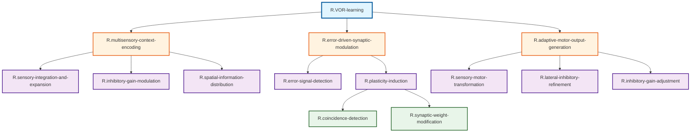

# ステップ2: 冗長性の削減とノードのマージ

## 初期分解結果の分析

ステップ1で作成された階層構造を分析し、冗長性を特定します。

### 冗長性の特定

1. **R.expansion-recoding と R.multisensory-conjunction**:
   - これら2つのノードは、どちらも顆粒細胞レベルでの感覚統合処理を表現している
   - R.expansion-recodingは「拡張」に、R.multisensory-conjunctionは「結合」に焦点を当てているが、これらは顆粒細胞の単一の計算過程の異なる側面である
   - → **マージ候補**: R.sensory-integration-and-expansionに統合

2. **R.feedforward-gain-control と R.feedback-gain-control**:
   - これら2つのノードは、どちらもゴルジ細胞による抑制性ゲイン制御を表現している
   - フィードフォワードとフィードバックは、同じゴルジ細胞による統合的な抑制機構の異なる入力経路である
   - → **マージ候補**: R.inhibitory-gain-modulationに統合

3. **R.axonal-lateral-inhibition と R.dendritic-lateral-inhibition**:
   - これら2つのノードは、どちらもプルキンエ細胞への側方抑制を表現している
   - 軸索レベルと樹状突起レベルは、側方抑制の異なる標的部位であるが、同じ機能的目的（出力パターン精緻化）を持つ
   - → **マージ候補**: R.lateral-inhibitory-refinementに統合

### マージしないノード

以下のノードは、明確に異なる機能を持つため、マージしません：

- R.error-signal-detection と R.plasticity-induction: 誤差信号の検出とシナプス可塑性の誘導は異なるプロセス
- R.coincidence-detection と R.synaptic-weight-modification: 同時活性検出とシナプス重み修正は異なる計算段階
- R.sensory-motor-transformation と R.inhibitory-gain-adjustment: プルキンエ細胞内の計算と前庭神経核への出力は異なるレベル

## 最適化されたFRG構造

### 階層構造表（親子関係を含む）

| 階層レベル | ノード名 | 親ノード | 子ノード | 機能説明 |
| ---------- | -------- | -------- | -------- | -------- |
| Level 0 | R.VOR-learning | なし | R.multisensory-context-encoding; R.error-driven-synaptic-modulation; R.adaptive-motor-output-generation | VOR学習：視覚フィードバックに基づいて前庭動眼反射のゲインを適応的に調整する運動学習 |
| Level 1 | R.multisensory-context-encoding | R.VOR-learning | R.sensory-integration-and-expansion; R.inhibitory-gain-modulation; R.spatial-information-distribution | 多感覚文脈符号化：前庭感覚と視覚運動情報を統合し、VOR実行のための感覚文脈を高次元表現空間で符号化する |
| Level 1 | R.error-driven-synaptic-modulation | R.VOR-learning | R.error-signal-detection; R.plasticity-induction | 誤差駆動シナプス調整：誤差信号に基づいてシナプス可塑性を誘導し、感覚-運動変換の重みを調整する |
| Level 1 | R.adaptive-motor-output-generation | R.VOR-learning | R.sensory-motor-transformation; R.lateral-inhibitory-refinement; R.inhibitory-gain-adjustment | 適応的運動出力生成：学習により調整されたシナプス重みに基づいて、前庭神経核への抑制信号を生成しVORゲインを調整する |
| Level 2 | R.sensory-integration-and-expansion | R.multisensory-context-encoding | リーフ | 感覚統合と拡張：前庭感覚と視覚運動情報を顆粒細胞で統合し、約100倍に拡張することで高次元空間に埋め込み、多様な感覚結合パターンを生成する |
| Level 2 | R.inhibitory-gain-modulation | R.multisensory-context-encoding | リーフ | 抑制性ゲイン調整：ゴルジ細胞がフィードフォワードおよびフィードバック経路で顆粒細胞へ抑制を提供し、活動を疎化してパターン分離を実現する |
| Level 2 | R.spatial-information-distribution | R.multisensory-context-encoding | リーフ | 空間的情報拡散：平行線維を介して疎な多感覚情報を空間的に広範に拡散し、下流の計算資源に分配する |
| Level 2 | R.error-signal-detection | R.error-driven-synaptic-modulation | リーフ | 誤差信号検出：retinal slip errorを検出し、登上線維を介して教師信号として伝達する |
| Level 2 | R.plasticity-induction | R.error-driven-synaptic-modulation | R.coincidence-detection; R.synaptic-weight-modification | 可塑性誘導：感覚文脈と誤差信号の同時活性化により、平行線維-プルキンエ細胞シナプスでLTD/LTPを誘導する |
| Level 2 | R.sensory-motor-transformation | R.adaptive-motor-output-generation | リーフ | 感覚-運動変換：多感覚文脈情報と学習されたシナプス重みに基づいて、プルキンエ細胞の活動パターンを生成する |
| Level 2 | R.lateral-inhibitory-refinement | R.adaptive-motor-output-generation | リーフ | 側方抑制精緻化：バスケット細胞とステラート細胞がプルキンエ細胞の軸索初節と樹状突起に抑制を提供し、出力パターンを鋭敏化する |
| Level 2 | R.inhibitory-gain-adjustment | R.adaptive-motor-output-generation | リーフ | 抑制性ゲイン調整：プルキンエ細胞から前庭神経核への抑制を調整し、VORゲインを変更する |
| Level 3 | R.coincidence-detection | R.plasticity-induction | リーフ | 同時活性検出：平行線維活動（mGluR1経由のIP3）と登上線維活動（電位依存性カルシウム流入）をIP3受容体で統合し、同時活性を検出する |
| Level 3 | R.synaptic-weight-modification | R.plasticity-induction | リーフ | シナプス重み修正：同時活性検出に基づいてAMPA受容体のエンドサイトーシス（LTD）または挿入（LTP）を実行し、シナプス重みを変更する |

## 最適化されたMermaid図

## マージの根拠

### 1. R.sensory-integration-and-expansion（統合）

**マージ前**: R.expansion-recoding と R.multisensory-conjunction

**根拠**: 
- 両者とも顆粒細胞レベルでの計算プロセスを表現
- 拡張（expansion）と多感覚結合（conjunction）は、顆粒細胞が実行する単一の計算過程の異なる側面
- 神経科学的には、各顆粒細胞が複数の苔状線維入力を統合する過程で、自然に拡張と結合が同時に実現される
- 統合により、顆粒細胞の機能を単一のGNとして明確に表現できる

### 2. R.inhibitory-gain-modulation（統合）

**マージ前**: R.feedforward-gain-control と R.feedback-gain-control

**根拠**:
- 両者ともゴルジ細胞による抑制性ゲイン制御を表現
- フィードフォワードとフィードバックは、同じゴルジ細胞が統合する2つの入力経路
- 神経科学的には、ゴルジ細胞は苔状線維（フィードフォワード）と平行線維（フィードバック）の両方から入力を受け、統合的に抑制を提供する
- 統合により、ゴルジ細胞の機能を単一のGNとして明確に表現できる

### 3. R.lateral-inhibitory-refinement（統合）

**マージ前**: R.axonal-lateral-inhibition と R.dendritic-lateral-inhibition

**根拠**:
- 両者ともプルキンエ細胞への側方抑制を表現
- バスケット細胞（軸索）とステラート細胞（樹状突起）は、異なる部位に作用するが、同じ機能的目的（出力パターンの鋭敏化）を持つ
- これらは協調して働き、プルキンエ細胞の入出力を多層的に調整する
- 統合により、側方抑制の全体的な機能を単一のGNとして表現できる

## 最適化の効果

### ノード数の削減

- **マージ前**: 21ノード（TLF含む）
- **マージ後**: 15ノード（TLF含む）
- **削減**: 6ノード（約29%削減）

### 解釈可能性の向上

1. **機能的グルーピング**: 関連する処理が単一のGNにまとめられ、理解しやすくなった
2. **階層の明確化**: Level 3のノード数が減少し、階層構造がよりシンプルになった
3. **神経組織との対応**: 各GNが特定の神経細胞タイプ（顆粒細胞、ゴルジ細胞、バスケット/ステラート細胞）の機能をより明確に表現

### グラフ構造の妥当性確認

- すべての親ノードは、子ノード群によって十分に実現される
- 各ノードは明確で独立した機能を持つ
- リーフノードは、UCと紐づけるのに適切な粒度である

## 次のステップ

ステップ3では、この最適化されたGN構造を実際の神経組織（UC）と紐づけ、FRGを完成させます。
