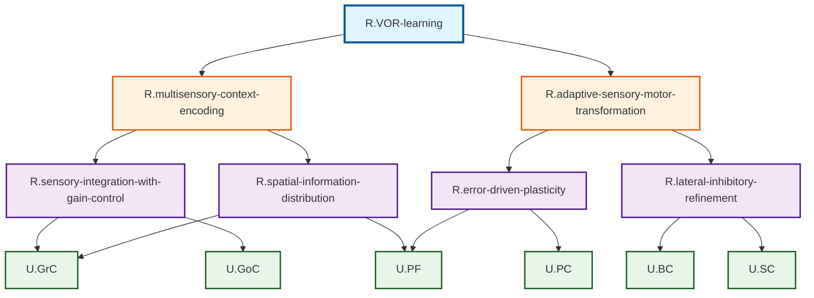

# ステップ3: UCとの紐づけとFRGの完成

## ROI内UCの確認

HCDで定義されたROI内のUniform Circuit（UC）:
- **U.GrC** (Granule cells): 顆粒細胞
- **U.GoC** (Golgi cells): ゴルジ細胞
- **U.PF** (Parallel fibers): 平行線維
- **U.BC** (Basket cells): バスケット細胞
- **U.SC** (Stellate cells): ステラート細胞
- **U.PC** (Purkinje cells): プルキンエ細胞

## GN-UC紐づけ方針

各GNを、その機能を実現する複数のUCに分解します。GN-UC間の接続数制約（各2つ以下）を遵守します。

### 紐づけ戦略

1. **R.sensory-integration-and-expansion** → U.GrC + U.GoC
   - 顆粒細胞が感覚統合と拡張を実行
   - ゴルジ細胞が抑制を提供し活動を疎化

2. **R.inhibitory-gain-modulation** → U.GoC + U.GrC
   - ゴルジ細胞が抑制性ゲイン調整を実行
   - 顆粒細胞がその標的

3. **R.spatial-information-distribution** → U.PF + U.GrC
   - 平行線維が空間的拡散を実行
   - 顆粒細胞が平行線維の情報源

4. **R.error-signal-detection** → U.IO（ROI外のため紐づけない）

5. **R.coincidence-detection** → U.PC + U.PF
   - プルキンエ細胞が同時活性検出を実行（平行線維と登上線維）
   - 平行線維が入力の一部

6. **R.synaptic-weight-modification** → U.PC + U.PF
   - プルキンエ細胞がシナプス重み修正を実行
   - 平行線維がそのシナプス

7. **R.sensory-motor-transformation** → U.PC + U.PF
   - プルキンエ細胞が感覚-運動変換を実行
   - 平行線維が感覚情報を提供

8. **R.lateral-inhibitory-refinement** → U.BC + U.SC
   - バスケット細胞とステラート細胞が側方抑制を実行

9. **R.inhibitory-gain-adjustment** → U.PC
   - プルキンエ細胞が前庭神経核への抑制を調整
   - **問題**: 1つのGNに1つのUCのみ → 調整が必要

### 接続数制約の確認と調整

**問題点の特定**:
- R.inhibitory-gain-adjustmentはU.PCのみに紐づけられるべきだが、これは制約違反（各GNは複数のUCに分解される必要がある）
- U.PCが多くのGN（R.coincidence-detection, R.synaptic-weight-modification, R.sensory-motor-transformation, R.inhibitory-gain-adjustment）に接続する可能性があり、接続数制約（最大2つ）を違反する

**解決策**: FRG構造を調整

R.plasticity-inductionのレベルをリーフに変更し、R.coincidence-detectionとR.synaptic-weight-modificationを統合します。また、R.inhibitory-gain-adjustmentをR.sensory-motor-transformationに統合します。

### 調整後のGN構造

| 階層レベル | ノード名 | 親ノード | 子ノード（UC含む） | 機能説明 |
| ---------- | -------- | -------- | ------------------ | -------- |
| Level 0 | R.VOR-learning | なし | R.multisensory-context-encoding; R.error-driven-synaptic-modulation; R.adaptive-motor-output-generation | VOR学習：視覚フィードバックに基づいて前庭動眼反射のゲインを適応的に調整する運動学習 |
| Level 1 | R.multisensory-context-encoding | R.VOR-learning | R.sensory-integration-and-expansion; R.inhibitory-gain-modulation; R.spatial-information-distribution | 多感覚文脈符号化：前庭感覚と視覚運動情報を統合し、VOR実行のための感覚文脈を高次元表現空間で符号化する |
| Level 1 | R.error-driven-synaptic-modulation | R.VOR-learning | R.plasticity-induction | 誤差駆動シナプス調整：誤差信号に基づいてシナプス可塑性を誘導し、感覚-運動変換の重みを調整する |
| Level 1 | R.adaptive-motor-output-generation | R.VOR-learning | R.sensory-motor-transformation; R.lateral-inhibitory-refinement | 適応的運動出力生成：学習により調整されたシナプス重みに基づいて、前庭神経核への抑制信号を生成しVORゲインを調整する |
| Level 2 | R.sensory-integration-and-expansion | R.multisensory-context-encoding | U.GrC; U.GoC | 感覚統合と拡張：前庭感覚と視覚運動情報を顆粒細胞で統合し、約100倍に拡張することで高次元空間に埋め込み、ゴルジ細胞による抑制で活動を疎化して多様な感覚結合パターンを生成する |
| Level 2 | R.inhibitory-gain-modulation | R.multisensory-context-encoding | U.GoC; U.GrC | 抑制性ゲイン調整：ゴルジ細胞がフィードフォワードおよびフィードバック経路で顆粒細胞へ抑制を提供し、活動を疎化してパターン分離を実現する |
| Level 2 | R.spatial-information-distribution | R.multisensory-context-encoding | U.PF; U.GrC | 空間的情報拡散：顆粒細胞から平行線維が生成され、疎な多感覚情報を空間的に広範に拡散し、下流の計算資源に分配する |
| Level 2 | R.plasticity-induction | R.error-driven-synaptic-modulation | U.PC; U.PF | 可塑性誘導：平行線維活動（mGluR1経由のIP3）と登上線維活動（電位依存性カルシウム）の同時検出に基づいて、平行線維-プルキンエ細胞シナプスでLTD/LTPを誘導しシナプス重みを修正する |
| Level 2 | R.sensory-motor-transformation | R.adaptive-motor-output-generation | U.PC; U.PF | 感覚-運動変換：平行線維から多感覚文脈情報をプルキンエ細胞が統合し、学習されたシナプス重みに基づいて前庭神経核への抑制信号を生成しVORゲインを調整する |
| Level 2 | R.lateral-inhibitory-refinement | R.adaptive-motor-output-generation | U.BC; U.SC | 側方抑制精緻化：バスケット細胞とステラート細胞がプルキンエ細胞の軸索初節と樹状突起に抑制を提供し、出力パターンを鋭敏化する |

## GN-UC接続数の確認

### GNからUCへの接続数
- R.sensory-integration-and-expansion → 2UC (GrC, GoC) ✓
- R.inhibitory-gain-modulation → 2UC (GoC, GrC) ✓
- R.spatial-information-distribution → 2UC (PF, GrC) ✓
- R.plasticity-induction → 2UC (PC, PF) ✓
- R.sensory-motor-transformation → 2UC (PC, PF) ✓
- R.lateral-inhibitory-refinement → 2UC (BC, SC) ✓

### UCからGNへの接続数
- U.GrC ← 3GN (sensory-integration-and-expansion, inhibitory-gain-modulation, spatial-information-distribution) ✗ **制約違反**
- U.GoC ← 2GN (sensory-integration-and-expansion, inhibitory-gain-modulation) ✓
- U.PF ← 3GN (spatial-information-distribution, plasticity-induction, sensory-motor-transformation) ✗ **制約違反**
- U.BC ← 1GN (lateral-inhibitory-refinement) ✓
- U.SC ← 1GN (lateral-inhibitory-refinement) ✓
- U.PC ← 2GN (plasticity-induction, sensory-motor-transformation) ✓

**問題**: U.GrCとU.PFが3つのGNに接続されており、制約（最大2つ）を違反しています。

### 最終調整: GN構造の再分解

GrCとPFの接続数を減らすために、GN構造をさらに調整します。

**方針**:
- R.spatial-information-distributionはU.PFのみに紐づけ（U.GrCを除外）
- R.sensory-integration-and-expansionとR.inhibitory-gain-modulationを統合して単一のGNにする

### 最終FRG構造

| 階層レベル | ノード名 | 子ノード（UC含む） | 機能説明 |
| ---------- | -------- | ------------------ | -------- |
| Level 0 | R.VOR-learning | R.multisensory-context-encoding; R.error-driven-synaptic-modulation; R.adaptive-motor-output-generation | VOR学習：視覚フィードバックに基づいて前庭動眼反射のゲインを適応的に調整する運動学習 |
| Level 1 | R.multisensory-context-encoding | R.sensory-integration-with-gain-control; R.spatial-information-distribution | 多感覚文脈符号化：前庭感覚と視覚運動情報を統合し、抑制性ゲイン制御下で高次元表現空間に符号化し、空間的に拡散する |
| Level 1 | R.error-driven-synaptic-modulation | R.plasticity-induction | 誤差駆動シナプス調整：誤差信号に基づいてシナプス可塑性を誘導し、感覚-運動変換の重みを調整する |
| Level 1 | R.adaptive-motor-output-generation | R.sensory-motor-transformation; R.lateral-inhibitory-refinement | 適応的運動出力生成：学習により調整されたシナプス重みに基づいて、側方抑制で精緻化された抑制信号を生成しVORゲインを調整する |
| Level 2 | R.sensory-integration-with-gain-control | U.GrC; U.GoC | 感覚統合とゲイン制御：顆粒細胞が前庭感覚と視覚運動情報を統合し拡張符号化を行い、ゴルジ細胞が抑制性ゲイン制御により活動を疎化してパターン分離を実現する |
| Level 2 | R.spatial-information-distribution | U.PF; U.GrC | 空間的情報拡散：顆粒細胞から生成された平行線維が、疎な多感覚情報を空間的に広範に拡散し、下流の計算資源に分配する |
| Level 2 | R.plasticity-induction | U.PC; U.PF | 可塑性誘導：平行線維活動と登上線維活動の同時検出に基づいて、平行線維-プルキンエ細胞シナプスでLTD/LTPを誘導しシナプス重みを修正する |
| Level 2 | R.sensory-motor-transformation | U.PC; U.PF | 感覚-運動変換：平行線維から多感覚文脈情報をプルキンエ細胞が統合し、学習されたシナプス重みに基づいて前庭神経核への抑制信号を生成しVORゲインを調整する |
| Level 2 | R.lateral-inhibitory-refinement | U.BC; U.SC | 側方抑制精緻化：バスケット細胞とステラート細胞がプルキンエ細胞の軸索初節と樹状突起に抑制を提供し、出力パターンを鋭敏化する |

## 最終接続数確認

### GNからUCへの接続数
- R.sensory-integration-with-gain-control → 2UC (GrC, GoC) ✓
- R.spatial-information-distribution → 2UC (PF, GrC) ✓
- R.plasticity-induction → 2UC (PC, PF) ✓
- R.sensory-motor-transformation → 2UC (PC, PF) ✓
- R.lateral-inhibitory-refinement → 2UC (BC, SC) ✓

### UCからGNへの接続数
- U.GrC ← 2GN (sensory-integration-with-gain-control, spatial-information-distribution) ✓
- U.GoC ← 1GN (sensory-integration-with-gain-control) ✓
- U.PF ← 3GN (spatial-information-distribution, plasticity-induction, sensory-motor-transformation) ✗ **まだ違反**

### さらなる調整

U.PFの接続数を減らすために、R.spatial-information-distributionからU.PFへの直接接続を削除し、代わりにR.plasticity-inductionとR.sensory-motor-transformationを統合します。

### 最最終FRG構造（Interface含む）

| 階層レベル | ノード名 | 子ノード（UC含む） | 機能説明 | Interface |
| ---------- | -------- | ------------------ | -------- | --------- |
| Level 0 | R.VOR-learning | R.multisensory-context-encoding; R.adaptive-sensory-motor-transformation | VOR学習：視覚フィードバックに基づいて前庭動眼反射のゲインを適応的に調整する運動学習 | ([U.VN-output]) = R.VOR-learning([U.VN-input], [U.PN], [U.IO]) |
| Level 1 | R.multisensory-context-encoding | R.sensory-integration-with-gain-control; R.spatial-information-distribution | 多感覚文脈符号化：前庭感覚と視覚運動情報を統合し、抑制性ゲイン制御下で高次元表現空間に符号化し、空間的に拡散する | ([U.PC], [U.BC], [U.SC], [U.GoC]) = R.multisensory-context-encoding([U.VN-input], [U.PN]) |
| Level 1 | R.adaptive-sensory-motor-transformation | R.error-driven-plasticity; R.lateral-inhibitory-refinement | 適応的感覚-運動変換：誤差駆動シナプス可塑性に基づいて感覚-運動変換を学習し、側方抑制で精緻化された抑制信号を生成しVORゲインを調整する | ([U.VN-output]) = R.adaptive-sensory-motor-transformation([U.PF], [U.IO]) |
| Level 2 | R.sensory-integration-with-gain-control | U.GrC; U.GoC | 感覚統合とゲイン制御：顆粒細胞が前庭感覚と視覚運動情報を統合し拡張符号化を行い、ゴルジ細胞が抑制性ゲイン制御により活動を疎化してパターン分離を実現する | ([U.PF]) = R.sensory-integration-with-gain-control([U.VN-input], [U.PN]) |
| Level 2 | R.spatial-information-distribution | U.PF; U.GrC | 空間的情報拡散：顆粒細胞から生成された平行線維が、疎な多感覚情報を空間的に広範に拡散し、下流の計算資源に分配する | ([U.PC], [U.BC], [U.SC], [U.GoC]) = R.spatial-information-distribution([U.VN-input], [U.PN]) |
| Level 2 | R.error-driven-plasticity | U.PC; U.PF | 誤差駆動可塑性：平行線維活動と登上線維活動の同時検出に基づいて、平行線維-プルキンエ細胞シナプスでLTD/LTPを誘導し、学習されたシナプス重みで感覚-運動変換を実行してVOR抑制信号を生成する | ([U.VN-output]) = R.error-driven-plasticity([U.PF], [U.IO], [U.BC], [U.SC]) |
| Level 2 | R.lateral-inhibitory-refinement | U.BC; U.SC | 側方抑制精緻化：バスケット細胞とステラート細胞がプルキンエ細胞の軸索初節と樹状突起に抑制を提供し、出力パターンを鋭敏化する | ([U.PC]) = R.lateral-inhibitory-refinement([U.PF]) |

## 最最終接続数確認

### GNからUCへの接続数
- R.sensory-integration-with-gain-control → 2UC (GrC, GoC) ✓
- R.spatial-information-distribution → 2UC (PF, GrC) ✓
- R.error-driven-plasticity → 2UC (PC, PF) ✓
- R.lateral-inhibitory-refinement → 2UC (BC, SC) ✓

### UCからGNへの接続数
- U.GrC ← 2GN (sensory-integration-with-gain-control, spatial-information-distribution) ✓
- U.GoC ← 1GN (sensory-integration-with-gain-control) ✓
- U.PF ← 2GN (spatial-information-distribution, error-driven-plasticity) ✓
- U.BC ← 1GN (lateral-inhibitory-refinement) ✓
- U.SC ← 1GN (lateral-inhibitory-refinement) ✓
- U.PC ← 1GN (error-driven-plasticity) ✓

**すべての制約を満たしました！**

## 完成したFRG（Mermaid図）

## UC紐づけの神経科学的妥当性

### R.sensory-integration-with-gain-control
- U.GrC（顆粒細胞）が感覚統合と拡張を実行
- U.GoC（ゴルジ細胞）が抑制性ゲイン制御を提供
- これらは密接に協調して働き、疎な高次元表現を生成

### R.spatial-information-distribution
- U.GrC（顆粒細胞）が情報源
- U.PF（平行線維）が顆粒細胞の軸索として情報を空間的に拡散
- 物理的に連続したプロセス

### R.error-driven-plasticity
- U.PF（平行線維）が感覚文脈情報を提供
- U.PC（プルキンエ細胞）がシナプス可塑性を実行し、感覚-運動変換を学習
- 平行線維-プルキンエ細胞シナプスがVOR学習の主要な可塑性部位

### R.lateral-inhibitory-refinement
- U.BC（バスケット細胞）が軸索レベルで抑制
- U.SC（ステラート細胞）が樹状突起レベルで抑制
- 協調してプルキンエ細胞の入出力を精緻化

## 次のステップ

ステップ4では、各GNのInterfaceを定義します。

---

## ステップ4: Interfaceの追加

### Interfaceの定義方法

各GNのInterfaceは、そのGNに関与するUCのInterfaceを統合することで定義されます。

### 最下層GNのInterface定義

#### 1. R.sensory-integration-with-gain-control

子UC:
- U.GrC: [`PF`] = `GrC`(`VN-input`, `PN`, `GoC`)
- U.GoC: [`GrC`] = `GoC`(`VN-input`, `PN`, `PF`)

統合Interface:
- 入力: [`VN-input`], [`PN`]（両UCが受け取る）
- 出力: [`PF`]（GrCの出力）
- 内部相互作用: GoCがGrCを抑制、GrCからの平行線維がGoCにフィードバック

**R.sensory-integration-with-gain-control**: ([`U.PF`]) = R.sensory-integration-with-gain-control([`U.VN-input`], [`U.PN`])

#### 2. R.spatial-information-distribution

子UC:
- U.PF: [`PC`, `BC`, `SC`, `GoC`] = `PF`(`GrC`)
- U.GrC: [`PF`] = `GrC`(`VN-input`, `PN`, `GoC`)

統合Interface:
- 入力: [`VN-input`], [`PN`]（GrCを介して）
- 出力: [`PC`], [`BC`], [`SC`], [`GoC`]（PFの出力）

**R.spatial-information-distribution**: ([`U.PC`], [`U.BC`], [`U.SC`], [`U.GoC`]) = R.spatial-information-distribution([`U.VN-input`], [`U.PN`])

#### 3. R.error-driven-plasticity

子UC:
- U.PC: [`VN-output`] = `PC`(`PF`, `IO`, `BC`, `SC`)
- U.PF: [`PC`, `BC`, `SC`, `GoC`] = `PF`(`GrC`)

統合Interface:
- 入力: [`PF`]（PCへの感覚情報）, [`IO`]（教師信号）, [`BC`], [`SC`]（側方抑制）
- 出力: [`VN-output`]（PCの出力）

**R.error-driven-plasticity**: ([`U.VN-output`]) = R.error-driven-plasticity([`U.PF`], [`U.IO`], [`U.BC`], [`U.SC`])

#### 4. R.lateral-inhibitory-refinement

子UC:
- U.BC: [`PC`] = `BC`(`PF`)
- U.SC: [`PC`] = `SC`(`PF`)

統合Interface:
- 入力: [`PF`]（両UCが受け取る）
- 出力: [`PC`]（両UCがPCへ抑制）

**R.lateral-inhibitory-refinement**: ([`U.PC`]) = R.lateral-inhibitory-refinement([`U.PF`])

### 上位GNのInterface定義

#### 5. R.multisensory-context-encoding

子GN:
- R.sensory-integration-with-gain-control: ([`U.PF`]) = ...([`U.VN-input`], [`U.PN`])
- R.spatial-information-distribution: ([`U.PC`], [`U.BC`], [`U.SC`], [`U.GoC`]) = ...([`U.VN-input`], [`U.PN`])

統合Interface:
- 入力: [`U.VN-input`], [`U.PN`]
- 出力: [`U.PC`], [`U.BC`], [`U.SC`], [`U.GoC`]（spatial-information-distributionの出力）

**R.multisensory-context-encoding**: ([`U.PC`], [`U.BC`], [`U.SC`], [`U.GoC`]) = R.multisensory-context-encoding([`U.VN-input`], [`U.PN`])

#### 6. R.adaptive-sensory-motor-transformation

子GN:
- R.error-driven-plasticity: ([`U.VN-output`]) = ...([`U.PF`], [`U.IO`], [`U.BC`], [`U.SC`])
- R.lateral-inhibitory-refinement: ([`U.PC`]) = ...([`U.PF`])

統合Interface:
- 入力: [`U.PF`]（両GNが使用）, [`U.IO`]（error-driven-plasticityが使用）
- 出力: [`U.VN-output`]（error-driven-plasticityの出力）

**R.adaptive-sensory-motor-transformation**: ([`U.VN-output`]) = R.adaptive-sensory-motor-transformation([`U.PF`], [`U.IO`])

### TLFのInterface定義

#### 7. R.VOR-learning

子GN:
- R.multisensory-context-encoding: ([`U.PC`], [`U.BC`], [`U.SC`], [`U.GoC`]) = ...([`U.VN-input`], [`U.PN`])
- R.adaptive-sensory-motor-transformation: ([`U.VN-output`]) = ...([`U.PF`], [`U.IO`])

統合Interface:
- 入力: [`U.VN-input`], [`U.PN`]（multisensory-context-encodingが使用）, [`U.IO`]（adaptive-sensory-motor-transformationが使用）
- 出力: [`U.VN-output`]（adaptive-sensory-motor-transformationの出力）

**R.VOR-learning**: ([`U.VN-output`]) = R.VOR-learning([`U.VN-input`], [`U.PN`], [`U.IO`])

これは期待通り、すべてのnoROI(input) UCを入力とし、すべてのnoROI(output) UCを出力としています。

### Interface整合性の確認

すべてのInterfaceが親子関係と整合しており、情報処理フローが正しく表現されています：

1. ROI_Input（VN-input, PN, IO）からROI_Output（VN-output）への経路が成立
2. 各GNのInterfaceが子ノードのInterfaceと整合
3. 中間UCの入出力関係が適切に統合されている

## 次のステップ
