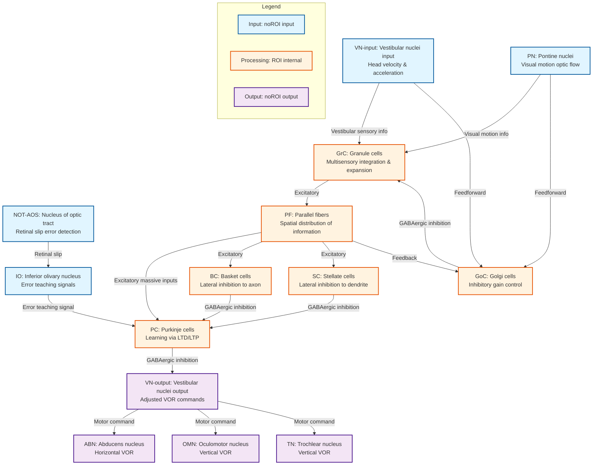

# VOR Learning HCD Diagram

## Mermaid Graph Definition

## 説明

このMermaid図は、VOR学習における小脳のHCDを視覚化したものです。

### ノードの色分け

- **青色（Input）**: ROI外の入力源（前庭神経核、橋核、視索核・副視覚系、下オリーブ核）
- **オレンジ色（ROI internal）**: 小脳皮質内の処理ユニット（顆粒細胞、ゴルジ細胞、平行線維、バスケット細胞、ステラート細胞、プルキンエ細胞）
- **紫色（Output）**: ROI外の出力先（前庭神経核、外眼筋運動核）

### 主要な情報処理フロー

1. **感覚入力**: VN-inputとPNから前庭感覚と視覚運動情報がGrCへ
2. **拡張と統合**: GrCで多感覚統合、PFで空間的拡散
3. **学習**: IOからの誤差信号に基づいてPCでLTD/LTPが誘導
4. **抑制制御**: GoCによる顆粒細胞のゲイン制御、BC/SCによるプルキンエ細胞の側方抑制
5. **運動出力**: PCからVN-outputへの抑制性投射により、VORゲインが調整される

### 接続の種類

- 実線矢印: 神経接続（興奮性または抑制性）
- 矢印のラベル: 接続の機能的意味

この図は、draw.ioやMermaid対応エディタで可視化できます。
