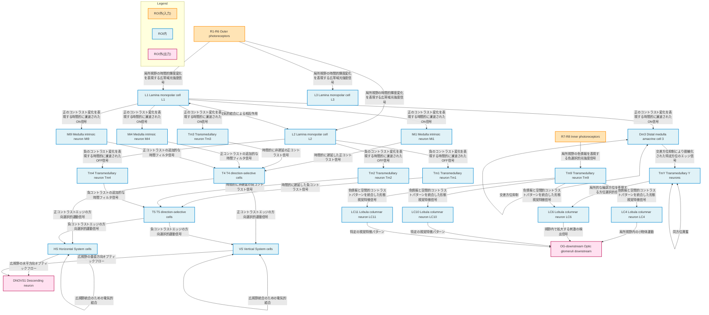

# ステップ8-3: HCD構造図

## Mermaid図（Draw.ioへの変換用）



## 図の説明

### ノードの色分け
- **オレンジ色**: ROI外の入力源（光受容体 R1-R6, R7-R8）
- **青色**: ROI内の神経回路（ラミナ、メデュラ、ロブラプレート、ロブラ）
- **ピンク色**: ROI外の出力先（DNOVS1、OG-downstream）

### 主要な情報フロー経路

#### 経路1: ON運動検出 → 広視野運動統合 → 運動制御
```
R1-R6 → L1 → Mi1(遅延)/Tm3(非遅延) → T4 → HS/VS → DNOVS1
```

#### 経路2: OFF運動検出 → 広視野運動統合 → 運動制御
```
R1-R6 → L2 → Tm1(遅延)/Tm2(非遅延) → T5 → HS/VS → DNOVS1
```

#### 経路3: 方位検出 → 形態視覚 → 行動制御
```
R1-R6 → L1 → Dm3 ⇄ Dm3 → TmY ⇄ TmY → LC6 → OG-downstream
```

#### 経路4: 色情報 → 物体検出 → 行動制御
```
R7-R8 → Tm9 → LC4/LC6/LC10/LC11 → OG-downstream
```

### 相互結合
- **L1 ⇄ L2**: ラミナでのON/OFF経路間の電気的結合
- **Dm3 ⇄ Dm3**: 交差方位抑制による方位選択性の鋭敏化
- **TmY ⇄ TmY**: 同方位興奮による輪郭統合の強化
- **HS ⇄ HS, VS ⇄ VS**: ロブラプレートでの広視野統合

## 技術的注釈

### Mermaid形式の制約
- エッジラベルには改行( )や中黒(・)を含めていません
- 各接続にはOutput Semanticsを簡潔に記載しています
- 自己接続（Dm3→Dm3, TmY→TmY, HS→HS, VS→VS）はMermaid上で表現が難しいため、双方向矢印で近似しています

### Draw.io変換時の推奨事項
1. レイアウトは階層的配置（縦方向）を推奨
2. ノードは機能グループごとにクラスタリング
3. エッジラベルのフォントサイズは小さめに設定
4. 長いエッジラベルは適切に折り返す
5. 凡例を図の右上または右下に配置

## UC数とConnection数の統計
- **総UC数**: 25個
  - ROI外(入力): 2個（R1-R6, R7-R8）
  - ROI内: 21個（L1, L2, L3, Mi1, Mi4, Mi9, Tm1, Tm2, Tm3, Tm4, Tm9, TmY, Dm3, T4, T5, HS, VS, LC4, LC6, LC10, LC11）
  - ROI外(出力): 2個（DNOVS1, OG-downstream）
- **Connection数**: 約40個の主要接続（相互接続を含む）
