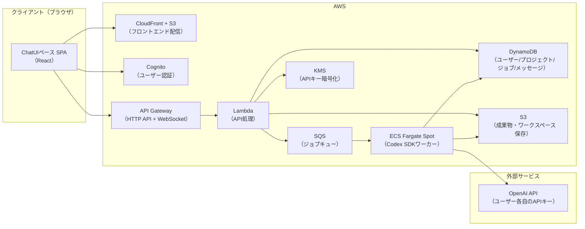

# CoBRAC Agents 仕様書（案）

| 項目 | 内容 |
| ---- | ---- |
| サービス名 | **CoBRAC Agents** |
| 文書バージョン | v0.3（実装反映版） |
| 作成日 | 2026-09-13 |
| ステータス | デプロイ済み（ap-northeast-1、`https://d253ipuk9gq4vr.cloudfront.net`）・実ジョブ検証前 |
| 実装リポジトリ | `CoBRAC Agents/`（本ファイルと同階層のモノレポ。セットアップ手順は `CoBRAC Agents/README.md`） |

### 改訂履歴

| 版 | 日付 | 内容 |
| -- | ---- | ---- |
| v0.1 | 2026-09-13 | 初版ドラフト |
| v0.2 | 2026-09-13 | FB反映: APIキー各自登録、質問応答ループ、完了後フォローアップ、グラフUI初版必須、CloudFront URL使用、名称「CoBRAC Agents」決定 |
| v0.3 | 2026-09-13 | 実装反映: 技術スタック・データモデル・API・Codex SDK 連携を実装内容に合わせて確定。§12「実装構成とデプロイ」を追加 |

---

## 1. 概要

### 1.1 背景・目的

現在、BRA（Brain Reference Architecture）データの作成作業（HCD作成 → FRG作成 → CSV作成 → xlsx変換）は、Cursor等のデスクトップAgents上で `instruction_0.md` 〜 `instruction_3_csv.md` を用いて実行している。

**CoBRAC Agents** は、この一連のワークフローを **サーバー上の Codex SDK** で実行するWebアプリケーションであり、以下を実現する。

- ブラウザから ROI / TLF を入力するだけで BRA 作成ジョブを起動できる
- 実行の進捗・ログをチャット形式でリアルタイムに確認できる
- エージェントからの確認質問にチャットで回答できる（応答ループ）
- 初版作成後、チャットでフォローアップ指示（修正・改善）を出せる
- 作成された BRA データ（プロジェクト）を一覧・管理できる
- HCD / FRG をインタラクティブなグラフとして閲覧できる
- 成果物（`.bra.xlsx`）をダウンロードできる

### 1.2 システム構成の全体像



### 1.3 スコープ

**対象（In Scope）**
- ユーザー管理（サインアップ・ログイン・プロフィール・OpenAI APIキー登録）
- ROI / TLF を入力とする BRA 作成ジョブの起動・監視・履歴管理
- ジョブ実行中のエージェント出力のストリーミング表示
- エージェントからの質問へのチャット回答（応答ループ）
- 完了プロジェクトへのフォローアップ指示（修正・改善の追加実行）
- 成果物（5種CSV、`.bra.xlsx`、中間mdファイル）の保存・ダウンロード
- HCD / FRG のグラフ可視化（ノードクリックで詳細表示）※初版から実装
- プロジェクト一覧・検索

**対象外（Out of Scope）※初版**
- 複数ユーザー間でのプロジェクト共有・共同編集
- 成果物の手動編集機能（Webエディタ）
- 課金・従量制プラン管理
- モバイルアプリ（ブラウザはレスポンシブ対応のみ）
- 独自ドメイン（CloudFront のデフォルト URL で提供）

### 1.4 利用形態

- **個人利用**を想定。一般公開はしない
- 各ユーザーは **自分の OpenAI API キーを登録** して利用する（Codex 実行コストはユーザー自身のAPI利用として課金される）
- ユーザー数は少数（自分＋数名程度）を前提とする

---

## 2. 用語定義

| 用語 | 説明 |
| ---- | ---- |
| BRA | Brain Reference Architecture。本システムが生成するデータ群の総称 |
| プロジェクト | 1つの BRA データ作成単位。Project ID（英語）で識別 |
| ジョブ | プロジェクトに対する1回の Codex SDK 実行単位。初回作成ジョブとフォローアップジョブがある |
| ROI | Region of Interest。対象脳領域 |
| TLF | Top Level Function。対象の計算機能 |
| HCD | Hypothetical Component Graph。UC（ノード）と Connection（エッジ）からなるグラフ |
| FRG | Function Realization Graph。TLF → GN（グループノード）→ UC の階層グラフ |
| UC | Uniform Circuit / Uniform Component。メゾスコピックレベルの神経組織単位 |
| GN | グループノード。FRG の中間ノード（`R.` プレフィックス） |
| ワーカー | Codex SDK を実行するサーバーサイドのコンテナプロセス（ECS Fargate） |
| 応答ループ | エージェントからの質問にユーザーがチャットで回答し、ジョブを再開する仕組み |

---

## 3. ユーザー要件・ユースケース

### 3.1 ユーザー種別

| 種別 | 説明 |
| ---- | ---- |
| 一般ユーザー | プロジェクトの作成・閲覧・DL・フォローアップができる。自分のプロジェクトのみアクセス可。自分の OpenAI API キーを登録して利用 |
| 管理者 | 全ユーザーのプロジェクト閲覧、ユーザー管理、ジョブの強制停止が可能 |

### 3.2 主要ユースケース

| ID | ユースケース | 概要 |
| -- | ------------ | ---- |
| UC-1 | サインアップ/ログイン | メールアドレス＋パスワードで認証 |
| UC-2 | APIキー登録 | 自分の OpenAI API キーを設定画面で登録・更新・削除 |
| UC-3 | プロジェクト作成 | ROI と TLF を入力してジョブを起動。Project ID は自動提案・編集可 |
| UC-4 | 進捗モニタリング | チャット画面上でエージェントの出力（思考・ツール実行等）をストリーミング閲覧 |
| UC-5 | 質問への回答 | エージェントからの確認質問（ROI妥当性の報告等）にチャットで回答し、ジョブを再開 |
| UC-6 | フォローアップ | 完了したプロジェクトに対し、チャットで修正・改善指示を出して再実行 |
| UC-7 | 履歴閲覧 | サイドバーから過去のプロジェクトを選択し、ログを再閲覧 |
| UC-8 | プロジェクト一覧 | 自分が作成した BRA データを一覧・検索・ステータス確認 |
| UC-9 | HCDグラフ閲覧 | HCD を有向グラフで表示。ノードクリックで UC の詳細を表示 |
| UC-10 | FRGグラフ閲覧 | FRG を階層グラフで表示。ノードクリックで GN / UC の詳細を表示 |
| UC-11 | Excelダウンロード | `{ProjectID}.bra.xlsx` をダウンロード |
| UC-12 | ユーザー管理（管理者） | ユーザーの一覧・無効化・権限変更 |

---

## 4. 機能要件

### 4.1 認証・ユーザー管理

- **F-1-1**: メールアドレス＋パスワードによるサインアップ・ログイン（Amazon Cognito 利用）
- **F-1-2**: メール確認によるアカウント有効化
- **F-1-3**: パスワードリセット
- **F-1-4**: ユーザープロフィール（表示名、Contributor 名として利用）
- **F-1-5**: **OpenAI API キーの登録・更新・削除**（設定画面）
  - キーは KMS で暗号化して DynamoDB に保存（平文では保存しない）
  - 登録時に取得した利用可能モデル一覧（`availableModels`）と、既定モデル／effort（`defaultModel` / `defaultReasoningEffort`）をユーザーレコードに保持
  - API 経由でキー本体を取得することは不可（登録済みかどうかのステータスのみ返す）
  - 登録時に OpenAI API への軽量な疎通確認でキーの有効性を検証する
  - API キー未登録のユーザーはジョブを起動できない
- **F-1-6**: 管理者によるユーザー一覧・有効/無効切替
- **F-1-7**: JWT（Cognito 発行）による API 認証

### 4.2 チャットUI（メイン画面）

- **F-2-1**: ChatGPT ライクなチャットインターフェースをベースとする
- **F-2-2**: 新規プロジェクト開始時、入力欄は **ROI 用と TLF 用の2つの独立した入力フィールド** を持つ
- **F-2-3**: Project ID は ROI/TLF から自動提案し、ユーザーが編集可能とする
- **F-2-4**: ジョブ実行中は、Codex SDK のイベント（思考、ツール呼び出し、ファイル作成等）をチャットメッセージとしてストリーミング表示する
- **F-2-5**: ステップ進行（HCD → FRG → CSV → xlsx）をステッパーUIで可視化する
- **F-2-6**: **エージェントからの質問は専用のカードUIで表示**し、回答入力欄と送信ボタンを提供する。未回答の質問がある間はジョブは `WAITING_USER_INPUT` 状態であることを明示する
- **F-2-7**: ジョブ完了後は、同じチャット画面の入力欄が **フォローアップ指示用** に切り替わり、自由文で修正・改善指示を送信できる（新規フォローアップジョブとして起動）
- **F-2-8**: サイドバーに過去のプロジェクト履歴を新しい順で表示する
- **F-2-9**: ジョブ完了時に成果物へのリンク（xlsx DL、HCD/FRGグラフ閲覧）をチャット内に表示する
- **F-2-10**: 実行中ジョブの停止（キャンセル）ボタンを提供する
- **F-2-11**: 新規プロジェクト作成時に **Codex のモデルと reasoning effort** を選択できる。モデル候補は API キー登録時に OpenAI `/v1/models` から取得した gpt-5 系一覧（手入力も可）、effort は SDK の `minimal〜persistent`。未選択時はユーザーの既定値（設定画面で保存）→ デプロイ環境の既定 → Codex 既定の順で適用し、フォローアップ／リトライも同じ設定で実行する

### 4.3 ジョブ実行管理（バックエンド）

- **F-3-1**: ジョブは SQS キュー経由でワーカー（ECS Fargate）に渡され、非同期実行される
- **F-3-2**: ジョブには2種類ある
  - **初回作成ジョブ**: ROI/TLF から HCD → FRG → CSV → xlsx まで一貫実行
  - **フォローアップジョブ**: 完了済みプロジェクトへの修正・改善指示を実行。S3 からワークスペースと Codex スレッド状態を復元し、スレッドを継続する
- **F-3-3**: 初回作成ジョブのワーカーは以下を順次実行する（現行 `instruction_0.md` の流れを踏襲）
  1. ワークスペース作成（`{ProjectName}/`, `{ProjectName}_HCD/`, `{ProjectName}_FRG/`, `{ProjectName}_CSV/`）
  2. `instruction_1_HCD.md` に基づく HCD 作成
  3. `instruction_2_FRG.md` に基づく FRG 作成
  4. `instruction_3_csv.md` に基づく CSV 作成（5種）
  5. `csv_to_excel.py` による xlsx 変換
  6. グラフ表示用 JSON の生成（§6.5 参照）
  7. 成果物・ワークスペース・スレッド状態の S3 保存
- **F-3-4**: ジョブの状態遷移:
  `QUEUED` → `RUNNING` → （`WAITING_USER_INPUT` ⇄ `RUNNING`）→ `FINALIZING` → `COMPLETED` / `FAILED` / `CANCELLED`
  - プロジェクトレベルのステップ表示用に、ジョブ内部の進捗ステップ（HCD/FRG/CSV/xlsx）も記録する
- **F-3-5**: **応答ループ（質問への回答待ち）の実現方式**:
  - エージェントには「ユーザーへの確認が必要な場合は `[QUESTION]...[/QUESTION]` タグで質問を出力してターンを終了する」ようプロンプトで指示する
  - ワーカーはターン完了時に最終メッセージを解析し、`[QUESTION]` を検出したら:
    1. ワークスペースと Codex スレッド状態（`~/.codex`）を S3 に保存
    2. ジョブを `WAITING_USER_INPUT` に更新し、**Fargate タスクを終了**（待機中の課金をゼロにする）
    3. フロントに質問カードを表示
  - ユーザーが回答を送信したら、新しい Fargate タスクを起動し、S3 からワークスペース・スレッド状態を復元して `resumeThread` でスレッドを再開、回答を次ターンの入力として送信
- **F-3-6**: 質問待ちタイムアウト: `WAITING_USER_INPUT` のまま **7日間** 経過したジョブは `FAILED`（理由: タイムアウト）とする。リトライで再開可能
- **F-3-7**: 各ステップ完了時点で中間成果物を S3 に保存し、途中失敗時は直前ステップからの再開を可能にする（リトライ）
- **F-3-8**: 同時実行ジョブ数の上限: ユーザーあたり 1、システム全体で 2（初期値。設定変更可能）
- **F-3-9**: ジョブの最大連続実行時間: 6時間（超過時は状態を保存して強制終了・FAILED。リトライ可能）

### 4.4 プロジェクト一覧

- **F-4-1**: 自分のプロジェクトをカードまたはテーブル形式で一覧表示
- **F-4-2**: 表示項目: Project ID、ROI、TLF、ステータス、作成日時、更新日時
- **F-4-3**: ステータス・キーワード（ROI/TLF/Project ID）によるフィルタ・検索
- **F-4-4**: 各プロジェクトから「チャット履歴」「HCDグラフ」「FRGグラフ」「xlsx DL」へ遷移可能

### 4.5 グラフ可視化（専用UI）※初版から実装

#### 4.5.1 HCD グラフ画面

- **F-5-1**: UC をノード、Connection を有向エッジとする有向グラフを表示
- **F-5-2**: ノードを色分けする（ROI内 / noROI(input) / noROI(output)）。凡例を表示
- **F-5-3**: エッジのホバー/クリックで Output Semantics を表示
- **F-5-4**: ノードクリックで詳細パネル（サイドまたはモーダル）を表示:
  - Circuit ID / Names / Source of ID / Transmitter / Modulation Type / Comments
  - Interface / Output Semantics
  - Requirement / Requirement realization by interface / Capability / Mechanism / Implementation
- **F-5-5**: レイアウト自動計算（力学モデル or 階層レイアウト）、ズーム・パン、ノード検索
- **F-5-6**: グラフの PNG/SVG エクスポート（任意）

#### 4.5.2 FRG グラフ画面

- **F-5-7**: TLF → GN → UC の階層有向グラフを表示
- **F-5-8**: ノード種別（TLF / GN / UC）で色・形状を区別
- **F-5-9**: ノードクリックで詳細パネルを表示:
  - GN: Node ID / Subnodes / Comment / Interface / Requirement / Requirement realization by interface / Capability / Mechanism
  - UC: HCD 側の詳細情報（FRG から HCD 詳細への相互リンク）
- **F-5-10**: 階層の折りたたみ/展開（任意）

#### 4.5.3 データソース

- グラフデータは `Circuits.csv` / `Connections.csv` / `FRG.csv`（および中間md）から生成した JSON を API 経由で提供する（§6.5）

### 4.6 成果物ダウンロード

- **F-6-1**: `{ProjectID}.bra.xlsx` のダウンロード（S3 署名付き URL、有効期限 15分）
- **F-6-2**: 5種 CSV（Project / References / Circuits / Connections / FRG）の個別 DL
- **F-6-3**: 中間 md ファイル群（1_Thinking.md 等）の閲覧・DL（任意）

---

## 5. 非機能要件

### 5.1 コスト目標

- **月額インフラコスト: $20 以下**（月 50 ジョブ程度を想定。OpenAI API 利用料はユーザー各自負担のため含まない）
- アイドル時の固定費をほぼゼロにするため、フルサーバーレス構成とする
- 質問回答待ち・ジョブ間の待機中はワーカーを停止し、課金を発生させない（F-3-5）

### 5.2 パフォーマンス

- API レスポンス: 通常操作は 1 秒以内
- グラフ描画: ノード数 200 程度まで快適に動作
- ジョブ起動から実行開始まで: 2 分以内（Fargate 起動時間を含む）
- 質問への回答後、ジョブ再開まで: 2 分以内

### 5.3 セキュリティ

- 全通信を HTTPS/WSS で暗号化
- API は Cognito JWT で認証
- S3 の成果物はパブリック公開せず、署名付き URL 経由のみ
- **ユーザーの OpenAI API キーは KMS で暗号化して保存**。ワーカー起動時にのみ復号して環境変数で注入し、永続化・ログ出力しない
- ワーカーコンテナはプライベートサブネット内で実行（NAT 経由で外部 API アクセス）
- ワーカーはジョブを起動したユーザーの API キーのみ使用する（他ユーザーのキーにはアクセス不可）

### 5.4 可用性・耐久性

- 成果物は S3（耐久性 99.999999999%）に無期限保存
- ジョブ実行中のワーカー障害はリトライまたは FAILED として記録（F-3-7）
- ワークスペースとスレッド状態はターン完了ごとに S3 へ保存し、タスク停止からの復元を可能にする

---

## 6. システムアーキテクチャ

### 6.1 技術スタック

| レイヤー | 技術 | 選定理由 |
| -------- | ---- | -------- |
| フロントエンド | React 18 + TypeScript + Vite 5 + Tailwind CSS 3 | 標準的・ビルド高速 |
| チャットUI | 自作（Tailwind）+ `react-markdown` | ROI/TLF 2 入力欄など独自要件が多いためライブラリに依存しない |
| グラフ描画 | `@xyflow/react`（React Flow v12）+ `@dagrejs/dagre` 自動レイアウト | インタラクティブな有向グラフ、ノード/エッジクリック対応 |
| 認証（フロント） | `aws-amplify` v6（Auth のみ） | Cognito SRP 認証・トークン更新 |
| バックエンド API | Node.js 22 (TypeScript) + Hono on Lambda (ARM64) | サーバーレスで安価。Hono は Lambda アダプタが軽量 |
| ワーカー | Node.js 22 + `@openai/codex-sdk` 0.154 + Python 3 on ECS Fargate Spot（1 vCPU / 2 GB） | 長時間実行可能・Spot で割安・停止/再開が容易。Spot 不可時は On-Demand に自動フォールバック |
| 認証 | Amazon Cognito User Pool（メール + パスワード） | フルマネージド・無料枠大 |
| DB | Amazon DynamoDB（オンデマンド、PITR 有効、Streams） | サーバーレス・従量課金。Streams → WebSocket 配信 |
| ストレージ | Amazon S3 | 成果物・ワークスペース・スレッド状態の保存 |
| キュー | Amazon SQS（+ DLQ） | ジョブの非同期化・同時実行数制御 |
| 暗号化 | AWS KMS（CMK、ローテーション有効） | ユーザー API キーの暗号化保存 |
| 配信 | CloudFront + S3（OAC） | SPA ホスティング（デフォルト URL で提供） |
| リアルタイム通信 | API Gateway WebSocket | 進捗ストリーミング（15 秒ポーリングにフォールバック） |
| IaC | AWS CDK v2 (TypeScript) | 単一スタック `CobracAgents` |
| ネットワーク | VPC（パブリックサブネット×2、NAT Gateway なし） | NAT の固定費（約 $32/月）を回避。ワーカーはパブリック IP で外部通信 |

### 6.2 AWS 構成とコスト試算

**想定利用量**: ユーザー数 数名、月 50 ジョブ、1 ジョブ平均 2〜4 時間（質問待ち時間は課金対象外）

| サービス | 構成 | 月額目安 |
| -------- | ---- | -------- |
| CloudFront + S3（フロント） | 静的配信 | $1 |
| Cognito | 5万MAUまで無料 | $0 |
| API Gateway（HTTP + WS） | 数十万リクエスト | $1〜2 |
| Lambda | API 処理 | $0〜1 |
| DynamoDB | オンデマンド、数 MB | $1 |
| S3（成果物・ワークスペース） | 数 GB | $0.5 |
| ECS Fargate Spot | 1vCPU/2GB × 100〜200 時間（Spot 単価 約 $0.015/時） | $2〜4（On-Demand フォールバック時は約 3 倍） |
| KMS | カスタマーマネージドキー 1 本 + リクエスト | $1〜2 |
| CloudWatch / Budgets | 最小構成 | $0.5 |
| **合計** | | **約 $8〜16/月** |

※ Codex の API 利用料は各ユーザーが自身の OpenAI アカウントで負担（F-1-5）。

### 6.3 代替案（比較）

| 案 | 構成 | 月額目安 | 特徴 |
| -- | ---- | -------- | ---- |
| **A（推奨）** | フルサーバーレス（上記） | $8〜16 | アイドル時ほぼ0円。質問待ち停止でさらに節約。スケールする |
| B | オールインワン EC2（t3.medium）+ Docker Compose | $10〜30 | シンプルだが常時起動費用。質問待ち中も課金。単一障害点 |
| C | App Runner + ワーカー分離 | $20〜 | 手軽だが長時間ジョブ・停止/再開の扱いが難しい |

**推奨は案 A**。ジョブ実行が不定期かつ質問待ちが発生するため、実行時間分だけ課金される Fargate Spot が最も安価。

### 6.4 DynamoDB データモデル（確定）

型定義は `packages/shared/src/types.ts` が正。

| テーブル | PK | SK | 主な属性 |
| -------- | -- | -- | -------- |
| `Users` | userId (Cognito sub) | - | email, displayName, contributorName, role(user/admin), disabled, **encryptedApiKey (KMS暗号化 base64)**, apiKeyRegistered, apiKeyLast4 |
| `Projects` | userId | projectId | roi, tlf, contributor, status, currentStep, stepStates{HCD,FRG,CSV,XLSX: pending/running/done}, activeJobId, codexThreadId, pendingQuestion, hasArtifacts, errorMessage, completedAt |
| `Jobs` | projectId | jobId | userId, type(initial/followup), status, instruction, pendingAnswer, ecsTaskArn, retryCount, lastHeartbeat, startedAt, endedAt, errorMessage, usage(トークン数) |
| `Messages` | projectId | sk = `{ISO時刻}#{連番}` | jobId, role(user/agent/system), type(prompt/agent_message/reasoning/command/file_change/web_search/todo/question/status/error/artifact), content, step, meta |
| `WsConnections` | connectionId | - | userId, role, projectId(購読中), ttl(2h) |

- GSI: `Projects.byProjectId`（Project ID の全体一意性チェック・管理者参照）、`Projects.byStatus`（ディスパッチャの同時実行数カウント・ジャニターの監視）、`WsConnections.byProject` / `byUser`（配信先解決）
- Streams: `Projects` と `Messages` に NEW_IMAGE ストリームを有効化し、`stream` Lambda が WebSocket へ fan-out する
- **Project ID は全ユーザーを通して一意**（Jobs/Messages の PK と S3 パスが projectId ベースのため）。重複時は API が 409 を返し、自動提案では末尾にサフィックスを付与する
- `Messages` はプロジェクトごとに時系列取得。ジョブをまたいだ全履歴をチャットに表示する。ユーザーは削除しても `Messages`/`Jobs`/S3 は保持（監査用・安価）

### 6.5 S3 オブジェクト構成

```
s3://{bucket}/
└── users/{userId}/{projectId}/
    ├── workspace/                    # ワーカーのワークスペース（md等、停止/再開用に永続化）
    │   └── {ProjectName}/
    │       ├── {ProjectName}_HCD/    # 1_Thinking.md 〜 8_diagram.md
    │       ├── {ProjectName}_FRG/    # 1_初期分解結果.md 〜 5_FRG作成レポート.md
    │       └── {ProjectName}_CSV/    # 5種CSV
    ├── thread/                       # Codex スレッド状態（~/.codex のスナップショット）
    ├── output/
    │   └── {ProjectID}.bra.xlsx      # 最終成果物
    └── graph/
        ├── hcd.json                  # HCDグラフ表示用JSON
        └── frg.json                  # FRGグラフ表示用JSON
```

**グラフ用 JSON 生成**: ワーカーが CSV 完了後に `Circuits.csv` / `Connections.csv` / `FRG.csv` / `References.csv` を `@cobrac/shared` の `buildGraphs()` でパースし、ノード・エッジ・詳細情報を含む JSON を生成する（LLM 非依存の決定的処理。ユニットテスト付き）。Interface 列は Connections から `([出力先]) = ID([入力元])` 形式で導出し、Requirement/Capability/Mechanism/Implementation/Output Semantics は FRG.csv の `U.*` 行から取り込む。ROI 内外は FRG のサブノード参照・Comments の `noROI (input/output)` 記述・接続方向から分類する。フォローアップジョブで内容が更新された場合は再生成する。

`workspace/` には instruction ファイル等のコピーも含まれるが、成果物一覧 API では `workspace/{ProjectID}/` 以下のみを表示する。

### 6.6 Codex SDK 連携仕様

- **実行環境**: Docker コンテナ（`packages/worker/Dockerfile`: Node.js 22、`@openai/codex-sdk` 0.154、Python 3 + pandas/openpyxl（csv_to_excel.py 用）、git、ripgrep）。非 root ユーザーで実行
- **認証**: ジョブを起動したユーザーの OpenAI API キーを KMS で復号し、`new Codex({ apiKey })` で注入（SDK が `CODEX_API_KEY` として CLI に渡す）。エージェントのシェル環境からは `AWS_*`（タスクロール認証情報を含む）とテーブル名等を除去して漏洩を防ぐ
- **ワークスペース初期化**:
  - 初回: instruction ファイル群（`instruction_0.md` 〜 `instruction_3_csv.md`、`csv_to_excel.py`、`Project.csv` テンプレート）をコンテナイメージの `/app/prompts` に同梱し、作業ディレクトリ `/work` 直下にコピー。エージェントは `/work/{ProjectID}/` 以下に成果物を作成する
  - 再開時（質問回答後・フォローアップ・リトライ）: S3 の `workspace/` を `/work/{ProjectID}/` に、`thread/` を `CODEX_HOME=/work/codex-home` に復元し `resumeThread(threadId)` で継続
- **実行方式**（`packages/worker/src/codex.ts` / `index.ts`）:
  ```typescript
  const codex = new Codex({ apiKey, env: sanitizedEnv, config: { show_raw_agent_reasoning: false } });
  const opts = {
    workingDirectory: "/work", skipGitRepoCheck: true,
    sandboxMode: "danger-full-access", approvalPolicy: "never",   // 隔離コンテナ内のため
    networkAccessEnabled: true, webSearchMode: "live",           // 文献調査に必須
    modelReasoningEffort: "high",                                  // 環境変数で変更可
  };
  const thread = threadId ? codex.resumeThread(threadId, opts) : codex.startThread(opts);
  const { events } = await thread.runStreamed(prompt, { signal });  // signal: キャンセル用
  for await (const ev of events) { /* item.* を Messages に保存 → Streams → WebSocket */ }
  ```
- **ターン制御ループ**: 1 ターン終了ごとに (1) `[QUESTION]` があれば状態を S3 に保存し `WAITING_USER_INPUT` で終了、(2) 5 種 CSV がそろっていれば仕上げへ（フォローアップは 1 ターン完了で仕上げへ）、(3) それ以外は現存する成果物一覧を添えた「作業継続」プロンプトを最大 3 回（`MAX_NUDGES`）送る。連続実行 6 時間で打ち切り（リトライ可）
- **ステップ判定**: `[STEP_COMPLETE]` マーカーに加え、ファイルシステム（`8_diagram.md`、`5_FRG作成レポート.md`、5 種 CSV の存在）から `stepStates` を導出し、ファイル変更イベントごとに `Projects` を更新する
- **ハートビート**: 60 秒ごとに `Jobs.lastHeartbeat` を更新し、同時に CANCELLED を検知して `AbortSignal` でターンを中断する。ジャニター（15 分間隔）はハートビートが 15 分途絶したジョブを FAILED とし、`retryCount < 2` なら自動リトライ（Spot 中断対策）
- **初回プロンプト例**:
  ```
  ROI: {roi}（未指定なら「調査によって妥当な ROI を決定してください」）
  TLF: {tlf}（同上）
  Project ID: {projectId}
  Contributor: {contributorName}

  作業ディレクトリ内の instruction_0.md を読み、その手順に従って作業を開始してください。
  ```
  質問ルール・`[STEP_COMPLETE]` マーカー・フォローアップモードの振る舞いは `instruction_0.md` 側に記載（プロンプトでは繰り返さない）
- **回答再開プロンプト例**（mode=resume）: `ユーザーからの回答:\n{answer}\n\nこの回答を踏まえて、中断した箇所から instruction_0.md の手順に沿って作業を再開してください。`
- **フォローアッププロンプト例**（mode=followup）:
  ```
  （ヘッダー同上）
  フォローアップ指示です。instruction_0.md の「フォローアップ（修正指示）モード」に従って対応してください。

  指示:
  {userInstruction}
  ```
- **リトライプロンプト**（mode=retry）: 既存成果物を確認し、残っている作業のみ続行（完成済みファイルは作り直さない）
- **イベント記録**: agent のメッセージ・推論要約・コマンド実行（開始時に登録し完了時に終了コード/出力を追記）・ファイル差分・Web 検索・TODO を `Messages` テーブルに保存。`[QUESTION]` ブロックは `question` タイプに分離
- **状態保存**: ターン完了ごとにワークスペースと `CODEX_HOME` を S3 に同期（削除されたファイルは S3 からも削除）
- **完了判定**: ワーカーが `csv_to_excel.py --contributor … --project-id … --base-dir … --output …` を実行して xlsx を生成し、`buildGraphs()` で `graph/hcd.json` / `graph/frg.json` を生成・アップロードした時点で COMPLETED（フォローアップジョブも同様に再生成して完了）

---

## 7. API 仕様（確定）

認証: `/health` 以外の全 API で Cognito **ID トークン**（Authorization: Bearer）を API Gateway の JWT オーソライザーで検証。ユーザーレコードは初回アクセス時に自動作成され、`ADMIN_EMAILS` に含まれるメールアドレス（または Cognito グループ `admin` 所属）は admin ロールになる。実装は `packages/api/src/app.ts`（Hono）、Lambda エントリは `packages/api/src/handlers/`。

| Method | Path | 説明 |
| ------ | ---- | ---- |
| GET | `/health` | ヘルスチェック（認証不要） |
| POST | `/projects` | プロジェクト作成＆初回ジョブ起動（body: roi, tlf, projectId?, contributor?）。API キー未登録は 400、ID 重複は 409、同時実行上限は 429 |
| POST | `/projects/propose-id` | ROI/TLF から Project ID を自動提案（body: roi, tlf） |
| GET | `/projects` | 自分のプロジェクト一覧（query: status, q, cursor） |
| GET | `/projects/{id}` | プロジェクト詳細 + ジョブ一覧 |
| DELETE | `/projects/{id}` | 一覧から削除（実行中は 409。S3 成果物は保持） |
| POST | `/projects/{id}/cancel` | 実行中/回答待ちジョブのキャンセル（ECS StopTask） |
| POST | `/projects/{id}/retry` | FAILED/CANCELLED からの再開（S3 の状態を復元して `resumeThread`） |
| POST | `/projects/{id}/answer` | 質問への回答（body: answer）。`WAITING_USER_INPUT` から再開 |
| POST | `/projects/{id}/followup` | 完了プロジェクトへのフォローアップ指示（body: instruction）。新規ジョブ起動 |
| GET | `/projects/{id}/messages` | チャットメッセージ履歴（query: after, cursor, limit。全ジョブ横断） |
| GET | `/projects/{id}/artifacts` | 成果物一覧（output / csv / hcd / frg / graph にカテゴリ分け） |
| GET | `/projects/{id}/artifacts/download?key=` | 署名付き URL 発行（15 分有効。`thread/` は対象外） |
| GET | `/projects/{id}/graph/hcd` | HCD グラフ JSON |
| GET | `/projects/{id}/graph/frg` | FRG グラフ JSON |
| GET / PUT | `/users/me` | プロフィール取得・更新（displayName, contributorName） |
| PUT | `/users/me/apikey` | OpenAI API キー登録・更新（`GET https://api.openai.com/v1/models` で疎通検証 → KMS 暗号化して保存） |
| DELETE | `/users/me/apikey` | API キー削除 |
| GET | `/users/me/apikey/status` | 登録済みか + 末尾 4 桁（キー本体は返さない） |
| GET | `/admin/users` | ユーザー一覧（管理者） |
| PUT | `/admin/users/{id}` | ユーザーの無効化/有効化・ロール変更（管理者） |
| GET | `/admin/projects` | 全プロジェクト一覧（管理者） |
| WS | `wss://…/prod?token={IDトークン}` | `$connect` で JWT 検証（`aws-jwt-verify`）。クライアントは `{action:"subscribe", projectId}` を送信。サーバーは `{type:"message"}` / `{type:"project"}` を配信。切断時は自動再接続 + 15 秒ポーリングにフォールバック |

---

## 8. 画面仕様（案）

| # | 画面 | パス | 主な要素 |
| - | ---- | ---- | -------- |
| 1 | ログイン/サインアップ | `/login` | Cognito Hosted UI または自作フォーム |
| 2 | チャット（メイン） | `/chat/{projectId?}` | サイドバー履歴 / ROI・TLF 2入力欄（新規時）/ メッセージストリーム / ステップステッパー / **質問カード（回答入力）** / **フォローアップ入力欄（完了後）** / 停止ボタン / 成果物リンク |
| 3 | プロジェクト一覧 | `/projects` | カード一覧、ステータスバッジ、検索・フィルタ |
| 4 | HCD グラフ | `/projects/{id}/hcd` | 有向グラフ、色分け凡例、ノード詳細パネル、検索 |
| 5 | FRG グラフ | `/projects/{id}/frg` | 階層グラフ、ノード詳細パネル、折りたたみ |
| 6 | 設定 | `/settings` | プロフィール（Contributor 名）、**OpenAI API キー登録・更新・削除**、パスワード変更 |
| 7 | ユーザー管理 | `/admin/users` | ユーザー一覧、有効/無効、ロール変更（管理者のみ） |

**画面2のイメージ（新規プロジェクト開始時）**:

```
┌────────────┬──────────────────────────────────────────┐
│ サイドバー  │  チャットエリア                            │
│            │  ┌──────────────────────────────────────┐ │
│ ・Proj A   │  │ agent: 1_Thinking.md を作成しました…  │ │
│ ・Proj B   │  │ agent: BIF を調査中…                  │ │
│ ・Proj C   │  └──────────────────────────────────────┘ │
│            │  ステップ: ●HCD ─ ○FRG ─ ○CSV ─ ○xlsx    │
│ [+ 新規]   │ ┌─────────────┐ ┌──────────────────────┐ │
│            │ │ ROI         │ │ TLF                  │ │
│            │ │ (入力欄1)   │ │ (入力欄2)            │ │
│            │ └─────────────┘ └──────────────────────┘ │
│            │                              [実行 ▶]   │
└────────────┴──────────────────────────────────────────┘
```

**画面2のイメージ（質問待ち時）**:

```
│  ┌──────────────────────────────────────────────┐   │
│  │ ❓ エージェントからの質問                      │   │
│  │ 「ROIとして指定された○○は、TLF△△の実現には    │   │
│  │  不適切な可能性があります。××を推奨しますが、  │   │
│  │  どうしますか？」                             │   │
│  │ ┌──────────────────────────────┐ ┌────────┐ │   │
│  │ │ 回答を入力…                  │ │ [回答] │ │   │
│  │ └──────────────────────────────┘ └────────┘ │   │
│  └──────────────────────────────────────────────┘   │
```

**画面2のイメージ（完了後のフォローアップ）**:

```
│  ┌──────────────────────────────────────────────┐   │
│  │ ✅ 完了: VisualCortex.bra.xlsx                │   │
│  │ [xlsx DL] [HCDグラフ] [FRGグラフ]             │   │
│  └──────────────────────────────────────────────┘   │
│  ┌──────────────────────────────────────────────┐   │
│  │ フォローアップ指示を入力（例: ○○のUCを追加して）│   │
│  │                                          [送信] │   │
│  └──────────────────────────────────────────────┘   │
```

---

## 9. 運用・監視

- CloudWatch Logs: Lambda / Fargate のログ集約（API キーはログに出力しない）
- CloudWatch Alarm: ジョブ失敗率、Fargate コスト異常、DynamoDB スロットリング
- コスト監視: AWS Budgets で月 $30 のアラート設定
- ジョブタイムアウト: 連続実行 6時間で強制終了（F-3-9）、質問待ち 7日で失敗（F-3-6）

---

## 10. 開発フェーズ（案）

グラフUI・フォローアップを含めて初版リリースとする。開発順序は以下の通り。

| フェーズ | 内容 |
| -------- | ---- |
| Phase 1 | 認証 + APIキー登録 + プロジェクト作成 + 初回ジョブ実行（ワーカー）+ チャット表示 + xlsx DL |
| Phase 2 | 質問応答ループ（WAITING_USER_INPUT / 停止・再開）+ WebSocket ストリーミング |
| Phase 3 | プロジェクト一覧 + HCD/FRG グラフ可視化 + 詳細パネル |
| Phase 4 | フォローアップジョブ + リトライ + 管理者機能 → **初版リリース** |

---

## 11. 決定事項と残課題

### 11.1 決定事項（FB反映済み）

| # | 論点 | 決定内容 |
| - | ---- | -------- |
| 1 | Codex API キー運用 | **ユーザー各自が登録**（KMS 暗号化保存） |
| 2 | 実行中の介入 | 現行同様、実行中の介入はなし。**完了後のフォローアップ指示は可能** |
| 3 | エージェントからの確認 | **チャットで応答ループ**（`[QUESTION]` タグ + 停止/再開方式） |
| 4 | 利用範囲 | **個人利用**（一般公開しない） |
| 5 | グラフUI | **初版から実装** |
| 6 | 成果物の保持期間 | 無期限（S3） |
| 7 | ドメイン | **CloudFront デフォルト URL**（独自ドメインなし） |
| 8 | サービス名 | **CoBRAC Agents** |

### 11.2 残課題・確認事項

1. ~~**質問検出の方式**~~ → 実装済み。`prompts/instruction_0.md` に CoBRAC Agents 実行環境ルール（`[QUESTION]` / `[STEP_COMPLETE]`）を追記し、`instruction_1_HCD.md` の「ユーザーに報告」箇所と `instruction_3_csv.md` の Contributor 確認箇所を `[QUESTION]` 形式に改修した。加えてファイル存在ベースのステップ判定でマーカー漏れを補完する
2. **サインアップの開放度**: 環境変数 `COBRAC_SELF_SIGNUP=false` でセルフサインアップを無効化できる（その場合は Cognito コンソールまたは CLI で管理者がユーザーを作成）。デフォルトは有効
3. **フォローアップの粒度**: 自由文の指示を渡し、エージェントが HCD/FRG/CSV のどこを修正すべきか判断する方式。部分再実行の明示的な制御は未実装（必要なら指示文で「FRG のみ」等を指定）
4. **同時実行数**: `COBRAC_MAX_CONCURRENT_JOBS`（既定 2）/ `COBRAC_MAX_CONCURRENT_JOBS_PER_USER`（既定 1）で変更可能
5. **管理者の API キー**: 管理者も自分のキーを登録して使う（システム共通キーは持たない）。実装もこの前提
6. **実機検証**: ワーカーイメージはデプロイ時に CodeBuild でビルドする方式（`@cdklabs/deploy-time-build`）に変更し、ローカル Docker 不要とした。2026-09-13 に ap-northeast-1 へデプロイ済み（イメージ内で Codex CLI 0.154 / Python 依存 / prompts 同梱を確認）。Codex 実行を伴う 1 ジョブの実機検証（ターン制御・質問応答・Spot 中断時の自動リトライ）は未実施
7. **Node.js 22 Lambda ランタイム**: Node.js 20 は 2026-04-30 に非推奨化されたため 22 を採用。将来 24 へ更新する場合は `packages/infra/lib/cobrac-stack.ts`（Lambda ランタイム・esbuild target）と `packages/worker/Dockerfile` を同時に更新する

---

## 12. 実装構成とデプロイ

### 12.1 リポジトリ構成（`CoBRAC Agents/`）

```
CoBRAC Agents/
├── package.json                 # npm workspaces（build / typecheck / test / deploy）
├── prompts/                     # コンテナ同梱の instruction 群（改修版）+ csv_to_excel.py（引数化）+ Project.csv
└── packages/
    ├── shared/   # 型定義・CSV パーサ・グラフ JSON 生成（buildGraphs）・ユーティリティ + vitest
    ├── worker/   # Fargate ワーカー（Dockerfile 同梱）: S3 同期・Codex ランナー・ステップ判定・xlsx/graph 生成
    ├── api/      # Lambda 群 handlers/: http(Hono) / dispatcher(SQS→ECS) / ws(authorizer・connect・default) / broadcaster(DynamoDB Streams→WS) / janitor
    ├── web/      # React SPA: ログイン・チャット・質問カード・フォローアップ・一覧・HCD/FRG グラフ・設定・管理
    └── infra/    # AWS CDK スタック（CobracAgents）。Lambda は NodejsFunction(esbuild) でバンドル
```

### 12.2 デプロイ手順（概要）

前提: Node.js 22+、AWS CLI 認証済み、CDK ブートストラップ済み（Docker は不要。ワーカーイメージは CodeBuild でビルド）。

```bash
cd "CoBRAC Agents"
npm install
npm test                                  # shared のユニットテスト
export COBRAC_ADMIN_EMAILS=you@example.com # 管理者にするメールアドレス（カンマ区切り）
npm run deploy                            # build → cdk deploy --all
```

デプロイ完了後の出力 `WebUrl`（CloudFront）にアクセスし、サインアップ → 設定画面で OpenAI API キーを登録 → チャット画面から ROI/TLF を入力して実行する。フロントの接続先（API/WS/Cognito）は CDK が `config.json` として S3 に配置するため、環境ごとの再ビルドは不要。

### 12.3 ジョブのライフサイクル（実装）

```
POST /projects ─→ Projects/Jobs 作成(QUEUED) ─→ SQS ─→ dispatcher Lambda
   ├─ 同時実行上限 → 60 秒遅延で再キュー
   └─ ECS RunTask(FARGATE_SPOT → 失敗時 FARGATE)
worker 起動 ─→ RUNNING ─→ Codex ターン反復（Messages に逐次記録 → Streams → WebSocket）
   ├─ [QUESTION] → S3 保存 → WAITING_USER_INPUT → タスク終了（課金停止）
   │     └─ POST /answer → QUEUED → dispatcher → worker(resume) → resumeThread
   ├─ 5 種 CSV 完成 → FINALIZING → csv_to_excel.py + buildGraphs → S3 output/ graph/ → COMPLETED
   │     └─ POST /followup → 新ジョブ(followup) → 同スレッドで修正 → 再仕上げ
   └─ エラー / Spot 中断 / 6h 超過 → FAILED（janitor が自動リトライ最大 2 回、手動リトライも可）
```

---

## 付録 A. 現行ワークフローとの対応表

| 現行（デスクトップ） | CoBRAC Agents での実現 |
| ------------------- | ---------------------- |
| `instruction_0.md`（フォルダ作成・全体統制） | ワーカーのオーケストレーションロジック |
| `instruction_1_HCD.md` | Codex SDK スレッドへの指示（コンテナ同梱） |
| `instruction_2_FRG.md` | 同上 |
| `instruction_3_csv.md` | 同上 |
| `csv_to_excel.py` | ワーカー内で Python サブプロセス実行（Contributor/Project ID は引数化に改修） |
| デスクトップ上の対話（確認の応答） | チャットの質問カードによる応答ループ（F-3-5） |
| 作業完了後の追加修正 | フォローアップジョブ（F-3-2、スレッド継続） |
| 成果物フォルダ | S3 + DynamoDB インデックス |
| `8_diagram.md`（mermaid） | 専用グラフUI（React Flow 等）で代替・拡張 |
| Cursor のモデル/API 利用 | ユーザー各自の OpenAI API キー |
