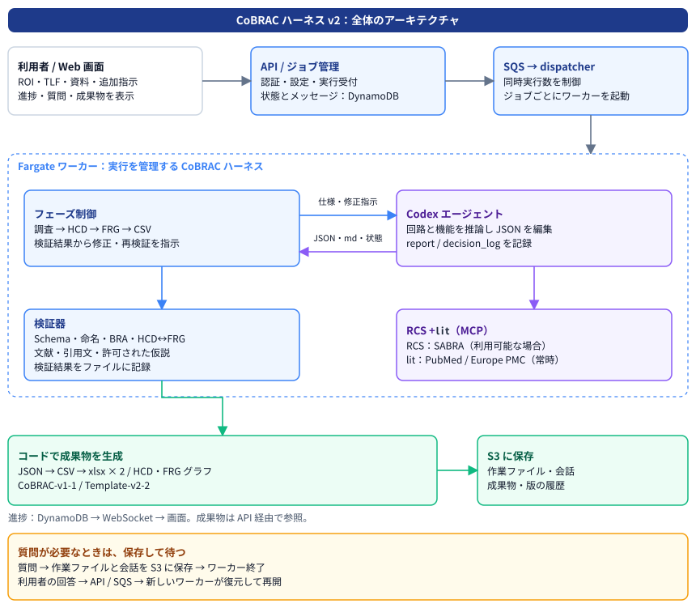
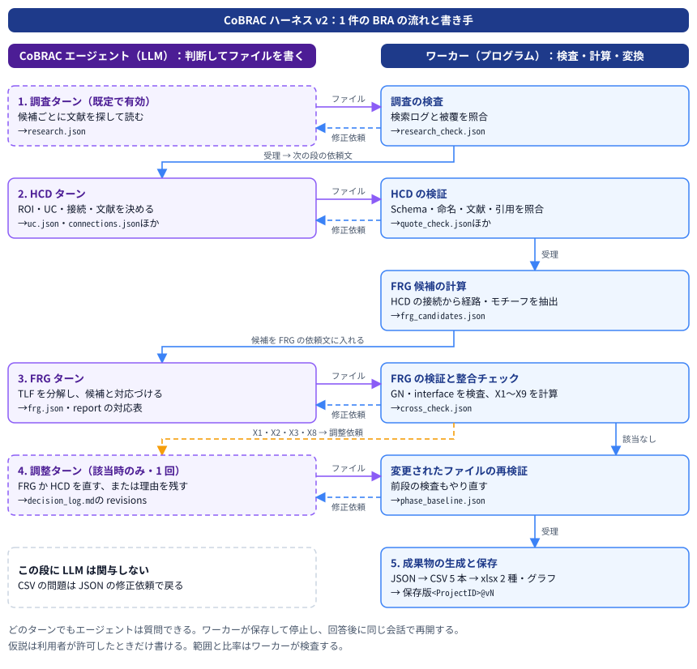

# CoBRAC ハーネス v2 現行仕様

CoBRAC ハーネスは、脳領域（ROI）と機能（TLF）から BRA を作るエージェントを動かす仕組みです。**エージェントが文献を調べて HCD と FRG を作り、ワーカーが工程を進め、ファイルを検証し、成果物に変換します。** FRG を作って初めて HCD の不足が分かったときは、根拠を確認して HCD に戻れます。

ここで説明するのは、アプリ **0.36.1 時点のハーネス v2** です。v2 導入後の命名規則、ROI の扱い、FRG の組み立て方、仮説モード、保存版も含みます。独立した v2.1 などの版番号はまだなく、新規プロジェクトには検証ルール **`harnessRules: 2`** が適用されます。ハーネス名・アプリ版・検証ルール・Excel 形式の番号は別のものです。

まず全体のアーキテクチャと処理の流れを説明し、その後で各工程に入ります。プロンプト原文、ファイル一覧、検査表、具体例は、それぞれの **「詳細を表示」** を開くと読めます。

## 1. 全体のアーキテクチャ

### 1.1 利用者からワーカーまで

利用者が画面から ROI、TLF、指示、参考資料を送ると、API がプロジェクトとジョブを記録し、キュー（SQS）に実行を依頼します。dispatcher は同時実行数を確認し、ジョブごとに Fargate のワーカーを起動します。基本は Spot、起動できない場合は On-Demand を使います。

ワーカーの中で動く Codex エージェントが、文献を調べ、脳領域を同定し、データファイルを書きます。ワーカーは、各段階の仕様と問題一覧をエージェントに渡し、結果をコードで検査します。エージェントの「終わりました」という返答だけでは次の段階には進みません。



### 1.2 考える部分と機械的に処理する部分

**エージェントの仕事**は、文献の選択、UC の粒度、情報の意味、機能の分解など、科学的な判断が必要な部分です。機械用の JSON と、人が読む `report.md`、判断の理由を残す `decision_log.md` を編集します。

**ワーカーの仕事**は、実行順序、JSON Schema、ID と参照の整合、命名、文献・引用文の照合、出力変換、保存と再開です。CSV はエージェントに書かせず、JSON からコードで生成します。同じデータを xlsx とグラフへ渡すので、別々に書き直した表が食い違うのを防げます。

**外部ツールの役割**も分かれています。`lit` は PubMed / Europe PMC の文献と原文を取得します。RCS は領域名を SABRA の単位に結び付けます。Canon は複数の BRA でそろえる回路定義を、固定された版の制約として渡します。参考資料は利用者の意図を知る入力であり、検証済み文献の代わりにはなりません。

<details>
<summary>詳細を表示：用語と版番号の対応</summary>

| 用語 | このハーネスでの意味 |
| ---- | ---- |
| BRA | Brain Reference Architecture。脳の構造と機能の対応を記述するデータ |
| ROI / TLF | 対象の脳領域 / その領域で説明する最上位の計算機能 |
| HCD | 文献に基づく UC と Connection で表す脳の情報処理グラフ |
| UC | Uniform Circuit。この HCD が均質な情報を表現するとみなす神経集団 |
| Collection | より細かい回路へ分けた領域のまとまり。接続の端や FRG の葉にはしない |
| BIF | 組織間の解剖学的投射を示す文献根拠。UC 間の Connection の根拠になる |
| FRG / GN | TLF を階層的に分解する Function Realization Graph / 中間の機能を表す Group Node |
| SABRA / RCS | 新皮質の BNA とそれ以外の DHBA を使う混合アトラス / 領域名からその単位を探す ROSETTA Candidate Search |
| Canon | プロジェクト間で共有する回路定義と、その変更の承認履歴 |

| 番号 | 対象 | 現行の値 |
| ---- | ---- | ---- |
| ハーネスの世代名 | HCD と FRG の往復を含む実行方式 | v2 |
| アプリ版 | Web・API・ワーカーを含むリリース | 本文の仕様基準は 0.36.1 |
| `harnessRules` | プロジェクトに保存される検証規則 | 新規は 2。0 は従来規則、1 は ROI 規則、2 は GN 規則も適用 |
| BRA の CSV 形式 | `Project.csv` の BRA version | `CoBRAC-v1-1` |
| 公式 xlsx | 出力先の BRA テンプレート | `Template-v2-2` |
| BRA 保存版 | あるプロジェクトの成果物の履歴 | `<ProjectID>@v1`、`@v2` など。ハーネスの世代とは無関係 |

旧プロジェクトでは、作成時の `harnessRules` や SABRA 境界を引き継ぎます。アプリが新しくなっただけで、すべての既存 BRA に新しい制約を一律適用するわけではありません。

</details>

## 2. 1 件の BRA ができるまで

### 2.1 通常の実行

新規作成では、既定で有効な**調査ステップ**が投射の候補と文献を集めます。次に **HCD** が UC と接続を定義し、**FRG** がそれらで TLF をどう実現するかを組み立てます。調査を無効にした場合は HCD から始まりますが、文献ツールと文献の検証は使われます。

FRG の後、ワーカーは HCD と FRG の整合を検査します。所定の食い違いがあると**調整ターンを実行ごとに 1 回**送ります。FRG の分解を直すか、根拠を得て HCD の UC・接続を直すかをエージェントが判断します。その後、コードが CSV 5 本、xlsx、グラフを生成し、成果物と生成条件を保存版にします。



### 2.2 質問とフォローアップ

利用者の判断が必要なとき、エージェントは `status: "question"` を返します。ワーカーは作業ファイルと Codex の会話を S3 に保存して終了します。回答が届くと新しいワーカーが復元し、同じ会話を再開します。質問への返答を待っている間は Fargate を動かし続けません。

完成後の追加指示も、同じファイルを入力として受け取ります。HCD と FRG の両方の仕様を再提示し、関連する ID、接続、インターフェース、レポートをそろえて直します。CSV と xlsx は再生成し、成果物は新しい保存版になります。

### 2.3 検証に通らないとき

HCD・FRG・CSV の各段では、問題を列挙して修正を依頼します。既定は各段で最大 3 回です。それでも問題が残る場合、データを読み込めない致命的な問題なら失敗にし、読み込める場合は未解決の問題を警告として残して進みます。調整後の修正には別枠があります。

そのため、**ジョブの完了は、すべての検査が合格したことや、科学的な正しさを保証するものではありません。** 残った警告、未照合の引用、調査の不足、仮説への依存は、成果物と一緒に読む必要があります。

## 3. エージェントに何を渡すか

ワーカーは作業場所に共通ルール `AGENTS.md` と `schemas/` を用意します。ターンごとの入力は、利用者にも表示する短い依頼、内部で付ける仕様、返答言語の指示を区切って連結します。仕様を画面上の短い依頼から省いていても、エージェントには渡しています。

仕様は単一の長い文章に固定されていません。HCD には ROI 規則と Canon の条件、FRG には GN 規則と HCD から計算した候補、調査モードには調査結果を使う指示、仮説モードには許された範囲を足します。**基礎仕様と追加規則を合わせたものが、そのプロジェクトの実際の指示です。**

<details>
<summary>詳細を表示：ターン別のプロンプトの組み立て</summary>

| ターン | 表示する依頼 | 内部で加える内容 |
| ---- | ---- | ---- |
| 調査 | Project ID、ROI、TLF、Contributor、参考資料の場所、調査開始 | `RESEARCH.md` の Project ID と候補数・時間・検索数を展開 |
| HCD | プロジェクト情報と `Run phase HCD.` | `HCD.md`、rules 1 以上なら ROI 規則、Canon 制約、必要時に RCS 利用不能の注記 |
| FRG | プロジェクト情報と `Run phase FRG.` | `FRG.md`、rules 2 なら GN 規則、最新の `frg_candidates.json` の候補 |
| 調査モードの HCD・FRG | 各段と同じ | `research_mode.md`。調査結果の利用、追加調査、FRG の理論・計算モデルの文献調査 |
| 仮説モードの HCD・FRG | 各段と同じ | `HYPOTHESIS.md`。許可 scope、仮説率の上限、調査モードの有無を展開 |
| 検証の修正 | 問題数、修正回数、最大 30 件の問題、ファイルを直す指示 | 修正ターンの推論レベルをプロジェクト値と medium の低い方にする |
| 整合の調整 | X1・X2・X3・X8 の所見と意味、片方または両方を直す依頼 | 根拠に基づく選択と revisions 節への記録を要求。通常の推論レベルを使う |
| 質問への回答 | 利用者の回答と継続指示 | 新しい会話から再開する場合だけ、プロジェクト情報と仕様を補う |
| 途中からの再試行 | 既存ファイルを読んで未完了の段を終える指示 | 必要な仕様。完成したファイルを作り直さない |
| フォローアップ | プロジェクト情報、追加指示、許可された仮説 scope | HCD と FRG の両仕様、調査・仮説モードの追加規則 |
| CSV | 通常の生成ターンなし | ワーカーが変換。問題があれば JSON 修正の依頼を送る |

以下は形式を示す例で、`<...>` は実行時の値です。

```text
Project ID: <ProjectID>
ROI: <ROI または調査で決める指示>
TLF: <TLF または調査で決める指示>
Contributor: <Contributor>

Run phase HCD.

---

<HCD 仕様とこのプロジェクトの追加規則>

---

<利用者への message / question の返答言語>
```

```text
The validator found <N> problem(s) in phase HCD (fix attempt <i>/3):
- <ファイル名・JSON ポインタ・問題>

Fix them in the files and finish with status "done".
```

ターンの終わりはスキーマ付きの JSON です。`done` は「このターンの作業を終えた」という意味で、ワーカーによる受理とは別です。

```json
{"status":"done","message":"<実施内容の短い説明>","question":null}
```

```json
{"status":"question","message":"<現状>","question":"<根拠・選択肢・推奨を含む質問>"}
```

成果物の JSON 値、レポート、判断ログは英語です。`message` と `question` は画面の言語に従います。別のターンで作る成果物の解説記事は、指定された言語で書きます。

</details>

実際の共通ルールと各仕様の全文は [12 章](#12-プロンプト原文) にあります。

## 4. データファイルを正本にする

会話が長くなっても、生成の途中結果はプロジェクトのファイルに残ります。HCD は `references.json`、`uc.json`、`connections.json`、FRG は `frg.json` です。形は `HARNESS_SCHEMAS` で定義し、エージェント用の `schemas/` と検証器で同じ定義を使います。

人が読む説明は `report.md` にまとめ、HCD・FRG・限界・参考文献を記載します。`decision_log.md` は結論を選んだ理由、採らなかった案、利用者の回答、変更の理由を追記する記録です。検索の生ログを判断ログに転記する必要はありません。

<details>
<summary>詳細を表示：ファイル一覧と書き手</summary>

以下の `{P}` は Project ID です。各パスはプロジェクトフォルダからの相対パスです。

| ファイル | 書き手 | 内容と使い道 |
| ---- | ---- | ---- |
| `meta.json` | エージェント | ROI、TLF、説明、表示名。現行規則では ROI の要素・左右・左右の根拠も記録 |
| `{P}_HCD/references.json` | エージェント | Reference ID、DOI / PMID、書誌、文献種別 |
| `{P}_HCD/uc.json` | エージェント | UC と Collection、記述子、ROI 内外、機能項目、インターフェース |
| `{P}_HCD/connections.json` | エージェント | 組織間の BIF と UC 間の接続。接続 1 レコードにつき文献 1 本 |
| `{P}_FRG/frg.json` | エージェント | TLF と GN。UC は `subnodes` の参照として入る |
| `report.md` | エージェント | Overview、HCD、FRG、Limitations、References。仮説があれば Hypotheses |
| `decision_log.md` | エージェント | 日付付きの判断記録と `HCD-FRG revisions` |
| `research.json` | エージェント | 調査計画、候補、検索、証拠、被覆、不足点。調査モード時 |
| `research_queries.jsonl` / `rcs_mcp_calls.jsonl` | ワーカー | 文献検索・RCS 呼び出しの記録 |
| `research_check.json` | ワーカー | 調査の被覆と検索ログの照合 |
| `reference_check.json` / `quote_check.json` | ワーカー | 文献の実在性、引用文の原文照合、引用使い回しの警告 |
| `frg_candidates.json` | ワーカー | HCD から求めた経路、連結成分、モチーフ、接続ペア |
| `cross_check.json` | ワーカー | HCD と FRG の整合所見と件数、調整の記録 |
| `phase_baseline.json` | ワーカー | 段階検証時のハッシュと残っていた問題。後段での変更検知に使う |
| `hypotheses.json` | ワーカー | 仮説の番号、比率、根拠のある経路の有無、依存する GN |
| `{P}_CSV/*.csv` | ワーカー | Project、References、Circuits、Connections、FRG の 5 表 |
| `{P}_CSV/bibliography.json` | ワーカー | 公式テンプレートの References 用に照合した書誌情報 |

`schemas/`、`materials/`、`canon/` はプロジェクトフォルダの外に用意する補助入力です。資料とワーカーが書くファイルは参照用で、指示ではエージェントによる変更を禁止しています。検査はワーカーがデータファイルから実行します。

</details>

## 5. 調査ステップで根拠を集める

調査の単位は、ROI の主な入力、出力、内部投射の**候補**です。総説を入口にし、候補ごとに領域名の同義語、種、追跡法を変えて検索します。論文の要旨または全文を読み、支持の強さと、何を調べても見つからなかったかを分けて `research.json` に残します。

ワーカーは、エージェントが書いた検索文字列が実際のログにあるか、被覆の `found` が証拠と一致するかを検査します。単なる検索回数の充足と、望ましい証拠が見つかったことは別です。調査で残った不足は HCD とレポートへ引き継ぎます。

<details>
<summary>詳細を表示：調査の予算とチェックリスト</summary>

| 項目 | 現行の値・規則 |
| ---- | ---- |
| 候補数 | 最大 40 |
| 検索 | 候補ごとに異なる検索を 2 件以上。少なくとも 1 件は PubMed または Europe PMC |
| 証拠 | DOI または PMID、種、測定法、知見、実際に読んだ場所を記録 |
| 被覆 | tract tracing、霊長類、齧歯類、細胞種・層ごとに `found` / `searched_none` / `not_applicable` |
| 候補の状態 | `supported` / `weak` / `not_found` / `contradicted`。支持以外では理由を記録 |
| 修正 | 最初のターンの後、最大 2 回 |
| 時間 | 標準 60 分。残り 10 分未満では新しい修正ターンを始めない。設定で変更可能 |
| 推論 | 調査の本ターンはプロジェクト値を high 以上に引き上げる。修正は medium 以下 |
| 不足・時間切れ | 警告と記録を残して HCD に進む。文献が網羅されたとみなす仕組みではない |

`lit` の検索は既定 8 件（1〜25 件を指定可能）、`find_sentences` は最大 8 文を返します。全文が取得できる場合は全文、できない場合は要旨を使います。必要な箇所を小さく取得し、その原文から引用します。

</details>

## 6. HCD で脳領域と情報の流れを定義する

### 6.1 ROI と UC の粒度

最初に ROI が TLF を実現できるか、どの情報が ROI に入り、何が出るかを確認します。ROI や TLF が空なら調査で補い、選択肢のうち利用者が決める必要がある場合は質問します。

現行の ROI 規則では、ROI に含まれる各領域を `roiElements` に記録し、各要素を代表する内部 UC を最低 1 つ割り当てます。異なる ROI 要素を 1 つの UC で兼ねず、すべての内部 UC をどれかの要素に所属させます。利用者の左右指定がなければ**両側**として扱い、機能が側性化しているだけで勝手に片側へ限定しません。

UC の Uniform は、その HCD が選ぶ粒度での判断です。領域内の部分が異なる投射や機能を持つなら、根拠を示して UC を分けます。分けた元の領域は必要に応じて Collection にします。Collection は構成関係を表すもので、接続の sender / receiver や FRG の葉として使いません。

### 6.2 SABRA に固定した名前

UC のキーは **UC Descriptor**、読みやすい別名は **Circuit ID** です。現行の SABRA 境界では新皮質だけを BNA、それ以外を DHBA 名を持つ HOMBA の語に固定します。海馬、内嗅皮質、扁桃体、基底核、視床も後者です。

通常はアンカーだけを使い、同じ単位の中で異なる集団を区別する必要がある場合に限り、細胞種や層などのファセットを付けます。BNA は左右ペアをアンカーにし、片側は `side` で区別します。RCS の問い合わせとワーカーの照合で、略称の独自解釈を抑えます。

<details>
<summary>詳細を表示：現行の命名例と検査項目</summary>

| 対象 | UC Descriptor | Circuit ID |
| ---- | ---- | ---- |
| 腹側被蓋野 | `HOMBA:12261` | `VTA` |
| 側坐核 | `HOMBA:10339` | `NAC` |
| 左側の A4ul | `BNA:57-58/side:left` | `A4ul(left)` |
| VTA 内の DA 集団 | `HOMBA:12261/nt:DA` | `VTA(DA)` |

| 検査 | 確認する内容 |
| ---- | ---- |
| アンカー | 現行の SABRA 境界に属する BNA ペア / BNAG / HOMBA。旧プロジェクトの境界は保存された設定に従う |
| 記述子 | ファセットの順序、値、左右、重複の禁止 |
| Circuit ID | 先頭が正式略称と一致すること。括弧内はファセット順に `.` で区切り、左右は最後 |
| 名前 | `names` の先頭が SABRA の正式名であること |
| 対応 | Circuit ID の各項目が記述子のファセットに対応すること |
| 一意性と粒度 | 同じ記述子の重複、粗い UC とその内側の細かい UC の重複、非均質な sender を確認 |

`A4ul@L` や `NAC(shell,DRD1+)` は旧式です。現行の例として使いません。RCS が利用不能なら、その旨を判断ログに書いて生成を続けますが、外部照会による略称確認には欠落が残ります。

</details>

### 6.3 接続の根拠とインターフェース

BIF は文献が述べる組織間の投射、Connection はその根拠を UC 同士へ対応させたものです。**接続レコード 1 行に文献 1 本**を対応させ、同じ投射を複数論文で支える場合は論文ごとに行を作ります。種、測定法、論文中の領域名、UC との包含関係、原文または図への参照をその行に持たせます。

内部 UC のインターフェースは接続から決まります。入力は送り手、出力は受け手です。`outputSemantics` は自分自身が表現する情報を計算論的に説明します。これに Requirement、Requirement realization、Capability、Mechanism、Implementation を加え、TLF に必要な役割から実装の式までをつなげます。

<details>
<summary>詳細を表示：HCD の 8 手順と記述のチェックリスト</summary>

| 手順 | 記録すること | 確認点 |
| ---- | ---- | ---- |
| 1 ROI / TLF | `meta.json` と判断ログ | ROI_Input / ROI_Output、各 ROI 要素と UC、左右の値と根拠 |
| 2 BIF | `references.json`、`connections.json` の `bif` | 組織間の投射を調べ、文献と文献種別を記録 |
| 3 UC | `uc.json` | 内部 / 外部を区別。名前、均質性、粒度、必要時の Collection |
| 4 Connection | `connections` と UC の `interface` | 1 レコード 1 文献。すべての端点・引用・入出力をそろえる |
| 5 Output Semantics | UC の `outputSemantics` | 自分の ID の 1 項目で情報を説明。出力のない外部 sink は空にできる |
| 6 機能項目 | UC の 5 項目 | Requirement は TLF に対する計算、realization は interface との対応、Capability は意味を外した一般化、Mechanism は実現機構、Implementation は入出力を結ぶ式のみ |
| 7 検証 | ファイルと残る論点 | ROI の入力から出力までの経路、欠落・重複、粒度、TLF を実現できるか |
| 8 レポート | `report.md` | Overview、HCD、Limitations、References。FRG 節は次の段で追加 |

外部 UC の `roi` は `noROI(input)` / `noROI(output)` / `noROI(input,output)`。内部は `internal` です。外部 UC には内部 UC 用のインターフェースや 5 つの機能項目を書きません。

| 接続の欄 | 意味 |
| ---- | ---- |
| `senderRelation` / `receiverRelation` | UC が論文中の領域より細かければ `<`、同じなら `=`、UC のほうが広ければ `>` |
| `senderInLiterature` / `receiverInLiterature` | 論文が実際に使う領域名。粗い領域の証拠を細かい UC に使う場合も、粒度の違いを明示する |
| `taxon` / `measurementMethod` | その論文の種と測定法を BRA の選択肢で記録 |
| `pointersOnLiterature` | この投射を述べる原文をそのまま引用。最低 10 語。要約やページ番号ではない |
| `pointersOnFigure` | `Fig. 3B` などの図番号。原文引用と図番号の少なくとも一方が必要 |

</details>

## 7. FRG で機能と回路を突き合わせる

### 7.1 上からの分解と下からの解釈

FRG は、TLF を論理的に分解する作業と、HCD の回路が何を計算するかを読む作業を合わせます。最初から回路の形を写すだけにならないよう、上からの分解を先に考え、重複や過剰な分解を整理します。

一方、ワーカーは HCD の接続から、ROI 入力から出力への経路、内部の連結成分、3〜4 UC のモチーフ、接続のあるペアを計算します。エージェントはそれぞれの候補を、Output Semantics、機能項目、興奮・抑制・修飾の符号、文献に照らして解釈します。

両者を対応させた結果を、レポートの FRG 節に表として残します。対応がないときは機能分解を修正するか、根拠に基づいて HCD に戻ります。制約を満たす数合わせだけで UC や接続を足すことはできません。

### 7.2 GN が表すもの

GN の意味は、UC の機能を列挙したものにとどまりません。**UC と、その間の接続による相互作用が実現する計算**です。rules 2 では GN の UC が内部で連結していることを検査します。通常は最大 2 UC、2 つずつでは表せないモチーフは理由と引用を `motifNote` に書いて 3〜4 UC を認めます。5 UC 以上は認めません。

GN のインターフェースは、子のインターフェースを合わせ、GN の内部で閉じる辺を取り除いて作ります。これを上へ合成し、TLF 全体では ROI の外部入力と外部出力になるようにします。GN の Output Semantics は、外へ出力する UC の値からワーカーが導出します。

<details>
<summary>詳細を表示：FRG の対応結果と作成規則と検査</summary>

| 対応結果 | 意味 | 取る対応 |
| ---- | ---- | ---- |
| `matched` | 下位回路が上位の副機能を実現する | ペア / モチーフを GN にし、上へまとめる |
| `top-down only` | 副機能に対応する候補がない | 上位 GN として残す・親へ統合、文献のある不足を HCD へ追加、ROI 外なら除外して限界へ記録 |
| `bottom-up only` | 回路候補に対応する副機能がない | 分解で漏れた機能を加える、または別の GN で TLF に寄与する理由を書く |
| `mismatch` | 必要な UC 同士がつながっていない | FRG の分解、または根拠のある HCD の接続を修正 |

レポートの対応表の列は `sub-function (GN ID)` / `candidate (IDs and UCs)` / `outcome` / `action` です。

| 作成規則と検査 | 現行の制約 |
| ---- | ---- |
| グラフ | TLF の根が 1 つ、循環なし、すべての GN に子がある |
| 葉 | ROI 内部の UC をすべて含める。外部 UC と Collection は葉にしない |
| GN の UC 数 | 通常最大 2。3〜4 は `motifNote` が必要、5 以上は不可 |
| UC だけを子に持つ GN | 最低 2 UC。UC 1 つの言い換えにはしない |
| UC の所属 | GN の親は最大 2 つ |
| 連結 | GN の UC 同士が、方向を無視した ROI 内部の接続で連結。途中の UC も含める |
| インターフェース | 実在する ID と構文を通常検査。子から合成して内部辺を除くことを指示し、接続との入出力の過不足は X1 / X3 で調整へ返す |
| 機能項目 | Requirement、realization、Capability、Mechanism の記載と参照 ID を通常検査。interface の UC の説明不足は X6 に記録 |
| HCD への変更 | 文献・引用・interface・機能項目・ROI 要素・左右をそろえて更新し、再検証 |

`FRG.md` の基礎仕様には従来の「最大 2 UC」が残っていますが、rules 2 では後ろに付く `FRG_gn_rules.md` が UC 数の 2 条件を置き換えます。

</details>

## 8. 検証と HCD への戻り道

### 8.1 何をコードで確認できるか

スキーマ、ID、列の値、引用の形式、接続とインターフェースの対応は決定的な検査です。文献は Crossref / PubMed、引用は取得した原文と照合します。引用の照合は文字の正規化と類似度（既定 0.9 以上）を用いるので、結果の「一致」は逐字完全一致だけを指しません。原文との対応を確認できたことと、その論文がこの神経科学的な主張を十分に支えることは異なります。後者には人の評価が必要です。

<details>
<summary>詳細を表示：検証の層と結果の読み方</summary>

| 層 | 主な確認 | 結果の限界 |
| ---- | ---- | ---- |
| JSON Schema | 必須キー、型、列挙値、余分なキー | 正しい形でも内容が正しいとは限らない |
| HCD / FRG | ID、参照、内外、Collection、interface、階層、現行 ROI / GN 規則 | 生物学的・計算論的な妥当性を完全には判定しない |
| SABRA | 記述子、略称、正式名、境界と左右 | RCS が使えない場合の外部照合には欠落がある |
| BRA 値 | 文献種別、種、測定法、式、原文・図番号、1 接続 1 文献 | 許された値の使用と科学的根拠の強さは別 |
| 文献照合 | DOI / PMID を Crossref / PubMed と照合 | 書誌の実在性はその主張の保証ではない |
| 引用照合 | 引用が全文または要旨に存在するか | 図の内容や主張の含意まで自動保証しない |
| 調査 | 実際の検索ログと被覆の一致 | 検索しなかった文献の不存在を証明しない |
| Canon | 固定版との回路定義・文献の衝突 | Canon 自体の定義にはレビューが必要 |
| 仮説 | 許可範囲、claim、前提、比率、表示 | 前提の照合は仮説の実証ではない |
| HCD / FRG 整合 | X 系の所見と調整 | 記録・調整の仕組みであり、全所見ゼロの保証ではない |

| 引用の状態 | 意味 | 扱い |
| ---- | ---- | ---- |
| `verified_fulltext` | 取得した全文で原文と一致 | 全文との一致として記録 |
| `verified_abstract` | 要旨で一致 | 要旨との一致として記録 |
| `not_found` | 全文を取得できたが引用が見つからない | 近い箇所などを返し、修正を依頼 |
| `unverified` | 全文が取れず、要旨でも一致を確認できない | 未検証として残す。照合済みとは扱わない |

同じ引用と図を異なる回路の接続に使い回している場合は `reused` の警告も記録します。図番号のみの根拠は図の内容まで照合したことにはなりません。

</details>

### 8.2 整合チェックと調整

X1・X2・X3・X8 の所見があれば、ワーカーは調整を依頼します。エージェントは、HCD が正しければ FRG を直し、細かい集団や欠けた投射の根拠があれば HCD を直します。直さない判断も理由とともに残します。

ワーカーは受理時点のファイルのハッシュを保持します。FRG や CSV の段で HCD が変われば HCD の検証を再実行し、以前から残っていた問題と、新しく増えた問題を区別します。HCD を直した後も古い検査結果のまま成果物を作る、という抜け道を防ぐためです。

<details>
<summary>詳細を表示：X 系の全チェックと調整記録</summary>

| コード | 所見 | 現行の動作 |
| ---- | ---- | ---- |
| X1 | GN の interface が、HCD にある外への出力・外からの入力を取りこぼす | 調整の契機 |
| X2 | HCD 接続から求めた ROI 入出力と `noROI` タグが一致しない | 調整の契機 |
| X3 | GN の interface が、HCD 接続にない入出力を要求する | 調整の契機 |
| X4 | GN の UC 間が非連結 | rules 0 / 1 のみ記録。rules 2 では FRG の通常検査で確認 |
| X5 | 内部 UC が、所属する GN の機能文に登場しない | 記録 |
| X6 | Requirement realization が interface の UC をすべて説明していない | 記録 |
| X8 | TLF が直接 UC に載る、GN が 1 つ、内部 UC が 3 未満など、FRG が潰れている可能性 | 調整の契機 |
| X9 | 内部 UC が回レベルの BNAG 全体または複数 SABRA 単位にまたがり、粗すぎる可能性 | 記録 |

実装に X7 はありません。X4 を含む定義は 8 種類で、rules 2 では X4 を算出しません。所見の severity と、パイプラインを即時停止するかどうかは別です。

調整は実行ごとに最大 1 回、その後の通常検証の修正は既定で最大 3 回です。残った所見は保存されます。判断ログでは次のタグを使います。

```text
## HCD-FRG revisions
- [FRG->HCD] <HCD の変更> — <FRG が必要とした理由> [Author, Year]
- [HCD->FRG] <FRG の変更> — <HCD に合わせる理由>
- [instruction] <変更> — <利用者の指示と根拠>
- [kept] <残した食い違い> — <変更しない理由>
```

</details>

## 9. 仮説を許可する場合

既定は文献で支持されたデータだけです。**「仮説を許可」を明示して作成するか、追加指示とともに許可範囲を設定した場合**に限り、直接の根拠がない接続や UC の性質を仮説として含められます。指示の文章に「仮説で」と書くだけでは許可範囲は広がりません。

緩めるのは、その主張自体を論文が直接述べているという条件です。前提となる論文、DOI / PMID、前提の原文引用、命名、スキーマ、interface、FRG、Canon の検査は続けます。文献が反証している主張は採りません。

仮説はデータと図で識別し、レポートの Hypotheses 節に根拠と比率を示します。入力から出力への経路が仮説接続なしには成立しない場合は、その事実を Limitations に書きます。仮説の検証実験や次の研究を勝手に提案することは、このモードの指示に含めていません。

<details>
<summary>詳細を表示：仮説の許可範囲とチェックリスト</summary>

| 項目 | 規則 |
| ---- | ---- |
| 接続の claim | `existence`、`direction`、`sign` |
| UC の claim | `population`、`transmitter`、`modulation`、`role` |
| scope | HCD 全体、または選択した回路 / GN。1 つの scope が対象とすべての claim を許可すること |
| 前提 | 実在する文献を最低 1 本。`premises` に Reference ID、`rationale` に推論の理由 |
| 推論の種類 | `published`、`homology`、`analogy`、`indirect`、`model`、`functional-need` |
| 調査 | まず直接の根拠を探す。調査モードでは `weak` / `not_found` の候補と対応させる |
| 比率 | 接続と UC を別々に数え、各々の仮説率が上限以下。既定 20%、選択肢は 10 / 20 / 30 / 50% |
| 分母 | 接続はレコード数、UC は内部と外部を含む。Collection は含めない。分母を薄めるためだけの追加は禁止 |
| 存在の仮説 | 接続の測定法を `Hypothetical` にする。他の claim だけなら前提の測定法を使う |
| 集団の仮説 | `sourceOfId: makeshift`。SABRA 単位そのものではなく、その内側の細かい集団に限る |
| 追跡 | ワーカーが UC、接続の順で H1、H2…を付ける。追加・削除で番号は変わりうる |
| 出力 | Comments の `Hypothesis (...)`、GN の `Depends on hypotheses`、グラフの H 表示と仮説非表示 |
| 共有 | 仮説は Canon の共有定義へ持ち込まない。仮説を含む保存版は現状 BRA-DB に登録できない |

接続の引用文が支えるのは**前提**です。仮説となる接続そのものを確認した引用として読まないことが重要です。

</details>

## 10. Canon と保存版とオーケストレーター

### 10.1 Canon の制約

Canon に参加したプロジェクトは特定の rev に固定され、ワーカーがその定義を読み取り専用の `canon/` に置きます。同じ回路の名前、Uniform / Collection、分け方、接続、文献を生成時の制約にし、衝突を検査します。Canon が Uniform とする回路を独断で分割することはできません。

役割は区別します。共有するのは神経集団としての定義で、TLF に依存する機能・役割はプロジェクト側に残ります。仮説も共有定義には混ぜません。定義を変更したい場合は Canon への取り込み依頼と人の承認を通します。AI レビューは所見を出す機能で、承認の代わりではありません。

### 10.2 どの条件で作った BRA か

完成した BRA ジョブは成果物を凍結して保存版にします。後からファイルが変わっても、その版の成果物と条件を参照できます。アプリ版だけでなく、プロンプトとスキーマのハッシュ、モデル、推論レベル、調査モード、Canon rev、SABRA 境界、検証ルール、仮説の設定を記録します。これは出力と来歴を固定する仕組みであり、モデルを再実行して同じ出力になる保証ではありません。

### 10.3 複数 BRA を動かす上位の仕組み

CoBRAC オーケストレーターは、複数の ROI × TLF を計画の行にし、依存関係と同時実行数に従って通常の BRA ジョブを起動します。単一 BRA の内部はここまでのハーネスと同じです。

Canon を使う計画では、先行する種の BRA の取り込み承認を待って次へ進みます。後続の行も Canon への取り込みが承認されて完了します。Canon が進んで衝突したときの更新は行ごとに最大 2 回で、残る衝突は人の判断に渡します。複数件の進行管理と、1 件の HCD / FRG の構築を混同しないための境界です。

## 11. 出力と運用で確認すること

### 11.1 同じ JSON から成果物を作る

`buildCsvs` が 5 つの CSV を作り、`csv_to_excel.py` が CoBRAC 形式の xlsx を作ります。同じデータを公式 Template-v2-2 のブックにも書き込み、`buildGraphs` が HCD / FRG のグラフを作ります。レポートと判断ログは、エージェントが書いた文章をそのまま閲覧・ダウンロードできるようにします。

公式テンプレートの生成だけが失敗した場合、CoBRAC 形式の xlsx とグラフでジョブが完了することがあります。必要な形式が揃っているかは、ジョブ状態だけでなく出力を確認します。

### 11.2 長いジョブと費用

実行中は 5 分ごとに作業場所と会話を保存し、Spot 中断の SIGTERM でも保存します。ハートビートが途絶えたジョブは janitor が回復を試みます。会話が大きすぎて再開できない場合は、新しい会話から既存ファイルと判断ログを読んで続けます。

会話の自動圧縮は既定 75,000 トークンです。ツールの結果を小さくし、ファイルを部分編集し、修正ターンだけ推論レベルを抑えます。費用はモデルの入力・キャッシュ入力・出力の使用量と単価から計算し、同じ会話の累計値をターンごとに重ねて足さないようにしています。過去の速度・費用の測定は [09 の記事](./09_BRA_speed_and_cost_ja.md) にありますが、その数値を現行の全ジョブの保証には使いません。

API キーは暗号化して保存し、ワーカー内で使用します。エージェントのシェルには AWS の認証情報を渡しません。管理者向けのこの文書と、すべての利用者向けの操作マニュアルも別の公開範囲です。

<details>
<summary>詳細を表示：完成した BRA を読むためのチェックリスト</summary>

| 確認 | 見る場所 | 判断すること |
| ---- | ---- | ---- |
| 対象 | メタ情報、Overview | ROI / TLF、左右、種、入出力が意図どおりか |
| 構造 | HCD、FRG、表 | UC の粒度、ROI 内外、Collection、処理の流れ、機能の階層が妥当か |
| 根拠 | 文献、接続、検査結果 | 実在する文献か、原文照合の状態、論文がどの粒度・種・方法で何を示したか |
| 機能との対応 | report の FRG 対応表 | 上からの副機能と下からの候補がどう一致したか、未対応をどう扱ったか |
| 往復 | `cross_check.json`、判断ログ | 調整の理由、残した食い違い、未解決の警告 |
| 調査の限界 | `research_check.json`、Limitations | 未探索・未発見・反証を区別できるか |
| 仮説 | Hypotheses、H 表示、`hypotheses.json` | 許可範囲、比率、前提、仮説を除いた経路があるか |
| 出力 | ダウンロード、保存版 | 必要な xlsx 形式・CSV・グラフ・レポートが揃っているか |
| 来歴 | 保存版の生成条件 | モデル、プロンプト、ルール、SABRA 境界、Canon の版を確認できるか |

</details>

## 12. プロンプト原文

以下は実装が読み込む共通ルールと仕様の全文です。英語の原文を保っています。`{P}` などは実行時に展開されます。追加規則が基礎仕様を上書きする部分と、プロジェクト条件によって付く部分を合わせて読む必要があります。動的に加わる依頼、問題一覧、Canon の制約、FRG 候補の組み立ては [3 章](#3-エージェントに何を渡すか) のとおりです。

<!-- BEGIN HARNESS PROMPTS -->

<details>
<summary>詳細を表示：原文の読み方・追加ルールの優先順位・差し込み値</summary>

以下はリポジトリにある英語の指示ファイルの全文です。実行時には差し込み値を埋め、プロジェクトの設定に応じて連結します。`AGENTS.md` は作業場所で Codex が読む共通ルールで、フェーズごとの本文とは別に適用されます。

**原文の基本仕様だけで実効ルールを判断しないでください。** [`rawPhaseSpec() / phaseSpec()`](https://github.com/miyamoto9265/cobrac-web/blob/main/packages/worker/src/index.ts) は HCD の後ろに ROI ルール（`harnessRules >= 1`）、FRG の後ろに GN ルール（`harnessRules >= 2`）を追加します。GN ルールは FRG 基本仕様の step 5 にある UC 数の制約を置き換えます。現在のルールでは GN 内の連結性が必要で、通常は最大 2 UC、引用を伴う `motifNote` で分割できないモチーフを説明した場合は 3〜4 UC を認め、5 UC 以上は認めません。

調査モードでは `research_mode.md`、仮説モードでは `HYPOTHESIS.md` をさらに追加します。仮説ルールは許可された範囲だけに適用され、範囲外の文献根拠の要件は変わりません。FRG 候補、Canon の案内、RCS が使えない場合の案内、プロジェクトのヘッダや検証結果などの動的な本文は、この静的な原文一覧には含めません。

| 差し込み値 | 実行時の値 |
| --- | --- |
| `{P}` | 実際の Project ID。`<ProjectID>` など山括弧の表記は説明用の例で、自動置換のトークンではありません。 |
| `{MIN_QUOTE_WORDS}` | [`DEFAULT_BRA_RULES`](https://github.com/miyamoto9265/cobrac-web/blob/main/packages/shared/src/bra.ts) の `minQuoteWords`（10 語）。 |
| `{MAX_CANDIDATES}` / `{MIN_QUERIES}` | [`RESEARCH_BUDGET`](https://github.com/miyamoto9265/cobrac-web/blob/main/packages/shared/src/research.ts) の候補上限 40 件 / 候補あたり最低 2 検索。 |
| `{BUDGET_MINUTES}` | 調査の時間予算。標準 60 分、`RESEARCH_TIME_BUDGET_MIN` で設定可能。 |
| `{SCOPES}` / `{MAX_SHARE}` / `{RESEARCH_MODE}` | [`hypothesisRules()`](https://github.com/miyamoto9265/cobrac-web/blob/main/packages/worker/src/hypothesisRules.ts) がプロジェクトの許可範囲、仮説率の上限、調査モードの有無を埋めます。 |

この付録は `node scripts/docs-harness-prompts.mjs` で更新し、`--check` で原文との一致を検査します。原文内の指示は CoBRAC の実行エージェントに向けたもので、この記事の閲覧者への操作指示ではありません。

</details>

<details>
<summary>詳細を表示：共通ルール（AGENTS.md）（全文）</summary>

原文: [`prompts/AGENTS.md`](https://github.com/miyamoto9265/cobrac-web/blob/main/prompts/AGENTS.md)

````markdown
# CoBRAC agent rules

You are the CoBRAC agent. You build BRA (Brain Reference Architecture) data for one brain region (ROI) and one function (TLF): first an HCD, then an FRG. A harness (the "worker") drives you one phase per turn, checks your files with deterministic validators, generates the CSVs/xlsx from your JSON data files, and renders the graphs. You do not need to run any conversion script and never write CSVs.

## Workspace

Work only inside the project folder named after the Project ID in the prompt (use that ID verbatim; the folders already exist):

```
<ProjectID>/meta.json                       project metadata (HCD step 1)
<ProjectID>/decision_log.md                 your decisions and their reasons (markdown, any time)
<ProjectID>/report.md                       the report for the user (markdown; HCD and FRG sections)
<ProjectID>/<ProjectID>_HCD/references.json literature
<ProjectID>/<ProjectID>_HCD/uc.json         Uniform Circuits and the Collections that group them
<ProjectID>/<ProjectID>_HCD/connections.json tissue-level BIF and UC connections
<ProjectID>/<ProjectID>_FRG/frg.json        TLF and group nodes with their function details
<ProjectID>/<ProjectID>_CSV/                written by the worker only
<ProjectID>/rcs_mcp_calls.jsonl             written by the worker only (every RCS call you make)
<ProjectID>/reference_check.json            written by the worker only (status of each reference)
<ProjectID>/quote_check.json                written by the worker only (Pointers on literature found in the paper or not)
<ProjectID>/cross_check.json                written by the worker only (HCD/FRG consistency, recorded for the user; no action needed)
<ProjectID>/frg_candidates.json            written by the worker only (bottom-up candidates for the FRG, recomputed from the HCD at every check)
<ProjectID>/phase_baseline.json             written by the worker only (state of the HCD/FRG files at their last check)
<ProjectID>/research.json                   literature survey (research mode only)
<ProjectID>/research_queries.jsonl          written by the worker only (every literature search: lit tools and web search)
<ProjectID>/research_check.json             written by the worker only (coverage check of research.json)
```

Each JSON file has a JSON Schema in `schemas/<name>.schema.json` (next to this file); the validator checks it exactly. Read a schema when unsure of a field.

`<ProjectID>/meta.json` (written in HCD step 1, keep it current):

```json
{ "roi": "<ROI in English>", "tlf": "<TLF in English>", "description": "<one English sentence describing the project>", "name": "<TLF> in <ROI>" }
```

`name` is the project's display name (the Project ID stays fixed): English, `<TLF> in <ROI>` in that order, sentence case with spaces (no slug or PascalCase), about 60 characters (max 200). Well-known abbreviations (`VOR`, `VTA`, `PFC`) are fine; spell out obscure ones; use a common English region name rather than atlas abbreviations. No version, date, user name, ID or prefix; no line breaks and preferably none of `/ \ : * ? " < > |`. Example: `VOR learning in cerebellar flocculus`.

## Language and format

- Write every artifact in English (all JSON values, the report and the decision log). The only exception is an explanatory article (`<ProjectID>/article/<locale>.md`), which a separate turn asks for in a given language.
- JSON files: UTF-8, valid JSON (no comments or trailing commas), exactly the keys of the schema, every key present (use `""` for an empty value). Write long text as one JSON string (`\n` for line breaks). Edit files in place and keep the rest of a file unchanged.
- Circuit IDs follow the UC naming rules of the HCD phase (SABRA abbreviation, e.g. `VTA`, `NACs(DRD1+)`, `A4ul(left)`); GN node IDs (`R.`) have no spaces (kebab-case). In JSON write IDs without backticks; in markdown wrap them in backticks.
- The `rcs` MCP server (ROSETTA Candidate Search) resolves region names to SABRA units (HOMBA/DHBA and BNA). Use it to anchor UCs; send it only region names and a short context (ROI, TLF, species).
- Terminology: name tissue after SABRA. `names` start with the SABRA official name; everywhere else (function items, comments, the report) refer to a UC as `[U.<Circuit ID>]` in JSON and `` `<Circuit ID>` `` in markdown, not by colloquial or other-atlas names alone.
- The `lit` MCP server searches the literature: `search_pubmed`, `search_europepmc`, `get_abstract`, and `find_sentences` (the sentences of a paper that contain given terms, from the open-access full text when there is one). Take PMIDs / DOIs from its results and copy `pointersOnLiterature` quotes from sentences it returns; the worker logs every call in `research_queries.jsonl`.
- Cite literature as `[Author, Year]` Reference IDs that exist in `references.json`. Use web search actively; do not invent DOIs (use `N/A` when unknown). The worker checks every DOI / PMID against Crossref and PubMed and writes the result to `reference_check.json`. Quote papers only from text you retrieved; the worker compares every `pointersOnLiterature` with the paper's text (`quote_check.json`).
- Where scientific accuracy cannot be guaranteed, say so in the value rather than overstating.

## Working efficiently

Every tool result stays in the conversation and makes each later step slower, so keep the conversation small:

- Write each file once, when its content is decided. After that, change only what must change with small edits (a patch or a short script that sets the fields concerned); never write a whole file again to change a few values.
- Do not print whole files to check them: read only the part you need (a key, a few lines). The worker checks schemas, IDs, references and consistency itself and sends back what is wrong.
- Ask the tools for small results: `max_results` 5–8 for literature searches, `top_k` 5 or less for RCS. Run independent searches and lookups together in one step.

## Reference materials from the user

When the prompt has a `Reference materials:` line, the user attached files or URLs when creating the project. They are in `materials/` next to this file (read-only; do not edit or copy them into the project folder). Start with `materials/INDEX.md`: it lists every item with its original file, the extracted or fetched text, and whether extraction worked. Images are also attached to your first prompt; open other images with your image viewer when needed.

- Consult them early: they show which sources, figures, species, and scope the user has in mind. Prefer the user's intent over your own guess where they differ, and note in `decision_log.md` which materials you used and how.
- They are not verified literature and do not replace it. Cite only published sources in `references.json` (with a real DOI / PMID where one exists); the worker checks every reference as usual. If a material is a paper, cite the paper itself, not the attachment.
- Quotes (`pointersOnLiterature` and similar fields) must be verbatim from the published source. Extracted PDF text can have broken line breaks, hyphenation, or missing symbols: check the wording against the original before quoting.
- A URL that could not be fetched is marked in `INDEX.md`; open it with web search if it matters.

## Decision log

`decision_log.md` records the decisions you took yourself and why, so that you (in a later follow-up or a new thread) and the user can trace them: ROI/TLF validity, ROI_Input / ROI_Output, the choice of each UC's SABRA anchor (the candidates you considered and why you chose one; the raw RCS calls are already in `rcs_mcp_calls.jsonl`, so do not copy them), rejected alternatives, answers the user gave, and changes made by follow-ups. Short dated entries under headings; append, do not rewrite.

Changes between the HCD and the FRG go under one heading `## HCD-FRG revisions`, one line each, tagged with the side that caused the change: `- [FRG->HCD] <what changed in the HCD> — <why the FRG needed it> [Author, Year]` (e.g. a UC split or added because a GN needs a separate output) or `- [HCD->FRG] <what changed in the FRG> — <what in the HCD required it>`. A change made because the user's instruction asked for it is `- [instruction] <what changed> — <the instruction and the evidence>`; keep `[FRG->HCD]` / `[HCD->FRG]` for what building one graph showed about the other. When you checked a mismatch and changed nothing, write `- [kept] <mismatch> — <reason>`.

## Turn protocol

Your final message of every turn is JSON matching the provided schema:

- `status: "done"` - the requested work for this turn is finished (the worker will validate it and may send back a list of problems to fix). Put a short summary for the user in `message`, `question: null`.
- `status: "question"` - you need a decision from the user. Put the question (with evidence, options and your recommendation) in `question` and stop working for this turn. Ask only when you cannot decide reasonably yourself; otherwise decide, record the reason in `decision_log.md`, and continue. Bundle multiple questions into one.

Write `message` and `question` in the reply language the worker gives in the prompt (the user's web interface language). Without one, use the language the user used for ROI/TLF or instructions (English if unclear).

## Validator feedback

When the worker sends validation problems, fix exactly those problems in the files (re-researching if needed) and finish with `status: "done"`. Do not rewrite files that are already correct. HCD files you change in a later phase are validated again, and their problems come back prefixed `HCD (changed after the HCD phase was checked):`. Problems are prefixed with the file and, for schema problems, a JSON pointer (e.g. `uc.json: /ucs/3/implementation is required`).

## Follow-up instructions

After the first delivery the user may send follow-up instructions. Apply them to the project files, keep all cross-file references consistent (Circuit IDs, connections, interfaces, FRG subnodes, function details, the report), log the change in `decision_log.md`, and finish with a summary of what changed. The worker regenerates the CSVs and xlsx.
````

</details>

<details>
<summary>詳細を表示：RESEARCH：事前の文献調査（全文）</summary>

原文: [`prompts/phases/RESEARCH.md`](https://github.com/miyamoto9265/cobrac-web/blob/main/prompts/phases/RESEARCH.md)

````markdown
# Research step (research mode) - literature survey before the HCD

This project runs in research mode: before building the HCD you survey the literature in depth and record the survey in `{P}/research.json` (schema: `schemas/research.schema.json`). Do **only** the survey in this turn: do not write the HCD files yet (the next turn builds the HCD from this survey). You may write `meta.json` and the ROI/TLF entry of `decision_log.md` (HCD step 1) if the ROI or TLF must be determined first; if the ROI/TLF is unclear enough that the user must choose, ask (turn protocol).

Budget: at most {MAX_CANDIDATES} candidates and about {BUDGET_MINUTES} minutes for this step. Spend it on the projections that matter most for the TLF; record what you could not cover in `gaps`.

## Tools

- `lit` MCP tools (PubMed / Europe PMC): `search_pubmed`, `search_europepmc` (field searches such as `METHODS:"retrograde"`, `open_access_only`), `get_abstract`, `find_sentences` (the sentences of a paper that contain given terms, from the open-access full text when there is one). The worker logs every call in `research_queries.jsonl`.
- Web search, for reviews, atlases and connectivity databases (e.g. tract-tracing databases, the Allen connectivity atlas) that lead to primary papers.
- `rcs` is for naming UCs in the HCD phase; it is not needed here.

## Procedure

1. **Plan** (`plan`): restate the ROI, TLF and species in scope and what the survey must establish; write the strategy (databases, key terms and their synonyms, reviews you start from).
2. **Candidates** (`candidates`): list the tissue-level projections the HCD may need: the main inputs to the ROI, its outputs, and projections between its parts. Start from reviews, then check each candidate in primary papers. Give each an `id` (`C1`, `C2`, …), `sender`, `receiver` and a `rationale`.
3. **Search each candidate** (`queries`): run at least {MIN_QUERIES} different queries per candidate, at least one with `search_pubmed` or `search_europepmc`. Vary region synonyms and add method and species terms (`"tract tracing"`, `anterograde`, `retrograde`, `macaque`, `rat`, `mouse`). Look for:
   - tract-tracing evidence (anterograde / retrograde / trans-synaptic / single-cell tracing) rather than only DTI or functional connectivity;
   - primate (macaque, marmoset, human) and rodent evidence;
   - which part of a large region sends or receives the projection (e.g. area 44 vs. area 45 within the inferior frontal gyrus, posterior vs. anterior fusiform gyrus): the HCD splits a region whose parts differ in connections or function into UCs for those parts, which needs no layer or cell-type evidence;
   - the layer and cell type of the projecting cells (e.g. layer 5 pyramidal, D1 medium spiny, dopaminergic) where the literature gives them, for finer UCs.
   List every query exactly as you sent it, with its `source` (`pubmed`, `europepmc` or `web`); the worker compares them with its search log.
4. **Read and record evidence** (`evidence`): for each paper you rely on, read the abstract (`get_abstract`) or the full text (`find_sentences`) and record its `referenceId` (`[Author, Year]`), `pmid` / `doi` (from the search result, never from memory), `taxon`, `measurementMethod` (from the BRA lists), `cellTypeOrLayer` when the paper states it, a one-sentence `finding`, and `readFrom`. Prefer the sentence(s) you will quote later in `pointersOnLiterature`: note them in `finding` only if you actually read them.
5. **Coverage and status**: set `coverage.tractTracing`, `primate`, `rodent`, `cellTypeLayer` to `found` (an evidence item shows it), `searched_none` (you searched, found nothing) or `not_applicable` (explain in `note`). Set `status`: `supported` (direct evidence), `weak` (indirect, single or secondary source), `not_found`, `contradicted`; explain anything but `supported` in `note`.
6. **Gaps** (`gaps`): what remains open; the report's limitations use it.

The worker checks the schema, that every query is in its search log, that the coverage values agree with the evidence, and that every evidence item has a PMID or DOI; problems come back as a fix turn. Then the HCD phase starts. Finish the turn with `status: "done"`.

```json
{
  "plan": { "scope": "Reward prediction error in the ventral striatum; primate and rodent evidence", "strategy": "Start from reviews of mesolimbic projections; PubMed and Europe PMC with region synonyms and tracing terms" },
  "candidates": [ {
    "id": "C1", "sender": "ventral tegmental area", "receiver": "nucleus accumbens shell", "rationale": "Dopaminergic teaching signal for the TLF",
    "queries": [
      { "source": "pubmed", "query": "ventral tegmental area nucleus accumbens projection tract tracing" },
      { "source": "europepmc", "query": "(\"ventral tegmental area\" AND \"accumbens\") AND METHODS:\"retrograde\"" }
    ],
    "coverage": { "tractTracing": "found", "primate": "searched_none", "rodent": "found", "cellTypeLayer": "found" },
    "evidence": [ {
      "referenceId": "[Beier, 2015]", "pmid": "26232228", "doi": "10.1016/j.cell.2015.07.015", "taxon": "Mouse", "measurementMethod": "Retrograde Trans-synaptic tracing",
      "cellTypeOrLayer": "dopaminergic neurons", "finding": "VTA-DA neurons projecting to lateral and medial nucleus accumbens innervate largely non-overlapping striatal targets.", "readFrom": "abstract"
    } ],
    "status": "supported", "note": ""
  } ],
  "gaps": "No primate tract-tracing study of the VTA to NAc shell projection was found."
}
```
````

</details>

<details>
<summary>詳細を表示：HCD：基本仕様（全文）</summary>

原文: [`prompts/phases/HCD.md`](https://github.com/miyamoto9265/cobrac-web/blob/main/prompts/phases/HCD.md)

````markdown
# Phase HCD - Hypothetical Component Diagram

Build the HCD for the given ROI and TLF in `{P}/{P}_HCD/`. The HCD is a graph that describes the information processing of the ROI, grounded in neuroscience evidence, at the mesoscopic level of neural tissue.

## Concepts

- **TLF** (Top Level Function): the computational function the HCD explains. **ROI** (Region of Interest): the neural tissue that realizes it.
- **UC** (Uniform Circuit): the node of the HCD; the smallest mesoscopic neural population that plausibly encodes homogeneous information. "Circuit" here just means *neural population* (not synaptic wiring). Each ROI-internal UC has an Interface, Output Semantics and function items.
- **Collection**: a circuit this HCD decomposes into finer circuits (its Sub-Circuits). Uniform or Collection is a choice of this HCD, not a property of the tissue: the same SABRA unit may be a UC in a coarse HCD and a Collection in a finer one. A Collection has no Interface, Output Semantics or function items; it is never a sender or receiver of a connection and never an FRG leaf. It records what the UCs belong to and why the HCD splits it.
- **BIF** (Brain Information Flow): literature evidence of anatomical projections. **Connection**: a directed UC-to-UC edge justified by BIF; connections determine interfaces.

## Steps and files

Files are in `{P}/` (`meta.json`, `decision_log.md`, `report.md`) and `{P}/{P}_HCD/` (`references.json`, `uc.json`, `connections.json`); formats at the end.

1. **ROI/TLF validation -> `decision_log.md`, `meta.json`.** Check with literature that the ROI can realize the TLF. If ROI or TLF is missing, determine a plausible one by research. If the ROI looks inappropriate, or there are several candidates the user must choose from, ask (turn protocol) with evidence and alternatives. Identify ROI_Input (information that must enter the ROI) and ROI_Output (information it must emit). Record the conclusion, ROI_Input / ROI_Output and their evidence in `decision_log.md`; write `meta.json` including `name` (see AGENTS.md).

2. **BIF -> `references.json`, `connections.json` `bif`.** Survey projections relevant to the ROI thoroughly. List each projection between tissues (tissue names; note tissue outside the ROI, strength and excitatory/inhibitory nature in `comment`; prefer connections confirmed by several papers) and add every cited paper to `references.json` with its `literatureType`.

3. **UCs -> `uc.json`.** Define UCs from the BIF. Criteria: involved in the TLF; encodes homogeneous information; appropriate mesoscopic granularity; **distinguish ROI-internal from external UCs (most important)**: set `roi` to `internal`, or to `noROI(input)` / `noROI(output)` / `noROI(input,output)` for every external UC. Name every UC (internal and external) by the UC naming rules below, using the `rcs` MCP tools. Start `names` with the SABRA official name of the anchor (the BNA area name from `search_bna_candidates`, or `sabra.dhba_name` from RCS; for a faceted UC, that name followed by the finer population), then synonyms separated by `;` (e.g. `dorsal area 44; Broca's area pars opercularis`). Set `sourceOfId` to one value (see File formats).
   - **Uniform senders and Collections -> `uc.json` `collections`.** Every sender must be uniform at the granularity this HCD chooses (BRA 203): one population whose parts play the same role. Check each candidate UC: if the region is anatomically or functionally heterogeneous at that granularity — a whole gyrus or group that contains several distinct areas (e.g. `BNAG:IFG` with areas 44 and 45), parts that are reported as different projection sources or targets, or parts with different functions in the TLF literature — split it into UCs for the parts the HCD distinguishes and connect those UCs. This needs no layer or cell-type evidence: areas (from `search_bna_candidates` or RCS) or other named parts are enough, as long as each part is named by the UC naming rules and the split is justified with citations. A paper that reports only the whole region still supports each part's connection with relation `<` and the paper's name for the region. Record the split region in `collections` (its descriptor and Circuit ID, the parts as `subCircuits`, and in `comments` what distinguishes them) when it helps the reader; a parent Collection is recommended, not required. Keep a region whole only when the HCD really treats it as one population (e.g. the literature reports it only as a whole and gives its parts no different roles); a sender that spans several SABRA units (a `BNAG` group or several anchors) then needs `uniformityNote` saying why, otherwise the validator asks you to split it. A UC and a finer UC inside it cannot both be UCs (the validator asks you to move the coarser one to `collections`). Uniform or Collection is decided per HCD. Collections are bookkeeping: never a Collection per UC or per connection, and a higher grouping (e.g. a named network) only when useful.

4. **Connections -> `connections.json` `connections`; interfaces in `uc.json`.** Map BIF projections onto UC-to-UC connections (one BIF entry may yield several connections and vice versa). Each connection record cites exactly one paper: when several papers support the same sender -> receiver, repeat the connection once per paper, each with that paper's taxon, measurement method and pointers. For every ROI-internal UC, fill `interface` as `([Out1], [Out2]) = <Circuit ID>([In1], [In2])`, where outputs are the receivers and inputs the senders of its connections (e.g. `([U.PC]) = GC([U.VN])`). External UCs: `interface` is `""`.

5. **Output Semantics in `uc.json`.** For every UC (internal or external, except external sinks without output) describe in `outputSemantics` what information it encodes, as exactly one item `[<its own Circuit ID>] content;` (no other `[ ]` or `;` in the content, except `[Author, Year]` citations at the end). The worker derives each GN's Output Semantics in the FRG from these items. Use computational terms (reward prediction, action selection, sensory feature, internal state), prefer experimentally identified representations, and consider what downstream UCs need.

6. **Function items in `uc.json`** (ROI-internal UCs only; external: `""`). Inside these five items (and in `comments`) refer to tissue as `[U.<Circuit ID>]` with an existing Circuit ID, never by a colloquial or atlas-specific name alone (not "Broca's area", "IFG", "BA44"), and state inputs/outputs explicitly as "input: [U.X]", "output: [U.Y]" (except `implementation`). This demands careful academic interpretation.
   - `requirement`: the computational function this UC must perform for the TLF (a decomposition of the TLF); describe the input-to-output transformation and name the involved UCs together with their Output Semantics.
   - `requirementRealization` (Requirement realization by interface): how the Requirement is realized by the Interface; verify the two do not contradict.
   - `capability`: the Requirement generalized by removing Output Semantics (task-independent); cite the prior work, biology or computational models it is based on.
   - `mechanism`: how the Capability is carried out as a mechanism.
   - `implementation`: only equations relating inputs to outputs, necessary and sufficient for the Mechanism (e.g. `[U.A] = [U.B]/[U.C]`, `[U.A] = P([U.B]|[U.C])`). No prose, no code.

7. **Verification.** The worker checks the schemas, IDs, references and interface/connection consistency itself. Check what it cannot and fix the files: a processing path from ROI_Input to ROI_Output; no duplicated/missing UCs and suitable granularity; the HCD can realize the TLF. Note what remains uncertain for the report's limitations.

8. **Report -> `report.md`.** A paper-style report the user reads in the app. Write it with these sections (the FRG phase adds `## FRG` later):
   - `# <title naming TLF and ROI>`, then `## Overview` (TLF/ROI, ROI_Input and ROI_Output);
   - `## HCD`: each UC's role and evidence, the processing flow from ROI_Input to ROI_Output, key findings. Name each tissue by its Circuit ID in backticks (`` `A44d(left)` ``) and its SABRA official name, not by other names;
   - `## Limitations`: open questions from step 7 and future work;
   - `## References`: full bibliography of the cited Reference IDs.

## UC naming (SABRA)

Every UC is anchored on exactly one unit of SABRA, the organisation's mixed atlas: a BNA (Brainnetome) area for the neocortex only, and a DHBA term (a HOMBA term that has a DHBA name) for everything else: amygdala, hippocampal formation and entorhinal cortex, olfactory and other allocortex, basal ganglia (striatum, NAc, pallidum), thalamus, claustrum, hypothalamus, brainstem, cerebellum. BNA's subcortical areas (`Amyg`, `Hipp`, `BG`, `Tha`: labels 211-246) and its cortical areas A28/34 (115/116, entorhinal) and TI (117/118) are not SABRA units; `search_bna_candidates` marks them `sabra.atlas: DHBA`, `sabra_unit: false`. SABRA has no IDs of its own and neither do UCs: the **UC Descriptor** (anchor + optional facets) is the UC's key, the **Circuit ID** its readable alias. The same population gets the same names in every project.

**The anchor alone is the normal case.** When a UC is a whole SABRA unit, its descriptor is just the anchor and its Circuit ID just the anchor's abbreviation (`HOMBA:12261` / `VTA`, `HOMBA:10339` / `NAC`, `BNA:57-58` / `A4ul`). Add a facet only when the HCD needs a population finer than the unit (e.g. two UCs in the same unit with different connections or Output Semantics, or a sub-population defined by its projection). Do not add facets to describe a UC: the transmitter goes in Transmitter, the content in Output Semantics, the evidence in the connections' references.

Anchor procedure (record each UC's anchor choice and reason in `decision_log.md`; the worker keeps every RCS call in `rcs_mcp_calls.jsonl`):

1. Take only the region words of the UC (drop cell type, layer, transmitter, gene, projection and response words; those become facets if needed).
2. `search_homba_candidates` with them (`context`: ROI/TLF/species). Read `ai.results` (else the top `candidates`):
   - `sabra.atlas: DHBA`, `relation '='`, `sabra.dhba_exact: true` → anchor `HOMBA:<id>`; abbreviation = `sabra.dhba_acronym` (the DHBA acronym, e.g. `Arc`, not the HOMBA acronym `ArH`).
   - `sabra.atlas: DHBA` with `dhba_exact: false` or `relation '<'` (the region is finer than any DHBA term) → anchor `sabra.dhba_homba_id`, and only if the UC needs the finer region, facet `part:<matched HOMBA ID>`.
   - `sabra.atlas: BNA` (neocortex) → `search_bna_candidates` with the same words (add left/right when known) and use only results with `sabra.atlas: BNA`. One BNA area clearly dominates (top `p_raw` ≥ 0.5 with `k_papers` ≥ 2) → anchor the area's pair `BNA:<left>-<right>` (odd = left label, even = right); add `side:left` / `side:right` only when the UC is one side; abbreviation = `bna_area_abbr`. Otherwise use `level: "l2"` and anchor `BNAG:<L2>` (e.g. `BNAG:MFG`). If the HOMBA term is finer than the BNA area (e.g. a cortical layer region) and the UC needs it, add `part:HOMBA:<id>`.
   - Never anchor a non-neocortical region on BNA (no `BNA:211-246`, `BNA:115-116`, `BNA:117-118`, `BNAG:Amyg|Hipp|BG|Tha`, also not as `in:` / `out:` values): CA1, the NAc shell or the central amygdala are DHBA terms (`HOMBA:10297` `CA1`, `HOMBA:10341` `NACs`, `HOMBA:10363` `CEN`). When `search_bna_candidates` returns such an area, take the region from `search_homba_candidates` instead (`sabra.dhba_homba_id` is only the DHBA term that contains the BNA area). The whole hippocampus is `HOMBA:12170` (`HiF`); when the source names a specific field (CA1, CA3, DG, subiculum, …), use that finer DHBA region instead of `HiF`. `BNAG:PhG` (parahippocampal gyrus) mixes neocortical areas with A28/34 and TI, so it is not a SABRA unit as a whole: use its neocortical subregions (`BNA:109-110` A35/36r, `BNA:111-112` A35/36c, `BNA:113-114` TL, `BNA:119-120` TH) or the DHBA terms `HOMBA:10317` (`EC`) and `HOMBA:10330` (`TI`).
   - `relation '>'` (the UC spans several units) → join anchors with `&` (`BNA:63-64&BNA:65-66`) or use their common SABRA unit.
   - empty `ai.results` → do not guess: ask the user (turn protocol) with the candidates you saw.
3. Region without any DHBA name on its path (e.g. spinal cord) → anchor on the nearest DHBA ancestor that RCS reports (`sabra.dhba_homba_id`) with `part:`; such regions may also appear freely as `in:` / `out:` values.
4. Check an anchor with `get_homba_term` when unsure (`sabra` shows the atlas and DHBA acronym).

UC Descriptor = `<anchor>[&<anchor>]{/<axis>:<value>[,<value>]}`. Anchors: `HOMBA:<id>`, `BNA:<l>-<r>` (always the left-right pair, e.g. `BNA:57-58`; never a single label), `BNAG:<L2>`. Facets, each at most once, in this order: `part` (finer region: HOMBA ID or short word), `lay` (`L5`), `cell` (`pyr`, `purkinje`), `nt` (`Glu` `GABA` `Gly` `ACh` `DA` `NE` `5HT` `His` `pep`), `mol` (official gene symbol + polarity `+` `-` `~hi` `~lo`, e.g. `DRD1+`; HGNC for human), `in` / `out` (population defined by its input / projection target, as an anchor-style ID), `resp` (response tuning, e.g. `rpe`), `side` (`left` or `right`, one value; omit it when the UC covers both sides or the side is not distinguished). No species in descriptors: record the taxon in the evidence. Older projects may show single labels (`BNA:57`) or `@L` / `@R`; the validator asks for the current form (`BNA:57-58/side:left`). Projects created before the 2026-10-04 SABRA boundary may also have BNA anchors for subcortical or hippocampal UCs (`BNA:223-224`, `BNAG:Hipp`): keep those UCs as they are, and anchor any new non-neocortical UC on DHBA.

Circuit ID = `<anchor abbreviation>[(<item>.<item>)]`:

- The head is the anchor's official SABRA abbreviation exactly (case included; spaces → `_`, as would be any other character outside the allowed set): the DHBA acronym, the BNA area abbreviation (`A4ul`, `A9/46d`, `V5/MT+`, `TE1.0_and_TE1.2`), or for `BNAG` / several anchors the common BNA L2 abbreviation (`MFG`; else the first anchor's). Never a custom or colloquial abbreviation (`NAc`, `LC`) or that of a finer region that is not a SABRA unit (`CH10`): those go inside the parentheses.
- The side is the last item, `left` or `right`, and only when the descriptor has `side` (`A4ul(left)`, `A8m(L3.left)`); both sides: no side item (`A4ul`). The left and the right of one population are separate UCs when the HCD needs both (`A4ul(left)`, `A4ul(right)`).
- No facets → no parentheses. Otherwise one item per facet value in facet order, separated by `.`: `part` as a short lowercase word (`floc`, `rostral`) or a well-known abbreviation; other facets as written (`L5`, `pyr`, `DA`, `DRD1+`, `SST-`, `NPY~hi`); `in-` / `out-` + the partner's SABRA abbreviation (HOMBA acronym when it is not a SABRA unit), e.g. `out-CEN`; `left` / `right` for `side`. Inside an item `.` (the separator) becomes `_`.
- Allowed characters: only `A-Z a-z 0-9 . _ ~ - / +` (WBAI's interim Circuit ID characters, with `/` and `+` as agreed on 2026-08-19) and the parentheses around the items. No `@ , :`, spaces, `;`, `|`, `[ ]`, nested parentheses. Older projects may show `A4ul@L`, `NAC(shell,DRD1+)` or `Amyg(BL,out:CEN)`; the validator asks for the current form (`A4ul(left)`, `NAC(shell.DRD1+)`, `Amyg(BL.out-CEN)`).

| UC | UC Descriptor | Circuit ID |
|---|---|---|
| ventral tegmental area | `HOMBA:12261` | `VTA` |
| nucleus accumbens (both sides) | `HOMBA:10339` | `NAC` |
| left area 4, upper limb | `BNA:57-58/side:left` | `A4ul(left)` |
| left medial area 8, layer III | `BNA:1-2/lay:L3/side:left` | `A8m(L3.left)` |
| locus coeruleus noradrenergic cells | `HOMBA:12499/nt:NE` | `NC(NE)` |
| arcuate AgRP neurons | `HOMBA:10492/mol:AGRP+` | `Arc(AGRP+)` |
| NAc shell DRD1+ cells | `HOMBA:10341/mol:DRD1+` | `NACs(DRD1+)` |
| VTA DA cells projecting to NAc, encoding RPE | `HOMBA:12261/nt:DA/out:HOMBA:10339/resp:rpe` | `VTA(DA.out-NAC.rpe)` |
| hippocampal CA1 pyramidal cells | `HOMBA:10297/cell:pyr` | `CA1(pyr)` |
| flocculus Purkinje cells | `HOMBA:12852/part:HOMBA:AA30423/cell:purkinje` | `FNCb(floc.purkinje)` |

A Collection that is a SABRA unit or a faceted population follows the same rules (descriptor and Circuit ID of that population); a grouping of several units has an empty descriptor and a short Circuit ID without spaces (e.g. `Mesolimbic-loop`).

The validator checks the syntax and characters, that the head equals the anchor's abbreviation from RCS / BNA, that items match the facets (the side last), and that no two UCs share a descriptor. Two UCs may not share a descriptor: if they are really different populations, add the facet that separates them. In JSON write them without backticks, in markdown wrap them in backticks; references inside text stay `[U.<Circuit ID>]` (e.g. `[U.NACs(DRD1+)]`).

## File formats

Every key is required (use `""` for an empty value); schemas: `schemas/references.schema.json`, `schemas/uc.schema.json`, `schemas/connections.schema.json`.

`references.json` - every reference cited anywhere in the project, each once. `id` is `[<first author's surname>, <year>]`; `title` is the paper's title as published; `pmid` is the PubMed ID or `""`; `journal` the journal name; `literatureType` one of `Experimental results`, `Meta review`, `Textbook`, `Systematic review`, `Review`, `Modeling`, `Simulation`, `Hypothesis`, `Data description`, `Insight`, `Opinion`; `alternativeUrl` the document's URL (publisher, PubMed or book page) when it has no DOI, else `""` (with a PMID the worker adds the PubMed URL itself). Take DOI, PMID and title from the publisher page or PubMed, never from memory:

```json
{ "references": [ { "id": "[Ito, 1982]", "doi": "10.1146/annurev.ne.05.030182.001423", "pmid": "6803651", "title": "Cerebellar control of the vestibulo-ocular reflex--around the flocculus hypothesis", "journal": "Annual Review of Neuroscience", "literatureType": "Review", "alternativeUrl": "" } ] }
```

The worker looks up every DOI in Crossref / doi.org and every PMID in PubMed and checks that the record has the same first author, year (±1) and title; it also checks that every `[Author, Year]` in the JSON files and `report.md` is in `references.json` and that every reference is cited outside the report's bibliography. A DOI or PMID that does not exist, or that belongs to another paper, comes back as a problem to fix.

`uc.json` - `ucs`: one entry per UC (fill progressively through steps 3-6); `collections` (optional, omit or `[]` when the HCD decomposes nothing): one entry per Collection (step 3).

- `sourceOfId`: one value (BRA Source of ID), never a list. A UC that is a whole DHBA term (HOMBA anchor, no facets): `DHBA`. A whole BNA area or group (BNA anchors only, no facets): `BNA` (a CoBRAC extension of the BRA list). A UC finer than its SABRA unit (facets) or spanning several units: the one Reference ID that defines that population, or `makeshift` when no paper does. Other supporting papers go into `comments` as `[Author, Year]` citations.
- `names`: SABRA official name first, then synonyms separated by `;` (step 3).
- `transmitter`: one of `Acetylcholine`, `Dopamine`, `GABA`, `Glutamate`, `Glycine`, `Serotonin`, or `""` when unknown or not in the list (write e.g. noradrenaline or a co-transmitter in `comments`); `modulationType` (`Excitatory` / `Inhibitory` / `Modulatory`): `""` when unknown.
- `comments`: role and corresponding tissue (the worker adds the `noROI(...)` tag to the CSV from `roi`).
- `uniformityNote` (optional key, omit it otherwise): only for a sender that spans several SABRA units and is kept whole: why this HCD treats it as one uniform population (step 3). The worker adds it to the Circuits comments.

```json
{ "ucs": [ {
  "circuitId": "VTA(DA.out-NAC.rpe)", "descriptor": "HOMBA:12261/nt:DA/out:HOMBA:10339/resp:rpe",
  "names": "ventral tegmental area, dopamine neurons projecting to the nucleus accumbens; VTA DA neurons", "roi": "internal",
  "sourceOfId": "[Schultz, 1997]", "transmitter": "Dopamine", "modulationType": "Modulatory", "comments": "...",
  "interface": "([U.NACs(DRD1+)]) = VTA(DA.out-NAC.rpe)([U.NACs(DRD1+)])",
  "outputSemantics": "[VTA(DA.out-NAC.rpe)] reward prediction error;",
  "requirement": "...", "requirementRealization": "...", "capability": "...", "mechanism": "...", "implementation": "..."
} ] }
```

Collections: `circuitId`, `descriptor` (`""` for a grouping of several units), `names` (SABRA official name first for a SABRA unit), `sourceOfId` (always `collection`), `subCircuits` (Circuit IDs of UCs or other Collections in this file, at least one, no cycles, not all `makeshift`), `comments` (required: why the region is heterogeneous at this granularity — what distinguishes the sub-circuits — with `[Author, Year]` citations):

```json
"collections": [ {
  "circuitId": "IFG(left)", "descriptor": "BNAG:IFG/side:left", "names": "left inferior frontal gyrus; Broca's region", "sourceOfId": "collection",
  "subCircuits": ["A44d(left)", "A45c(left)"], "comments": "Area 44 and area 45 receive different temporal and parietal inputs and support phonological vs. semantic processing [Author, Year]"
} ]
```

`connections.json` - `bif`: tissue-level projections from step 2; `connections`: UC-to-UC edges from step 4, whose `sender` / `receiver` are Circuit IDs from `uc.json` (not tissue names). One record per paper: `referenceIds` holds exactly one Reference ID, and `taxon`, `measurementMethod`, the pointers and the literature notations describe that paper. `comment`: property and information carried (add species or method details there).

- `senderInLiterature` / `receiverInLiterature`: the name that paper uses for the sending / receiving circuit (e.g. `ventral striatum`, `midbrain dopamine neurons`), not the Circuit ID.
- `senderRelation` / `receiverRelation`: how the UC relates to that circuit, read as `<UC> <relation> <circuit in the paper>`: `<` the UC is part of the paper's circuit (the paper reports a coarser unit, e.g. UC `NACs(DRD1+)` < `ventral striatum`), `>` the UC contains it (the paper reports a finer unit), `=` the same circuit. Evidence at a coarser granularity is acceptable when marked with `<`.

- `taxon`: one of `Mouse`, `Rat`, `Cat`, `Marmoset`, `Macaque`, `Human`, `(Mixed)`, `Rodent`, `Rabbit`, `(No description)`.
- `measurementMethod`: one of `Anterograde tracing`, `Retrograde tracing`, `Axonal tracing`, `Neuronal Tract Tracing`, `Various tracing`, `Single cell tracing`, `Anterograde Trans-synaptic tracing`, `Retrograde Trans-synaptic tracing`, `Immunohistochemistry(neurobiotin)`, `CRACM`, `Optogenetic`, `Electro physiology`, `DW-MRI`, `fMRI`, `SILPP estimation`, `Anatomical connection in a secondary source`, `Functional connection in a secondary source`, `Unsurveyed secondary source`, `Hypothetical`, `Mixed`, `(No description)`.
- `pointersOnLiterature`: the sentence(s) of that paper that state this projection, copied verbatim (at least {MIN_QUOTE_WORDS} words; not a page, section or summary). Quote only text you actually retrieved in this run (the abstract or the full text, e.g. from PubMed, Europe PMC / PMC or the publisher page) and copy it character for character; never write, merge or paraphrase a quote from memory. The worker looks the quote up in the paper's open-access full text (Europe PMC / PMC) or, without one, its abstract, and sends back a quote that is not in the full text, with the closest passage; prefer sentences from open-access full text or the abstract so that they can be checked. If you cannot read a sentence that states the projection, leave it `""` and give the figure, or cite another paper.
- `pointersOnFigure`: the figure of that paper that shows the projection, like `Fig. 3B` (optionally more panels or a short note), or `""`. At least one of the two pointers is required.

```json
{
  "bif": [ { "sender": "ventral tegmental area", "receiver": "nucleus accumbens shell", "comment": "dopaminergic, strong", "referenceIds": ["[Schultz, 1997]"] } ],
  "connections": [ {
    "sender": "VTA(DA.out-NAC.rpe)", "senderRelation": "<", "senderInLiterature": "midbrain dopamine neurons",
    "receiver": "NACs(DRD1+)", "receiverRelation": "<", "receiverInLiterature": "ventral striatum", "comment": "reward prediction error",
    "referenceIds": ["[Schultz, 1997]"], "taxon": "Macaque", "measurementMethod": "Electro physiology",
    "pointersOnLiterature": "<the sentence of [Schultz, 1997] that states this projection, copied verbatim>", "pointersOnFigure": "Fig. 1"
  } ]
}
```

Finish the turn with `status: "done"` once all eight steps are complete.
````

</details>

<details>
<summary>詳細を表示：HCD：ROI の追加ルール（全文）</summary>

原文: [`prompts/phases/HCD_roi_rules.md`](https://github.com/miyamoto9265/cobrac-web/blob/main/prompts/phases/HCD_roi_rules.md)

````markdown
## ROI rules (this project)

These rules extend steps 1, 3 and 4. The validator checks them.

**Elements of the ROI -> `meta.json` `roiElements`.** In step 1, split the ROI into the elements (regions) it consists of: each region the ROI names (`visual word form area and posterior fusiform gyrus` has two), or, for a ROI named as one system (`language network`), the regions you include in it with their evidence. In step 3, give **every element at least one ROI-internal UC that represents only that element**: never one UC for two elements (not one UC for the VWFA and the posterior fusiform gyrus). When the literature reports the elements only together, still define one UC per element (named by the UC naming rules), cite the joint evidence with relation `<`, and say so in the limitations. List each element with the Circuit IDs of its ROI-internal UCs (a Collection of them is fine) in `roiElements`; every ROI-internal UC belongs to an element.

**Side of the ROI -> `meta.json` `roiSide`, `roiSideSource`.** When the user's ROI or instructions name a side (left, right, a hemisphere, unilateral), use it: `roiSide` `left` / `right` (or `both` for bilateral), `roiSideSource` `user`. When they do not, the ROI covers **both sides**: `roiSide` `both`, `roiSideSource` `assumed`, and record the assumption in `decision_log.md` (e.g. `ROI side: not given by the user; treated as bilateral (both hemispheres)`). Do not pick a hemisphere yourself, even when the function is lateralized: under `both`, a ROI-internal UC is bilateral (no `side` facet), or its left and right UCs are both present (`A44d(left)` and `A44d(right)`), and a lateralization goes into the connections, Output Semantics and the report. Under `left` / `right`, ROI-internal UCs are on that side or bilateral.

```json
{ "roi": "visual word form area and posterior fusiform gyrus", "tlf": "...", "description": "...", "name": "...",
  "roiElements": [ { "name": "visual word form area", "ucs": ["<Circuit ID>"] }, { "name": "posterior fusiform gyrus", "ucs": ["<Circuit ID>"] } ],
  "roiSide": "both", "roiSideSource": "assumed" }
```

**One quote per connection (step 4).** `pointersOnLiterature` is the sentence that states *this* projection. Do not reuse one sentence (with the same figure, or none) for connections between different circuits: find the sentence or figure that states each projection, or cite another paper. The worker warns about a reused quote in `quote_check.json` (`reused`) and in the chat.
````

</details>

<details>
<summary>詳細を表示：FRG：基本仕様（後続の GN ルールと併読）（全文）</summary>

原文: [`prompts/phases/FRG.md`](https://github.com/miyamoto9265/cobrac-web/blob/main/prompts/phases/FRG.md)

````markdown
# Phase FRG - Function Realization Graph

Build the FRG in `{P}/{P}_FRG/frg.json` from the TLF and the ROI-internal UCs of the finished HCD (`{P}/{P}_HCD/uc.json`, `connections.json`). The FRG is a directed acyclic graph that decomposes the TLF hierarchically into group nodes (GN) whose leaves are UCs, making the computation interpretable.

## Concepts

- Root: the TLF node. Intermediate: **GN**s, sub-functions over several levels; each is necessary for its parent and sufficiently realized by the combination of its children. Leaves: **UC**s (the HCD's ROI-internal Uniform Circuits). Collections of `uc.json` are not FRG nodes: attach their UCs.
- A GN that holds UCs is realized by those UCs **and the connections between them**: what the GN adds to its UCs' own functions is what their interaction computes (the internal edges that its interface removes).
- Node IDs: kebab-case, no spaces, prefix `R.` for the TLF and GNs (e.g. `R.Motor-Learning`), `U.` + Circuit ID for UCs (e.g. `U.VTA`, `U.NACs(DRD1+)`; Circuit IDs keep their own format).
- **Bottom-up candidates**: the worker reads the ROI-internal connections of the HCD and lists, at the end of this prompt and in `{P}/frg_candidates.json` (rewritten whenever the HCD changes): the **pathways** from ROI inputs to ROI outputs (a `{…}` block is a loop), the **components** of the ROI-internal graph, the **motifs** of 3-4 UCs that pairs of UCs cannot express (loops, feedforward triangles), and every connected **pair**, each with an ID (`W1`, `M1`, …). Arrows show the sign: → excitatory or unknown, ⊣ inhibitory, ⇢ modulatory.

## Steps

The FRG meets in the middle: a top-down decomposition of the TLF (steps 1-2) and a bottom-up reading of the circuit (step 3) are made independently and then matched (step 4). Steps 1-3 are working steps: do them in your reasoning and keep only their rationale for the report.

1. **Top-down decomposition.** Decompose the TLF purely logically into sub-functions, recursively, until each is small enough. Do this before you look at the UCs and the candidates, so that the decomposition does not just copy the circuit. Split where the function divides (separate inputs, outputs or goals); the number of children is not fixed. Check that every parent is realized by its children and every GN is a clear, independent function.

2. **Optimization.** Merge GNs that duplicate or resemble each other or are over-split, as long as interpretability improves, and rebuild parent/child links. Remember what you merged and why.

3. **Bottom-up reading.** Read the candidates. For the pathways and for the motifs and pairs that matter, state in one sentence what the circuit computes, from the UCs' Output Semantics and function items, the signs of the connections, the connection comments and the literature. Cover every ROI-internal UC at least once. Pathways and components suggest the upper levels; motifs and pairs suggest the GNs that hold UCs.

4. **Matching -> `report.md`.** Match each sub-function of steps 1-2 with the candidate that realizes it, and settle every sub-function and every candidate you read:
   - **matched**: a motif or pair realizes the sub-function -> a GN with those UCs;
   - **top-down only** (no candidate realizes it): (a) it is realized only by combining its children -> merge it into its parent or keep it as an upper GN; (b) the HCD lacks a UC or connection that the literature supports -> go back to the HCD (step 5); (c) it is realized outside the ROI -> drop it and say so under `## Limitations`;
   - **bottom-up only** (a candidate no sub-function uses): (a) the decomposition missed a function -> add a GN; (b) it does not serve this TLF -> its UCs serve the TLF through their other GNs; say why in the table;
   - **mismatch** (a sub-function falls on UCs that are not connected): change the decomposition or the HCD (step 5).
   Write the result as a table in the `## FRG` section of `report.md`: sub-function (GN ID) | candidate (IDs and UCs) | outcome | action.

5. **Grounding in UCs -> `frg.json` `subnodes`.** Build the graph from the matching: the GNs that hold UCs come from the matched candidates; group them upward along the top-down decomposition and the pathways to the TLF. Attach ROI-internal UCs only (external UCs are treated as attached through the internal UCs they project to). UCs may attach to intermediate GNs, not only the lowest level. Constraints (hard, checked by the validator):
   - a GN whose children are only UCs has **exactly 2** UCs (a GN with a single UC would just be that UC);
   - a GN has **at most 2** UC children (a motif of 3-4 UCs becomes a GN over GNs of 2 UCs); a UC has **at most 2** GN parents;
   - every ROI-internal UC appears in the FRG; every GN has children; one root (the TLF); no cycles.
   If the constraints cannot be met, or a GN needs a flow or a distinction the HCD does not have, choose the side the evidence supports:
   - **decompose the TLF more finely** (the FRG was too coarse), or
   - **go back to the HCD and split or add UCs** (the HCD was too coarse): split a UC into finer UCs of the same SABRA unit when the literature separates their inputs, outputs or Output Semantics (HCD step 3, with the coarser unit as a Collection), or add a UC or connection the GN requires and the literature supports (HCD steps 2-5: references, quotes, interfaces, Output Semantics and function items of the new UCs; when the HCD spec has ROI rules, list each new ROI-internal UC under its element in `meta.json` `roiElements` and keep the ROI's side). The worker validates changed HCD files again and recomputes the candidates. Do not invent UCs or connections to satisfy the constraints; without evidence, change the FRG instead.
   Record every such change and its reason in `decision_log.md` under `## HCD-FRG revisions` (see AGENTS.md). Also check that the UC combinations realize each GN and are consistent with the HCD connections.

6. **Interfaces -> `frg.json` `interface`.** For a GN whose children are all UCs, the interface is the union of its UCs' interfaces with internal edges removed; external UCs may appear. Example: `U.A: [U.E] = U.A([U.F], [U.G])` and `U.B: [U.H] = U.B([U.F], [U.I])` give `R.GN: ([U.E], [U.H]) = R.GN([U.F], [U.G], [U.I])`. Compose upward recursively; the TLF should become `(all noROI(output)) = R.TLF(all noROI(input))`.

7. **Function details -> `frg.json`.** For the TLF and every GN (not UCs) define, referring to nodes as `[R.<node ID>]` / `[U.<Circuit ID>]` with existing IDs (tissue is always named by its `[U.<Circuit ID>]`, not by other names):
   - `requirement`: the function this node must perform for its parent/TLF; name the UCs of its interface with their Output Semantics.
   - `requirementRealization` (Requirement realization by interface): how the interface realizes it; mention every UC of the interface; verify consistency.
   - `capability`: the Requirement without Output Semantics (generalized); cite prior work, biology or computational models.
   - `mechanism`: how the Capability is carried out.
   Check consistency with the parent's requirement and the children's interfaces; fix related files when inconsistent.

8. **Report -> `report.md`.** Add a `## FRG` section after `## HCD`: the rationale of the decomposition and of the merges from step 2, the matching table of step 4, the neuroscientific validity of the UC grounding, and the overall consistency of the function details. Extend `## Limitations` and `## References` as needed.

## File format

`frg.json` holds one entry per TLF/GN (no UC entries; UCs appear only in `subnodes`). Every key is required except `motifNote`, which this project uses only if a GN rules section follows; schema: `schemas/frg.schema.json`.

```json
{ "nodes": [ {
  "id": "R.Node", "subnodes": ["R.Child", "U.UC"], "comment": "description of the node",
  "interface": "([U.X]) = R.Node([U.Y], [U.Z])",
  "requirement": "...", "requirementRealization": "...", "capability": "...", "mechanism": "..."
} ] }
```

The worker fills the GN Output Semantics of the FRG sheet from the `outputSemantics` of the UCs that project out of each GN, and writes the fixed text for the rows of UCs outside the ROI; do not add them to `frg.json`.

Finish the turn with `status: "done"` once all eight steps are complete.
````

</details>

<details>
<summary>詳細を表示：FRG：GN の置換ルール（全文）</summary>

原文: [`prompts/phases/FRG_gn_rules.md`](https://github.com/miyamoto9265/cobrac-web/blob/main/prompts/phases/FRG_gn_rules.md)

````markdown
## GN rules (this project)

These rules replace the two UC-count constraints of step 5. The validator checks them.

- The UCs of a GN are **connected among themselves** by ROI-internal connections (direction ignored): what the GN adds to its UCs is what their interaction computes. A UC on the way between two of them belongs in the GN too. When the UCs a sub-function needs are not connected, regroup them, or add the missing connection to `connections.json` if the literature reports it (HCD step 4).
- A GN holds **at most 2** UCs, or **3-4** when they form a motif that pairs cannot express (a loop, a feedforward triangle, or a convergence the literature describes as one computation). Then its `motifNote` says why the motif cannot be split into GNs of 2 UCs, with citations; the worker adds it to the GN Comments of the FRG sheet. Do not use it to avoid decomposing, and leave it out for a GN of 2 UCs or fewer. 5 or more UCs are never accepted.
- A GN whose children are only UCs has **at least 2** UCs; a UC has **at most 2** GN parents (unchanged).

```json
{
  "id": "R.Loop-Node", "subnodes": ["U.A", "U.B", "U.C"], "comment": "...", "interface": "...",
  "requirement": "...", "requirementRealization": "...", "capability": "...", "mechanism": "...",
  "motifNote": "U.A -> U.B -> U.C -> U.A is one recurrent loop: the persistent activity needs all three [Author, Year]"
}
```
````

</details>

<details>
<summary>詳細を表示：調査モード：HCD・FRG の追加指示（全文）</summary>

原文: [`prompts/research_mode.md`](https://github.com/miyamoto9265/cobrac-web/blob/main/prompts/research_mode.md)

````markdown
## Research mode

This project runs in research mode. `{P}/research.json` holds the literature survey of the research step (the worker's search log is `{P}/research_queries.jsonl`, its coverage check `{P}/research_check.json`). Use the `lit` MCP tools (`search_pubmed`, `search_europepmc`, `get_abstract`, `find_sentences`) throughout.

- **HCD**: build the BIF and the connections from the survey. Prefer `supported` candidates and tract-tracing evidence; state in `comment` when a connection rests on `weak` evidence, and leave out `contradicted` ones unless you explain them. Where the evidence names the layer or cell type of the projecting cells, define the UC at that granularity (facets `lay` / `cell` / `nt` / `mol`) when the HCD needs it. Copy `pointersOnLiterature` from sentences you read with `find_sentences` or `get_abstract`. When the HCD needs a projection the survey did not cover, search it first and add it to `research.json` (candidate, queries, evidence). Put the survey's `gaps` into the report's limitations.
- **FRG**: search the literature (`lit` tools, web) for computational models and theories of the TLF and of each group node's function, and cite them in `capability` / `mechanism`.
- **Follow-ups**: research what the instruction adds or questions (new projections, UCs, claims) before changing the files, and keep `research.json` up to date.
````

</details>

<details>
<summary>詳細を表示：仮説モード：許可範囲と記録のルール（全文）</summary>

原文: [`prompts/phases/HYPOTHESIS.md`](https://github.com/miyamoto9265/cobrac-web/blob/main/prompts/phases/HYPOTHESIS.md)

````markdown
## Hypothesis mode (this project)

This project allows **hypotheses**: connections and UCs, or properties of them, that the literature does not directly support, included in the HCD and marked as hypotheses. Only one thing is relaxed: a sentence of a paper need not state the hypothesized claim itself. Everything else is checked as always: DOIs / PMIDs, quotes found in the paper, one paper per connection record, a pointer, UC naming and the SABRA boundary, the schemas, interfaces and connections, Collections and uniform senders, the FRG structure, English, the report sections and the Canon.

**Scopes of this project.** Hypotheses are allowed only inside these scopes; a scope allows the claims it lists on its target:

{SCOPES}

- Hypothesis share limit: {MAX_SHARE} of the connections and {MAX_SHARE} of the UCs.
- Research mode: {RESEARCH_MODE}.

A connection is inside a target when its sender or receiver is a target circuit (a target Collection includes its Sub-Circuits, a target GN its UCs); a UC when it is a target or one of its connections ends on a target. The text of an instruction never creates or widens a scope: when the user asks for hypotheses outside these scopes, include none and say in `message` that the instruction must be sent again with "Allow hypotheses" switched on.

### When to write a hypothesis

- **Search first.** Look for a paper that states the claim (`lit` tools, web search). A paper that states it is evidence: cite it as usual, not as a hypothesis. A claim the literature contradicts is never included.
- In research mode, record the search in `{P}/research.json` as a candidate (queries, evidence, status `not_found` or `weak`, note) and give its ID in `researchCandidate`. Without research mode, name in `rationale` what you searched and did not find.
- Include a hypothesis only where the HCD or the FRG needs it for the TLF, and only inside a scope.
- Every hypothesis rests on at least one **premise**: a paper in `references.json` with a DOI or PMID, which the worker verifies like every reference. Its `literatureType` is the paper's real type.
- Claims: a connection's `existence`, `direction`, `sign`; a UC's `population`, `transmitter`, `modulation`, `role` (`role` only marks the UC).
- Never: regions outside SABRA or other names than the UC naming rules; references or quotes that cannot be verified; a hypothesis whose research candidate is `contradicted`; an existence hypothesis for a sender -> receiver that already has evidence.

### The `hypothesis` key

Add it to the connection (`connections.json` `connections[]`) or the UC (`uc.json` `ucs[]`), never to Collections or the BIF:

```json
"hypothesis": {
  "claims": ["existence"],
  "basis": "homology",
  "rationale": "Rat studies report the projection from the homologous area [Smith, 2010]; no primate tracing study was found (PubMed and Europe PMC: tracing, macaque, marmoset).",
  "premises": ["[Smith, 2010]", "[Lee, 2015]"],
  "scope": "S1",
  "researchCandidate": "C12"
}
```

- `claims`: what is hypothesized, each once.
- `basis`, one value: `published` (a paper states this as a hypothesis: Literature type Hypothesis, Modeling, Opinion, …), `homology` (a homologous region in another species when the homology itself is uncertain; direct evidence in another species is ordinary evidence with its `taxon`), `analogy` (an analogous circuit), `indirect` (functional connectivity, co-activation, lesions, undirected DW-MRI, …), `model` (a computational model requires it), `functional-need` (only the FRG needs it to realize the TLF; the weakest basis).
- `rationale`: why the premises support the hypothesis and what was searched without finding direct evidence, with `[Author, Year]` citations. It states what is known; it contains no predictions, tests, experiments or next steps.
- `premises`: Reference IDs, at least one.
- `scope`: the ID of the scope above that allows it; that one scope must allow every claim of the hypothesis on this element.
- `researchCandidate`: research mode only (omit the key otherwise).

**Connections.** One record per paper as always: `referenceIds` holds `premises[0]`, and the record's `taxon`, literature names and relations, `measurementMethod` and pointers describe that paper. `pointersOnLiterature` quotes, verbatim, the sentence of that paper that states the **premise** (for example the projection in the rat, or the co-activation); the worker checks it against the paper like every quote and sends back a quote it does not find. For a hypothesis the quote guarantees the premise, not the hypothesized connection (BRA 274 is judged on the premise). Cite further premises in `rationale`.
- `existence` → `measurementMethod` `Hypothetical`, which is used for nothing else.
- `direction` or `sign` only → the method of the premise's evidence (e.g. `DW-MRI`), since the projection itself is supported.

**UCs.** UC naming, descriptors and the SABRA boundary are unchanged.
- `population` → `sourceOfId` `makeshift`: no paper defines the population. Only for a population finer than its SABRA unit (a UC with facets); a whole SABRA unit is defined by the atlas.
- `transmitter` → the estimated value in `transmitter`; `modulation` → the estimated value in `modulationType`.
- `role` → the UC's role in the TLF is the hypothesis; its values follow the literature.

**FRG.** Inside the scopes, FRG step 5's "Do not invent UCs or connections to satisfy the constraints" does not forbid a hypothesis written by these rules: when a GN needs a UC or connection the literature does not support and a scope allows it, you may add it to the HCD as a hypothesis (HCD steps 2-6 for the new element: premise, quote, interfaces, Output Semantics, function items). Outside the scopes the rule stands. Record each such change in `{P}/decision_log.md` under `## HCD-FRG revisions` as `- [FRG->HCD][hypothesis] <what was added> — <why the GN needs it> [Author, Year]`.

### What the worker does

- Numbers the hypotheses `H1`, `H2`, … in file order: first the UCs of `uc.json`, then the connections of `connections.json`. The IDs change when hypotheses are added or removed; `{P}/hypotheses.json` (worker only, rewritten at every check) lists them with their elements, the share against the limit, whether the ROI inputs reach the ROI outputs without hypothesis connections, and the GNs that depend on hypotheses.
- Writes the CSVs and xlsx: the Comments of a hypothesis connection or UC start with `Hypothesis (<claims>; <basis>): <rationale>`, an existence hypothesis has Measurement method `Hypothetical`, a population hypothesis Source of ID `makeshift`, and the Comments of a GN that depends on hypotheses end with `Depends on hypotheses: H2, H5`. The Credibility rating is the template's own.

### Share limit

Hypothesis connections ÷ all connections and hypothesis UCs ÷ all UCs (ROI-internal and external; Collections not counted) must each be at most {MAX_SHARE}; every connection or UC with a hypothesis counts once, whatever its claims. The validator sends a larger share back: then reduce the hypotheses; never add connections or UCs to lower the share. If the HCD cannot realize the TLF within the limit, say so in `message`, so that the user can review the scopes or the limit.

### Report

- `## Hypotheses` (before `## Limitations`), required once there is a hypothesis: a table with one row per hypothesis, columns ID (the worker's `H1`, …), element, claims, basis, premises, rationale, and below it the share of hypothesis connections and of hypothesis UCs against the limit. Write the basis `functional-need` in bold. The section discloses what the BRA includes; it suggests nothing.
- `## Limitations`: when no path from the ROI inputs through the ROI to the ROI outputs is free of hypothesis connections, state this fact: "No evidence-only path leads from the ROI inputs to the ROI outputs." (and, when the hypothesis connections complete such a path, "Every such path uses at least one hypothesis connection."). In this project `## Limitations` states facts only: open questions and survey gaps are written as what is not known, without future work, studies or experiments to do (this replaces "future work" in the HCD spec's step 8).

### Removing or replacing hypotheses

Only when an instruction asks for it (e.g. "remove all hypotheses", "remove H3", "find evidence for H3 and replace it"; read `{P}/hypotheses.json` for the element an ID names). When evidence replaces a hypothesis, cite the paper as usual (a record with its own quote; for a UC, its values from the paper), drop the `hypothesis` key, and log `- [hypothesis] H3 → evidence [Author, Year]` in `{P}/decision_log.md`.

### Never

Do not propose further investigations, experiments, tests or predictions, and do not list what should be studied next: not in `rationale`, comments, the report, the decision log or `message`. Whether and how to investigate a hypothesis is the researcher's decision.
````

</details>

<!-- END HARNESS PROMPTS -->

## 13. 関連資料とアーカイブ

操作は [利用マニュアル](https://cobrac.site/manual)、実装全体は [設計仕様](./01_設計仕様.md)、命名の詳しい背景は [回路の命名](./08_Circuit_naming_ja.md)、調査と Canon の操作は [調査モードと Canon](./06_Research_mode_and_Canon_ja.md) を参照してください。英語版は [CoBRAC Harness v2](./04_CoBRAC_Harness_v2.md) です。

差分記事は歴史的な記録として保存しています。現在の規則を調べるときは、この現行仕様を入口にしてください。

<details>
<summary>詳細を表示：旧差分記事と実装の参照先</summary>

- [v0 から v1](./archive/04_CoBRAC_Harness_v0_to_v1_ja.md)
- [v1 から v1.1](./archive/05_CoBRAC_Harness_v1_to_v1_1_ja.md)
- [v1.1 から v2](./archive/07_CoBRAC_Harness_v1_1_to_v2_ja.md)

本文の仕様基準は [アプリ 0.36.1 のコード](https://github.com/miyamoto9265/cobrac-web/tree/54c07823c3cc8d6649a4cba437d2c7f512ce1b49) です。主な対応は次のとおりです。

| 内容 | 実装 |
| ---- | ---- |
| 実行とプロンプト合成 | `packages/worker/src/index.ts`、`pipeline.ts` |
| スキーマ・HCD / FRG 検査・CSV | `packages/shared/src/harness.ts` |
| 整合と候補 | `packages/shared/src/cross.ts`、`motifs.ts` |
| 文献・引用・調査 | `packages/worker/src/references.ts`、`quotes.ts`、`packages/shared/src/research.ts` |
| 命名 | `packages/shared/src/ucNaming.ts`、`packages/worker/src/rcs.ts` |
| 仮説 | `packages/shared/src/hypothesis.ts`、`packages/worker/src/hypothesisRules.ts` |
| 出力と保存版 | `packages/worker/src/finalize.ts`、`versions.ts`、`packages/shared/src/braVersion.ts` |
| 指示の全文 | `prompts/AGENTS.md`、`prompts/phases/`、`prompts/research_mode.md` |

</details>
