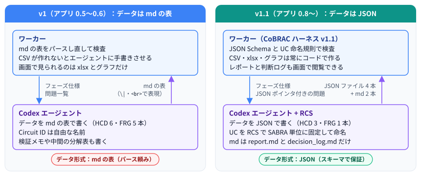
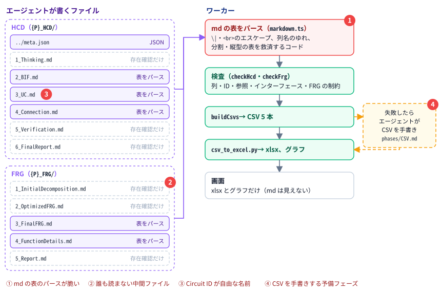
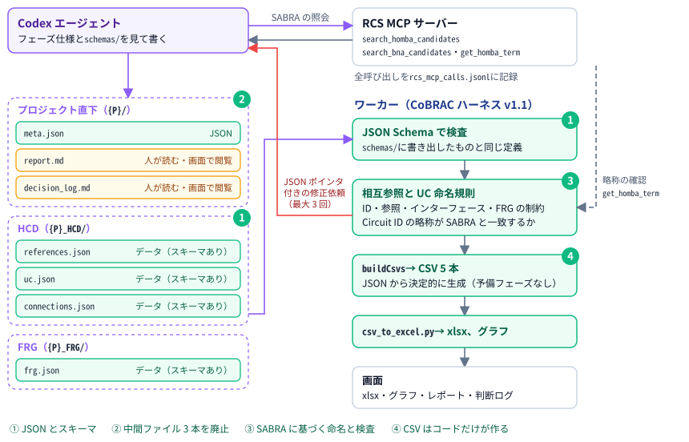
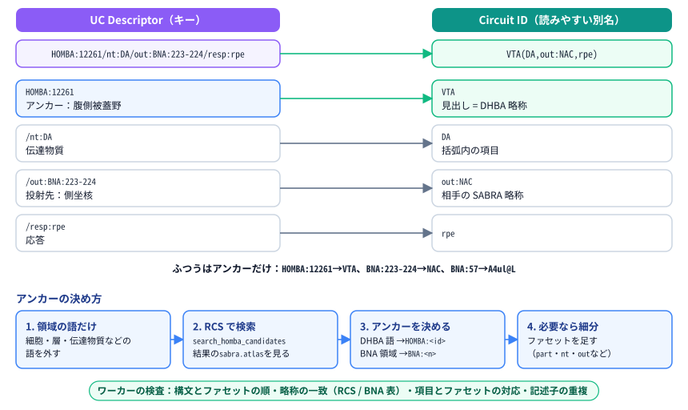
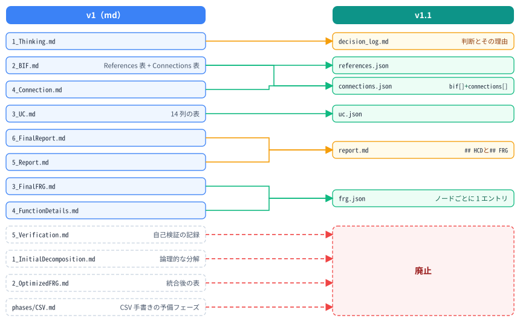
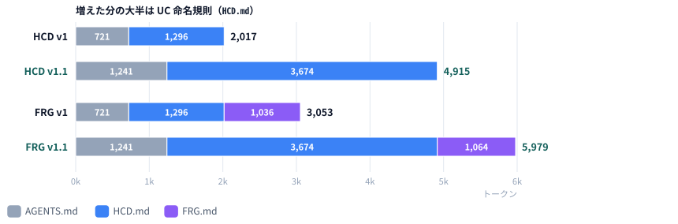

# CoBRAC ハーネス v1 → v1.1 解説：何が変わり、なぜ変えたか

| 項目 | 内容 |
| ---- | ---- |
| 文書 | CoBRAC ハーネス v1 から v1.1 への変更点の解説。データファイルの JSON 化、SABRA に基づく UC の命名、レポートと判断ログの閲覧 |
| 対象読者 | 利用者、運用者、BRA の品質や OpenAI の利用料を確認する人 |
| 対象バージョン | v1 = アプリ 0.5.0〜0.6.0 / v1.1 = アプリ 0.8.0 以降。UC の命名規則と RCS 連携は 0.7.0 で先に入った（0.7.x はデータがまだ md の表だった途中段階） |
| 関連 | [04_CoBRAC_Harness_v0_to_v1_ja.md](./04_CoBRAC_Harness_v0_to_v1_ja.md)（v0 → v1）/ [01_設計仕様.md](./01_設計仕様.md) / English: [05_CoBRAC_Harness_v1_to_v1_1.md](./05_CoBRAC_Harness_v1_to_v1_1.md) |

---

## 1. ひとことで言うと

v1 で、ワーカーがフェーズを進めて検証する仕組みになりました（[04 の解説](./04_CoBRAC_Harness_v0_to_v1_ja.md)）。ただしエージェントは、データを md の表で書き続けていました。ワーカーはその表をパースし直して検査し、CSV が作れないときはエージェントに CSV を手で書かせていました。UC の Circuit ID は自由な名前で、画面で見られるのは xlsx とグラフだけでした。

v1.1 では 3 つを変えました。**データは JSON で書き、JSON Schema で形を保証します。** CSV はいつもコードが作ります。**UC は RCS で SABRA の単位に固定して名付け、その名前をワーカーが検査します。** そして、**md は人が読むレポートと判断ログの 2 本だけにし、どちらもチャット画面で読めるようにしました。**

---

## 2. 用語

| 用語 | 意味 |
| ---- | ---- |
| SABRA | 組織で使う混合アトラス。新皮質・扁桃体・海馬・大脳基底核・視床は BNA（Brainnetome）の領域、それ以外は DHBA 名を持つ HOMBA の語 |
| RCS | ROSETTA Candidate Search。脳領域の名前から SABRA の単位を探す MCP サーバー |
| アンカー | UC を固定する SABRA の単位（`HOMBA:12261`、`BNA:223-224` など） |
| UC Descriptor | UC のキー。アンカーに、必要なときだけファセット（`part`・`nt`・`out` など）を足したもの |
| Circuit ID | UC の読みやすい別名。先頭はアンカーの正式略称（`VTA`、`NAC(shell,DRD1+)`） |
| JSON Schema | データファイルごとの形の定義（`HARNESS_SCHEMAS`）。エージェント用に `schemas/` に書き出し、バリデータも同じ定義を使う |
| 判断ログ | `decision_log.md`。エージェントが自分で決めたことと、その理由の記録 |

---

## 3. アーキテクチャ

### 3.1 v1：データは md の表、ワーカーがパースし直す

v1 の弱点：

- **① md の表のパースが脆かった。** セルの中の `|` は `\|`、改行は ` ` で書く約束でした。ワーカーには、列名のゆれや、分割された表・縦型の表を救済するコードが必要でした。いちばん大きな `3_UC.md` は 14 列の表で、長文のセルが 5 つあり、1 プロジェクトの中で何度も書き直されていました。
- **② 誰も読まない中間ファイルがあった。** `1_InitialDecomposition.md`、`2_OptimizedFRG.md`、`5_Verification.md` は、ワーカーが存在を確認するだけで、後の工程では使われず、ユーザーにも見えませんでした。2 本のレポートも画面からは読めませんでした。
- **③ Circuit ID が自由な名前だった。** 同じ神経集団でもプロジェクトごとに名前が変わり、脳アトラスとの対応もありませんでした。
- **④ CSV を手書きする予備フェーズが残っていた。** 表の変換に失敗すると、エージェントが `phases/CSV.md` に従って CSV を手で書きました。

### 3.2 v1.1：データは JSON、名前は SABRA に固定

フェーズの骨格（HCD → FRG → CSV → xlsx、ワーカーがフェーズを進めて検証する、ターンの終わりに `{status, message, question}` を返す）は v1 と同じです。変わったのは、エージェントが書くファイルと、ワーカーの検査と生成です。

### 3.3 並べて比べる

| 観点 | v1 | v1.1 |
| ---- | -- | ---- |
| データファイル | md の表（`2_BIF.md`、`3_UC.md`、`4_Connection.md`、`3_FinalFRG.md`、`4_FunctionDetails.md`） | JSON（`references.json`、`uc.json`、`connections.json`、`frg.json`） |
| 形式の保証 | 表の書き方の約束（`\|`・` `・列名）と救済するパーサ | JSON Schema。問題は JSON ポインタ付き（`uc.json: /ucs/3/implementation is required`） |
| HCD のファイル | md 6 本 + `meta.json` | JSON 3 本 + `meta.json`、`report.md`、`decision_log.md`（プロジェクト直下） |
| FRG のファイル | md 5 本 | `frg.json` 1 本（レポートは `report.md` の `## FRG` 節） |
| 中間ファイル | 分解表・統合表・自己検証の記録を書く | 書かない（理由と残る論点はレポートへ） |
| 外部 UC の印 | Comments に `noROI(...)` と書く | `roi` の値（`internal`、`noROI(input)` など）。CSV の Comments にはワーカーが書く |
| UC の名前 | 自由な Circuit ID | SABRA のアンカーに基づく UC Descriptor と Circuit ID |
| 名前の検査 | なし（空白がないことだけ） | 構文、略称の一致（RCS / BNA の表）、項目とファセットの対応、記述子の重複 |
| RCS | なし | MCP サーバーとしてエージェントが照会。全呼び出しを `rcs_mcp_calls.jsonl` に記録 |
| CSV | コードで生成。失敗時はエージェントが手書き | 常にコードで生成。問題は JSON ファイルの修正依頼として返す |
| 画面で見られるもの | xlsx、グラフ | xlsx、グラフ、レポート、判断ログ（閲覧とダウンロード） |
| 前の形式の読み込み | v0 の旧ファイル名や表の形も読む | 読まない（[6 章](#6-互換性)） |

---

## 4. 変更点

3.1 の弱点と、それに対応する変更の関係です。

| v1 の弱点 | v1.1 での変更 | 詳細 |
| --------- | ------------- | ---- |
| ① md の表のパースが脆かった | データを JSON で書き、JSON Schema で検査する | [4.3](#43-データファイルを-json-にしjson-schema-で検査する) |
| ② 誰も読まない中間ファイルがあった | 中間ファイル 3 本を廃止し、レポートを 1 本にして画面で読めるようにした | [4.4](#44-レポートと判断ログ) |
| ③ Circuit ID が自由な名前だった | SABRA に基づく命名規則と、ワーカーによる検査 | [4.1](#41-uc-の命名規則sabra-のアンカーuc-descriptorcircuit-id)、[4.2](#42-rcs-連携) |
| ④ CSV を手書きする予備フェーズが残っていた | CSV は常にコードが作り、問題は JSON の修正として返す | [4.5](#45-csv-は常にコードで作る) |

### 4.1 UC の命名規則（SABRA のアンカー・UC Descriptor・Circuit ID）

0.7.0 から、すべての UC（ROI の内側も外側も）を SABRA の単位 1 つに固定して名付けます。SABRA にも UC にも独自の ID はありません。**UC Descriptor**（アンカー + 必要なときだけファセット）が UC のキーで、**Circuit ID** はその読みやすい別名です。同じ神経集団には、どのプロジェクトでも同じ名前が付きます。

- **アンカーだけが通常です。** UC が SABRA の単位そのものなら、記述子はアンカーだけ、Circuit ID は略称だけです（`HOMBA:12261` / `VTA`、`BNA:223-224` / `NAC`、`BNA:57` / `A4ul@L`）。ファセットは、単位より細かい集団が HCD に必要なときだけ足します。伝達物質は Transmitter 列、内容は Output Semantics に書き、UC を説明するためにファセットを足すことはしません。
- **Circuit ID の先頭はアンカーの正式略称です。** DHBA の略称か BNA の領域略称をそのまま使い、独自の略称（`NAc`、`LC`）や下位単位の略称（`NACs`、`CA1`）は括弧の中に入れます。片側だけの UC は `@L` / `@R` を付けます。
- **ワーカーが検査します。** 検査するのは次の 4 点です。記述子の構文とファセットの順。Circuit ID の先頭（と左右）がアンカーの略称と一致するか（BNA は組み込みの表、HOMBA/DHBA は RCS で照会）。括弧内の項目がファセットと対応するか。2 つの UC が同じ記述子を使っていないか。
- `uc.json` の `descriptor` が、`Circuits.csv` と xlsx の Circuits シートの最後の列（UC Descriptor）になり、HCD グラフのノード詳細にも表示されます。

### 4.2 RCS 連携

エージェントは RCS を MCP サーバーとして使います。`search_homba_candidates` で候補を探し、BNA 側なら `search_bna_candidates` を使います。迷ったときは `get_homba_term` で確かめます。RCS に送るのは領域名と短い文脈（ROI、TLF、種）だけです。

- ワーカーはエージェントの RCS 呼び出しをすべて `rcs_mcp_calls.jsonl` に残します。判断ログには照会の転記を書かず、どの候補からなぜ選んだかだけを書きます。
- 検査のとき、ワーカーは HOMBA アンカーの略称を自分で RCS に問い合わせます（`get_homba_term`、同じジョブ内ではキャッシュ）。
- RCS が使えない実行でも BRA の生成は止めません。エージェントは知識からアンカーを選び、RCS で確かめていないことを判断ログに書きます。問い合わせられなかったアンカーは、略称の照合だけを省きます。
- あわせて、括弧やカンマを含む Circuit ID（`[U.NAC(shell,DRD1+)]` など）を Interface や FRG の Subnodes で正しく分けられるようにしました。区切りは括弧の外だけで判定します。

### 4.3 データファイルを JSON にし、JSON Schema で検査する

0.8.0 から、ワーカーがパースしていた md の表を JSON のデータファイルに置き換えました。

| v1 | v1.1 | 理由 |
| -- | ---- | ---- |
| `2_BIF.md` の References 表 | `{P}_HCD/references.json` | References.csv にパースするだけで、md である必要がない |
| `2_BIF.md` の Connections 表 + `4_Connection.md` | `{P}_HCD/connections.json`（`bif[]` + `connections[]`） | UC 間の接続は Connections.csv の写し。組織レベルの BIF はその根拠なので同じファイルに置く |
| `3_UC.md`（14 列の表） | `{P}_HCD/uc.json` | 最も大きく壊れやすい表だった。長文も JSON の文字列なら安全。外部 UC は `roi` の値で明示する |
| `3_FinalFRG.md` + `4_FunctionDetails.md` | `{P}_FRG/frg.json` | 同じノードをキーにした 2 つの表を、ノードごとの 1 エントリにまとめた |

- JSON ファイルにはそれぞれ JSON Schema があります。ワーカーは作業場所の `schemas/` に書き出し、エージェントは迷ったらそれを読みます。バリデータも同じ定義を使います。
- 形の問題は、ファイル名と JSON ポインタ付きで返します（`uc.json: /ucs/3/implementation is required`）。ID・参照・インターフェースと接続の整合・FRG の制約・命名規則の検査は、JSON に対して続けて行います。
- 英語でない値は、その値を書いたフェーズの検査で指摘します。
- md のパーサ（`markdown.ts`）と、旧ファイル名・旧レイアウトを救済するコードは削除しました。

### 4.4 レポートと判断ログ

- レポートは `report.md` の 1 本です（プロジェクト直下、`## HCD` と `## FRG` の節）。v1 の `6_FinalReport.md` と `5_Report.md` をまとめたものです。FRG の分解・統合の理由（以前の `1_InitialDecomposition.md`・`2_OptimizedFRG.md` の中身）と、自己検証で残った論点（以前の `5_Verification.md`）は、レポートの本文と Limitations に書きます。構造の検査はバリデータが行います。
- `1_Thinking.md` は `decision_log.md` になりました。ROI/TLF の妥当性、ROI_Input / ROI_Output、各 UC のアンカーの選び方、採らなかった案、ユーザーの回答、フォローアップでの変更を、日付つきで追記します。
- チャット画面に「レポート」と「判断ログ」のボタンを追加しました。ファイルができると押せるようになり、ビューアで読むこともダウンロードすることもできます。

### 4.5 CSV は常にコードで作る

CSV フェーズにエージェントのターンはありません。`buildCsvs` が JSON から CSV 5 本を作り、`csv_to_excel.py` が xlsx を、`buildGraphs` がグラフを作ります。エージェントが CSV を手で書く予備フェーズ（`phases/CSV.md`）は削除しました。問題が見つかった場合は、JSON ファイルへの修正依頼として返します。フェーズのループは `packages/worker/src/pipeline.ts` に切り出し、モックのエージェントで HCD → FRG → CSV → xlsx を通すテストを加えました。

---

## 5. 指示の量とコスト

### 5.1 指示のトークン数（実測）

`o200k_base` トークナイザで数えた値です。0.7.0 の列は、命名規則が入り、データがまだ md だった途中段階です。

| ファイル | v1（0.6.0） | 0.7.0 | v1.1（0.8.0） |
| -------- | ----------: | ----: | ------------: |
| `AGENTS.md` | 721 | 942 | 1,241 |
| `phases/HCD.md` | 1,296 | 3,173 | 3,674 |
| `phases/FRG.md` | 1,036 | 1,063 | 1,064 |
| `phases/CSV.md`（予備のときのみ） | 481 | 525 | 廃止 |

各フェーズで、リクエストのたびに文脈に載っている指示の量です。

v1.1 の指示は v1 のおよそ 2 倍です。増えた分の約 3 分の 2 は、0.7.0 で `HCD.md` に入った UC 命名規則（+1,877）です。JSON 化の増分は `AGENTS.md` +299 と `HCD.md` +501 で、ファイル構成・JSON の書き方・判断ログの説明が増えました。JSON Schema 自体は `schemas/` に置き、エージェントが必要なときだけ読むので、毎回の文脈には入りません。

### 5.2 1 プロジェクトあたりの目安（試算）

[04 の 5.4](./04_CoBRAC_Harness_v0_to_v1_ja.md#54-1-プロジェクトあたりの目安試算) と同じ前提（HCD 120 回、FRG 60 回のリクエスト）で計算すると、指示の増分は 120 × 2,898 + 60 × 2,926 ≈ 52 万トークンで、ほぼすべてキャッシュ入力です。

| モデル | キャッシュ入力の単価（USD / 100 万） | 1 プロジェクトあたりの増加 |
| ------ | -----------------------------------: | -------------------------: |
| gpt-6-luna（既定） | 0.01 | **約 $0.01** |
| gpt-6-sol | 0.20 | **約 $0.10** |
| gpt-5.6-sol | 0.40 | **約 $0.21** |
| gpt-6-astra | 1.00 | **約 $0.52** |

上の表に含めていないもの：

- **減るもの。** 中間ファイル 3 本を書かない。判断ログに RCS の照会を転記しない。CSV を手書きする予備フェーズがない。md のエスケープ崩れによる修正ターンがなくなる。
- **増えるもの。** RCS の呼び出しとその結果が文脈に入る。命名規則の検査で指摘された修正ターン。

どちらも実測していないので、正確な値は各チャットの使用量の表示と OpenAI のダッシュボードで確認してください。v1.1 の主な狙いはコストではなく、データの形の保証と、プロジェクトをまたいで同じ名前を使えることです。

---

## 6. 互換性

- 0.8.0 以降、ハーネスは JSON のデータファイルだけを読みます。0.8.0 より前に作ったワークスペース（md の表。v0 と v1 のプロジェクトを含む）は読みません。xlsx とグラフは引き続き閲覧・ダウンロードできますが、フォローアップやリトライは、新しいプロジェクトを作るよう案内してすぐに止まります。
- xlsx の Circuits シートには、0.7.0 から最後の列（O 列）に UC Descriptor が加わりました。A〜N 列の位置は変わりません。`Project.csv` の BRA version は `CoBRAC-v1-0` のままです。これは BRA データ形式の版で、ハーネスの版とは別のものです。今回の変更は末尾への列の追加だけで、既存の列の意味も位置も変えていないためです。
- v1 より前に始めたスレッドでは、`[QUESTION]` マーカーも引き続き認識します。

---

## 7. アプリ側の関連変更

ハーネスの外ですが、同じ時期にプロジェクト ID を変えました（0.7.0）。プロジェクト ID はシステムが `<ユーザーキー>-<番号>`（例 `u7m2q9xa-12`）の形で割り当て、全ユーザーで一意で、変わりません。表示名は別に持ち、いつでも変えられます。エージェントは `meta.json` の `name` に英語の名前（`<TLF> in <ROI>`）を書きます。xlsx は `{名前}_{ID}.bra.xlsx` でダウンロードされます。

---

## 8. コードの場所

| 内容 | 場所 |
| ---- | ---- |
| エージェント共通ルール | `prompts/AGENTS.md` |
| フェーズ仕様（命名規則を含む） | `prompts/phases/HCD.md`、`FRG.md` |
| JSON Schema・バリデータ・CSV 生成 | `packages/shared/src/harness.ts`、`jsonSchema.ts` |
| UC の命名規則の検査 | `packages/shared/src/ucNaming.ts`、BNA の表 `bnaLabels.ts` |
| フェーズのループ | `packages/worker/src/pipeline.ts` |
| RCS の接続と照会 | `packages/worker/src/rcs.ts` |
| ジョブ制御と RCS 呼び出しの記録 | `packages/worker/src/index.ts` |
| レポート・判断ログのビューア | `packages/web/src/components/DocViewer.tsx` |
| テスト | `packages/shared/test/harness.test.ts`、`ucNaming.test.ts`、`packages/worker/test/pipeline.test.ts`、`rcs.test.ts` |
